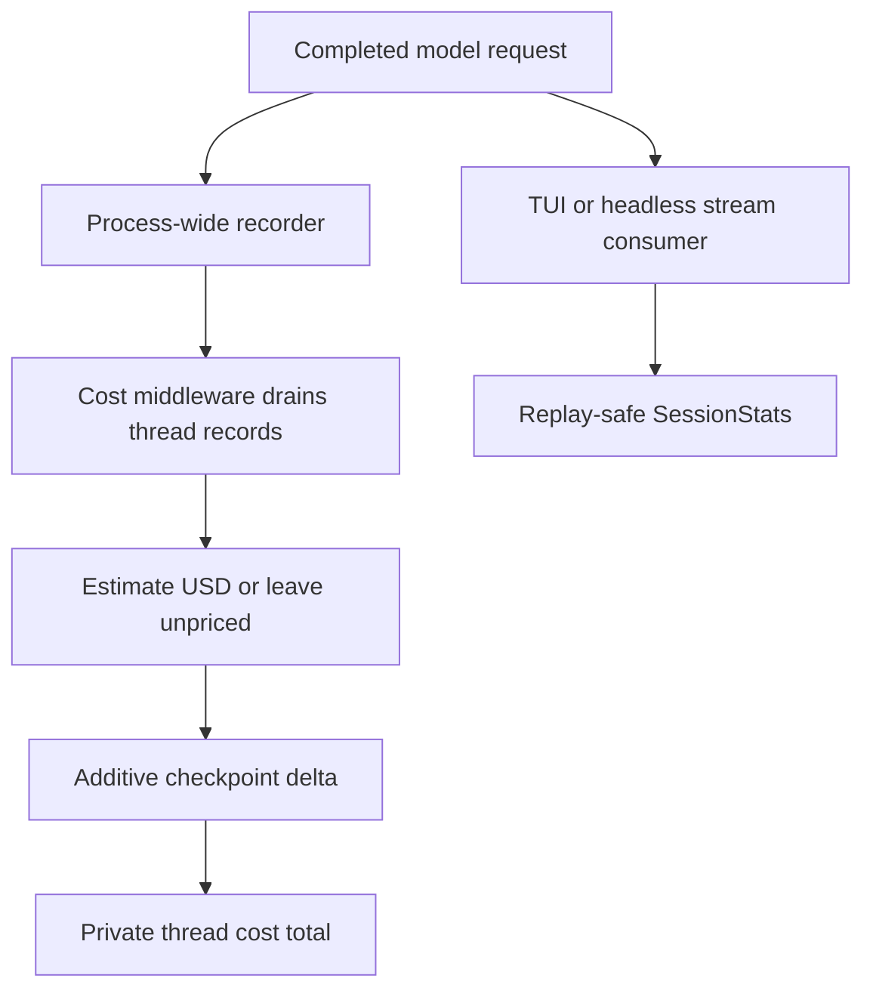
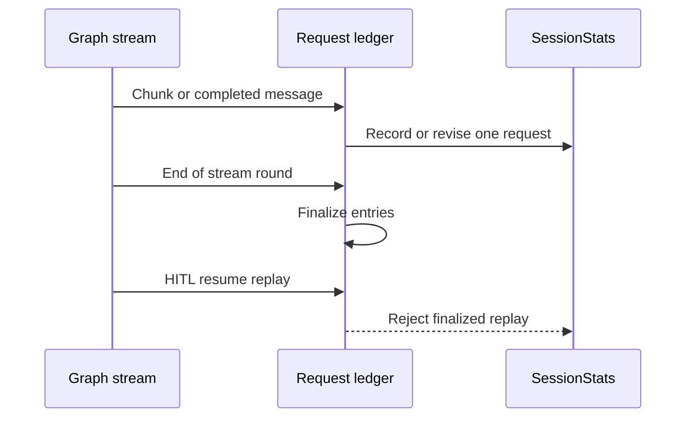

# dcode Cost Tracking and Sessions

A dcode session is a LangGraph **thread**: checkpointed graph state identified by a time-ordered UUID7. Cost and usage figures are operational estimates, not provider invoices or spend controls. They are useful for explaining a run, but a missing price means “unpriced,” not “free,” and a displayed total must not be used to reconcile a bill.

Related material: [Runtime behavior](../architecture/runtime-behavior.md), [Profiles and models](../concepts/profiles-models.md), [State persistence](../concepts/state-persistence.md), [Security](security.md), and [Run a dcode session](../workflows/run-dcode-session.md).

## Ownership at a glance

| Concern | Owner | Meaning |
| --- | --- | --- |
| Thread identity and checkpoints | `sessions.py` and LangGraph | Durable conversation state for one `thread_id`. |
| Lifetime graph cost | `CostTrackingMiddleware` / `CostState` | Checkpointed estimated USD for priceable calls. |
| Live client statistics | `SessionStats` | Replay-safe display ledger for requests, tokens, cost, and time. |
| Price lookup | `genai-prices`, then local overrides on a miss | Best-effort estimate; never a reason to fail a turn. |
| Legacy state transition | `state_migration.py` | Best-effort move from the old profile-root locations into `.state/`. |

*The checkpointed graph total and client-side live statistics are separate accounting paths.*

## Thread identity, storage, and deletion

`generate_thread_id()` creates UUID7 strings, so normal thread IDs sort naturally by creation time. Checkpoints live in the single local SQLite database `DEFAULT_STATE_DIR/sessions.db`. `get_db_path()` caches that location after hardening the state directory; `get_checkpointer()` supplies an `AsyncSqliteSaver` over a connection owned and cleaned up by the sessions module.

A selected checkpoint is the unit of resume. `ResumeState` declares schema-private versioned channels such as `_context_tokens`, `_model_spec`, invocation parameters, and pending goal data. The CLI can read the selected checkpoint’s `state_values` and rehydrate runtime facts and history without replaying or re-tokenizing the entire conversation. This is deliberately checkpoint-relative: values reflect the chosen point in the thread, not an aggregate assembled across all checkpoints.

Cache-cold detection depends on a coherent identity/time pair. `_last_model_request_at`, `_last_cache_model_spec`, and `_last_cache_endpoint` are recorded only after a successful main-model request, preventing a failed request from being mistaken for a warm-cache baseline.

`delete_thread(thread_id)` removes checkpoint and write rows, invalidates session-list/message caches, and then attempts to remove local offloaded conversation history. Its Boolean result reports only whether checkpoint rows were deleted; archive cleanup is best effort. The archive deletion rejects suspicious thread IDs that would escape its `conversation_history` directory. Because offloaded history may fall back to a private temporary directory when the profile root is unwritable, that fallback may not survive a restart.

## Migration from legacy state locations

On normal CLI startup—after parsing and the no-I/O help/version path—dcode calls `migrate_legacy_state()`. It moves recognized legacy entries such as `sessions.db` and its SQLite sidecars, `mcp-tokens`, history/update files, and the onboarding marker from `~/.deepagents/` into `~/.deepagents/.state/`.

The migration is intentionally idempotent and fail-soft. It does not create a state directory when there is nothing to move; it skips a source whose destination already exists rather than clobber either copy, warns about the collision, and continues with other entries after per-entry I/O failures. Startup continues even if the migration itself unexpectedly fails. When both a legacy `sessions.db` and `.state/sessions.db` exist, inspect and resolve the two copies manually before deleting either one.

## Durable cost lifecycle

`CostState` adds the schema-private `_session_cost_usd` channel to resume state. Its `operator.add` reducer means a charging pass writes only its newly priced delta; the graph checkpoint, rather than a UI accumulator, owns the cumulative thread estimate.

`_SessionCostRecorder` is attached by a LangChain configure hook for every model request in the process. It collects completed request records by thread and checkpoint scope but does not price inline. This covers ordinary agent calls, subagents, and direct side calls such as offload/summarization and Auto classification without requiring each caller to add accounting code. A request with no usable thread cannot be attributed; bounded recorder queues also protect the process from pathological load, at the cost of possible dropped records.

`CostTrackingMiddleware.after_model` drains and prices records since its previous checkpoint. `after_agent` makes a final drain for work after the last model step, including rubric grading. Both hooks catch exceptions because each hook is a graph node: an accounting failure must not fail the user turn. A failed charging pass restores its drained records when possible, so later work can retry; record loss due to bounded queues or a failed restoration still leaves the durable estimate short.

Nested middleware isolates subagent accounting. It resets its local cost channel in `before_agent`, checkpoints local deltas, then publishes a completed total in `_session_cost_transfers`, addressed by checkpoint scope to the owning parent graph. The parent can checkpoint the transfer even if a sibling interrupts.

Server-owned work has a distinct transaction boundary: `prepare_operation_cost(state, thread_id)` drains and prices side-model calls but does not commit them. Persist `PreparedOperationCost.update` atomically with the operation state and commit it, or roll it back if the state write fails or the operation is abandoned. Roll back even for a zero-dollar prepare, because preparation already consumed records.

## Pricing estimates and overrides

`estimate_cost()` needs a model identity and separately reported input/output tokens; a combined total alone cannot be priced defensibly. It forwards LangChain’s inclusive input count plus cache, audio, and reasoning detail buckets to `genai-prices`. The pricing library subtracts a detail bucket from its enclosing total only when the matched model prices that detail, avoiding double charging while leaving unpriced detail tokens in ordinary input/output pricing.

Pricing is best effort. An unavailable package, unpriceable provider/model, missing token split, or catalog miss yields no estimate rather than interrupting a model request. Consequently, durable and displayed monetary totals include only priceable calls. Use the request count and priced-request count to distinguish zero-priced requests from unpriced requests.

On its first successful pricing import, dcode may start one daemon updater that refreshes upstream pricing data hourly. Disable it with `DEEPAGENTS_CODE_PRICES_AUTO_UPDATE=0`, `[update].prices_auto_update = false`, or `DEEPAGENTS_CODE_OFFLINE`. Failed or truncated upstream fetches retain the prior healthy snapshot; dcode refuses a fetched catalog with fewer providers than the bundled catalog.

When the active upstream catalog misses, dcode checks the user config file `~/.deepagents/prices.json` and then the bundled `bundled_prices.json`. Upstream pricing always wins; for a matching provider/model in the two fallback catalogs, the user entry wins. Both use the upstream provider-array schema and per-million-token fields such as `input_mtok` and `output_mtok`; optional cache, audio, and reasoning fields should be supplied only when their rates are known. Deterministic malformed or unreadable overrides are skipped and cached for the process; restart dcode after editing `prices.json`.

The override integration uses private `genai-prices` names (`genai_prices.types._providers_from_raw` and `genai_prices.data_snapshot.find_provider_by_id`). The supported dependency range spans `>=0.1.7,<0.2.0`; re-test parsing, lookup, precedence, and graceful fallback whenever that range changes.

## Live statistics, retries, and reporting

`SessionStats` is the display ledger. It accumulates request count, input/output and cache tokens, estimated USD, priced request count, wall time, plus breakdowns by `(provider, model_name)` and `UsageKind`. It is not the checkpointed lifetime total.

*The request ledger permits in-round chunk revisions but prevents a resumed round from adding the same request again.*

`record_message_usage()` records a completed `AIMessage` idempotently. For chunks, it retracts the exact earlier contribution and records revised running usage, keeping one API call as one request even when later metadata names the real model. Retry attempts are keyed as `(attempt_scope, message_id)`, so reused provider message IDs remain distinct attempts. At every stream-round boundary, consumers must call `finalize_recorded_requests()`; it closes entries and projects scoped entries onto bare IDs so HITL resume replays do not double tokens or cost.

`print_usage_table()` is enabled by default and gated through `usage_table_enabled()`, using `[ui].show_usage_stats` or `DEEPAGENTS_CODE_SHOW_USAGE_STATS`. Configuration errors fail open because the table is cosmetic, while a detected `BlockingError` is re-raised rather than hidden. The table renders an em dash when no request in a group was priceable, avoiding a misleading `$0.00`.

## Safe diagnostics and change checklist

1. Start with the exact `thread_id` and selected checkpoint. Compare its `_session_cost_usd` to `SessionStats` only with their differing scopes in mind: checkpointed lifetime estimate versus client stream ledger.
2. For missing cost, check model/provider identity, input/output token split, the pricing-package/catalog state, override validity, and recorder warnings about missing thread context or dropped records. Treat “unpriced” as unknown cost, not zero cost.
3. For a resume discrepancy, verify that the consumer finalized its request ledger at every round boundary and inspect retry scope/message IDs before assuming the provider duplicated a call.
4. Before manually resolving legacy state, stop dcode and preserve both database copies. Migration intentionally refuses to overwrite a destination.
5. When changing these paths, run focused unit coverage including `tests/unit_tests/test_cost_tracking.py`, `test_session_stats.py`, `test_sessions.py`, and `test_state_migration.py`; exercise failure, rollback, interruption, retry, chunking, and resume-replay cases.
