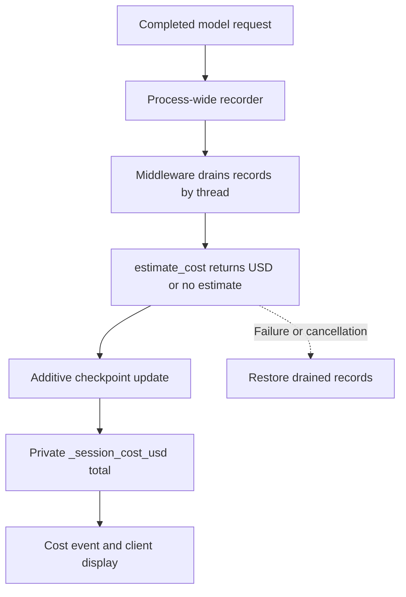
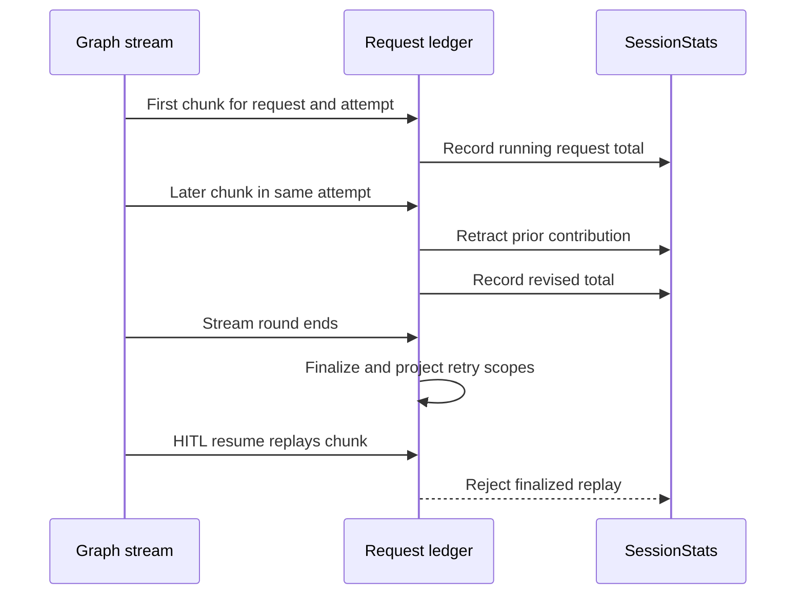

# dcode Cost Tracking & Session Operations

`deepagents_code` has two complementary accounting paths. Graph checkpoints own the durable per-thread cost shown by `/cost` and the TUI status bar; stream consumers maintain `SessionStats` for responsive token/cost summaries and the end-of-run table. They are estimates, not billing or policy: **nothing caps spend or blocks execution based on them**.

- Model selection and provider identity: [Profiles & Models](../concepts/profiles-models.md)
- Checkpoint concepts: [State Persistence](../concepts/state-persistence.md)
- Development and test workflow: [Development](./development.md)
- User workflow: [Run a dcode Session](../workflows/run-dcode-session.md)

## Ownership and accounting lifecycle

| Concern | Owner | Important boundary |
| --- | --- | --- |
| Price one request | `estimate_cost` | Best-effort USD estimate or `None`; an unavailable or unknown rate never fails a turn. |
| Durable thread total | `CostTrackingMiddleware` / `CostState` | Checkpointed lifetime value, rather than a value owned by a client. |
| Collect completed calls | `_SessionCostRecorder` | Process-wide callback capture for main models, subagents, and side invokes. |
| Stream-facing totals | `SessionStats` request ledger | Provisional client statistics that must tolerate chunks, retries, and resume replay. |
| Resume facts | `ResumeState` and middleware | Schema-private checkpoint channels, restored at the selected checkpoint. |
| Thread management | `sessions.py` | Local LangGraph SQLite checkpoint store and archive cleanup. |

`CostState` extends `ResumeState` with schema-private `_session_cost_usd`. Its `operator.add` reducer accepts a newly priced delta, so writers do not read-modify-write the running total. That makes the total durable with the graph checkpoint and prevents a UI accumulator from becoming authoritative.

*Completed calls are captured before they are priced; the checkpoint, not the display, owns the lifetime total.*

The recorder is installed through LangChain's configure hook for every model request. It records completed calls by thread and deliberately does no pricing inline; middleware prices drained records off the model callback path. This covers direct side invokes such as offload/summarization and Auto classification as well as agent and subagent graphs. The main-response fallback prices state only when the recorder did not already charge that message ID, favoring an undercount for an unidentified response over a duplicate charge.

`after_model` charges calls completed since the preceding checkpoint. `after_agent` drains late work, including rubric grading after the final model step. Both hooks catch ordinary exceptions because each hook is a graph node and accounting must not fail the user's turn. A cancellation or other failure after destructive draining restores the records for a later pass; bounded recorder queues can nevertheless log and drop records if their limits are exceeded.

### Nested graphs and server-side operations

A nested `CostTrackingMiddleware` resets its local cost channel in `before_agent`, checkpoints local deltas while it runs, and puts its completed total in `_session_cost_transfers`. The map is keyed by completed checkpoint scope and identifies the owning parent scope; its map reducer permits independent parallel transfers. The parent claims the matching transfer into its own checkpoint, which preserves completed subagent spend even when another sibling interrupts.

For server-owned work, call `prepare_operation_cost(state, thread_id)`. It destructively drains and prices side-model records but returns a `PreparedOperationCost`; persist its `update` atomically with the operation state and then mark it committed, or call `rollback()` if the write fails or the operation is abandoned. This applies even to a zero delta, because preparation has still claimed records. Never roll back after a successful write: doing so restores records that will be charged again. An unsettled object warns because its records have been lost from the lifetime total.

## Pricing data and overrides

`estimate_cost` lazily imports `genai-prices`, so the pricing package and its catalog do not burden CLI startup. It sends LangChain's inclusive `input_tokens` plus cache, audio, and reasoning details; `genai-prices` subtracts a priced detail from its containing bucket rather than double charging it. Unpriced detail remains in ordinary input/output pricing. Requests with no split input/output usage (only `total_tokens`), missing identity, or non-API providers can remain unpriced. Self-inconsistent cache/detail counts are clamped and warned about instead of discarding the request.

Provider names are normalized through `_PROVIDER_ALIASES` before lookup. Response metadata is preferred, with per-request configured metadata, checkpointed `_model_spec`, and finally runtime configuration providing fallbacks. Consequently, model behavior changes should be tested against both response metadata and these fallback paths.

On the first successful pricing import, one daemon updater can refresh upstream `data.json` hourly. Disable it with `DEEPAGENTS_CODE_PRICES_AUTO_UPDATE=0`, `[update].prices_auto_update = false`, or `DEEPAGENTS_CODE_OFFLINE`. A failed or refused refresh keeps the catalog already installed. The guarded updater also rejects an upstream snapshot with fewer providers than the package's bundled catalog, avoiding a half-published catalog that would otherwise replace valid data and make rates disappear.

### Local catalog precedence

On a primary `genai-prices` miss only, dcode looks first in `~/.deepagents/prices.json`, then in packaged `bundled_prices.json`. Upstream rates always win; for the same provider/model entry, the user catalog wins over the bundled stopgap. The user file follows the upstream provider-array schema and is normally cached after its first usable read, so restart dcode after editing it. Parse, schema, rate, and loader failures warn/drop the affected fallback rather than interrupting a model request.

Rates are per million tokens: `input_mtok` and `output_mtok`, plus optional cache, audio, and reasoning buckets. Use the post-alias provider ID. If no override provider claims that ID, the fallback may sweep models across providers and warns when it prices under a different provider; this last-resort path can yield a wrong estimate rather than no estimate.

Bundled entries are temporary upstream stopgaps. Each needs a `price_comments` link to an upstream `genai-prices` issue or PR and should be removed once upstream covers it. See `libs/code/deepagents_code/bundled_prices.README.md` for the maintainer policy and entry format.

### Dependency-change caution: private upstream integration

Local override support intentionally depends on two **private** `genai-prices` APIs: `genai_prices.types._providers_from_raw` validates raw override catalogs, and `genai_prices.data_snapshot.find_provider_by_id` narrows override lookup. They have no compatibility promise; the dependency range can admit a patch release that moves either symbol. Whenever the `genai-prices` range or lockfile changes, re-verify both APIs and the behavior of `cost_tracking._build_price_overrides` and `cost_tracking._find_override_model`. Test user/bundled precedence, a provider-matched lookup, fallback inference, and the loud degradation path when either private name is unavailable. Do not treat the version pin as sufficient compatibility protection.

## Stream statistics and replay safety

`SessionStats` accumulates request count, input/output and cache tokens, priced request count, cumulative USD, and wall time. It also has `per_model` rows keyed by `(provider, model_name)` and `per_kind` rows for assistant, subagent, offload, and Auto work. These values serve responsive displays and the end-of-run table; they are distinct from the durable graph cost.

*Chunks revise one active request; once a stream round closes, matching data is replay protection rather than new usage.*

A completed `AIMessage` supplies whole-request usage and is idempotent on replay. For chunks, `record_message_usage` records an initial request then retracts its exact `RecordedRequest` contribution and re-records the running aggregate. This handles providers that emit full snapshots and Google-style incremental usage, including a final chunk that finally identifies the model. Totals therefore remain aligned with per-model and per-kind breakdowns.

Retries may reuse a provider message ID. The ledger keys those requests with `(attempt_scope, message_id)`, which separates retry attempts while retaining revision behavior within one attempt. At every stream-round boundary, `finalize_recorded_requests` finalizes entries and projects scoped ones to bare IDs. That means an unscoped HITL-resume replay finds the finalized request and cannot add tokens or cost again. Preserve this finalization in both interactive and headless stream loops.

`print_usage_table` emits the end-of-run Rich table only when `usage_table_enabled()` permits it. The shared `display.show_usage_stats` resolver defaults to enabled and is used by both TUI teardown and headless execution. Config-resolution errors fail open because this output is cosmetic, but `BlockingError` is re-raised to expose blocking I/O on the event loop. `/cost` reports how many recorded calls were priceable, distinguishing unpriced calls from a real zero-cost estimate.

## Threads, checkpoints, and offloaded history

Threads use LangGraph checkpoint persistence in one SQLite database: `DEFAULT_STATE_DIR/sessions.db`. `get_db_path()` hardens and caches the directory/path; `get_checkpointer()` yields an `AsyncSqliteSaver` around a module-owned connection and drains its worker on close. New IDs are time-ordered UUID7 strings.

`ResumeState` declares schema-private, versioned channels that the CLI reads from `state_values` to rehydrate a selected checkpoint without replaying or re-tokenizing history. Important examples are `_context_tokens`, effective `_model_spec`/`_model_params`, goal/rubric state, and `CostState`'s cost channels. Model-turn cache facts are committed only after a successful request: `_last_model_request_at`, `_last_cache_model_spec`, and `_last_cache_endpoint` form a coherent timestamp/identity set for cold-cache detection.

`delete_thread(thread_id)` deletes checkpoint and write rows, invalidates local caches, and then best-effort deletes the corresponding offloaded-history archive. Its Boolean result says only whether checkpoint rows were deleted; it can remove an orphan archive while returning `False`.

Offloaded local conversation history is stored in a hardened `conversation_history` directory beneath the deepagents home, with private temporary fallback storage if that root is unavailable. Archive deletion rejects path-escaping thread IDs and never blocks checkpoint deletion. In server/sandbox mode the archive belongs to the backend, so local cleanup has no remote effect.

At TUI startup, a background worker runs the history sweep. `history.retention_days` resolves through normal configuration precedence and defaults to 30; zero disables the sweep. It deletes only expired direct regular `.md` archives, rechecks mtime on an open descriptor before unlinking, and treats per-file and root failures as non-fatal.

## Safe changes and focused verification

1. Keep estimates display-only and all durable mutations in graph checkpoint state.
2. Preserve destructive-drain recovery: restored records are required on failed pricing, and prepared operation costs must be atomically committed or rolled back.
3. Preserve nested checkpoint-scope ownership and transfer claiming; test parallel/nested interruption paths.
4. When changing provider/model behavior, test aliases and metadata fallbacks, missing usage, cache/detail clamping, unknown models, primary/user/bundled precedence, and updater failure/refusal.
5. Re-verify the two private `genai-prices` integration points on every dependency-range or lockfile update.
6. Test whole-message replay, incremental chunks, model discovery in a final chunk, retried IDs, and HITL replay independently; retain round-boundary finalization in every stream consumer.
7. Exercise SQLite list/delete and cancellation-safe connection lifecycle, plus old/fresh archive selection, zero retention, layered overrides, unlink failure, and orphan-archive cleanup. Relevant suites include `test_cost_tracking.py`, `test_session_stats.py`, `test_sessions.py`, and `test_offload.py` under `libs/code/tests/unit_tests/`.
