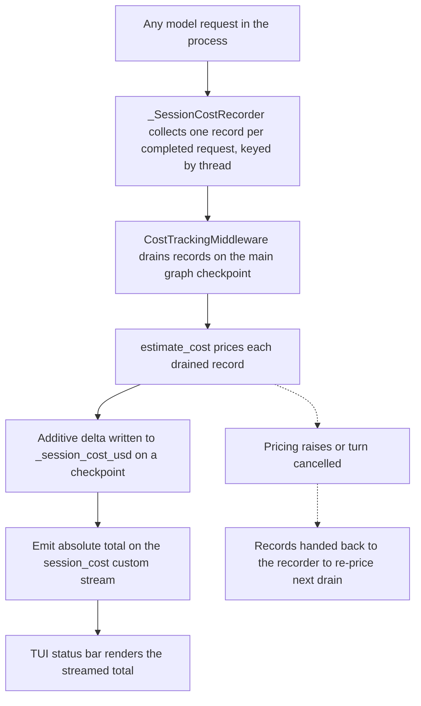

# Cost Tracking, Sessions & Runtime Stats

This page explains how the dcode CLI (`deepagents_code`) estimates the money and
tokens a thread spends, where pricing rates come from and how to override them,
how per-turn usage statistics are accumulated for the `/cost` view and the
end-of-run table, and how threads are persisted so a session can be resumed.

Cost estimates are **display-only**. Nothing in dcode caps spend or gates
execution on them — a wrong rate produces an inaccurate number and nothing more.

- Architecture context: [Code Agent](../architecture/code-agent.md)
- Context/token accounting: [Context Management](../concepts/context-management.md)
- How the pricing options layer over env vars and `config.toml`: [Config Layering](../concepts/config-layering.md)
- Observed token sinks and latency from the trace sample: `../runtime-behavior.md` (sample figures there are scoped to that single trace pull, not general limits)

## Responsibilities at a glance

| Concern | Owner | Where it lives |
| --- | --- | --- |
| Estimate one request's USD cost from usage metadata | `estimate_cost` | `cost_tracking.py` |
| Own the durable per-thread cumulative total | `CostTrackingMiddleware` (`_session_cost_usd`) | `cost_tracking.py` |
| Collect completed requests process-wide | `_SessionCostRecorder` | `cost_tracking.py` |
| Price a server operation's calls rollback-safely | `prepare_operation_cost` | `cost_tracking.py` |
| Pricing rates | `genai-prices` catalog + local overrides | `bundled_prices.json`, `~/.deepagents/prices.json` |
| Per-turn/per-session token & cost stats | `SessionStats` / `ModelStats` / `KindStats` | `_session_stats.py` |
| Checkpointed state restored on resume | `ResumeState` channels | `resume_state.py` |
| Thread listing / lookup / deletion / checkpointing | SQLite helpers | `sessions.py` |

## Cost tracking

### The durable total lives on the graph, not the client

The graph owns the durable cumulative total for a thread in the schema-private
channel `_session_cost_usd` on `CostState` (an extension of `ResumeState`). The
channel uses an additive reducer (`operator.add`) so each write contributes only
the spend it priced without a read-modify-write of the running total, and it is
kept schema-private so cost never appears in public graph input/output. Because
each update rides a graph checkpoint, cost tracking works for local, headless,
and remote execution without any client-side state update. The client is a pure
reader: it renders the streamed total and never maintains its own lifetime
figure.

### Every request is collected, then priced once

Coverage is not limited to the agent's own model node. Offload/summarization and
the Auto-mode classifier invoke a model directly (outside `after_model`), and
subagents run their own graph. `_SessionCostRecorder` — a LangChain callback
handler installed process-wide for every model request via `_install_recorder`
— collects one record per *completed* request, keyed by thread. It runs inline
(`run_inline = True`) and does **no pricing**: `estimate_cost` lazily imports
`genai-prices`, and the recorder must not do blocking work on the event loop.
`CostTrackingMiddleware` alone drains and prices those records on the main
agent's checkpoint path, so newly added side invokes are covered with no extra
wiring.

The middleware's `after_model` hook charges every request completed since the
previous checkpoint; `after_agent` drains anything that spent after the final
model step (for example the `ReliableRubricMiddleware` grading agent). The
agent's own response is additionally priced from state, but only when the
recorder did not already charge that message ID — joining on message ID keeps a
request from being counted twice, and that fallback keeps the main-agent total
correct even for a model that never fires callbacks.

Both hooks wrap their work in a broad `try/except` because each middleware hook
is its own graph node: an exception there would fail the user's turn, and cost
tracking is never worth that. The pricing loop itself catches `BaseException`
(not just `Exception`) around drain-through-return, so a cancelled turn
(`CancelledError`) returns the drained records to the recorder to be re-priced
rather than silently discarding real spend.

*How a completed request becomes a durable, streamed thread total.*

### Nested (subagent) totals transfer through state

A nested `CostTrackingMiddleware` instance (`nested=True`) zeroes its cost
channel in `before_agent` and checkpoints its own spend on a private channel
first, so a completed model call is durable before a later tool approval can
interrupt the subgraph. When the subagent finishes, `after_agent` stages the
accumulated delta in `_session_cost_transfers` — a map keyed by the completed
graph's checkpoint scope carrying its `owner_scope` and total. The map reducer
(`operator.or_`) lets parallel subagents hand off independently, and
`OmitFromInput` keeps a parent's pending entries from seeding a child. The
subagent (task) tool checkpoints that transfer on the owning parent graph even
when a sibling interrupts, while the private total itself stays isolated between
graphs.

### Live total to the client

The durable writer emits the thread's **absolute** cumulative total on a custom
stream event of type `session_cost` (`SESSION_COST_EVENT_TYPE`). The payload is
`{"type", "total", "thread_id", "pricing_ok"}`: `total` is always the full
lifetime estimate (never a delta) so a client that misses an event converges on
the next one; `thread_id` lets a client that has since switched threads discard
a stale total; and `pricing_ok` reports whether price data actually loaded in
the pricing process, which is the only way a client can distinguish a broken
remote install from models that simply have no published rates. The
`textual_adapter` in the TUI consumes this event to drive the status bar.

### Server operations: prepare / commit / rollback

`prepare_operation_cost` gives server-owned operations a rollback-safe way to
price their side-model calls without committing them to the graph. It drains and
prices the operation's recorded calls and returns a `PreparedOperationCost`
whose `update` the caller must persist atomically with the operation state — or
call `rollback()` if that write is abandoned. A prepare with a zero delta still
consumes its records, so an abandoned prepare must roll back even when it has
nothing to write.

### What `estimate_cost` does

`estimate_cost` is the only function that imports or calls `genai-prices`, and
the import is lazy so the package and its bundled pricing data stay off the CLI
startup path. It takes LangChain `usage_metadata`, a model name, and a provider,
and returns USD or `None`. Key behaviors:

- LangChain's `input_tokens` is the inclusive input count (including cache reads
  and writes); the inclusive total plus cache, modality, and reasoning detail
  buckets are forwarded so `genai-prices` subtracts each bucket from its
  container before applying rates, avoiding double counting.
- Only buckets the matched model actually publishes a rate for are broken out;
  tokens in an unpriced bucket stay in the ordinary input or output total rather
  than being dropped.
- A usage payload that reports only a combined `total_tokens` (no input/output
  split) cannot be priced and returns `None`.
- Providers in `_UNPRICEABLE_PROVIDERS` (e.g. `openai_codex`, whose access model
  is not per-token API billing) return `None`.
- Cache token counts that exceed the inclusive input total are clamped (with a
  warning) rather than dropping the whole request, because `calc_price` rejects a
  negative uncached input.
- LangChain provider names are mapped to `genai-prices` ids through
  `_PROVIDER_ALIASES` (for example `bedrock` → `aws`, `xai` → `x-ai`) before any
  lookup.

Unsupported models and malformed usage return `None`; pricing must never
interrupt a model turn.

### First-import side effect: the hourly catalog updater

On the first successful `genai-prices` import, a daemon-thread updater starts
(`_start_price_updater`) that fetches the upstream `data.json` from
`raw.githubusercontent.com` hourly and installs it via `set_custom_snapshot`,
after which every `calc_price` transparently uses the fresher catalog. A failed
or refused fetch leaves the previously installed snapshot in place (the bundled
catalog until the first fetch succeeds, then the last good fetch). The updater is
a single daemon thread per process with no `stop()` pairing, so it exits with the
process. It is suppressed when `DEEPAGENTS_CODE_PRICES_AUTO_UPDATE=0` or
`[update].prices_auto_update = false`, and `DEEPAGENTS_CODE_OFFLINE` suppresses it
along with every other network fetch.

## Pricing: catalog and local overrides

Rates come from `genai-prices`, which ships an offline catalog. dcode consults a
**local override catalog only on a primary-catalog miss** (`_override_price`):
the user's `~/.deepagents/prices.json` first, then a maintainer-curated file
shipped as package data (`bundled_prices.json`). Upstream always wins — an
override is never consulted when the primary lookup succeeds. On a conflicting
`(provider id, model id)` pair the user file wins over the bundled one.

### User overrides (`~/.deepagents/prices.json`)

`prices.json` uses the same provider-array schema as `genai-prices`'
`prices/new_data/v2/data.json`, so an entry is contributable upstream as-is. It
is a bare JSON array of providers (not `{"providers": [...]}`). Required fields
are `id`, `name`, and `api_pattern` on the provider and `id`, `match`, and
`prices` on each model. Rates are per million tokens (`input_mtok`,
`output_mtok`, and optionally `cache_read_mtok`, `cache_write_mtok`,
`output_reasoning_mtok`, `input_audio_mtok`).

Operational rules that matter:

- The file is **read once**, on the first request that needs it, so edits take
  effect on the **next dcode start**, not mid-session.
- Getting the provider id right is the usual failure: dcode resolves the
  LangChain provider name through its alias table before lookup, so the id it
  searches on is the post-alias id. If no provider in the file claims that id,
  dcode falls back to searching every provider by model id alone, which can price
  a request against the wrong provider's entry (with a warning naming both).
- A malformed `prices.json` never breaks a model turn and never disables ordinary
  pricing: the bad source is dropped and everything else still prices.
- Diagnostics are logged once per session to the Debug Console (`Ctrl+\`).

### Bundled maintainer overrides (`bundled_prices.json`)

`bundled_prices.json` is a small maintainer-curated stopgap for models users
already run but that upstream has not priced yet. Policy (from
`bundled_prices.README.md`) requires every entry to carry a `price_comments`
field linking a tracked upstream `genai-prices` PR/issue, enforced by
`test_every_bundled_override_entry_is_priced_and_links_upstream`, and entries are
removed once upstream covers the model. Because the override fires only on a
primary-catalog miss, a stale entry is normally inert — but if the provider id
LangChain reports differs from the one upstream cataloged, a stale entry can keep
billing its own possibly-outdated rate silently.

The override loader (`_price_overrides` / `_build_price_overrides`) never raises:
any failure it did not handle warns once and caches an empty catalog, so
`_override_price` can treat loading as infallible.

## Session usage statistics

`_session_stats.py` accumulates lightweight token and cost statistics that back
the `/cost` view and the end-of-run usage table. It is deliberately free of heavy
top-level dependencies (no pydantic, config, or widget imports) so `app.py` can
import `SessionStats` and `format_token_count` at module level.

- `SessionStats` holds turn/session totals: request count, input/output tokens,
  cache read/write tokens, cumulative USD, priced request count, and wall time,
  plus a `per_model` breakdown keyed by `(provider, model_name)` and a `per_kind`
  breakdown.
- `ModelStats` and `KindStats` are the per-model and per-type sub-aggregates.
- `UsageKind` classifies a request as `assistant`, `subagent`, `offload`, or
  `auto`; `classify_usage_kind` derives it from whether the request is the main
  agent and from stream metadata (`summarization` → `offload`,
  `auto_mode_classifier` → `auto`).

### One API call counts once, however its usage streams

`record_message_usage` handles the difference between a completed `AIMessage`
(which carries the request's whole usage and is idempotent on replay) and a
streamed chunk (Anthropic/OpenAI attach full usage to one chunk; Google emits an
incremental delta per chunk and names the model only on the final chunk). A later
chunk of the same request **revises** the earlier record rather than adding a new
one: the prior contribution is retracted (`retract_request`, driven by the exact
`RecordedRequest` ledger entry so totals cannot drift from the per-kind/per-model
breakdowns) and re-recorded with the running totals. So one API call stays one
request and one per-model row no matter how many chunks carried its usage.
`finalize_recorded_requests` closes a ledger at each stream-round boundary so a
replayed chunk on an HITL resume pass is not merged a second time.

### How stats surface

- The end-of-run table is rendered by `print_usage_table` (lazy `rich.table`
  import). `usage_table_enabled` gates it via `[ui].show_usage_stats` /
  `DEEPAGENTS_CODE_SHOW_USAGE_STATS` (resolved through
  `load_bool_display_preference`, default on), read once so the TUI teardown and
  headless run cannot disagree. It fails open (shows the table) on a config error
  but re-raises a `BlockingError`.
- `/cost` reports the current thread's cumulative estimate and, when a model has
  no rates, distinguishes an omitted model from a genuinely free request by
  reporting how many recorded requests are included in the figure.

## Persistence, sessions and resume

### Where state is stored

Threads use LangGraph's built-in checkpoint persistence backed by a single
SQLite database at `<DEFAULT_STATE_DIR>/sessions.db` (`get_db_path`, cached after
first resolution; the directory is hardened via `harden_state_dir`).
`get_checkpointer` yields an `AsyncSqliteSaver` over a connection this module
owns so it can clean up after an interrupted connect. Thread ids are time-ordered
UUID7 strings (`generate_thread_id`).

### Checkpointed resume state

`ResumeState` declares schema-private, checkpointed channels that the CLI reads
back from `state_values` on resume so it can rehydrate a session without
replaying or re-tokenizing history. They fall into two write paths:

- **Written from inside the graph on successful model turns** — `_context_tokens`
  (latest `AIMessage` context total, powering `/tokens` and the status bar, from
  `ResumeStateMiddleware.after_model`); `_model_spec` / `_model_params` (so
  `dcode -r` restores the model the resumed thread was actually using rather than
  the user's global default, from `ConfigurableModelMiddleware`);
  `_last_model_request_at` / `_last_cache_model_spec` (so the TUI can detect when
  a provider's reusable prompt prefix may be cold). These ride the same
  checkpoint as the model response, so resuming a specific checkpoint yields the
  values as of that checkpoint, not a thread-level aggregate.
- **User/agent-owned goal and rubric state** — `_goal_objective`,
  `_goal_status`, `_goal_rubric`, `_goal_status_note`,
  `_pending_goal_completion_note`, `_sticky_rubric`, and the pending-goal
  proposal channels. Some are client-written via `aupdate_state`, others are
  graph-written by the agent's `update_goal` tool or `GoalCriteriaMiddleware`.
  Both paths behave identically against local and remote (HTTP) graphs.

`_session_cost_usd` and `_session_cost_transfers` (the cost channels above) live
on `CostState`, which extends `ResumeState`, so cost is persisted and resumed on
the same checkpoint path.

### Listing, lookup, and deletion

`sessions.py` provides the thread-management surface: `list_threads` /
`list_threads_command` (with a covering index `idx_dcode_threads_list` that turns
a full-table scan over inline state blobs into a sub-second index-only scan),
`get_most_recent`, `get_thread_agent`, `get_thread_cwd`, `thread_exists`,
`find_similar_threads`, and `delete_thread` / `delete_thread_command`.
`delete_thread` removes the thread's `checkpoints` and `writes` rows, invalidates
the in-module caches, and makes a best-effort attempt to remove the per-thread
offloaded conversation-history archive; its return value reflects only whether
checkpoint rows were removed.

The module also carries aiosqlite robustness details — a compatibility patch
adding `is_alive()` (`_patch_aiosqlite`), worker-thread draining
(`_drain_aiosqlite_worker`), and handle guarding against cancellation
(`_guard_sqlite_handle`) — so connections close cleanly even when the opening
task is cancelled at shutdown.
