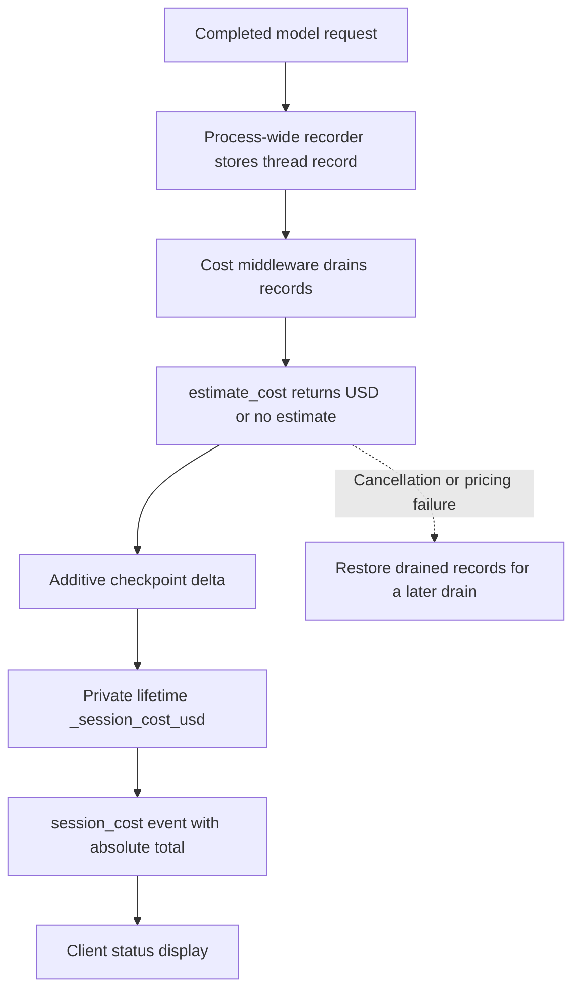
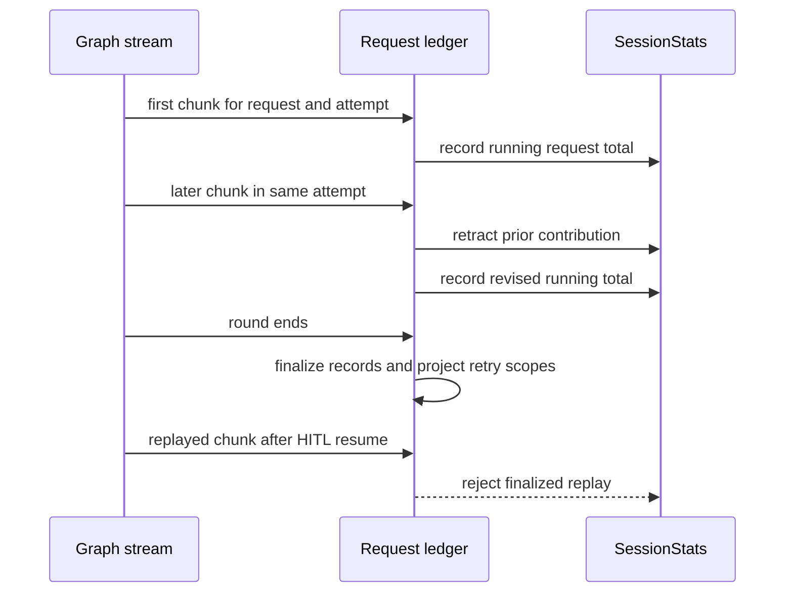

# Cost Tracking, Sessions & Runtime Stats

`deepagents_code` has two complementary accounting paths. The graph checkpoint owns the durable, per-thread cost shown by `/cost` and the TUI status bar. Stream consumers maintain `SessionStats` for responsive token/cost summaries and the end-of-run table. Neither path is a billing system or execution control: estimates are **display-only**. No CLI mechanism caps spend or prevents a request because of an estimate.

- Architecture context: [Code Agent](../architecture/code-agent.md)
- Token and compaction context: [Context Management](../concepts/context-management.md)
- Option precedence: [Config Layering](../concepts/config-layering.md)
- Checkpoint concepts: [State Persistence](../concepts/state-persistence.md)
- Running a thread: [Run a dcode Session](../workflows/run-dcode-session.md)

## Ownership and boundaries

| Concern | Owner | Operational consequence |
| --- | --- | --- |
| Estimate a request | `estimate_cost` | Best-effort USD estimate or `None`; never blocks a turn. |
| Durable thread total | `CostTrackingMiddleware` / `CostState` | A graph-checkpointed lifetime value, not a client accumulator. |
| Capture model calls | `_SessionCostRecorder` | Process-wide callback coverage, including side invokes and subagents. |
| Stream-facing statistics | `SessionStats` and its request ledger | One API call remains one statistic despite streaming, retries, and HITL replay. |
| Resume facts | `ResumeState` and middleware | Private, versioned channels restore the selected checkpoint without reprocessing history. |
| Thread storage and management | `sessions.py` | LangGraph checkpoints in the profile SQLite database. |

## Durable cost lifecycle

`CostState` extends `ResumeState` with `_session_cost_usd`, a schema-private channel using `operator.add`. Writers submit a newly priced delta rather than read-modify-writing the lifetime total. Thus its value travels with graph checkpoints for local, headless, and remote execution; the client only renders what it receives.

The process-wide inline `_SessionCostRecorder` records completed model calls by thread but deliberately does no pricing. `CostTrackingMiddleware` drains those records and prices them from a worker path. This captures main-agent calls as well as calls that bypass a model-loop `after_model` hook, including offload/summarization, Auto-mode classification, and subagents. The main response also has a state-based fallback, but only if the recorder did not charge its message ID, preventing a duplicate charge when callbacks work.

*Completed model calls are captured first, then converted into a checkpointed absolute thread total; the display never owns the total.*

`after_model` drains calls finished since the prior checkpoint. `after_agent` drains work that occurs after the final model step, notably rubric grading, so middleware order keeps that spend in the completing turn. Each hook catches failures because an accounting-node failure must not fail a user turn. The lower pricing loop catches `BaseException`; on cancellation it returns drained records to the recorder for a later attempt rather than silently losing known spend. A request that cannot be priced is omitted with no execution impact.

### Nested graphs and server operations

A nested middleware instance resets its private cost channel in `before_agent`, checkpoints local deltas during its run, and on completion stages the accumulated total in `_session_cost_transfers`. This map is addressed by completed checkpoint scope and records the owning parent scope; its merge reducer allows independent parallel subagents. The task tool checkpoints the transfer on that parent even if a sibling interrupts. The private nested total does not leak into another graph directly.

Server-owned work uses `prepare_operation_cost(state, thread_id)`. It drains and prices operation calls but returns a `PreparedOperationCost` rather than immediately changing graph state. Persist its `update` atomically with the operation's state, or call `rollback()` if that operation is abandoned or its write fails. This remains required when the prepared delta is zero because preparation still claims records. An un-settled prepared object warns that its spend was lost from the lifetime total.

The durable writer emits custom event `session_cost` with `type`, `total`, `thread_id`, and `pricing_ok`. `total` is the **absolute** lifetime estimate, not a delta, allowing a client that missed an event to converge on the next one. `thread_id` prevents a switched client from applying a stale event; `pricing_ok` distinguishes a broken pricing installation in the pricing process from valid but unpriced models.

## Pricing data and safe customization

`estimate_cost` is the sole `genai-prices` import/call site, and imports lazily to keep package data off startup. It passes inclusive LangChain input tokens plus cache, audio, and reasoning detail buckets so `genai-prices` can price details without double counting. Details without a model-specific rate remain in ordinary input/output pricing. Missing model/usage, a combined-only `total_tokens` report, and providers such as `openai_codex` return `None`. Self-inconsistent cache counts are clamped with a warning rather than discarding the request.

Provider IDs are normalized by `_PROVIDER_ALIASES` before lookup (`bedrock` to `aws`, `xai` to `x-ai`, and `google_genai` to `google`, for example). If response metadata is incomplete, configured model metadata and checkpointed model information provide fallbacks; a missing identity can still leave the request unpriced.

On its first successful import, dcode starts one daemon updater that refreshes upstream pricing data hourly. Set `DEEPAGENTS_CODE_PRICES_AUTO_UPDATE=0`, set `[update].prices_auto_update = false`, or use `DEEPAGENTS_CODE_OFFLINE` to prevent the fetch. A failed refresh retains the bundled catalog or the last successfully installed snapshot.

### Override precedence

When the primary `genai-prices` catalog misses, dcode consults `~/.deepagents/prices.json` and then packaged `bundled_prices.json`. Upstream wins whenever it has a match; for the same provider/model in the fallback catalog, the user entry wins. The user file is read once when first needed, so restart dcode after editing it. Errors in an override never interrupt a model request: malformed sources are discarded, and unexpected loader failures warn once and leave an empty fallback catalog.

`prices.json` is a bare provider array using the `genai-prices` schema. Providers contain `id`, `name`, and `api_pattern`; models contain `id`, `match`, and `prices`. Rates are per million tokens such as `input_mtok` and `output_mtok`, optionally cache/audio/reasoning buckets. Use the post-alias provider ID. If no provider claims it, dcode may sweep entries by model match and warn: that last-resort behavior can price a request against the wrong provider rather than omit it.

Bundled entries are deliberately temporary. Each must include `price_comments` pointing to an upstream PR or issue, and maintainers remove it once upstream has coverage.

## Streaming statistics: revisions are not replay

`SessionStats` holds request count, input/output and cache token totals, priced-request count, cumulative estimate, wall time, and two breakdowns: `per_model` keyed by `(provider, model_name)` and `per_kind` (`assistant`, `subagent`, `offload`, `auto`). `classify_usage_kind` identifies subagents from namespace status and recognizes `summarization` and `auto_mode_classifier` stream metadata.

A stream's client-side totals are useful for immediate rendering, but are not the durable graph total. `record_message_usage` has a ledger of `RecordedRequest` contributions to make the distinction below explicit:

*Within one stream round, chunks revise a single request; after the boundary, the same completed request is replay protection rather than new usage.*

A completed `AIMessage` supplies whole-request usage and is idempotent on replay. Chunks are different: some providers emit a whole snapshot once while Google can emit incremental usage and identify its model only in the final chunk. A later chunk in the same active attempt retracts the exact previous ledger contribution and records the revised aggregate, including any corrected model identity. This preserves agreement between grand totals and the per-model/per-kind views.

Retry attempts may reuse a provider message ID, so an `attempt_scope` combines attempt identity with that ID: retries are separate requests, while chunks for one attempt still revise each other. At every stream-round boundary—also on an aborted headless round—`finalize_recorded_requests` finalizes the ledger and projects scoped entries onto bare IDs. A HITL resume can replay old chunks without scope; it finds the finalized entry and cannot merge or double tokens/cost. Both the TUI adapter and non-interactive runner finalize their ledgers around each graph stream pass.

`print_usage_table` renders the end-of-run Rich table when `usage_table_enabled()` permits it. The preference is `display.show_usage_stats`, including its environment/config resolution, defaulting to enabled. It is resolved through one shared function so TUI teardown and headless execution agree. Configuration-resolution failures fail open for this cosmetic output, while `BlockingError` is re-raised to expose event-loop blocking. `/cost` also reports how many recorded calls contributed, distinguishing omitted unpriced calls from literal zero-cost estimates.

## SQLite threads and resume state

LangGraph checkpoints are stored in one SQLite database at `DEFAULT_STATE_DIR/sessions.db`. `get_db_path()` hardens and caches the directory/path; `get_checkpointer()` yields an `AsyncSqliteSaver` using a module-owned connection. New thread IDs are time-ordered UUID7 strings. Connection helpers patch the `aiosqlite` compatibility surface, drain its worker after close, and guard the raw handle during cancellation so shutdown does not leak a connection or leave a worker targeting a closed event loop.

`ResumeState` channels are schema-private and checkpoint-versioned: restoring a specific checkpoint restores its values, not a thread-wide aggregate, without replaying or retokenizing conversation history.

- **Successful model-turn facts:** `ResumeStateMiddleware.after_model` writes `_context_tokens` from the newest `AIMessage`, which powers `/tokens` and the status bar. `ConfigurableModelMiddleware` writes effective `_model_spec` and `_model_params`, allowing `dcode -r` to restore the model actually used. It also commits `_last_model_request_at` together with `_last_cache_model_spec` and `_last_cache_endpoint` after a successful request, enabling cache-cold detection with a consistent identity/time pair.
- **Goal and rubric facts:** accepted goal/rubric fields and the tri-state `_rubric_model_spec` are restored separately from public graph input. The TUI writes user selections via `aupdate_state`; graph middleware/tools write proposals and agent-driven status updates. Both write routes use the same checkpoint semantics for local and remote graphs.
- **Cost facts:** `CostState` inherits `ResumeState`, so `_session_cost_usd` and pending nested transfers resume through that same state path.

`list_threads` creates a non-fatal covering index, `idx_dcode_threads_list`, so its checkpoint metadata grouping can avoid scanning blob-heavy checkpoint rows. `delete_thread` deletes checkpoint and write rows, invalidates in-module caches, and then best-effort removes offloaded conversation history; its Boolean result only says whether checkpoint rows were deleted. It still attempts archive cleanup when no checkpoint rows exist, which removes stranded local archives while returning `False` for the missing thread.

### Offloaded-history retention and deletion

Local offload archives are per-thread Markdown files under `~/.deepagents/conversation_history/` (or a private temporary fallback when the profile location is unavailable). The archive subdirectory is created and hardened to `0o700`; fallback storage is explicitly ephemeral. In server/sandbox mode archive persistence belongs to that backend, so local cleanup has no remote effect.

At TUI startup, a fire-and-forget worker calls `sweep_offloaded_history()` off the event loop. It resolves `history.retention_days` through normal configuration layering; the default is 30 days, and `DEEPAGENTS_CODE_HISTORY_RETENTION_DAYS` is an available override. A value of `0` disables the sweep before it resolves archive storage. The sweep considers only direct, regular `.md` children whose mtime is older than the cutoff. It rechecks mtime on an open descriptor before unlinking, avoiding a race with a concurrent archive refresh; missing files and filesystem failures are non-fatal and do not inflate its deletion count.

`delete_offloaded_history(thread_id)` is likewise best effort and rejects a path-escaping thread ID before unlinking `{root}/conversation_history/{thread_id}.md`. Root resolution may create/harden the archive directory and probe writability even if the archive is absent. Consequently, checkpoint deletion remains authoritative: an archive-cleanup failure is logged rather than allowed to block deletion.

## Safe changes and focused verification

When changing this area, preserve these boundaries:

1. Do not turn estimated price into a budget gate, and do not make unavailable pricing fail the agent.
2. Keep durable cost mutations in checkpointed graph state; client stream calculations are provisional displays.
3. Treat a later chunk in the same active request as a **revision**, but treat a finalized request on a later HITL pass as a **replay**. Preserve attempt scoping and boundary finalization when altering stream loops.
4. Keep a server operation's prepared cost coupled atomically to its state write, with rollback on every abandoned path.
5. Test model/provider fallback, aliases, missing usage, cache clamping, failed catalog/override loads, and upstream-versus-user-versus-bundled precedence. Test full-message replay, incremental chunks, final-chunk model discovery, retried IDs, and HITL replay separately.
6. Exercise nested interruption/transfer behavior plus SQLite list/delete and cancelled connection startup. For archive retention, cover old versus fresh regular Markdown files, `0` retention, layered overrides, and unlink failure; cover orphan-archive deletion separately. See the repository unit suites for `test_cost_tracking.py`, `test_session_stats.py`, `test_sessions.py`, and `test_offload.py`, and the broader [Testing Guide](../testing/testing-guide.md).
