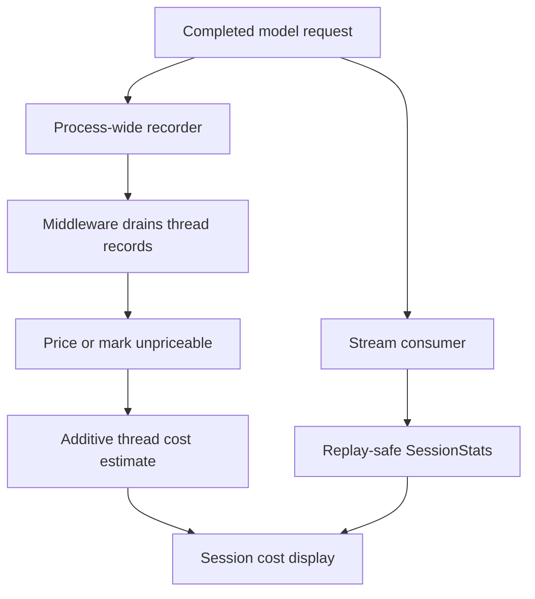
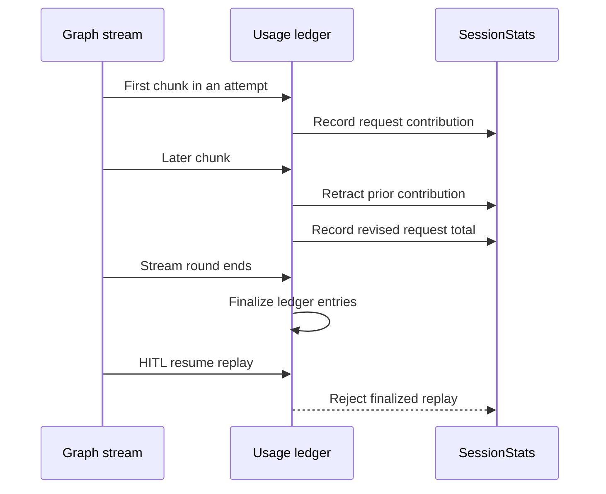

# Cost Tracking and Session Operations

A dcode session has two accounting views. `CostTrackingMiddleware` produces the thread's cumulative estimated spend, while `SessionStats` is a replay-safe client-side usage ledger used by stream consumers and the usage table. They are **estimates, not billing**: dcode neither caps spend nor blocks execution based on a cost figure.

This page covers operational behavior around a session. The SQLite checkpoint implementation is the persistence substrate, not the subject here; see [State persistence](../concepts/state-persistence.md). For execution behavior, see [Runtime behavior](../architecture/runtime-behavior.md); for compaction and offload behavior, see [Context management](../concepts/context-management.md).

## What is authoritative

| Concern | Owner | Operational meaning |
| --- | --- | --- |
| Estimated thread cost | `CostTrackingMiddleware` | The schema-private `_session_cost_usd` is an additive cumulative estimate for priceable calls. |
| Live token and cost display | `SessionStats` | A client/stream ledger; useful for diagnostics but not the durable total. |
| Price catalog | `genai-prices`, then optional dcode overrides | Missing or unusable pricing omits a call from the dollar total. |
| Offloaded history | `conversation_history/<thread_id>.md` | A recovery/context artifact, managed separately from checkpoints. |
| Session recovery | LangGraph checkpoint selected by the caller | Recovery rehydrates private state at that checkpoint; it does not replay history to recalculate it. |

*The checkpoint-owned estimate and the stream usage ledger serve different operational purposes.*

## Accounting lifecycle

`CostState` adds `_session_cost_usd` with an `operator.add` reducer. A charge writes only its newly priced delta, avoiding read-modify-write races when the graph checkpoints. The main graph owns the total; this does not make the UI's running number a persistence authority.

`_SessionCostRecorder` is installed for model requests process-wide and records completed requests by thread and checkpoint scope. It intentionally does no pricing in its callback path. Consequently, ordinary agent requests, subagent calls, offload/summarization, and Auto-classifier calls use the same capture path. `after_model` drains records from the prior checkpoint interval; `after_agent` drains late work such as rubric grading. Hook errors are caught because an accounting-node failure must not fail a user's turn. A failed pricing pass restores its drained records so a later drain can retry.

The middleware also prices the latest main `AIMessage` from state when callbacks did not yield an attributable record. It joins on message ID when possible to avoid a double charge; where identity is unavailable it deliberately prefers a possible undercount over charging an already-recorded call twice.

### Nested and server-side work

A nested middleware resets its local cost channel in `before_agent`, checkpoints local spend, then passes its completed total through `_session_cost_transfers`. Each transfer carries the nested checkpoint scope, its `owner_scope`, and cost; the matching parent claims it into its own total. This permits a completed subagent's cost to survive sibling interruption without making siblings claim each other's work.

Server operations that invoke a side model must use `prepare_operation_cost(state, thread_id)`. It destructively claims and prices records but does not persist them. Persist `PreparedOperationCost.update` atomically with the operation state and then commit it; roll it back when the write fails or the operation is abandoned. This applies even to a zero-dollar prepared delta because records were still consumed.

## Estimate semantics and catalog operations

`estimate_cost` uses LangChain usage metadata and `genai-prices`. Input tokens are inclusive of cache reads/writes; cache, audio, and reasoning detail buckets are passed with that total so the pricing library can subtract priced detail buckets before applying rates. A bucket lacking a matching rate remains in ordinary input or output pricing rather than being silently discarded.

A missing model/provider identity, usage split, price match, or usable pricing library produces no estimate. `/cost` distinguishes unpriced requests from zero-cost requests. Treat every dollar amount as an estimate: provider catalog data, model identity, proxy naming, and usage metadata can all make it incomplete or inaccurate.

On first successful pricing import, dcode may start one daemon updater that fetches upstream `data.json` hourly and installs a validated snapshot. Set `DEEPAGENTS_CODE_PRICES_AUTO_UPDATE=0`, `[update].prices_auto_update = false`, or `DEEPAGENTS_CODE_OFFLINE` to suppress it. Failed or rejected refreshes leave the existing snapshot in place; a catalog with fewer providers than dcode's bundled catalog is rejected to avoid installing an obviously truncated source.

If upstream lookup misses, dcode tries `~/.deepagents/prices.json` and then bundled `bundled_prices.json`; upstream always wins and the user entry wins a user/bundle conflict. The user file is read once, so restart dcode after editing it. Invalid override data warns and is skipped instead of breaking a turn. Overrides rely on private `genai-prices` APIs, so verify this integration when changing that dependency.

## Live usage, chunks, retries, and display

`SessionStats` accumulates request count, input/output and cache tokens, estimated USD, priced-request count, wall time, plus breakdowns by `(provider, model_name)` and `UsageKind`. It is designed to prevent a streaming transport detail from appearing as additional API spend.

*Within a stream round, chunks revise one request; round finalization prevents a resume replay from counting it again.*

`record_message_usage` treats a completed `AIMessage` as idempotent. Chunks revise the precise previous `RecordedRequest`, including when a final chunk names a more specific model. Retry attempts use `(attempt_scope, message_id)`, allowing providers that reuse IDs to count distinct attempts. Consumers retaining a ledger across HITL resume rounds must call `finalize_recorded_requests`; it closes entries and projects scoped entries to bare IDs so an unscoped replay is rejected.

The end-of-run table is rendered by `print_usage_table` when `usage_table_enabled()` permits it. The implementation resolves `display.show_usage_stats` (default enabled); configuration errors show the cosmetic table, while a `BlockingError` is re-raised because it signals blocking work on the event loop.

## Recovery artifacts, deletion, and retention

A thread ID is a time-ordered UUID7. The session service uses it to locate checkpoints and its local offloaded history archive. `delete_thread(thread_id)` deletes checkpoint/write records, invalidates its in-process caches, and then attempts archive removal. Its Boolean means only that checkpoint rows were deleted: archive cleanup is best effort and may occur even when no checkpoint thread remains.

Local offloaded history normally lives in a hardened `conversation_history` directory below the dcode profile. If that profile root is unwritable, dcode uses private temporary storage and warns that the history may not survive a restart. Archive deletion rejects a path-escaping thread ID. In server/sandbox mode the archive can be backend-owned, so there may be no local file to remove.

`history.retention_days` controls a TUI-startup background sweep. **Enforced behavior:** the default is 30 days; `0` disables the sweep; it targets only direct, regular `.md` files older than the cutoff; and individual filesystem errors are logged while startup continues. This is retention of offloaded archives, not a retention policy for graph checkpoints.

## Context and session diagnostics

Use `/context-doctor` when the practical question is why a new request starts large. It builds a fresh-session audit for the base system prompt, AGENTS.md memory, progressive-disclosure skills, built-in tool schemas, and each MCP server's tool definitions. It estimates section size at roughly four characters per token, reports the injected subtotal before conversation history, and, when available, compares that with conversation and provider-reported context. The unattributed delta is diagnostic evidence, not an exact tokenization or enforced context limit. For unavailable custom or remote-agent components, it reports `unavailable` rather than inventing a count.

For cost discrepancies, first establish whether the request was unpriced, the recorder dropped it under a hard bound, or the display is showing a provisional stream value awaiting the graph's absolute total. Then inspect model/provider identity and override warnings. For resume discrepancies, ensure each stream consumer finalizes its request ledger at the round boundary and compare the selected checkpoint's private values—not a thread-wide aggregate.

## Limits and safe operations

The following are implementation-enforced resource bounds, not spend controls:

| Bound | Value | Effect when exceeded |
| --- | ---: | --- |
| Recorder thread queues | 64 | Oldest inactive thread's undrained records are evicted. |
| Undrained records per active thread | 1,024 | Oldest records are dropped and their cost is missing from the total. |
| Started requests awaiting callback completion | 4,096 | Oldest start context is evicted; a later completion cannot be attributed and is dropped. |
| Default thread-list result | 20 | The listing default; `DEEPAGENTS_CODE_RECENT_THREADS` can change it, with a minimum of 1. |

These bounds keep a crashed, cancelled, or non-draining process from accumulating unbounded recorder memory. They are not guarantees that all actual provider charges will appear in an estimate. Monitoring warning logs is essential if a total is used for operational reporting.

### Focused validation

Changes to this area should exercise `test_cost_tracking.py`, `test_session_stats.py`, `test_offload.py`, `test_sessions.py`, and `test_context_doctor.py` under `libs/code/tests/unit_tests/`. Prioritize callback-loss fallback, drain rollback, nested transfer ownership, chunk corrections, retry/HITL replay, archive cleanup races, and the distinction between approximate diagnostics and enforced limits.
