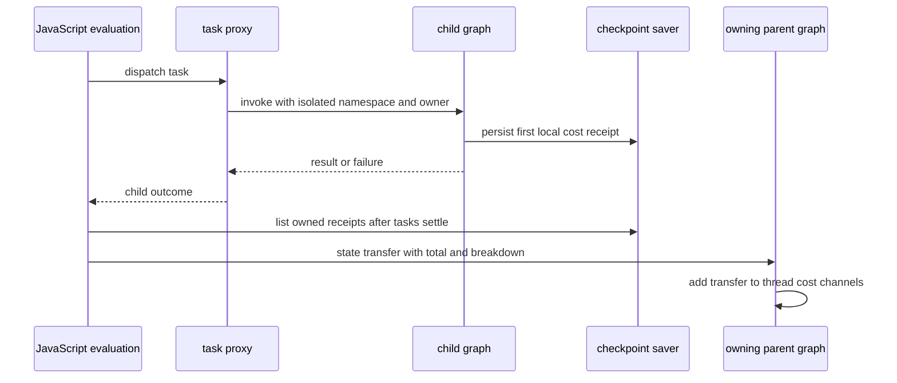
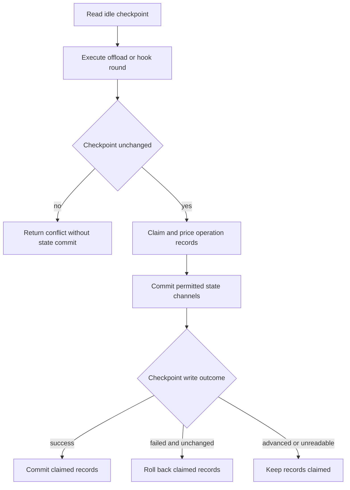

# dcode Cost, Session, and Context Operations

Cost in dcode is an **estimate**, not provider billing, an authorization decision, or budget enforcement. It does not cap or gate requests. Treat a missing price as an accounting gap—not proof that a request was free—and reconcile charges with the provider's billing records.

Related material: [Code agent architecture](../architecture/code-agent.md), [State persistence](../concepts/state-persistence.md), [Sandbox partners](../integrations/sandbox-partners.md), and [Run a dcode session](../workflows/run-dcode-session.md).

## Accounting owners and durable ledgers

| Concern | Owner | Operational meaning |
| --- | --- | --- |
| Main graph estimate | `CostTrackingMiddleware` and `CostState` checkpoint channels | `_session_cost_usd` is the durable, cumulative estimate for priceable graph calls. `_session_cost_breakdown` preserves structured usage, including unpriceable requests. |
| Nested and JavaScript-dispatched work | Nested cost middleware, receipt checkpoints, and transfer records | A completed child total is handed to the graph scope that owns it; child graph state is not the thread total. |
| Live local usage | `SessionStats` | A replay-safe client display ledger for streamed usage, not durable thread accounting. |
| Combined client presentation | `SessionCostTracker` | Retains graph and side-question sources independently and merges them only when presenting a snapshot. |
| Side-question subtotal | `dcode_btw_costs` in sessions SQLite | Durable subtotal for completed tool-free side questions; it does not feed back into the graph recorder or checkpoint channel. |
| Server operation cost | `PreparedOperationCost` | Destructively claimed recorder entries that must be settled with the corresponding checkpoint result. |

```mermaid
flowchart TD
    call["Completed model call"] --> recorder["Process-wide recorder"]
    recorder --> middleware["Graph middleware drains and prices"]
    middleware --> checkpoint["Additive graph cost channels"]
    child["JavaScript child graph"] --> receipt["Durable owned receipt"]
    receipt --> transfer["Transfer to parent graph scope"]
    transfer --> checkpoint
    call --> side["Side-question recorder"]
    side --> sqlite["SQLite side-cost subtotal"]
    checkpoint --> client["Graph subtotal"]
    sqlite --> client
    client --> display["Combined estimated session cost"]
```

*Main graph and side-question accounting remain separate; JavaScript child work joins the main graph only through a parent-owned transfer.*

`CostState` uses additive reducers, so each drain supplies a delta rather than performing a shared read-modify-write. The process-wide recorder records completed model calls by thread and graph scope but deliberately does not price in its inline callback. `CostTrackingMiddleware` drains and prices after model steps and at agent completion for late work. A hook failure is logged rather than failing the user turn; when possible, drained records are restored for a later attempt.

The main agent owns the thread total. A nested middleware instance resets its local accounting at run start, checkpoints local deltas before an interrupt can pause the child, and stages its completed total in `_session_cost_transfers` for the owning parent scope. Parallel children can supply independent transfer-map entries.

## JavaScript subagents: receipt ownership and replay safety

When `enable_interpreter` is enabled for a local agent, construction adds `CostAwareCodeInterpreterMiddleware`. Remote sandboxes do not support that interpreter in this release. The middleware wraps asynchronous `task` dispatches from JavaScript while leaving synchronous tool execution unchanged.

Each interpreter evaluation chooses one opaque accounting owner: an inherited owner for a nested dispatch, or a key based on its checkpoint scope and a hash of the tool-call ID. Each dispatched child receives an isolated checkpoint namespace based on a hash of its description, type, response schema, and occurrence. The hash avoids putting prompt text in checkpoint names; the occurrence prevents identical parallel requests from colliding.

A child cost hook calls `record_cost_receipt` before its graph update returns. With an owner and a checkpoint saver, it writes the local delta and breakdown under a receipt namespace. The write is synchronous from the worker thread's perspective, and refuses to replace an existing receipt: replay therefore retains the first node receipt. Zero-dollar requests are retained when their breakdown has request usage, so a free or unpriceable request remains visible in historical accounting.

After all dispatched tasks settle—or are cancelled and awaited in the interpreter's `finally` block—the outer evaluation totals the latest receipt from each owned namespace. It emits a `_session_cost_transfers` entry targeting the parent checkpoint scope. Nested interpreter work inherits the owner, so only the outer owner exports the receipt total and a descendant cannot be charged again by an intermediate graph. If no saver or owner is available, the receipt path is a no-op rather than a model-execution failure.

```mermaid
sequenceDiagram
    participant JS as JavaScript evaluation
    participant Proxy as task proxy
    participant Child as child graph
    participant Saver as checkpoint saver
    participant Parent as owning parent graph
    JS->>Proxy: dispatch task
    Proxy->>Child: invoke with isolated namespace and owner
    Child->>Saver: persist first local cost receipt
    Child-->>Proxy: result or failure
    Proxy-->>JS: child outcome
    JS->>Saver: list owned receipts after tasks settle
    JS->>Parent: state transfer with total and breakdown
    Parent->>Parent: add transfer to thread cost channels
```

*Receipt persistence makes completed JavaScript child cost durable across interruption, failure, cancellation, and resume; the parent transfer is the sole route into the thread total.*

This is still best-effort accounting. A receipt can preserve completed child work even if JavaScript later throws or a sibling fails, but no distributed transaction spans provider billing, receipt persistence, and the parent checkpoint update. Do not alter owner keys, namespaces, receipt deduplication, or transfer semantics without exercising restart, parallel-dispatch, interrupt, cancellation, and nested-dispatch cases.

## Price estimation and catalog operations

`_estimate_cost` is best effort. It needs a usable model identity and split input/output usage; a combined `total_tokens` alone is not defensibly priceable. Input totals are inclusive of cache reads and writes. dcode forwards applicable cache, audio, and reasoning detail to `genai-prices`, which avoids double counting buckets it prices; details without a published bucket rate remain in ordinary input or output pricing. Self-inconsistent cache detail is clamped and logged rather than causing the entire request to be dropped.

An unmatched model, unavailable pricing library, unpriceable provider, missing model name, or insufficient usage yields no estimate and does not fail the model request. The structured breakdown distinguishes request count from priced request count, including genuinely free requests whose estimate is `$0.00`.

The lookup path is ordered as follows:

1. Use an upstream `genai-prices` match.
2. On a miss, consult `~/.deepagents/prices.json`.
3. Then consult dcode's `bundled_prices.json` stopgap catalog.

The local catalog is loaded once on the first request that requires it; restart dcode after editing it. Invalid entries are logged and skipped, never allowed to interrupt a model turn. The hourly updater starts only after pricing loads successfully. Disable it with `DEEPAGENTS_CODE_PRICES_AUTO_UPDATE=0`, `[update].prices_auto_update = false`, or truthy `DEEPAGENTS_CODE_OFFLINE`; on fetch failure it keeps the prior snapshot, and it rejects a fetched snapshot with fewer providers than the bundle. Local overrides rely on private `genai-prices` APIs, so dependency upgrades require pricing and override tests.

## Client display and side questions

The graph middleware emits an absolute total, structured breakdown, and pricing-health flag on the custom stream because its private channels are not in the normal state stream. The client ignores an event for another thread, settles matching provisional request amounts, and displays the authoritative graph total plus any remaining provisional amount. Reading committed state is also authoritative, but a state response without `_session_cost_usd` is deliberately not treated as zero.

`SessionStats` is separate live display accounting. It maintains totals plus provider/model and usage-kind breakdowns. Its recorded-request ledger retracts and replaces chunk contributions, scopes retries, and finalizes each stream round, preventing human-in-the-loop replay from being counted twice. The end-of-run usage table is enabled by default through `display.show_usage_stats`; ordinary configuration errors fail open because it is cosmetic, while `BlockingError` is re-raised. A row with no priceable request renders `—`, not `$0.00`.

A tool-free side question runs under a private `_SessionCostRecorder` through `answer_with_cost`. Completed records move to a per-thread pending queue, are priced, then written in a short SQLite transaction. A failed write remains queued for a later `load_cost` retry and is not repriced after it has been priced. Once generation has finished, cancellation waits for settlement to reach a terminal outcome before cancellation is re-raised. Deletion tombstones prevent a late completion or pending retry from recreating deleted spend.

`SessionCostTracker` protects independently delayed sources: it accepts nondecreasing finite graph totals, keeps the newest cumulative side breakdown, and merges them only for a presentation snapshot. Neither source is provider billing.

## Offload and handoff: settlement is conditional

`POST /dcode/threads/{thread_id}/offload` serializes work per thread and requires an eligible, quiescent checkpoint with no pending graph work. It hydrates and executes the operation, verifies that the checkpoint has not advanced, then prepares operation cost. A hook interrupt is resumed by re-executing the stable `operation_id` with accumulated hook responses, not by holding a suspended server coroutine.

```mermaid
flowchart TD
    start["Read idle checkpoint"] --> execute["Execute offload or hook round"]
    execute --> unchanged{"Checkpoint unchanged"}
    unchanged -- "no" --> conflict["Return conflict without state commit"]
    unchanged -- "yes" --> prepare["Claim and price operation records"]
    prepare --> write["Commit permitted state channels"]
    write --> outcome{"Checkpoint write outcome"}
    outcome -- "success" --> committed["Commit claimed records"]
    outcome -- "failed and unchanged" --> restored["Roll back claimed records"]
    outcome -- "advanced or unreadable" --> conservative["Keep records claimed"]
```

*The route favors avoiding a later double estimate when it cannot prove that a failed write did not land.*

`PreparedOperationCost` couples a claimed recorder delta to an additive checkpoint update. Every prepared value—also a zero-dollar delta with usage—must reach exactly one terminal action: `commit()` only after its update persisted, or `rollback()` only when that write is known not to have landed. Preparing is destructive. An abandoned prepare permanently omits the records; rolling back a landed update allows a later drain to double count them.

If an offload state write fails, the route reads the checkpoint again. A confirmed unchanged checkpoint rolls records back. An advanced or unreadable checkpoint keeps them claimed: that can omit an estimate, but restoration could duplicate one. Cancellation during commit is deferred until the commit task settles and then re-raised. This is an exactly-once **intent and best-effort checkpoint settlement protocol**, not an end-to-end exactly-once provider-billing guarantee. The route allowlists state channels and rejects `messages` writes to avoid clobbering concurrent conversation changes.

Normal offload reserves summary state and the cost update before it appends a deferred transcript archive, then links the archive path in the checkpoint. If readback confirms the link is absent, it restores the prior archive; if it cannot determine the link state, it reports an indeterminate result. A post-reservation archive-append failure leaves the committed summary reservation in place.

`POST /dcode/threads/{thread_id}/handoff` differs from compaction: it summarizes for a child thread without compacting the source or writing its summary event. It commits source cost channels only and writes a source-owned recovery transcript for the child summary. If there is no operation-cost update, prepared records are rolled back. The cancellation endpoint waits for the identified task to become terminal and returns `cancelled` or `finished`.

## SQLite threads and archive lifecycle

Thread storage uses a cached, hardened `DEFAULT_STATE_DIR/sessions.db` SQLite path. `get_checkpointer()` exposes LangGraph `AsyncSqliteSaver` through an async context manager over a module-owned connection. New thread IDs are UUID7 strings, but listings retain compatibility with legacy short identifiers.

`delete_thread(thread_id)` removes checkpoint and write rows and best-effort removes its offloaded archive and source-owned handoff snapshots. It first records the side-cost tombstone in the sessions transaction, which discards pending retries and late completions. Its Boolean result reports checkpoint deletion only, not side-cost or archive-cleanup success.

Local archives use a hardened `conversation_history` directory under the persistent profile where possible. If that profile location is unavailable, dcode falls back to marked-ephemeral hardened temporary storage. Cleanup is best effort and must not block thread deletion.

## Verification and operating checklist

- Run `tests/unit_tests/test_cost_tracking.py` after changing usage normalization, lookup, recorder drains/restores, transfers, or operation preparation.
- Run `tests/unit_tests/test_js_cost_tracking.py` for durable receipt ownership, nested and parallel dispatch, replay/resume, failures, zero-dollar or partial pricing, and cancellation around SQLite receipt writes. Run `tests/unit_tests/test_js_cost_sync.py` to preserve synchronous interpreter behavior.
- Run `tests/unit_tests/test_session_stats.py` after changing streamed request identity, chunk aggregation, retries, HITL replay, or usage-table output.
- Run `tests/unit_tests/test_sessions.py` after changing SQLite lifecycle, deletion, IDs, caches, or archive cleanup; run `tests/unit_tests/test_offload_api.py` for idle/conflict checks, hook resume, cost settlement, archive-link recovery, handoff, and cancellation races.
- Run `tests/unit_tests/test_cache_expiry.py` when changing cache-expiry handoff prompts or source/child handoff recovery; it covers source retention across remote state, summary, seed, cancellation, and lost-response failures.
- For a discrepancy, identify the thread and distinguish checkpoint graph cost, persisted side subtotal, provisional client display, unavailable pricing, and provider billing.
- For an indeterminate offload result, inspect `/context` and the latest checkpoint before retrying. Do not blindly rerun a compaction that might have landed.
