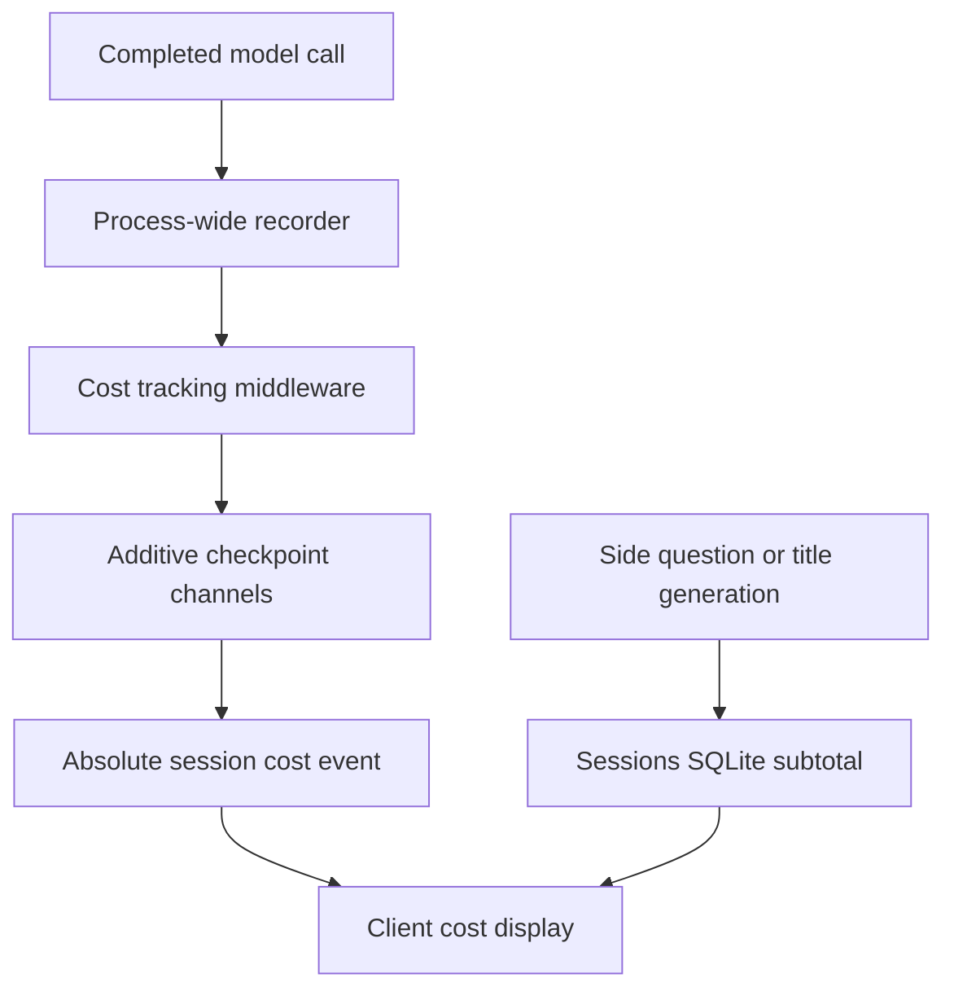
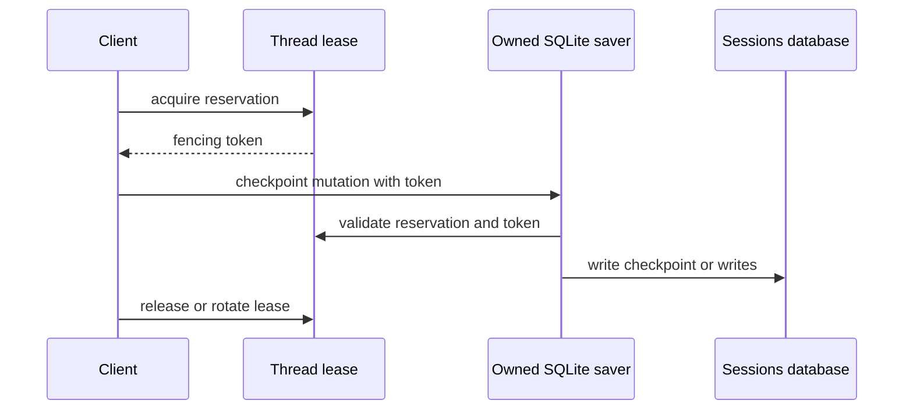
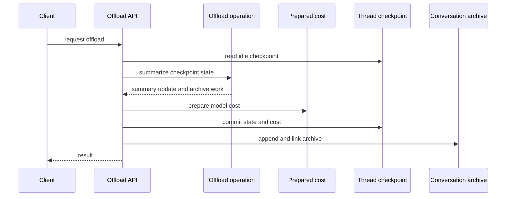

# Cost Tracking and Session Operations

## What a cost total means

All dollar values are **estimates**, not provider invoices, budgets, reservations, or spend limits. A request can be counted even when it has no published price; reconcile billing with the provider.

The durable graph authority is the private, additive checkpoint state `_session_cost_usd` and `_session_cost_breakdown`. `CostTrackingMiddleware` drains completed records after model steps and once more after agent completion. The latter catches work performed after the final model step. Accounting failures are deliberately non-fatal to a user turn: drained records are restored when possible and the hook returns no update on failure. Nested agents checkpoint their local costs before transferring a completed total to their owning parent graph.


```mermaid
flowchart TD
    Call["Completed model call"] --> Recorder["Process-wide recorder"]
    Recorder --> Middleware["Cost tracking middleware"]
    Middleware --> Graph["Additive checkpoint channels"]
    Side["Side question or title generation"] --> SideStore["Sessions SQLite subtotal"]
    Graph --> Event["Absolute session cost event"]
    Event --> Display["Client cost display"]
    SideStore --> Display
```

*Graph spend is checkpointed separately from side-task spend; the client combines read-only totals for presentation.*

`SessionStats` is client-process telemetry rather than the durable lifetime total. It records totals and per-provider/model and request-kind rows. Its usage ledger retracts and replaces a prior streamed contribution as later chunks supply cumulative usage or better model attribution, so one model API call is counted once.

### Breakdown semantics and failure policy

A version-one breakdown contains total and priced request counts, input/output/cache/reasoning token and cost categories, and completeness flags. Unpriceable calls retain reported token usage but leave their cost categories incomplete. Invalid or legacy breakdown data keeps `historical_complete` false; the UI must not imply that a detail table covers older dollar-only history.

The `session_cost` stream event is an absolute thread total, not a delta, and optionally carries the absolute checkpointed breakdown. A client that misses an event can converge on a later one and can discard an event for a thread it no longer displays. Nested `model_usage` events are provisional UI input only: the client rejects unsupported versions, malformed required identifiers or usage, and events for another active thread.

Direct model operations outside normal agent middleware, including server offload, must call `prepare_operation_cost()`. Preparing destructively claims recorder entries. Persist `PreparedOperationCost.update` with the operation state and call `commit()`, or call `rollback()` only when the write demonstrably did not land. An unsettled prepare loses its claimed spend; restoring records after a landed write makes a future drain charge it twice.

## Pricing catalogs and overrides

Pricing is best effort. Missing models, malformed usage, an unavailable `genai-prices` install, or an incompatible pricing contract yield no estimate rather than interrupting model work. Cost tracking distinguishes a broken pricing installation from a model that simply has no published rate.

The primary `genai-prices` catalog begins with package data and may be refreshed in the background once per process. Refresh is disabled by `DEEPAGENTS_CODE_OFFLINE` or the resolved `update.prices_auto_update` option. A guarded updater rejects an upstream snapshot with fewer providers than the bundled catalog, retains the current catalog, and retries at the next interval. This protects against a syntactically valid but partially published catalog that would otherwise replace known rates wholesale.

For an upstream `LookupError`, dcode consults a built-in `bundled_prices.json` stopgap and then the user configuration directory's `prices.json`. The sources use upstream's provider-array schema; invalid, unreadable, or malformed sources are warned about and ignored without stopping the turn. User entries win only on colliding provider/model entries while non-conflicting bundled models remain available. Deterministic results are cached for the process, so editing `prices.json` requires a dcode restart; transient read failures are retried. Once upstream learns a model, primary pricing wins over any fallback override.

## Operator-facing cost diagnostics

The entire-thread breakdown formatter renders only a mapping with `version == 1` and `historical_complete is True`. For valid data it labels unavailable values, marks incomplete categories as `(partial)`, notes any directionless cost that cannot be attributed to input or output, and warns when priced and total request counts differ. Parent input/output rows include their indented cache and reasoning subsets.

`CostBreakdownScreen` is a read-only live modal. It will not stack a duplicate modal, refreshes its provider every 0.5 seconds, and preserves the last view if refresh fails. Display and clipboard content are sanitized plain text without markup; `Esc` closes it and a clipboard failure reports a warning. Treat this view as an operational diagnostic, not a bill or a persistence/backup mechanism.

## Side-task subtotals

Side questions and generated thread names are not fed back into graph checkpoint channels. `btw_cost.py` owns their subtotal in the sessions SQLite database; readers add it to graph cost only for presentation. Settlement drains the side operation's recorder into a per-thread pending queue before it writes. If pricing initially fails, only usage and pricing metadata—not conversation content—is retained for retry. Once priced, retrying a database write does not calculate a new price; only a successful persistence survives a server restart.

A short `BEGIN IMMEDIATE` transaction merges the new breakdown into `dcode_btw_costs`. Thread deletion writes a `null` tombstone before checkpoint deletion, preventing late completions or pending retries from resurrecting deleted spend. Side-task settlement finishes its persistence task before returning an answer or re-raising cancellation.

## Session database lifecycle

Sessions are SQLite checkpoints, not transactional backups. Maintain an independent backup if recovery guarantees matter. Thread rows are lightweight metadata: ID, agent, timestamps, latest checkpoint, branch, working directory, and name. `list_threads()` first creates a covering metadata index and groups checkpoint rows without scanning checkpoint blobs. Names are populated separately.

Message count and initial prompt are more expensive checkpoint-derived fields. They are loaded only when requested or visible, reconstructed from ordered writes when the latest checkpoint lacks messages, and cached against the latest checkpoint ID. Startup and post-turn prewarming refresh only the visible detail columns. Cached selector rows can paint before a fresh database query; only unfiltered update-sorted listings populate that cache.

Thread names are trimmed printable single-line values of 1–50 characters. `rename_thread()` transactionally saves them in `dcode_thread_names` and mirrors the name into the latest checkpoint metadata for compatibility. Reads prefer the durable table and fall back to root-checkpoint metadata.


```mermaid
sequenceDiagram
    participant Client as Client
    participant Lease as Thread lease
    participant Saver as Owned SQLite saver
    participant Store as Sessions database
    Client->>Lease: acquire reservation
    Lease-->>Client: fencing token
    Client->>Saver: checkpoint mutation with token
    Saver->>Lease: validate reservation and token
    Saver->>Store: write checkpoint or writes
    Client->>Lease: release or rotate lease
```

*The ownership check occurs at the write boundary, preventing an old client from writing after release or re-ownership.*

A lease uses operating-system-backed locks plus a random token in an owner file. The owned SQLite saver serializes mutations per thread and validates the live reservation and token. Deletion acquires that reservation, rejects a live owner elsewhere, deletes checkpoints, writes, names, and side cost, then best-effort removes offloaded history. Its Boolean result reports checkpoint deletion, not archive-cleanup success.

Use `/threads` for interactive discovery and `/threads -r [THREAD_ID]` to resume the last reset thread, the most recent active-agent thread, or an explicit target. A cross-agent target may require an agent switch. A normal switch reserves its destination before releasing the old ownership after the outcome is known.

## Safe inspection

Use LangSmith for a traced conversation when available. For trusted offline/local state, use the bundled inspector instead of manually decoding blobs:

```bash
python3 "$SKILL_DIR/scripts/inspect_sessions.py" THREAD_ID --mode latest-turn
python3 "$SKILL_DIR/scripts/inspect_sessions.py" --list 20
```

The inspector opens the database read-only, requires `checkpoints` and `writes`, and uses strict MsgPack deserialization. It reads root-namespace materialized messages from the latest checkpoint, then replays ordered message writes when the checkpoint is unavailable or malformed. A unique ID prefix is accepted; ambiguous prefixes fail. It emits warnings for corrupt metadata, decode failures, skipped writes, malformed overwrites, and truncation-relevant output rather than silently claiming a complete reconstruction.

Its default database follows dcode: `DEEPAGENTS_SESSIONS_DB` takes precedence, otherwise `$DEEPAGENTS_HOME/.state/sessions.db`, otherwise `~/.deepagents/.state/sessions.db`. Do not inspect an untrusted database, expose credentials or hidden reasoning in output, or mutate records through the inspector.

## Server-side offload settlement

Server `/offload` serializes work per thread and requires a registered idle thread with no pending graph work. It reads the checkpoint, reconstructs trusted model context from that state, and rechecks the checkpoint identity before committing. Its update is allowlisted and cannot write `messages`.


```mermaid
sequenceDiagram
    participant Client as Client
    participant Api as Offload API
    participant Engine as Offload operation
    participant Ledger as Prepared cost
    participant Store as Thread checkpoint
    participant Archive as Conversation archive
    Client->>Api: request offload
    Api->>Store: read idle checkpoint
    Api->>Engine: summarize checkpoint state
    Engine-->>Api: summary update and archive work
    Api->>Ledger: prepare model cost
    Api->>Store: commit state and cost
    Api->>Archive: append and link archive
    Api-->>Client: result
```

*Normal offload commits summary state and its prepared cost before deferred archive append and link.*

On a failed checkpoint write, offload rolls back only if readback proves the checkpoint unchanged. If it advanced or is unreadable, it keeps recorder entries claimed to avoid double charging and reports an indeterminate outcome. Cancellation waits for commit work to settle before it is re-raised. A normal offload commits summary state and cost before archive work; a handoff retains source context and commits only source cost channels plus a source-owned recovery transcript.

## Focused verification

- Run `tests/unit_tests/test_cost_tracking.py` for price fallback/update behavior, recorder ownership, breakdown completeness, middleware charging, and prepared-operation settlement.
- Run `tests/unit_tests/skills/test_thread_inspector.py` for read-only inspection, root-namespace filtering, reconstruction, malformed data, and thread-name fallback.
- Run `tests/unit_tests/test_sessions.py` and thread-ownership tests after changing listing, names, deletion, ownership, or checkpoint-derived metadata.
- Run offload API tests after changing checkpoint guards, allowed state channels, cost settlement, cancellation, or archive linking.

Related material: [Context management](../concepts/context-management.md), [State persistence](../concepts/state-persistence.md), [Security](security.md), and [Run a dcode session](../workflows/run-dcode-session.md).
