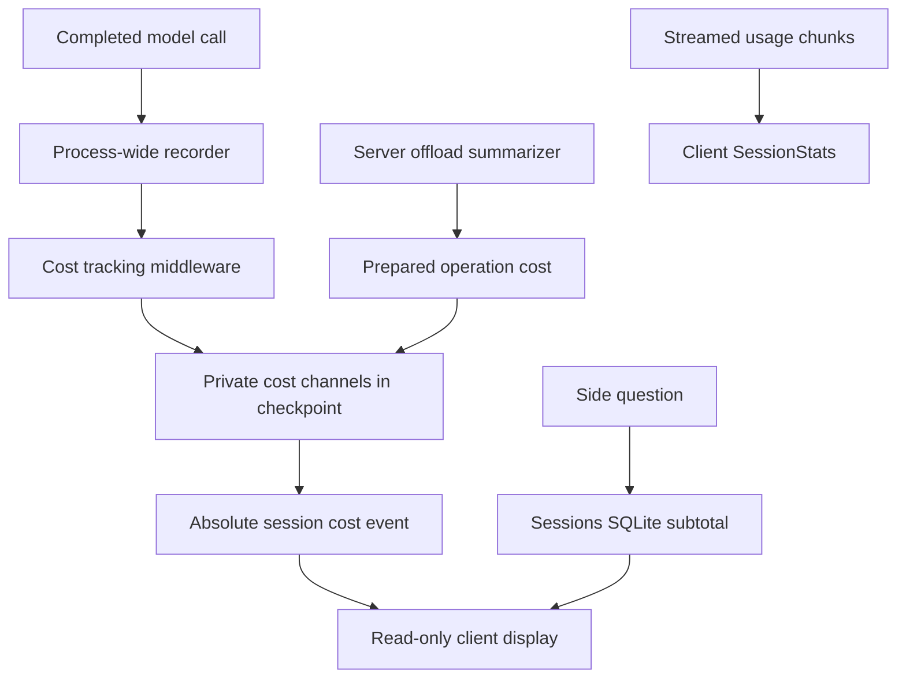
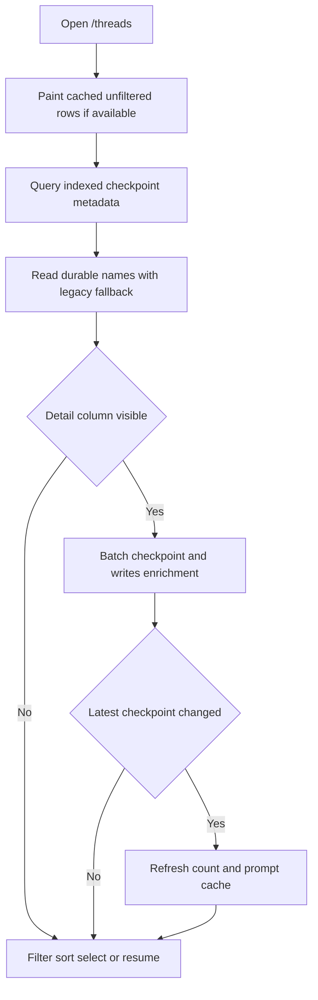
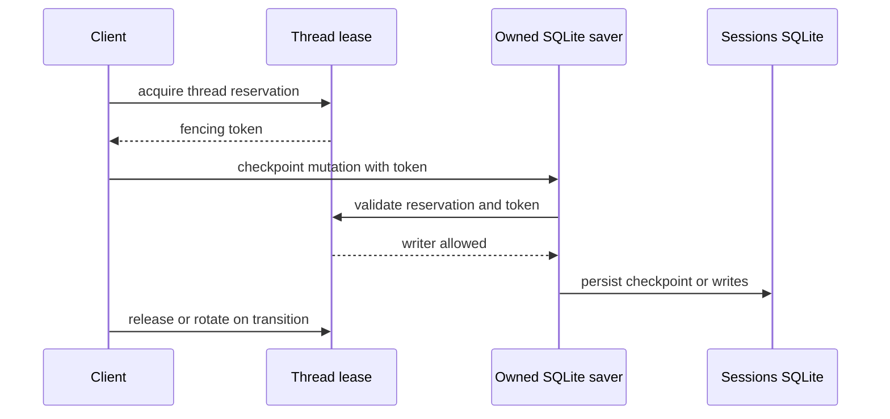
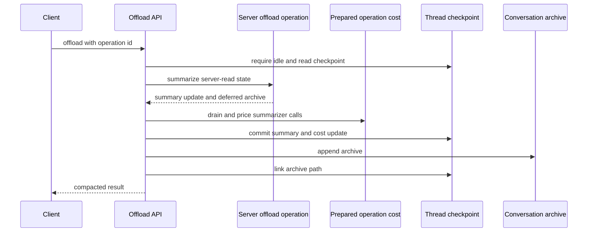

# dcode Cost, Sessions, and Context Operations

## Operational boundaries

dcode reports **estimated** model cost, not provider billing, a reservation, a budget, or a spending gate. Reconcile charges with the provider. An unpriceable request can still be represented in request counts and structured accounting, but it does not contribute a dollar estimate.

A local SQLite checkpoint is durable application state for a dcode thread; it is **not a transactional backup**. It can be changed or deleted by normal lifecycle operations, local inspection is intended for trusted local state, and archive cleanup is best effort. Maintain independent backups when recovery guarantees matter.

The graph checkpoint owns the cumulative graph-cost channels. The terminal client renders server-owned checkpoint totals and streamed absolute totals; it does not write the lifetime total. Client-process `SessionStats` is instead a presentation/usage accumulator: it tracks totals, per-provider/model rows, and request kind buckets for the running process or active loaded thread. A streamed request revised by later chunks is retracted and re-recorded, so one model invocation remains one request rather than one request per chunk. Side questions are separate: their subtotal is persisted in the sessions database and merged with graph cost only for client presentation.


```mermaid
flowchart TD
    Call["Completed model call"] --> Recorder["Process-wide recorder"]
    Recorder --> Middleware["Cost tracking middleware"]
    Middleware --> Checkpoint["Private cost channels in checkpoint"]
    Operation["Server offload summarizer"] --> Prepared["Prepared operation cost"]
    Prepared --> Checkpoint
    Checkpoint --> Stream["Absolute session cost event"]
    Stream --> Client["Read-only client display"]
    LocalUsage["Streamed usage chunks"] --> Stats["Client SessionStats"]
    Side["Side question"] --> SideDB["Sessions SQLite subtotal"]
    SideDB --> Client
```

*Durable graph cost and side-question cost have separate persistence paths; client usage statistics are useful live telemetry, not the durable cost authority.*

`CostTrackingMiddleware` owns `_session_cost_usd` and `_session_cost_breakdown`, both additive private state channels. It drains completed call records after model steps and again when the agent finishes. It returns records to the recorder if pricing processing fails, because accounting must not fail a user turn. Nested agents first persist local cost and then stage an owner-scoped transfer for the parent graph, avoiding a loss when an interrupt stops a child after it has spent.

Pricing is best effort. `estimate_cost` is the sole `genai-prices` integration; unsupported models or malformed usage produce no price rather than failing the invocation. The structured version-one breakdown records request counts, token categories, dollar categories, and completeness flags. The `session_cost` stream event carries an **absolute** thread total and optional absolute breakdown, allowing a client to converge after missed events and discard events for a thread it no longer displays.

### Cost operation invariants

- Do not treat `_session_cost_usd`, a `SessionStats` total, or a displayed table as an invoice. They cover only usage that dcode could observe and, for dollars, price.
- Preserve both the dollar total and structured breakdown on changes. Old checkpoints may contain a dollar total without historical detail; merging malformed or legacy detail marks `historical_complete` false.
- A direct model operation outside normal model middleware, such as server offload, must use `prepare_operation_cost()` and settle it exactly once. Its destructive recorder drain means even a zero-dollar prepared update must be committed with the state update or rolled back.
- For a failed offload checkpoint write, roll back only when a readback proves the checkpoint is unchanged. If it advanced or cannot be read, retain the claimed records to avoid a possible double charge; the result is deliberately indeterminate rather than silently retried.
- A nested model-usage event is provisional UI input. The consumer validates its type/version, required identity and usage fields, and active thread before incorporating it; an unsupported event version loses only that provisional detail because the durable thread total is separately streamed.

## Entire-thread breakdown and read-only UI

The status bar opens **Token & Cost Breakdown** only when a left, first click lands on the rendered cost span. The application formats the current `_session_cost_usd` plus `_session_cost_breakdown`; it is a live, read-only view of graph accounting, not a provider bill, a backup record, or a side-question subtotal. A second modal is not stacked. While open, it refreshes every 0.5 seconds and retains its prior text if the provider fails.

The entire-thread formatter refuses a table unless it sees a mapping with `version == 1` and `historical_complete is True`. This prevents a dollar-only legacy history from appearing as complete token detail. For valid detail, parent input/output rows are inclusive of cache-creation, cache-read, and reasoning subsets. Invalid fields render as `unavailable`; incomplete categories carry `(partial)`; a positive difference between directional and total cost is reported as directionless/unattributed; and a mismatch between priced and total requests warns that costs are partial.

The modal sanitizes control characters, renders non-markup content, and copies the same current sanitized plain text. `Esc` closes it; a failed clipboard operation produces a warning. These choices make accounting output and any unexpected text safe for terminal presentation rather than an interactive control surface.

## Prompt-cache expiry and cold-cache guidance

Cache expiry is advisory context economics, not durable cost accounting. A checkpointed cache-activity record holds the request time, effective model spec, endpoint identity, and cache-identity parameters. Invalid checkpoint values are discarded rather than interpreted as a warm cache. The cache identity deliberately includes only cache-affecting parameters and, for documented providers, reasoning effort; unrelated settings should not create a false “identity changed” warning.

`ConfigurableModelMiddleware` records effective cache identity around main-model requests. It can add a thread-based OpenAI `prompt_cache_key` and Fireworks session affinity without overwriting caller settings; cross-provider swaps strip Anthropic-only `cache_control` settings. Auxiliary/subagent requests do not overwrite the main conversation's cache identity.

A prompt-cache policy is resolved only for an official provider endpoint or an exact host explicitly listed in `[warnings].trusted_cache_endpoints`. Cross-wire-format routes and unknown or untrusted endpoints resolve to no policy instead of claiming a retention guarantee. The UI can distinguish an expired cache, an identity change, and unknown age; cache retention that is only a provider minimum is presented as “may be cold,” not as proof of expiry.

Operationally, set `[warnings].cache_prompt` to `expiry`, `send`, or `off`. In expiry mode, the client may offer a handoff once for a particular thread and expiry window, subject to the cold-cache threshold and suppression choices. A cache-expiring notification waits for request reconciliation so it does not race a turn that renewed the cache. Treat estimates and expiry indicators as guidance; provider-side cache behavior remains authoritative.

## Discovering and resuming sessions

Use `/threads` to open the interactive thread selector. It initially paints from an in-memory cache when available, then queries the database and enriches only the checkpoint-derived columns that are visible. The selector supports fuzzy search, directory scope, agent filtering, sort by created or updated time, relative timestamps, configurable columns, copy ID, and confirmation before deletion. It defaults to the current working directory according to saved selector configuration; choosing all directories removes that filter.

Use `/threads -r` to resume the thread left by the latest reset, falling back to the most recent thread for the active agent. Use `/threads -r THREAD_ID` for a specific thread. A target owned by a different agent requires an agent-switch offer. The normal picker validates that a selected thread can be reserved; if work is currently running, a chosen switch is deferred until the current task completes. A resume prefetches history before replacing the current transcript and retains the old lease if the switch does not complete.

The `deepagents threads list` command provides non-interactive discovery. It can filter by agent, git branch, and exact stored working-directory string, sort by created or updated time, and render text or JSON. The configured `DEEPAGENTS_CODE_RECENT_THREADS` limit is clamped to at least one; an invalid value falls back to the default.

### Metadata, names, and list performance

A thread row is lightweight metadata: ID, agent, creation/update times, latest checkpoint ID, branch, working directory, and durable name when available. `list_threads()` creates or reuses a covering listing index before grouping the checkpoints table, avoiding a scan over checkpoint blobs. It caches only unfiltered, update-sorted results, preventing a scoped or differently sorted result from contaminating the selector’s initial view.

Message count and initial prompt are intentionally deferred. The latest checkpoint can omit the `messages` channel between snapshots, so the reader can reconstruct detail from ordered writes when the fast checkpoint path is unavailable. dcode batches this enrichment and caches message count and initial prompt against the latest checkpoint ID; changed checkpoints invalidate the cached value. Startup and post-turn background refreshes prewarm only the visible detail columns, keeping the picker’s first paint responsive while allowing an eventual fresh database read.

A thread name is durable metadata separate from ordinary checkpoint revision. `/rename NAME` accepts a trimmed, printable, single-line name of 1–50 characters. `rename_thread()` uses a transaction and a `dcode_thread_names` table, updates the latest checkpoint metadata for compatibility, and can perform an atomic “only if unnamed” generated-name write. Reads prefer the durable table and fall back to the latest root checkpoint metadata for older stores. Naming a nonexistent or not-yet-checkpointed thread returns false; the UI asks the user to send a message first.


```mermaid
flowchart TD
    Open["Open /threads"] --> Cached["Paint cached unfiltered rows if available"]
    Cached --> Query["Query indexed checkpoint metadata"]
    Query --> Names["Read durable names with legacy fallback"]
    Names --> Visible{"Detail column visible"}
    Visible -->|"No"| Browse["Filter sort select or resume"]
    Visible -->|"Yes"| Enrich["Batch checkpoint and writes enrichment"]
    Enrich --> Fresh{"Latest checkpoint changed"}
    Fresh -->|"No"| Browse
    Fresh -->|"Yes"| Cache["Refresh count and prompt cache"]
    Cache --> Browse
```

*Thread discovery keeps metadata listing separate from potentially expensive checkpoint decoding, and uses checkpoint identity as the freshness boundary for derived fields.*

## Safe local inspection

For a traced conversation, prefer LangSmith tooling when it is available. For offline, untraced, or local-only investigation, use the built-in `deepagents-thread-inspector` skill rather than manually decoding SQLite blobs. It opens the session database read-only and uses LangGraph’s strict MsgPack loader to read materialized messages from the latest checkpoint, with ordered-write replay as a fallback.

First obtain the exact current thread ID when the request concerns the active conversation; do not guess it from the newest listed record. A unique prefix is accepted by the inspection script. Resolve `SKILL_DIR` to the directory holding the skill, then use the smallest view that answers the question:

```bash
python3 "$SKILL_DIR/scripts/inspect_sessions.py" THREAD_ID --mode latest-turn
```

Use `--mode summary` to read `thread.thread_name`, or `--mode transcript` when the full stored conversation is needed. Add `--include-metadata` only for model, run, repository, or checkpoint metadata, and adjust `--max-content N` deliberately. If the ID is unknown, list candidates first:

```bash
python3 "$SKILL_DIR/scripts/inspect_sessions.py" --list 20
```

By default the inspector follows dcode’s database-location rules: `$DEEPAGENTS_HOME/.state/sessions.db`, otherwise `~/.deepagents/.state/sessions.db`, with `DEEPAGENTS_SESSIONS_DB` taking precedence. Supply `--db PATH` only for a non-default store; relative and `~user` overrides are rejected rather than silently inspecting a database dcode does not write.

Treat output as sensitive local data. Do not deserialize an untrusted database, mutate rows during inspection, paste raw JSON when a synthesis will do, or expose credentials, tokens, unrelated personal data, or hidden reasoning. Report reconstruction warnings (for example corrupt checkpoints or skipped writes) and truncation flags so conclusions remain appropriately qualified.

## Session persistence and exclusive ownership

Sessions use SQLite checkpoints. `get_checkpointer()` supplies an ownership-fenced `AsyncSqliteSaver`, not a general unguarded writer. A client reserves a thread using operating-system file locks and a random fencing token stored in an owner file. Each checkpoint mutation enters a per-thread writer gate and validates both the live client reservation and supplied token. Releasing or rotating a lease therefore prevents a stale process from writing after another client takes over.


```mermaid
sequenceDiagram
    participant Client as Client
    participant Lease as Thread lease
    participant Saver as Owned SQLite saver
    participant DB as Sessions SQLite
    Client->>Lease: acquire thread reservation
    Lease-->>Client: fencing token
    Client->>Saver: checkpoint mutation with token
    Saver->>Lease: validate reservation and token
    Lease-->>Saver: writer allowed
    Saver->>DB: persist checkpoint or writes
    Client->>Lease: release or rotate on transition
```

*The saver checks ownership at the mutation boundary, so holding an old configuration is insufficient to write a released or re-owned thread.*

Deleting a thread first acquires the same reservation and refuses with `BlockingIOError` if another client owns it. It deletes the SQLite checkpoint/write rows and side-question cost, then best-effort removes offloaded archive material. Its Boolean return reports checkpoint deletion only, not cleanup success.

## Server-side `/offload` and handoff

The built-in server-side offload path serializes attempts per thread, requires an idle registered thread with no pending graph work, reads a checkpoint, then verifies that checkpoint has not changed before committing. The server reconstructs model context from checkpointed settings rather than trusting client-supplied model fields. Its checkpoint update is allowlisted: offload may write summary and private cost channels but must not write `messages`.


```mermaid
sequenceDiagram
    participant CLI as Client
    participant API as Offload API
    participant Graph as Server offload operation
    participant Ledger as Prepared operation cost
    participant Store as Thread checkpoint
    participant Archive as Conversation archive
    CLI->>API: offload with operation id
    API->>Store: require idle and read checkpoint
    API->>Graph: summarize server-read state
    Graph-->>API: summary update and deferred archive
    API->>Ledger: drain and price summarizer calls
    API->>Store: commit summary and cost update
    API->>Archive: append archive
    API->>Store: link archive path
    API-->>CLI: compacted result
```

*This depicts the normal implementation path: state and operation cost are committed before a deferred archive is appended and linked.*

For ordinary offload, summary state and operation cost are committed before archive append; a failed append leaves the summary reservation in place. The archive link is read back after a failed linking write: a confirmed absent link rolls back the appended archive, while an unreadable result is reported as indeterminate. Cancellation does not abandon a commit halfway through: the API waits for the commit task to settle, then re-raises cancellation.

A cache-expiry handoff differs from compaction: it summarizes for a new thread while the source retains full context. The source receives only the prepared cost channels, and the recovery transcript is saved under a source-owned archive prefix. The resulting archive may be marked ephemeral when persistent offload storage is unavailable.

## Focused verification and safe changes

- Run `tests/unit_tests/test_cost_tracking.py` for recorder draining, price fallbacks, middleware transfers, and prepared operation-cost settlement.
- Run `tests/unit_tests/test_js_cost_tracking.py`, `tests/unit_tests/test_app.py`, and `tests/unit_tests/tui/widgets/test_status.py` when changing breakdown formatting, refresh/copy behavior, cost-span interaction, or stream-cost reconciliation.
- Run `tests/unit_tests/test_cache_expiry.py`, `tests/unit_tests/test_cold_cache.py`, and `tests/unit_tests/test_configurable_model.py` for cache identity, endpoint trust, expiry prompting, and request instrumentation.
- Run `tests/unit_tests/test_sessions.py`, `tests/unit_tests/test_thread_ownership.py`, and `tests/unit_tests/test_thread_ownership_transitions.py` when changing listing, checkpoint-derived metadata, names, deletion, leases, or session transitions.
- Run thread-selector widget tests when changing visible-column loading, filtering, selection, or deletion UX.
- Run `tests/unit_tests/test_offload_api.py` and `tests/unit_tests/test_offload.py` for server-side compaction, archive behavior, hooks, cancellation, and settlement.

Related material: [Code agent architecture](../architecture/code-agent.md), [State persistence](../concepts/state-persistence.md), [Testing guide](../testing/testing-guide.md), and [Run a dcode session](../workflows/run-dcode-session.md).
