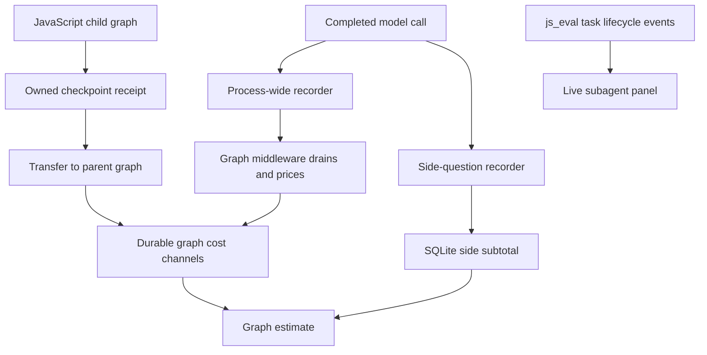
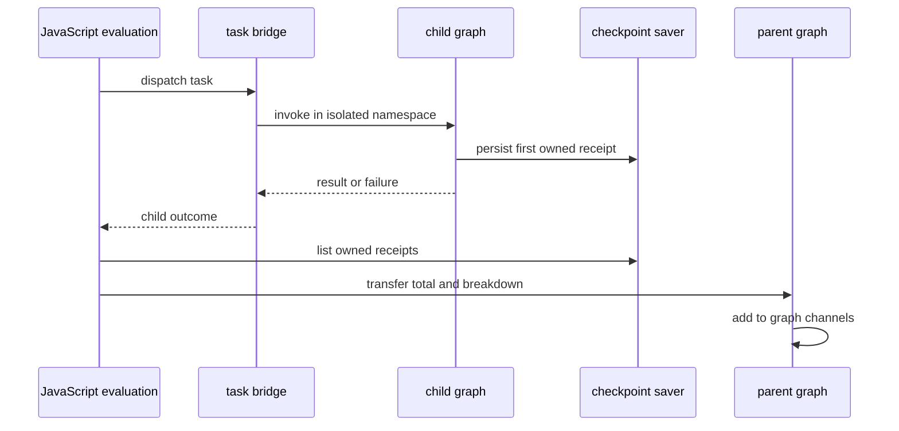
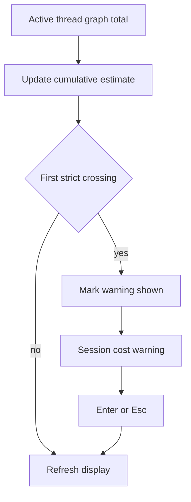

# dcode Cost, Sessions, and Context Operations

## Scope and reporting boundary

Cost in dcode is an **estimate**. It is neither provider billing nor an authorization, reservation, budget, or execution gate. An absent price is an accounting gap, not evidence that a request was free; reconcile spend with provider records.

The terminal client and the agent server are separate processes: the client owns presentation and input, while the server owns graph execution and checkpointed state. This division matters for session reporting: durable graph cost belongs to the checkpointed graph; the client renders streamed and locally observed summaries.

| Surface or ledger | Owner | What it means |
| --- | --- | --- |
| `_session_cost_usd` and `_session_cost_breakdown` | `CostTrackingMiddleware` / graph checkpoints | Durable cumulative estimate and request breakdown for the main graph. |
| Nested and JavaScript-dispatched graph work | Nested middleware, receipts, and parent transfers | A completed child total reaches the owning parent graph; a child-local total is not itself the thread total. |
| `SessionStats` | Client | A replay-safe live usage display ledger, separate from the durable thread estimate. |
| `SessionCostTracker` | Client | Combines independently reported graph and side-question subtotals only for presentation. |
| Side-question subtotal | `dcode_btw_costs` in sessions SQLite | Durable cost for completed tool-free side questions, kept apart from the graph recorder. |
| Dynamic subagent panel | Client | Per-turn live progress for `task()` calls made inside `js_eval`; it is not an accounting ledger. |

```mermaid
flowchart TD
    Call["Completed model call"] --> Recorder["Process-wide recorder"]
    Recorder --> Middleware["Graph middleware drains and prices"]
    Middleware --> Checkpoint["Durable graph cost channels"]
    Child["JavaScript child graph"] --> Receipt["Owned checkpoint receipt"]
    Receipt --> Transfer["Transfer to parent graph"]
    Transfer --> Checkpoint
    Call --> Side["Side-question recorder"]
    Side --> SQLite["SQLite side subtotal"]
    Checkpoint --> Display["Graph estimate"]
    SQLite --> Display
    Bridge["js_eval task lifecycle events"] --> Panel["Live subagent panel"]
```

*Durable graph cost, durable side-question cost, and the per-turn activity panel have distinct owners and lifecycles.*

## Durable cost accounting

`_session_cost_usd` is a checkpoint channel for the durable, cumulative graph estimate. The process-wide recorder collects completed model calls without pricing; `CostTrackingMiddleware` drains and prices records after model steps and when an agent finishes, so late work can be included. Its hook failures are logged rather than allowed to fail a user turn; drained records can be restored for a later attempt.

The main agent owns the thread total. A nested middleware instance starts with a local zero total, checkpoints its local deltas before an interrupt can pause the subgraph, then stages its completed total in `_session_cost_transfers` for the owning parent scope. Parallel children use separate transfer entries. This prevents a nested graph's private total from becoming an independent thread total.

For local JavaScript interpreter dispatch, `CostAwareCodeInterpreterMiddleware` is installed when `enable_interpreter` is enabled; using that interpreter with a remote sandbox is rejected. Each async `task()` child receives an isolated checkpoint namespace and an accounting owner. The child persists its first local receipt before its graph update returns; after dispatched children settle, the outer evaluation totals its owned receipts and transfers the result to the parent scope. Nested evaluations inherit the owner, so only the outer owner exports the receipt total. This design preserves completed child work through replay, interruption, failure, and cancellation without double counting. No receipt is written when an owner or checkpointer is unavailable, rather than failing model execution.

```mermaid
sequenceDiagram
    participant Eval as JavaScript evaluation
    participant Bridge as task bridge
    participant Child as child graph
    participant Saver as checkpoint saver
    participant Parent as parent graph
    Eval->>Bridge: dispatch task
    Bridge->>Child: invoke in isolated namespace
    Child->>Saver: persist first owned receipt
    Child-->>Bridge: result or failure
    Bridge-->>Eval: child outcome
    Eval->>Saver: list owned receipts
    Eval->>Parent: transfer total and breakdown
    Parent->>Parent: add to graph channels
```

*The parent transfer, rather than a child-local value or the activity panel, is the route by which JavaScript subagent cost contributes to the graph estimate.*

### Pricing is best effort

`estimate_cost` requires usable model identity and split input/output usage. It accounts for inclusive input and applicable priced detail buckets such as cache, audio, and reasoning usage. An unmatched model, unavailable pricing library, unpriceable provider, missing model name, or insufficient usage returns no estimate and does not fail the model request. Structured breakdowns retain request counts separately from priced-request counts, including literal zero-price requests.

Price lookup first uses `genai-prices`; after an upstream miss, it checks `~/.deepagents/prices.json`, then dcode's bundled catalog. The local file is loaded once on the first request that needs it, so restart after editing it. The hourly updater can be disabled with `DEEPAGENTS_CODE_PRICES_AUTO_UPDATE=0`, `[update].prices_auto_update = false`, or truthy `DEEPAGENTS_CODE_OFFLINE`; a failed fetch retains the preceding snapshot and a snapshot with fewer providers than the bundle is rejected.

## Client-visible cost and usage

The middleware emits an absolute thread total, a breakdown, and a pricing-health flag on the custom stream. The client ignores a total for another thread, settles corresponding provisional request amounts, and displays the authoritative graph total plus any remaining provisional amount. A state response that omits `_session_cost_usd` is not interpreted as zero.

`SessionStats` is intentionally separate from checkpoint accounting. It maintains aggregate, provider/model, and usage-kind views. Its recorded-request ledger retracts and replaces streamed chunk contributions, scopes retries, and finalizes each stream round so a human-in-the-loop replay does not double count. The end-of-run usage table is enabled by default with `display.show_usage_stats`; ordinary configuration errors fail open because the table is cosmetic, whereas `BlockingError` is re-raised. Rows without a priceable request render `—`, not `$0.00`.

Tool-free side questions use a private recorder and settle into a per-thread SQLite subtotal. Settlement occurs before a post-generation cancellation is re-raised. A failed SQLite write stays pending for retry, while deletion tombstones prevent late completion from recreating a deleted thread's spend. `SessionCostTracker` accepts only nondecreasing finite graph totals, retains the newest cumulative side breakdown, and merges the sources only into a presentation snapshot.

### Dynamic subagent activity panel

A `task()` launched inside a `js_eval` call is hidden from the normal message stream, so the TUI mounts `SubagentPanel` above the input area to show its fan-out. The stream adapter forwards only custom payloads with `type == "subagent"` from the main-agent namespace; nested subagent emissions, unrelated custom payloads, and malformed payloads do not enter the panel. The panel independently validates an event's identifier and accepts `start`, `complete`, and `error` lifecycle phases.

The panel is hidden until the first start event. It groups records by `eval_id` into ordered phases, shows the newest phase unless the user has selected one, and shows a live elapsed time while any record runs. A repeated start marks a record as replayed without resetting its start time; a repeated terminal event does not overwrite a settled status or duration. An error without a matching start is surfaced as a minimal row, whereas an orphan completion is ignored. These choices make the activity surface useful under streamed-event loss and replay without claiming it is a durable execution history.

Users can click the header or press `Ctrl+T` to collapse or expand the body, and can select phases by click or use Up/Down or J/K while focused. The chosen expanded/collapsed preference survives a turn reset, but phase records are cleared before a new workflow and on `/clear`. If a turn is interrupted, remaining running rows are marked `cancelled` with their elapsed duration frozen because cancellation may bypass the bridge's terminal-event emission.

Labels and error text are LLM/JavaScript-originated input. The panel strips control, escape, and bidi characters, bounds rendered strings, and uses non-markup Textual content, so these strings cannot add terminal control sequences, Textual markup, or panel rows. Panel task counts and durations are progress summaries only; they do not determine session cost, request settlement, or model billing.

## Session-cost warning

The interactive TUI can open `SessionCostWarningScreen` after the active thread's **server-owned cumulative graph estimate** strictly exceeds `warnings.session_cost_threshold_usd`. Zero disables the warning. It evaluates `_session_cost_usd`, not a provisional status-bar amount, and ignores totals for a non-active thread. The warning is display-only: it does not cancel work, alter the session, cap spend, or gate the next request.

```mermaid
flowchart TD
    Total["Active thread graph total"] --> Set["Update cumulative estimate"]
    Set --> Crossing{"First strict crossing"}
    Crossing -- "no" --> Refresh["Refresh display"]
    Crossing -- "yes" --> Latch["Mark warning shown"]
    Latch --> Modal["Session cost warning"]
    Modal --> Ack["Enter or Esc"]
    Ack --> Refresh
```

*Only a new strict crossing opens the acknowledgement modal; dismissing it returns to the existing session.*

The modal presents the estimated amount and threshold and suggests `/offload` to reduce context usage or `/clear` to start a new thread. It is a persistent acknowledgement modal: clicking does not dismiss it or execute either suggestion, while Enter and Esc dismiss it without changing the session or cancelling running work. The warning latches after its first crossing. When a restored thread is already above the threshold, it is considered acknowledged; a restored total at or below the threshold remains eligible to warn if it later crosses.

## Context operations and durable sessions

Threads use cached, hardened SQLite storage at `DEFAULT_STATE_DIR/sessions.db`; `get_checkpointer()` exposes an `AsyncSqliteSaver` context manager over its module-owned connection. New IDs are UUID7 strings, while listings retain compatibility with legacy short identifiers. `delete_thread()` removes checkpoint and write rows and best-effort removes offloaded archives and source-owned handoff snapshots. Its Boolean result reports checkpoint deletion only.

`/offload` is a server checkpoint operation, not an automatic response to the warning. The server serializes it per thread and requires a quiescent eligible checkpoint. It prepares and destructively claims the operation's cost records, then settles that prepared value with the additive state update: commit after a successful write, rollback only after a failed write is confirmed unchanged, and keep records claimed when the write advanced or cannot be read. The conservative last case avoids a later duplicate estimate but can omit an estimate. A prepared cost must reach exactly one of `commit()` or `rollback()`; abandoning it can permanently omit its claimed records, including zero-dollar usage.

Normal offload reserves summary state and operation cost before appending a deferred archive, then verifies the checkpoint's archive link. If it confirms that the link is absent it restores the append; if link state is indeterminate it reports that outcome. Handoff differs: it preserves source context, commits only source cost channels, and writes a source-owned recovery transcript for the child summary. Hook interruptions resume by re-executing a stable operation ID with accumulated responses rather than retaining a suspended coroutine; the cancellation endpoint waits for the identified task to become terminal and returns `cancelled` or `finished`.

Local archive history uses a hardened `conversation_history` directory under the persistent profile when possible and marked-ephemeral temporary storage otherwise. Cleanup is best effort and does not block thread deletion.

## Operating and verification checklist

- Treat `/cost`, status-bar totals, the usage table, and the session warning as current implementation summaries. Reconcile provider charges independently.
- For a discrepancy, distinguish checkpoint graph cost, persisted side-question cost, provisional client usage, panel activity, unavailable pricing, and provider billing before retrying work.
- Run `tests/unit_tests/test_cost_tracking.py` after changes to recorder drains, prices, transfers, or prepared operation settlement; run `tests/unit_tests/test_js_cost_tracking.py` after receipt ownership, replay, parallel dispatch, failure, or cancellation changes.
- Run `tests/unit_tests/test_session_stats.py` after streamed usage, request identity, retry, replay, or usage-table changes. Run `tests/unit_tests/test_sessions.py` and `tests/unit_tests/test_offload_api.py` after persistence, deletion, offload, handoff, or cancellation-race changes.
- Run `tests/unit_tests/test_app.py` and `tests/unit_tests/tui/modals/test_session_cost.py` after warning threshold, active-thread filtering, restored-thread latch, or acknowledgement changes.
- Run `tests/unit_tests/tui/widgets/test_subagent_panel.py` after changing event validation, replay timing, turn reset, cancellation finalization, navigation, layout, or rendering sanitization.

Related material: [Code agent architecture](../architecture/code-agent.md), [Context management](../concepts/context-management.md), [Testing guide](../testing/testing-guide.md), and [Run a dcode session](../workflows/run-dcode-session.md).
