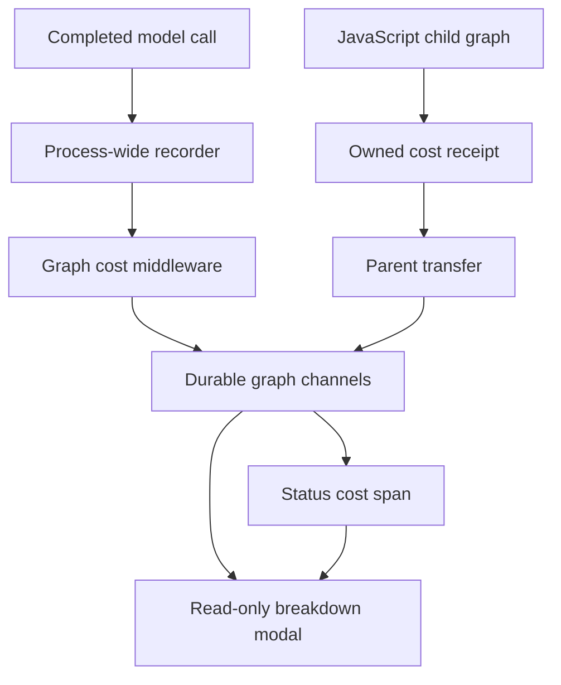
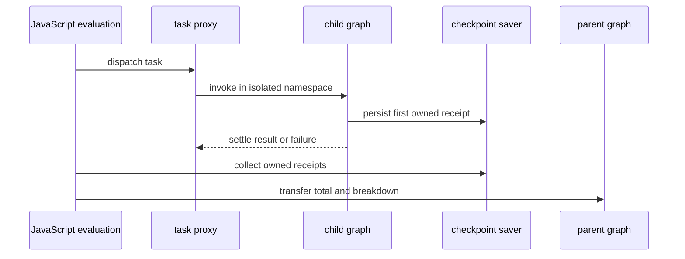

# dcode Cost, Sessions, and Context Operations

## Scope and reporting boundary

Cost in dcode is an **estimate**, not provider billing, an authorization, reservation, budget, or execution gate. An unavailable price is an accounting gap, not proof that a request was free; reconcile charges with the provider.

The terminal client owns presentation and input; the server owns graph execution and checkpointed state. These surfaces deliberately do not share one mutable ledger:

| Surface | Owner | Meaning |
| --- | --- | --- |
| `_session_cost_usd` / `_session_cost_breakdown` | `CostTrackingMiddleware` and graph checkpoints | Durable cumulative main-graph estimate and structured thread breakdown. |
| Nested and JavaScript child work | Nested middleware, persisted receipts, parent transfers | Completed child cost becomes part of the owning parent graph total. |
| `SessionStats` | Client | Replay-safe live usage display ledger, separate from checkpoint accounting. |
| `SessionCostTracker` and side-question subtotal | Client plus sessions SQLite | Presentation merge of independent graph and tool-free side-question subtotals. |
| `SubagentPanel` | Client | Per-turn `js_eval` activity, not an accounting ledger. |

```mermaid
flowchart TD
    Call["Completed model call"] --> Recorder["Process-wide recorder"]
    Recorder --> Middleware["Graph cost middleware"]
    Middleware --> Checkpoint["Durable graph channels"]
    Child["JavaScript child graph"] --> Receipt["Owned cost receipt"]
    Receipt --> Transfer["Parent transfer"]
    Transfer --> Checkpoint
    Checkpoint --> Modal["Read-only breakdown modal"]
    Checkpoint --> Footer["Status cost span"]
    Footer --> Modal
```

*The footer and modal present checkpoint-derived accounting; the modal does not alter it.*

## Durable accounting and pricing

`_session_cost_usd` is the durable cumulative graph estimate. A process-wide recorder captures completed model calls without pricing. `CostTrackingMiddleware` drains and prices them after model steps and at agent completion; nested graphs transfer their local completed total to the owning parent. If pricing/drain processing fails before an update is returned, records are restored when possible for a later attempt rather than failing the model request.

Pricing is best effort. `estimate_cost` includes inclusive input and priced detail buckets such as cache, audio, and reasoning. Missing usage, model identity, price data, or a matching price produces no estimate and does not fail the request. The versioned breakdown separately records all requests and priced requests, including genuinely zero-dollar requests.

Lookup uses `genai-prices`, then `~/.deepagents/prices.json`, then bundled prices after an upstream miss. The hourly update can be disabled; fetch failure retains the old snapshot and a snapshot with fewer providers than the bundle is rejected. The session-cost warning (`warnings.session_cost_threshold_usd`) is similarly display-only: it opens once on a strict crossing of the active thread's server-owned graph total; zero disables it.

### QuickJS subagent receipts

With `enable_interpreter`, dcode installs `CostAwareCodeInterpreterMiddleware`; combining the local interpreter with a remote sandbox is rejected. A dispatched `task()` runs in an isolated checkpoint namespace with an accounting owner. A child records its first local node receipt before its graph update returns. When the outer `js_eval` call settles its children, it totals receipts owned by that evaluation and transfers that total and breakdown to the parent scope. A nested evaluation inherits the owner, so only the outer owner exports it.

```mermaid
sequenceDiagram
    participant Eval as JavaScript evaluation
    participant Task as task proxy
    participant Child as child graph
    participant Saver as checkpoint saver
    participant Parent as parent graph
    Eval->>Task: dispatch task
    Task->>Child: invoke in isolated namespace
    Child->>Saver: persist first owned receipt
    Child-->>Task: settle result or failure
    Eval->>Saver: collect owned receipts
    Eval->>Parent: transfer total and breakdown
```

*Receipt persistence precedes parent transfer, preserving completed work across replay, interruption, failure, and cancellation without double counting.*

The focused QuickJS tests cover durable accounting after replay, completed siblings around an interrupt, evaluation and child failures, cancellation while writing a SQLite receipt, parallel identical dispatches, zero-dollar and unpriceable requests, and legacy dollar-only receipts. A legacy receipt remains in the durable dollar total but marks its structured history incomplete.

## Entire-thread token and cost breakdown

Clicking the visible dollar amount in the status bar opens the entire-thread **Token & Cost Breakdown**. The click boundary is deliberately narrow: only a left, first-click event on the rendered cost span dispatches `app.open_cost_breakdown`; clicks elsewhere, right clicks, repeat clicks, and a cost segment removed by narrow-layout truncation do not open it or consume normal application clicks.

The app passes a provider that formats the current `_session_cost_usd` and `_session_cost_breakdown`. It is therefore a **read-only, live client presentation of durable graph accounting**, not the provisional status-bar estimate and not a `SessionStats` or side-question view. The modal is not stacked if already open. While open it calls the provider every 0.5 seconds; provider errors are logged and leave the prior display intact. A checkpoint/state update changes the next displayed and copied content without reopening the modal.

### Completeness and partial pricing semantics

The formatter emits no table unless the breakdown is a mapping with `version == 1` and `historical_complete is True`. This historical-completeness gate prevents a superficially complete table from being built from legacy or malformed detail—even when the durable dollar total exists. Opening in that state shows “No cost details to show for this session yet.” and leaves the status amount visible.

A valid table has input and output parent rows, indented cache-creation, cache-read, and reasoning subset rows, plus a total. Parent rows are inclusive of their subsets. Missing or invalid category values render as `unavailable`; a category whose completeness flag is false is marked `(partial)`. If directional input/output amounts do not add up to the total, the formatter reports the positive remainder as directionless/unattributed rather than inventing an attribution. If priced requests differ from total requests, it explicitly says that some requests were unpriceable and costs are partial. A `$0` total uses `n/a` rather than a fictitious percentage.

The formatter returns plain text. The modal sanitizes control characters while retaining table newlines, renders `Content(..., markup=False)`, and sends that same sanitized current text to the clipboard on `c`. This prevents structured accounting or clipboard/terminal text from being interpreted as markup or control input. `Esc` closes the modal; copy failures become a warning notification. The debug console uses the same formatter/provider pattern.

## Live client usage and activity

The cost middleware emits an absolute thread total, structured breakdown, and pricing-health flag on the custom stream. The client ignores another thread's event, settles matching provisional request amounts, and displays the authoritative graph total plus remaining provisional cost. A state response without `_session_cost_usd` is not zero.

`SessionStats` maintains totals plus provider/model and usage-kind views. Its request ledger retracts and replaces chunk contributions, scopes retries, and finalizes each stream round to avoid human-in-the-loop replay double counting. The end-of-run usage table is enabled by default through `display.show_usage_stats`; ordinary configuration errors fail open, `BlockingError` is re-raised, and no-price rows show an em dash.

Tool-free side questions settle through a private recorder into a per-thread SQLite subtotal before a post-generation cancellation is re-raised. Failed writes remain pending; tombstones prevent late work from resurrecting deleted-thread spend. `SessionCostTracker` accepts nondecreasing finite graph totals, retains the newest side breakdown, and merges sources only for its client snapshot.

`SubagentPanel` is hidden until `js_eval` fan-out starts. The adapter forwards only main-agent custom `type == "subagent"` events. The panel groups lifecycles by `eval_id`, preserves timing across replayed starts, surfaces orphan errors but ignores orphan completions, and clears phase data for a new turn or `/clear`; interrupted rows finalize as cancelled. Labels and errors are untrusted LLM/JavaScript data: control, escape, and bidi characters are removed, length is bounded, and non-markup Textual content is used.

## Context operations and session lifecycle

Threads use cached, hardened `DEFAULT_STATE_DIR/sessions.db` SQLite checkpoint storage and UUID7 identifiers. `get_checkpointer()` exposes an async `AsyncSqliteSaver` context manager over the module-owned connection; listing remains compatible with legacy short IDs. Deletion removes checkpoint and write rows and best-effort removes offloaded archives and source-owned handoff snapshots. Its Boolean result reports checkpoint deletion only.

`/offload` serializes work per thread and requires a quiescent eligible thread. It destructively prepares operation-cost records and settles them with the additive state update: commit after a successful write, rollback only when failed write is confirmed unchanged, and keep records claimed after an advanced or unreadable write to avoid double charging. Abandoning a `PreparedOperationCost` can permanently omit claimed spend, including a zero-dollar delta.

Normal offload reserves summary state and cost before appending a deferred archive and verifies the checkpoint/archive link. Handoff preserves source context, commits only source cost channels, and writes a source-owned recovery transcript. Hook interruptions re-execute a stable operation ID with accumulated responses rather than retain a suspended coroutine; cancellation waits for terminal status and returns `cancelled` or `finished`. Archive history uses a hardened persistent `conversation_history` directory when possible, with marked-ephemeral temporary fallback; cleanup does not block deletion.

## Operating and verification checklist

- Treat the footer, breakdown, `/cost`, usage table, and warning as estimates. Reconcile provider billing independently.
- When a breakdown is unavailable, distinguish incomplete historical detail from unpriceable current requests, a valid zero-dollar request, missing provider usage, provisional client display, and provider billing.
- Change the formatter or modal with `tests/unit_tests/test_js_cost_tracking.py`, `tests/unit_tests/test_app.py`, and `tests/unit_tests/tui/widgets/test_status.py`. These cover durable child-accounting output, historical-completeness refusal, live modal refresh/no stacking, and the precise status-span click boundary.
- Change recorder drains, price lookup, transfers, or operation settlement with `tests/unit_tests/test_cost_tracking.py`; change sessions/offload behavior with `tests/unit_tests/test_sessions.py` and `tests/unit_tests/test_offload_api.py`.
- Change client stream usage with `tests/unit_tests/test_session_stats.py`; change activity display with `tests/unit_tests/tui/widgets/test_subagent_panel.py`.

Related material: [Code agent architecture](../architecture/code-agent.md), [Context management](../concepts/context-management.md), [State persistence](../concepts/state-persistence.md), [Testing guide](../testing/testing-guide.md), and [Run a dcode session](../workflows/run-dcode-session.md).
