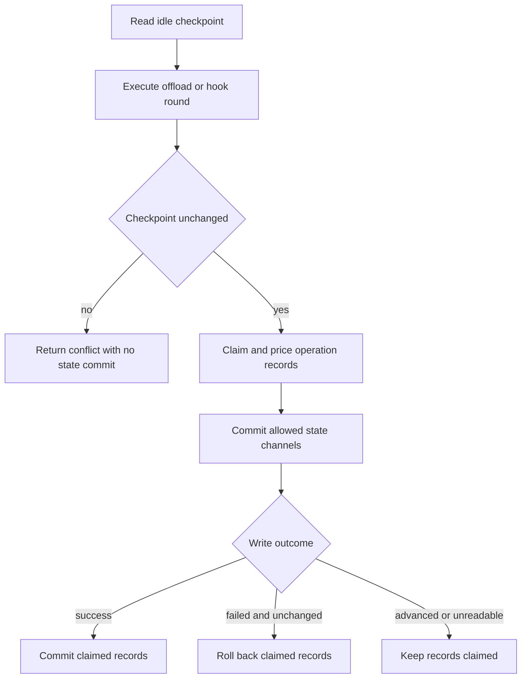

# dcode Cost, Session, and Context Operations

Cost in dcode is an **estimate**, not a billing, authorization, or budget-enforcement system. The graph persists priceable main-task spend in its thread checkpoint; client presentation combines that source with independently persisted side-question spend when available. Use provider billing records to reconcile charges.

Related material: [Code agent architecture](../architecture/code-agent.md), [Context management](../concepts/context-management.md), [State persistence](../concepts/state-persistence.md), [Development](development.md), and [Run a dcode session](../workflows/run-dcode-session.md).

## Accounting owners and flow

| Concern | Owner | What it means operationally |
| --- | --- | --- |
| Main graph estimate | `CostTrackingMiddleware` and `CostState` checkpoint channels | `_session_cost_usd` is the cumulative USD estimate for priceable graph calls. `_session_cost_breakdown` retains structured usage, including unpriceable requests. |
| Live local usage | `SessionStats` | A replay-safe client display ledger for streamed model usage; it is not durable thread accounting. |
| Combined client presentation | `SessionCostTracker` | Retains graph and side subtotals independently, then merges them only for presentation. |
| Side-question subtotal | `dcode_btw_costs` in the sessions database | A durable subtotal for completed tool-free side-question requests. It never feeds back into graph recorder or checkpoint channels. |
| Server operation cost | `PreparedOperationCost` | A destructively claimed operation delta that must be settled with the corresponding checkpoint outcome. |

```mermaid
flowchart TD
    call["Completed model call"] --> recorder["Process-wide recorder"]
    recorder --> middleware["Graph middleware drain and price"]
    middleware --> checkpoint["Additive graph cost channels"]
    call --> side["Side-question recorder"]
    side --> sqlite["SQLite side-cost subtotal"]
    checkpoint --> client["Graph subtotal"]
    sqlite --> client
    client --> display["Combined estimated session cost"]
```

*Main graph and side-question accounting are deliberately separate sources that meet only in client presentation.*

`CostState` uses additive reducers for its private cost channels, so a drain contributes a delta rather than performing a shared read-modify-write. The process-wide recorder captures completed model calls by thread and graph scope but deliberately does not price in its inline callback. `CostTrackingMiddleware` prices drained records after model steps and again at agent completion for late work. Hook failures do not fail the user turn; when possible, drained records are restored for a later attempt. Nested graphs checkpoint local cost and transfer their completed total to the owning parent scope.

The middleware emits an absolute custom-stream total, structured breakdown, and pricing-health flag because private state channels are absent from the state stream. The client can discard another thread's event, settle matching provisional amounts, and converge after a missed delta. `SessionStats` separately maintains totals and per-provider/model and usage-kind breakdowns. Its request ledger retracts and replaces streamed chunk contributions, scopes retries, and finalizes a stream round so a human-in-the-loop replay is not counted twice.

## Price estimation and catalog operations

`estimate_cost` is best effort. It requires usable model identity and split input/output usage, and accounts for inclusive input plus priced detail buckets such as cache or reasoning. Missing or unmatched price data yields no estimate rather than failing a provider request. A missing dollar amount is therefore not proof that the provider call was free; usage can still appear in structured breakdowns.

The catalog lookup first uses `genai-prices`. On an upstream miss, dcode checks `~/.deepagents/prices.json`, then `bundled_prices.json`; the user catalog wins over the bundled stopgap, while either remains subordinate to an upstream match. The local file is loaded once on the first request requiring it, so edits apply after restart. Invalid local entries are logged and skipped rather than interrupting a model turn. These overrides rely on private `genai-prices` APIs, so test them when changing the resolved dependency version.

A successful pricing-library load can start one hourly background catalog updater. Disable it with `DEEPAGENTS_CODE_PRICES_AUTO_UPDATE=0`, `[update].prices_auto_update = false`, or truthy `DEEPAGENTS_CODE_OFFLINE`. A failed refresh keeps the prior snapshot; dcode also rejects a fetched snapshot with fewer providers than the bundled catalog. Fresh data improves an estimate but cannot make it authoritative billing.

## Side questions and client rendering

A tool-free side question runs under a private `_SessionCostRecorder` through `answer_with_cost`. Its completion records are moved to a per-thread pending queue before persistence, then priced and written in a short SQLite transaction. A failed settlement stays queued in process and is retried by a later `load_cost`; once priced, it is retried without repricing. Only successfully persisted charges survive a server restart, and failed charges retain usage/pricing metadata rather than conversation data.

Cancellation has a deliberate boundary: cancellation may interrupt generation, but once generation finishes, `answer_with_cost` waits for the settlement task to reach a terminal result before it re-raises cancellation. This prevents a disconnect after provider completion from silently skipping the accounting attempt.

`SessionCostTracker` protects independently delayed sources from erasing each other. It accepts only finite graph totals and retains the greatest graph total; it keeps the newest cumulative side breakdown ordered by request count and cost; and `snapshot()` adds their USD amounts and merges their breakdowns only when a UI value is requested. A cached snapshot marks that no fresh graph checkpoint was available to settle provisional usage.

The end-of-run usage table is enabled by default through `display.show_usage_stats`. Ordinary configuration errors fail open because the table is cosmetic, while `BlockingError` is re-raised. A row without a priceable request renders `—`, not `$0.00`.

## Offload, handoff, and archive settlement

`POST /dcode/threads/{thread_id}/offload` serializes an operation per thread. It requires an eligible quiescent thread with no pending graph work, reads and hydrates the checkpoint itself, executes the operation, then verifies that the checkpoint has not advanced before it prepares the operation's cost. A hook interrupt returns a resumable request rather than preserving a suspended server coroutine: the client resubmits the stable `operation_id` with accumulated hook responses, and the operation re-executes from the top.

```mermaid
flowchart TD
    start["Read idle checkpoint"] --> execute["Execute offload or hook round"]
    execute --> changed{"Checkpoint unchanged"}
    changed -- "no" --> conflict["Return conflict with no state commit"]
    changed -- "yes" --> prepare["Claim and price operation records"]
    prepare --> write["Commit allowed state channels"]
    write --> result{"Write outcome"}
    result -- "success" --> committed["Commit claimed records"]
    result -- "failed and unchanged" --> restored["Roll back claimed records"]
    result -- "advanced or unreadable" --> conservative["Keep records claimed"]
```

*Offload favors avoiding a later double charge when a failed write might already have landed.*

`PreparedOperationCost` couples a claimed set of recorder entries to an additive checkpoint update. `commit()` merely records that the accompanying update persisted; `rollback()` returns the entries to the recorder. Every prepared value must reach exactly one of those outcomes, including a zero-dollar delta. An abandoned prepare permanently omits its claimed spend, and rolling back after a landed write can double count it.

If the state write fails, `/offload` reads the checkpoint back. A confirmed unchanged checkpoint rolls the cost records back. An advanced or unreadable checkpoint keeps them claimed: this may omit an estimate in the unreadable case, but restoring could cause a later double charge. Cancellation during the commit is deferred until the commit task settles, then re-raised. The route allowlists state channels and rejects `messages` writes, avoiding an unattributed write that could clobber concurrent conversation changes.

Normal offload reserves its summary state and cost update before writing a deferred transcript archive under an archive lock. It then links the written archive path through a checkpoint update. If the link is confirmed absent, it restores the prior archive; if its result cannot be read back, the route reports an indeterminate error. An archive append failure after summary reservation is logged and leaves the reserved summary rather than rolling back the committed checkpoint.

`POST /dcode/threads/{thread_id}/handoff` is distinct: it summarizes every message for a new thread but does not compact the source thread or write its summary event. It commits only source cost channels, then writes an immutable recovery transcript whose filename is prefixed with a hash of the source thread ID. The resulting summary and archive path seed the child thread. If no operation-cost update exists, its prepared records are rolled back.

The cancellation endpoint, `POST /dcode/threads/{thread_id}/offload/{operation_id}/cancel`, identifies an operation by both thread and operation ID, cancels an active task, and waits for a terminal acknowledgement. It returns `cancelled` if cancellation won or `finished` if the operation had already become terminal; retained terminal outcomes also close request/cancel races.

## SQLite thread and archive lifecycle

The sessions database is accessed through module-owned `aiosqlite` connections and `get_checkpointer()`, which yields LangGraph's `AsyncSqliteSaver` as an async context manager. The connection wrapper guards cancellation while opening and joins the worker after close, preventing an unreachable SQLite handle or teardown worker race. New thread IDs are UUID7 strings, while listings retain legacy short-ID compatibility.

`delete_thread(thread_id)` writes a tombstone for side-question cost before deleting checkpoint and `writes` rows in the same sessions transaction. The tombstone discards pending retries and late completions, preventing deleted spend from being resurrected. It invalidates thread-list/message-count caches, then best-effort removes local compaction history and all source-owned handoff snapshots. Its Boolean result reports checkpoint deletion only, not cost or archive cleanup success.

Local archives normally live in the hardened `~/.deepagents/conversation_history` directory. If the profile root is unavailable, dcode uses hardened temporary storage and marks it ephemeral, so it may not survive restart. Retention uses `history.retention_days` and is disabled at `0`; sweeping removes only expired regular Markdown children and fails open. In server or sandbox mode archives belong to the backend rather than local history storage.

## Verification and operating checklist

- Run `tests/unit_tests/test_cost_tracking.py` after changing usage normalization, price lookup, recorder drains/restores, transfers, or operation preparation.
- Run `tests/unit_tests/test_session_stats.py` after changing stream identity, chunk aggregation, retries, HITL replay, or usage-table output.
- Run `tests/unit_tests/test_sessions.py` after changing SQLite connection lifecycle, deletion, IDs, cache behavior, or archive cleanup.
- Run `tests/unit_tests/test_offload_api.py` for idle/conflict checks, hook resume, cost settlement, archive-link recovery, handoff, and cancellation races.
- For a cost discrepancy, identify the thread and distinguish graph checkpoint cost, persisted side subtotal, provisional client display, unavailable pricing, and actual provider billing.
- For a 500 indeterminate offload result, inspect `/context` and the latest checkpoint before retrying. Do not blindly rerun a compaction that might have landed.
