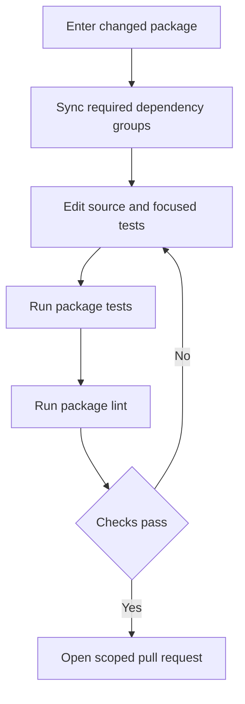
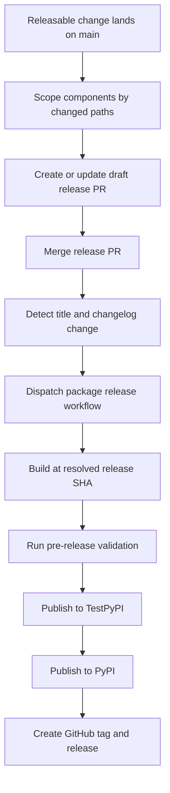

# Development, CI, and Releases

This repository is a monorepo of independently versioned Python packages under `libs/`, not one root Python project. Work at the package boundary: its `pyproject.toml`, `uv.lock`, and `Makefile` define dependencies and supported commands. Repository-wide locking and release automation deliberately cross that boundary and therefore have separate safeguards.

For initial setup, see [Quickstart](../quickstart.md). See [Testing Guide](../testing/testing-guide.md) for test conventions, [Run Evals](../workflows/run-evals.md) for evaluation execution, and [Sandbox Partners](../integrations/sandbox-partners.md) for integration context.

## Package-local workflow

Use `uv` for interpreters, environments, and dependencies, and `make` for standard tasks. Do not use `pip`, Poetry, or Conda. `uv` provisions an interpreter compatible with the package's `requires-python`; there is no repository-wide Python version to pin. Each package owns its `pyproject.toml`, `Makefile`, README, and tests; sibling package dependencies may be editable local sources.

Install hooks once, then enter the package being changed:

```bash
uv tool install pre-commit
pre-commit install --install-hooks

cd libs/deepagents
uv sync --all-groups
make test
make lint
```

Use `make help` inside the package to discover its actual targets. The Makefile is authoritative: target sets and arguments are similar across packages but are not a uniform API. Explicitly run `uv sync`, using `--group <name>` or `--all-groups` as appropriate; do not create an external environment or mix environments in one session.

| Command | Typical purpose |
| --- | --- |
| `make test` | Run package unit tests. In `deepagents`, this is parallel, socket-disabled pytest with coverage. |
| `make integration_test` | Run network-capable integration tests separately where the package provides the target. |
| `make lint` | Check Ruff linting and formatting and run the package type check. |
| `make format` | Apply Ruff formatting and safe fixes; review the resulting diff. |
| `make type`, `make coverage`, `make test_watch` | Focused package-specific type, coverage, and watch entrypoints. |

Package Makefiles invoke tools through `uv run`. For example, `deepagents` exports `UV_FROZEN = true`, causing commands to fail when the lockfile is stale instead of silently updating it. Do not infer that every package uses precisely the same groups or flags—consult its Makefile.



Caption: the normal edit loop remains package-local until its validation passes.

### Warnings and local CI parity

Unaccepted pytest warnings are errors across packages. Fix actionable warnings rather than adding a broad filter. Scope an expected warning to an individual test with `@pytest.mark.filterwarnings`; reserve package-level filters for a justified categorical or third-party condition, and prefer visible `default::` behavior to `ignore::` when possible.

`libs/code` supplies a stronger local entrypoint. `make check` first runs lint, import checks, and unit tests, then checks extras synchronization, version equality, and lock freshness. Its SDK-pin check treats only the expected stale-pin result as advisory; other checker failures remain fatal.

## Repository fan-out, hooks, and CI

Run cross-package work from `libs/`. Its Makefile discovers direct child packages and `partners/*` packages with a Makefile; lock operations additionally include examples that have a `pyproject.toml`. The loops use `set -e`, so the first failing package stops the operation.

| Command | Purpose |
| --- | --- |
| `make lint` / `make format` | Invoke the corresponding target in every discovered library package. |
| `make lock [no-cache]` | Regenerate discovered library and example locks; `no-cache` bypasses uv's cache. |
| `make lock-check` | Verify discovered locks. |
| `make lock-bump DEP=<pkg>` | Re-resolve every discovered lock with `-P <pkg>`; a missing `DEP` is an error. |
| `make bench-all` | Run `bench` for `deepagents` and `code`. |

The fan-out lock policy chooses Python 3.14 for ACP and 3.12 elsewhere. It is a locking policy, not a replacement for a package's declared supported-Python range or CI matrix.

```bash
make -C libs/code check
make -C libs lock-check
```

CI path filters select affected package lint and unit-test jobs for pull requests, while pushes to `main` run package jobs unconditionally. Editable SDK consumers include `libs/deepagents/**` in their filters, so an SDK change validates those consumers before merging.

The hook configuration requires pre-commit 3.2.0 or later and installs `pre-commit`, `commit-msg`, and `pre-push` hooks. Local package hooks invoke package Makefiles; lock, extras, and selected version checks are file-scoped. The commit-message hook accepts the configured Conventional Commit types, while PR CI validates scopes.

The always-run pre-push branch check expects `<github-username>/<scope>/<short-description>` for ordinary branches. It allows protected, automation, and release branches, and resolves the login from `git config github.user`, then `gh`, then the email local part. Set `github.user` when that fallback is ambiguous. `git push --no-verify` or `SKIP=branch-name git push` bypasses only the local check; server-side checks still matter for multi-ref pushes and pushes with no new commits.

Keep bump-worthy work to one releasable component. Use a separate `chore(deps):` change for cross-package dependency and lock churn.

### Adding or changing a partner package

A partner package is independently versioned and owns its own environment, metadata, Makefile, and tests. Adding one is a repository-wide wiring change, not merely a new directory: register its issue areas and labels, Dependabot entry, CI change detection/job, allowed scope synchronized among PR lint and both branch-name checks, release setup/detection, release-please config and manifest, release documentation, release-note distribution map, dependency-maintenance list, and secrets. Sandbox-backed partners additionally need Harbor options and credential checks plus integration-test matrix and secret gating. For a first managed release, set the manifest baseline to `0.0.0`.

## Lock and public-dependency validation

Regenerate a package lock whenever its project metadata or resolved dependencies change, then run its package checks or `make -C libs lock-check`. For a shared dependency update, use `make -C libs lock-bump DEP=<pkg>` rather than editing locks manually.

Editable local sources prove in-tree integration but can hide an unsatisfiable public dependency graph. On release PRs, **Check Release Dependencies** removes local sources and resolves changed package manifests against public indexes with `uv pip compile --no-sources --universal --prerelease allow --all-extras`. The `release-deps: acknowledged` label does not skip the work: it makes the check report-only while keeping follow-up releases visible. Use it only for an intentional coordinated release order, not to mask incorrect metadata.

## Release topology and lifecycle

Release-please manages nine independently versioned Python distributions: `deepagents`, `deepagents-acp`, `deepagents-code`, `deepagents-talon`, `langchain-daytona`, `langchain-modal`, `langchain-runloop`, `langchain-vercel-sandbox`, and `langchain-quickjs`. It creates separate draft release PRs. Each managed package has Python release metadata, a package name and component, changelog path, version-bearing extra files, and test-path exclusions. `skip-github-release` is enabled, so a separate publisher—not release-please—creates GitHub releases.

The manifest is the current released-version baseline, not a source-version file, and should not be manually advanced for an existing package:

| Package path | Baseline |
| --- | --- |
| `libs/deepagents` | `0.7.13` |
| `libs/acp` | `0.0.11` |
| `libs/code` | `0.1.66` |
| `libs/talon` | `0.0.7` |
| `libs/partners/daytona` | `0.0.8` |
| `libs/partners/modal` | `0.0.6` |
| `libs/partners/runloop` | `0.0.7` |
| `libs/partners/vercel` | `0.0.2` |
| `libs/partners/quickjs` | `0.3.7` |

When adding a managed package, add both its configuration and manifest entry. For an unshipped package whose source begins at `0.0.1`, set the manifest baseline to `0.0.0`; otherwise release-please treats `0.0.1` as already released and proposes `0.0.2`.

Release attribution follows changed paths, not Conventional Commit scope alone. `feat`, `fix`, `perf`, and `revert` enter changelog sections; configured docs, style, chore, refactor, test, CI, and hotfix types are hidden. All managed packages use pre-1.0 rules: an ordinary feature produces a patch bump and a breaking feature produces a minor bump. Tags include the component without a `v`, for example `deepagents==0.7.13`.



Caption: release-please prepares component release PRs; a separate publisher releases a selected immutable tree.

A merged `release(<component>): <version>` commit must change that component's `CHANGELOG.md` for the release-please workflow to dispatch `release.yml`. The publisher resolves an explicit release SHA and normally rejects it unless that commit's `pyproject.toml` declares the requested version. It builds and tags that same SHA and rejects a version already on PyPI. The normal sequence is build, pre-release checks, TestPyPI, PyPI, then GitHub release.

The release workflow's build job has minimal permissions and is separate from the publishing job, which obtains the privileged publishing and repository-write capabilities. This separation limits the effect of a compromised build step. Release notes are deliberately fail-open: a notes-job failure does not prevent PyPI publication or GitHub tagging, so repair an empty GitHub release body afterward.

Manual dispatch is exceptional. Normal manual publication requires a 40-character `release-sha`; `dangerous-nonmain-release` may use the dispatch SHA and skips the normal version match. Use that path only for intentional backports or throwaway prerelease branches.

## Fan-out prevention and recovery

Changed paths make commit partitioning an operational invariant:

- **Never put an empty commit on `main`.** With no package path, release-please can fan out to every managed component. `guard-empty-commit` blocks it before release-please; the narrow exception is an empty two-parent `hotfix(repo): ...` merge whose introduced commits all change files.
- **Keep bump-worthy changes in one component.** A `feat` or `fix` that changes lockfiles or real files in another managed component can create a release PR per touched component. The scope guard blocks lockfile-only and multi-component fan-out unless `allow-lockfile-release` acknowledges it; that label allows the PR but does not stop resulting releases.
- **Separate dependency and lock churn.** Put it in a `chore(deps):` commit or PR so it is not a bump-worthy component change.

Closing an unintended release PR does not erase its triggering commit from `main`, so it can return. Revert or otherwise remove the unreleased bump rather than relying on closure.

When a release PR is merged, publishing starts first. Before release-please refreshes remaining release PRs, the workflow waits for every merged PR still labeled `autorelease: pending`; the manifest may otherwise advance before the corresponding tag exists. It fails closed if GitHub release state is unreadable. A genuinely slow publish times out into a deferred refresh on a later push, while a failed pending release requires recovery.

For a release that fails **before** PyPI, fix the problem without changing the already-bumped version, then manually dispatch against the exact hotfix SHA and verify that the original release PR label changes from `autorelease: pending` to `autorelease: tagged`. If the version is already public, do not recreate its tag or retry that version: publish a new fix version and consider yanking a harmful release. One version must identify the same artifact and source tree for PyPI, GitHub tags, downstream installers, and audit tooling.
