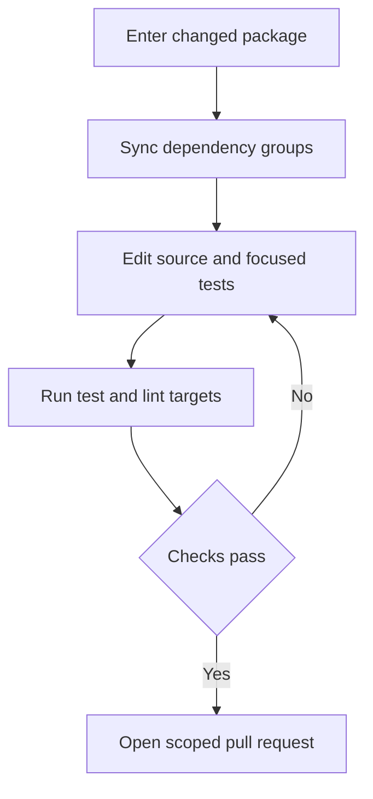
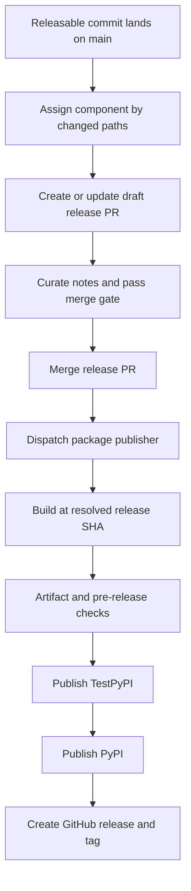

# Development, CI, and Releases

The repository is a monorepo of independently versioned Python packages under `libs/`, not a single root Python project. Work at a package boundary for ordinary development; use the aggregate tooling only when a dependency or lock change must be validated across packages. See [Source Map](../architecture/source-map.md) for code ownership, [Testing Guide](../testing/testing-guide.md) for test conventions, and [Security](security.md) for operational security expectations.

## Start in the package you change

External contributors need a maintainer-approved issue or discussion and assignment before opening a PR. Each package owns its `pyproject.toml`, `Makefile`, and README, and there is no root `pyproject.toml`. Sibling dependencies may be editable, so a local package edit is visible to its consumers during development.

Use `uv` for interpreters, environments, and dependencies; do not use `pip`, Poetry, or Conda. `uv` provisions a Python interpreter compatible with the individual package's `requires-python`, so there is no global Python version to install. Install hooks once, then enter the package:

```bash
uv tool install pre-commit
pre-commit install --install-hooks

cd libs/deepagents
uv sync --all-groups
make test
make lint
```

`make help` is the authoritative list of targets for the current package. Install dependencies explicitly with `uv sync`, adding `--group <name>` or `--all-groups`; do not create an environment outside the package or mix environments in one session. Package targets invoke tooling through `uv run`. In particular, `deepagents` exports `UV_FROZEN = true`, so a stale lock fails rather than being silently rewritten; its `make test` is parallel, socket-disabled pytest with coverage.

| Command | Typical purpose |
| --- | --- |
| `make test` | Run package unit tests; in `deepagents`, tests are offline and parallel with coverage. |
| `make integration_test` | Run network-capable integration tests when the package provides the target. |
| `make lint` | Run the package lint, format check, and type checks. |
| `make format` | Apply formatting and safe lint fixes. |
| `make type`, `make coverage`, `make test_watch` | Focused targets when offered by that package. |



Caption: the ordinary developer loop is package-local and repeats until package validation passes.

Unaccepted pytest warnings are errors. Fix actionable warnings; narrowly filter an expected warning at test scope rather than broadly ignoring it. `libs/code` also has `make check`, a local CI-parity entrypoint: it runs lint, import checks, and unit tests, then checks extras synchronization, version equality, and lock freshness. Its expected stale SDK-pin result is advisory, but other checker failures remain fatal.

## Aggregate commands, locks, hooks, and CI

Run repository fan-out operations from `libs/`. `libs/Makefile` discovers direct library packages and `partners/*` packages with Makefiles; lock operations also include example projects with `pyproject.toml`. The loops use `set -e`, stopping at the first failure.

| Command | Purpose |
| --- | --- |
| `make lint` / `make format` | Invoke the corresponding target in every discovered library package. |
| `make lock [no-cache]` | Regenerate every discovered library and example lock; `no-cache` bypasses uv's cache. |
| `make lock-check` | Verify those locks are current. |
| `make lock-bump DEP=<pkg>` | Re-resolve every discovered lock with `-P <pkg>`; `DEP` is required. |
| `make bench-all` | Run `bench` for `deepagents` and `code`. |

The aggregate lock policy resolves ACP with Python 3.14 and every other package or example with Python 3.12. This is a lock-generation choice, not ACP's published interpreter floor: ACP declares `requires-python = ">=3.11"`, while Talon declares `requires-python = ">=3.12"`; their lockfiles record those respective ranges. Regenerate a package lock when its metadata or resolved dependencies change; for a shared dependency update, use `make -C libs lock-bump DEP=<pkg>` rather than hand-editing lockfiles.

The pre-commit configuration requires pre-commit 3.2.0 or later and installs `pre-commit`, `commit-msg`, and `pre-push` hooks. Package hooks invoke Makefile targets; lock, extras, and selected version checks are file-scoped. The main CI entry workflow handles pull requests, pushes to `main`, and merge-group events. It uses path detection to select affected package jobs on PRs, while main pushes run jobs unconditionally; filters include `libs/deepagents/**` for editable SDK consumers.

## Package coupling and public dependency checks

Editable sources validate in-tree integration but can mask an unsatisfiable public install graph. On release PRs, **Check Release Dependencies** removes local sources and resolves changed manifests against public indexes with `uv pip compile --no-sources --universal --prerelease allow --all-extras`. `ci:ack-release-deps` makes this report-only, but does not skip it: the check continues to report required follow-up releases. Use that acknowledgement only for an intentional coordinated release order.

`deepagents-code` pins an exact `deepagents==` version. Bump that pin in the same PR whenever Code needs new SDK functionality. Its release-PR check makes a stale pin advisory, but the publisher enforces that Code's pin is at or ahead of the workspace SDK. A prerelease pin requires `ci:ack-release-deps`; an intentionally older pin can be deliberately bypassed with `ci:dcode-skip-sdk-pin`, which the release dispatcher translates to `dangerous-skip-sdk-pin-check=true`. Label lookup failure fails closed: it does not enable the bypass.

Adding a partner is therefore a wiring change, not just a directory: register its issue/label routing, CI detection and jobs, scope validation, release configuration and manifest, release workflow mappings and notes, dependency maintenance, and required secrets. Sandbox-backed partners also need Harbor and integration-test credential surfaces.

## Release lifecycle

Release-please manages nine independent Python distributions: `deepagents`, `deepagents-acp`, `deepagents-code`, `deepagents-talon`, `langchain-daytona`, `langchain-modal`, `langchain-runloop`, `langchain-vercel-sandbox`, and `langchain-quickjs`. It creates separate draft PRs, one component per package, and `skip-github-release` delegates publication to `release.yml`. Each configured package supplies its Python release type, distribution/component names, changelog path, version-bearing extra files, and test exclusions. Tags use the component and `==`, without `v`.

The manifest records released baselines, not source versions, and is automatically maintained. Current baselines are: `libs/deepagents` `0.7.15`, `libs/acp` `0.0.12`, `libs/code` `0.1.71`, `libs/talon` `0.0.8`, `daytona` `0.0.8`, `modal` `0.0.6`, `runloop` `0.0.7`, `vercel` `0.0.2`, and `quickjs` `0.3.7`. ACP's published `0.0.12` is aligned across its manifest baseline, `pyproject.toml`, and release-please-managed `deepagents_acp/_version.py`; Talon's corresponding current source version is `0.0.8`. Do not manually advance these release values as part of ordinary dependency work: release-please updates each configured package's `pyproject.toml` and version marker on its release PR, then its lock updater regenerates the affected `uv.lock` file. Add both config and manifest entries for a new managed package; for an unshipped `0.0.1` package, use manifest baseline `0.0.0` so its first proposed release is `0.0.1`.



Caption: release-please prepares a component release PR, while a separate workflow publishes and tags one resolved source tree.

Release attribution is by changed file paths, not Conventional Commit scope alone. A release commit must match `release(<component>): <version>` and change that package's `CHANGELOG.md` before dispatch. A merged release PR is initially `auto:release-pending`; successful publication marks it `auto:release-tagged`.

### Curated notes are a release gate

When a release PR is ready, mark it ready for review. `release-bot` posts a draft as a PR comment; review or edit it, then issue `@release-bot apply`. The bot updates the package `CHANGELOG.md` and mirrors the notes to the PR body. The required `curated release notes` check must pass before merge. `ci:skip-curated-notes` is the explicit escape hatch for intentionally shipping the generated changelog without curation.

Because release-please and the lock updater push with `GITHUB_TOKEN`, their branch updates do not create ordinary pull-request events. After such updates, `release-please.yml` explicitly dispatches `release_notes_check.yml` against each affected release PR so the required check is refreshed on its current head. A changelog-only trusted apply commit can reuse the preceding CI result rather than rerunning all package tests.

### Publication safeguards and recovery

The publisher is `workflow_dispatch` rather than a reusable workflow because PyPI Trusted Publishing does not support reusable workflows. It resolves a 40-character `release-sha`; on the normal path it rejects a SHA whose package `pyproject.toml` version differs from the requested version. All downstream build, validation, publication, and GitHub tag steps use that resolved SHA. Before publishing, it rejects a version already on PyPI and fails closed if PyPI cannot be reached or returns an unexpected status.

The build job has only read permission; the later publishing/tagging job gets trusted-publishing and repository-write permissions. Pre-release checks validate the built wheel in a fresh environment and, for Code, hard-gate the SDK pin unless the dangerous bypass is explicitly set. The pipeline is build → pre-release checks → TestPyPI → PyPI → GitHub release/tag. Release-note generation is intentionally fail-open: a failure still permits PyPI publication and tagging with an empty GitHub release body, which must be repaired afterward.

Keep bump-worthy work to one managed component. An empty commit has no path for release-please to assign and can fan out to every component; `guard-empty-commit` blocks it before release-please. A bump-worthy change that includes lockfiles or real files in another component can also fan out. The scope gate blocks lockfile-only and multi-component fan-out unless `ci:allow-lockfile-release` explicitly acknowledges it; acknowledgement permits, rather than prevents, the resulting releases. Separate cross-package dependency and lock churn as `chore(deps):` work.

Before release-please recomputes open release PRs, it waits for every merged PR still labeled `auto:release-pending`, avoiding a manifest that has advanced before its tag exists. Unknown GitHub state fails closed; a genuinely slow publisher defers refresh to a later push. If a release fails before PyPI, fix it without changing the bumped version and manually dispatch the exact hotfix SHA. If the version is already public, never recreate its tag or retry that version: publish a new fix version, preserving the invariant that one version identifies the same PyPI artifacts and Git tree.
