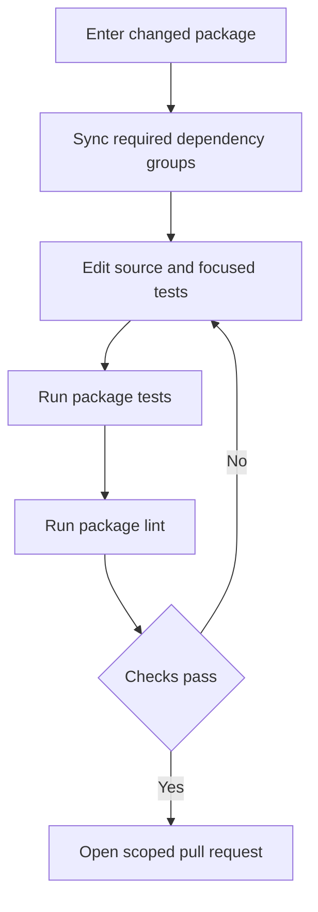
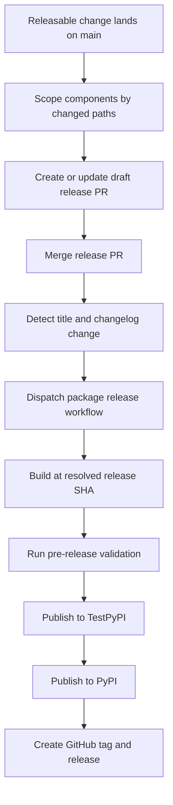

# Development, Build & Release Operations

This repository is a monorepo of independently versioned Python packages under `libs/`, not one root Python project. Work at the package boundary: its `pyproject.toml`, `uv.lock`, and `Makefile` define dependencies and supported commands. Repository-wide locking and release automation intentionally cross that boundary and have separate safeguards.

For initial setup, see [Quickstart](../quickstart.md); for test design and conventions, see [Testing Guide](../testing/testing-guide.md); for evaluation execution, see [Run Evals](../workflows/run-evals.md); and for publication-security context, see [Security Operations](security.md).

## Package-local development

Use `uv` for interpreters, environments, and dependencies, and `make` for standard tasks. Do not use `pip`, Poetry, or Conda. `uv` provisions an interpreter compatible with the package's `requires-python`; there is no global repository Python version to pin. Each package owns a `pyproject.toml`, `Makefile`, and README, and sibling development dependencies may be editable sources.

Install hooks once, then enter the package being changed:

```bash
uv tool install pre-commit
pre-commit install --install-hooks

cd libs/deepagents
uv sync --all-groups
make test
make lint
```

Use `make help` inside the package to discover its actual targets. The Makefile is authoritative: target sets and arguments are similar across packages but not a uniform API. Prefer explicit `uv sync` (with `--group <name>` or `--all-groups`) before work; do not create an external environment or mix environments in one session.

| Command | Typical purpose |
| --- | --- |
| `make test` | Run socket-disabled unit tests. `deepagents` and `code` run pytest in parallel with coverage; Talon first runs Node tests for its WhatsApp bridge; ACP uses its own timeout and coverage arguments. |
| `make integration_test` | In `deepagents` and `code`, run network-capable integration tests separately from unit tests. |
| `make lint` | Check Ruff linting and formatting, then run `ty`; Code also checks its generated command catalog and process working-directory policy. |
| `make format` | Apply Ruff formatting and safe fixes. Review the diff before committing. |
| `make type`, `make coverage`, `make test_watch` | Focused package-specific type, coverage, and watch entrypoints. |

`deepagents`, `code`, and Talon export `UV_FROZEN = true`, so their Makefile tasks fail on a stale lock instead of updating it. ACP has different group and flag choices; consult its Makefile rather than assuming the core-package invocation applies.



Caption: the normal edit loop remains package-local until its validation passes.

### Code CI-parity entrypoint

For `libs/code`, `make bootstrap` syncs the test group and installs hooks. `make check` is the local CI-parity command: linting, import checks, and unit tests precede extras synchronization, version equality, and lock freshness checks. A stale SDK pin is advisory in this local command, but an unexpected checker failure is fatal.

## Repository-wide maintenance and CI

Run cross-package tasks from `libs/`. Its Makefile discovers direct child and `partners/*` package Makefiles; lock tasks also include example directories with `pyproject.toml`. The loops use `set -e`, so the first failed package stops the run.

| Command | Purpose |
| --- | --- |
| `make lint` / `make format` | Invoke that target in every discovered library package. |
| `make lock [no-cache]` | Regenerate all discovered library and example locks; `no-cache` bypasses the uv cache. |
| `make lock-check` | Verify every discovered lock. |
| `make lock-bump DEP=<pkg>` | Re-resolve all discovered locks with `-P <pkg>`; missing `DEP` fails. |
| `make bench-all` | Run `bench` for `deepagents` and `code`. |

The fan-out lock policy uses Python 3.14 for ACP and 3.12 elsewhere. That is a locking policy, not a replacement for a package's declared supported Python range or CI matrix.

```bash
make -C libs/code check
make -C libs lock-check
```

CI runs path-selected lint and unit-test jobs for pull requests; pushes to `main` run every package. Editable consumers include `libs/deepagents/**` in their filters, so SDK changes test relevant consumers before landing. The reusable lint and test workflows set `UV_FROZEN`, sync the test group, and call package Makefiles; unit-test workflow inputs validate JSON matrix values and provision Node 24 for Talon.

`pre-commit install --install-hooks` installs commit, commit-message, and pre-push checks. Pre-commit 3.2.0 or newer is required because older versions reject the configured git-hook stage names. File-scoped hooks format/lint core packages, regenerate the Code command catalog and eval catalog where applicable, and check locks, extras, and selected version equality. The commit-message hook admits the configured Conventional Commit types; PR CI validates scopes.

The always-run pre-push branch check expects `<github-username>/<scope>/<short-description>` for ordinary branches. It allows protected, automation, and release branches and resolves the login from `git config github.user`, then `gh`, then the email local part. Set `github.user` if that fallback is ambiguous. `git push --no-verify` or `SKIP=branch-name git push` bypasses only the local hook; server-side checks remain necessary for multi-ref pushes and pushes with no new commits.

Before a PR, read the LangChain contributing guide. External PRs need a maintainer-approved issue or discussion and assignment. Keep bump-worthy work to one releasable component; isolate cross-package dependency and lock churn in a `chore(deps):` change.

## Lock and dependency changes

Regenerate a package lock whenever its project metadata or resolved dependencies change, then use its package checks or `make -C libs lock-check`. For a shared dependency update, use `make -C libs lock-bump DEP=<pkg>` rather than manually editing locks.

Local editable sources prove in-tree integration but can hide an unsatisfiable public dependency graph. On release PRs, **Check Release Dependencies** removes local sources and resolves changed manifests against the package index using `uv pip compile --no-sources --universal --prerelease allow --all-extras`. The `release-deps: acknowledged` label does not skip this work: it makes the check report-only while keeping outstanding follow-up releases visible. Use it only for an intentional coordinated release order, not to mask incorrect metadata.

## Release topology

Release-please manages nine independently versioned Python packages: `deepagents`, `deepagents-acp`, `deepagents-code`, `deepagents-talon`, `langchain-daytona`, `langchain-modal`, `langchain-runloop`, `langchain-vercel-sandbox`, and `langchain-quickjs`. It creates separate draft release PRs and is configured with Python release metadata, package names, changelog paths, version-bearing extra files, and test-path exclusions for each component. Release-please does not create GitHub releases itself (`skip-github-release` is enabled).

The manifest records release-please's current released-version baselines and should not be manually advanced for an existing component:

| Package path | Baseline |
| --- | --- |
| `libs/deepagents` | `0.7.13` |
| `libs/acp` | `0.0.11` |
| `libs/code` | `0.1.66` |
| `libs/talon` | `0.0.6` |
| `libs/partners/daytona` | `0.0.8` |
| `libs/partners/modal` | `0.0.6` |
| `libs/partners/runloop` | `0.0.7` |
| `libs/partners/vercel` | `0.0.2` |
| `libs/partners/quickjs` | `0.3.7` |

When adding a managed package, add both its configuration and manifest entry. For an unshipped package whose source begins at `0.0.1`, set manifest baseline `0.0.0`; otherwise release-please treats `0.0.1` as already released and proposes `0.0.2`.

Release attribution follows changed paths, not Conventional Commit scope alone. `feat`, `fix`, `perf`, and `revert` appear in changelog sections; the configured docs, style, chore, refactor, test, CI, and hotfix types are hidden. Pre-1.0 configuration maps ordinary features to patch bumps and breaking changes to minor bumps. Tags use component names without `v`, for example `deepagents==0.7.13`.



Caption: release-please prepares component release PRs; a separate publisher releases the selected immutable tree.

A merged `release(<component>): <version>` commit must change that component's `CHANGELOG.md` for the release-please workflow to dispatch `release.yml`. The publisher maps the package to a working directory, resolves an explicit release SHA, and normally rejects a SHA whose `pyproject.toml` version differs from the requested version. It builds and tags that same SHA; it also rejects a version already on PyPI. The release path is build, pre-release checks, TestPyPI, PyPI, then GitHub release. Release notes are deliberately fail-open: a notes failure does not block an already-valid publication, so repair the empty GitHub release body afterward.

Manual dispatch is exceptional. Normal manual publication requires a 40-character `release-sha`; a non-main branch requires `dangerous-nonmain-release`, which can fall back to the dispatch SHA and skips the normal version match. Use the dangerous path only for intentional backports or throwaway prerelease branches.

## Preventing fan-out and recovering releases

Changed paths make commit partitioning an operational invariant:

- **Never put an empty commit on `main`.** With no package path, release-please can fan out to every managed component. `guard-empty-commit` blocks it before release-please; the narrow exception is an empty two-parent `hotfix(repo): ...` merge where every introduced commit changes files.
- **Keep bump-worthy changes in one component.** A `feat` or `fix` that changes locks or real files in another managed component can produce a release PR for each touched component. The scope guard fails lockfile-only and multi-component cases unless `allow-lockfile-release` acknowledges the fan-out; the label allows the PR but does not stop releases.
- **Separate dependency/lock churn.** Put it in a `chore(deps):` commit or PR so it is not a bump-worthy component change.

Closing an unintended release PR does not erase the triggering commit from `main`, so it can return. Revert or otherwise remove the unreleased bump rather than relying on closure. If a package release is pending, the release-please workflow waits for all merged PRs still labeled `autorelease: pending` before recomputing release PRs: the manifest may have advanced while the tag does not yet exist. The workflow fails closed when it cannot read that state; a genuinely slow publish eventually defers maintenance to a later push.

For a release that fails **before** PyPI, fix the problem without changing the already-bumped version, then manually dispatch against the exact hotfix SHA and verify the original release PR label changes from `autorelease: pending` to `autorelease: tagged`. If the version is already public, do not recreate the tag or retry the version: publish a new fix version (and consider yanking a harmful release). A version must identify the same artifact and source tree for PyPI, GitHub tags, downstream installers, and audit tooling.
