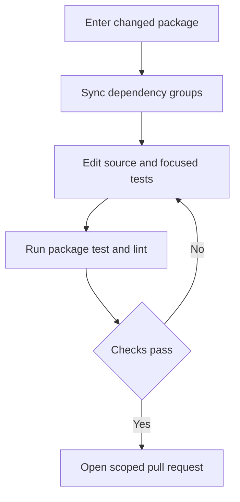
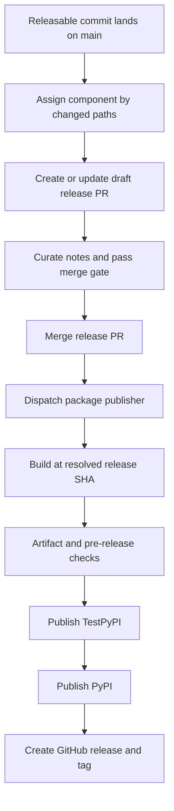

# Development, CI, and Releases

The repository is a monorepo of independently versioned Python packages under `libs/`, rather than one root Python project. Work at a package boundary for normal development; use aggregate tooling when validating shared dependency or lockfile changes. See [Source Map](../architecture/source-map.md), [Testing Guide](../testing/testing-guide.md), [Security](security.md), and [Quickstart](../quickstart.md) for complementary context.

## Package-local development

External contributors must link a maintainer-approved issue or discussion and be assigned to it before opening a PR. Every package owns its `pyproject.toml`, `Makefile`, and README; there is no root `pyproject.toml`. Local sibling dependencies can be editable, so in-tree development can observe changes across package boundaries.

Use `uv` for interpreters, environments, and dependencies, and use each package's Makefile as the command authority. `uv` provisions an interpreter compatible with that package's `requires-python`; there is no repository-wide Python version to install. Install hooks once, then work in the changed package:

```bash
uv tool install pre-commit
pre-commit install --install-hooks

cd libs/deepagents
uv sync --all-groups
make test
make lint
```

`make help` lists the targets available in the current package. Install dependencies explicitly with `uv sync`, adding `--group <name>` or `--all-groups` when needed; do not create an environment outside the package or mix environments in one session. Package targets run tools through `uv run`. For example, the `deepagents` Makefile exports `UV_FROZEN = true`, so a stale lockfile fails rather than being silently updated; its unit-test target runs socket-disabled pytest in parallel with coverage.

| Command | Typical purpose |
| --- | --- |
| `make test` | Run unit tests; `deepagents` uses offline, parallel pytest with coverage. |
| `make integration_test` | Run network-capable integration tests when the package offers the target. |
| `make lint` | Run package lint, formatting checks, and type checks. |
| `make format` | Apply formatting and safe lint fixes. |
| `make type`, `make coverage`, `make test_watch` | Use focused validation where the package supplies it. |



Caption: the ordinary developer loop is package-local and repeats until package validation passes.

Warnings not explicitly accepted by the test configuration are errors. Fix actionable warnings, and narrowly filter an expected warning at test scope instead of broadly ignoring it.

### Code local CI and the SDK pin

`libs/code` provides `make check` as the local CI-parity entrypoint. After linting, import checks, and unit tests, it verifies optional-extra synchronization, `pyproject.toml`/`_version.py` equality, and lock freshness. It then checks the Code SDK pin: exit status 1 (a stale pin) is advisory locally, while other checker failures remain fatal.

`deepagents-code` currently has source version `0.1.73` in both `libs/code/pyproject.toml` and `deepagents_code/_version.py`; its changelog records the `0.1.73` release. Its exact SDK dependency is `deepagents==0.7.17`. When Code needs SDK functionality introduced by a newer SDK, update that exact pin in the same PR, regenerate `libs/code/uv.lock`, and commit the result. The pin represents the minimum SDK Code actually requires, not merely the newest SDK available.

On a Code release PR, the SDK-pin workflow warns but does not fail for a stale pin. Publication is stricter: the release workflow rejects a Code package pin that is older than the workspace SDK. An intentionally older pin requires the deliberate `ci:dcode-skip-sdk-pin` release-PR label; only after positively reading that label does the dispatcher pass `dangerous-skip-sdk-pin-check=true`. A label lookup failure leaves the check enforced. A prerelease SDK pin instead requires `ci:ack-release-deps` before the release PR can merge.

## Aggregate locks and cross-package validation

Run repository fan-out operations from `libs/`. Its Makefile discovers direct library packages and `partners/*` packages that have Makefiles; lock operations additionally include example projects that have `pyproject.toml`. The loops use `set -e`, so they stop at the first failure.

| Command | Purpose |
| --- | --- |
| `make lint` / `make format` | Run the corresponding target in each discovered library package. |
| `make lock [no-cache]` | Regenerate all discovered library and example locks; `no-cache` bypasses uv's cache. |
| `make lock-check` | Verify those locks are current. |
| `make lock-bump DEP=<pkg>` | Re-resolve every discovered lock with `-P <pkg>`; `DEP` is required. |
| `make bench-all` | Run `bench` for `deepagents` and `code`. |

The aggregate lock policy resolves ACP with Python 3.14 and all other package or example locks with Python 3.12. This is a lock-generation choice, not a published interpreter floor: ACP declares `>=3.11`, Talon declares `>=3.12`, and their locks record those respective ranges. Regenerate a lock when package metadata or resolved dependencies change. For a shared dependency update, use `make -C libs lock-bump DEP=<pkg>` rather than editing lockfiles by hand.

Editable workspace sources validate in-tree integration but can conceal an unsatisfiable public installation graph. On a `release(...)` PR, **Check Release Dependencies** removes local sources and resolves changed manifests against public indexes with `uv pip compile`. `ci:ack-release-deps` makes this report-only rather than skipping it: resolution and follow-up-release reporting still run. Use the acknowledgement only for an intentional, coordinated release order.

Adding a partner package is consequently a repository-wiring change, not merely a new directory. Register issue and label routing, CI detection and jobs, synchronized scopes, release workflow mappings, release-please configuration and manifest, notes, dependency maintenance, and secrets. Sandbox-backed packages also require Harbor and integration-test credential surfaces.

## Independent release baselines

Release-please manages nine independent Python distributions: `deepagents`, `deepagents-acp`, `deepagents-code`, `deepagents-talon`, `langchain-daytona`, `langchain-modal`, `langchain-runloop`, `langchain-vercel-sandbox`, and `langchain-quickjs`. It creates separate draft PRs and is configured per package with Python release type, distribution and component names, changelog path, version-bearing extra files, and excluded test paths. `skip-github-release` delegates publication to `release.yml`; tags include the component and `==`, without `v`.

The release manifest records the last released baselines, **not** a package's editable source version. Its current baselines are:

| Manifest path | Baseline |
| --- | --- |
| `libs/deepagents` | `0.7.17` |
| `libs/acp` | `0.0.12` |
| `libs/code` | `0.1.73` |
| `libs/talon` | `0.0.8` |
| `libs/partners/daytona` | `0.0.8` |
| `libs/partners/modal` | `0.0.6` |
| `libs/partners/runloop` | `0.0.7` |
| `libs/partners/vercel` | `0.0.2` |
| `libs/partners/quickjs` | `0.3.7` |

Do not manually advance a managed package's release values during routine dependency work. Release-please updates package metadata and version markers on its release PR, and the lock updater then regenerates the affected `uv.lock` because release-please itself does not. ACP's published `0.0.12` agrees between project metadata and its release-please marker; Talon's source metadata and marker are both `0.0.8`.

## Release lifecycle and controls



Caption: release-please prepares a component release PR, while a separate workflow publishes and tags one resolved source tree.

Release attribution is by changed file paths rather than Conventional Commit scope alone. A merged release commit must match `release(<component>): <version>` and change that package's `CHANGELOG.md` before it dispatches publication. Release PRs begin with `auto:release-pending`; successful publication changes the label to `auto:release-tagged`.

Keep bump-worthy work to one managed component. An empty commit has no path assignment and can fan out to every component, so the release workflow blocks it before release-please runs. A bump-worthy change that also includes lockfiles or real files in another component can likewise fan out. The scope gate blocks lockfile-only and multi-component fan-out unless `ci:allow-lockfile-release` acknowledges it; the label permits rather than prevents the resulting releases. Put cross-package dependency and lock churn in a separate `chore(deps):` change.

Before recomputing release PRs, the release workflow waits for every merged PR still carrying `auto:release-pending`. This prevents evaluating a manifest advanced ahead of its tag; unreadable GitHub state fails closed, while a genuinely slow publisher defers the refresh to a later push.

### Curated release notes

Every release-please release PR has a required `curated release notes` merge gate. When a draft release PR is marked ready for review, `release-bot` drafts notes in a PR comment. A maintainer reviews or edits the draft and uses `@release-bot apply`; the bot writes the package `CHANGELOG.md`, updates the PR-body preview, and explicitly dispatches the gate for the new head. `ci:skip-curated-notes` is the explicit bypass.

The automation derives each component's changelog path and expected release branch from `release-please-config.json`; adding a configured managed component therefore opts it into this gate rather than requiring a hard-coded component list. It accepts only an open, same-repository PR to `main` whose release branch and `release(<component>): <version>` title agree. This prevents a fork or mismatched branch/title from gaining the release-PR mutation path.

The privileged draft and apply jobs run automation checked out from trusted `main`, treat release-PR content as untrusted API data rather than checking it out, and use a short-lived GitHub App token only after validation confirms the command and maintainer write permission. The drafting step makes one fixed model-provider request without model tools; failures are reported on the PR. The apply path creates a non-force Git Data API commit, so it does not rewrite release-branch history.

Because pushes made with `GITHUB_TOKEN` or the app token do not reliably produce a normal PR run, both the release-please lock updater and a successful apply explicitly dispatch `release_notes_check.yml`. That check validates the current release head, creates or refreshes the required check for dispatch/comment runs, and finalizes an interrupted refresh as failure rather than leaving it in progress. The Python test shim runs the native Node tests and asserts the workflow wiring, trusted-source helper paths, component coverage, permissions, and mutation safeguards.

### Safe publication and recovery

The publisher is dispatched as `workflow_dispatch`, rather than reused as a workflow, because PyPI Trusted Publishing does not support reusable workflows. It resolves an explicit release SHA and, on the normal path, rejects a SHA whose package `pyproject.toml` version differs from the requested version. Build, validation, and tag creation all use that resolved SHA. The build also rejects an already-published PyPI version and fails closed when PyPI is unreachable or returns an unexpected status.

The build job has read-only repository permission. Later publishing and GitHub-release jobs hold trusted-publishing and repository-write permissions, limiting exposure of those credentials. The release stages are build, pre-release validation, TestPyPI, PyPI, then GitHub release/tag. Notes generation for the published GitHub release is intentionally fail-open: a notes failure can leave an otherwise published and tagged GitHub release with an empty body that must be repaired afterward.
