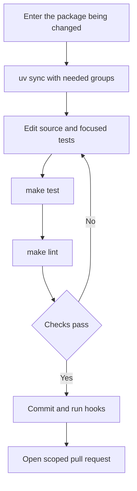
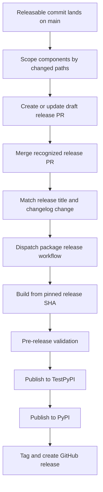

# Development & Build Operations

This is a monorepo of independently versioned Python packages under `libs/`, rather than one root Python project. Work at the package boundary: its `pyproject.toml`, `uv.lock`, and `Makefile` define its dependencies and supported commands. Repository-wide and release operations deliberately cross that boundary and need additional safeguards.

For repository locations, see [Source Map](../architecture/source-map.md); for initial setup, see [Quickstart](../quickstart.md); for test conventions, see [Testing Guide](../testing/testing-guide.md); and for evaluation runs, see [Run Evals](../workflows/run-evals.md).

## Package-local development

Use `uv` for interpreters, environments, and dependencies, and `make` as the task runner. Do not use `pip`, Poetry, or Conda. `uv` selects a compatible interpreter from the package's `requires-python`; there is no repository-wide Python version to pin.

Each package owns a `pyproject.toml`, `Makefile`, and README. Local dependencies are editable uv sources, so a dependency edit is immediately visible to a sibling consumer. For example, Code uses editable sources for `deepagents`, `deepagents-acp`, and all listed partner packages.

```bash
uv tool install pre-commit
pre-commit install --install-hooks

cd libs/deepagents
uv sync --all-groups
make test
make lint
```

Keep the environment reproducible:

1. Install dependencies explicitly with `uv sync`; use `--group <name>` or `--all-groups` as needed.
2. Do not create a virtual environment outside the package directory for normal monorepo work.
3. Do not mix environments in a session.
4. Follow the package's `requires-python` rather than pinning a global Python version.

The package Makefile is the command authority. Run `make help` in the package to discover its targets; help is generated from `##` comments. Shared target names are similar, not a uniform interface.

| Command | Typical purpose and important variation |
| --- | --- |
| `make test` | Run socket-disabled unit tests. `deepagents` and `code` use parallel pytest with coverage; Talon runs its Node WhatsApp bridge tests first. ACP uses its own flags and timeout. |
| `make integration_test` | In `deepagents` and `code`, run integration tests with network access and a timeout; this is intentionally distinct from unit testing. |
| `make lint` | Run Ruff checks and format diff checks, then `ty`; Code additionally verifies its generated command catalog and working-directory policy. |
| `make format` | Apply Ruff formatting and safe Ruff fixes. Review the resulting changes before committing. |
| `make type`, `make coverage`, `make test_watch` | Package-specific focused type, coverage, and watch entrypoints. |

`deepagents`, `code`, and Talon export `UV_FROZEN = true`, so their Makefile invocations fail when locks are stale rather than updating them. ACP and evals have different uv group/flag combinations and do not export this setting. For evaluations, `make evals MODEL=<id>` requires `MODEL`; `make evals-trials MODEL=<id> TRIALS=<n>` requires both inputs and fails before execution when either is absent.



Caption: the normal development loop stays within one package until package validation succeeds, then passes the change to repository gates.

### Code CI-parity entrypoint

In `libs/code`, `make bootstrap` syncs the test group and installs repository hooks. `make check` is the local CI-parity entrypoint: it runs lint, import checks, and unit tests, then validates extras synchronization, version equality, and lock freshness. Its SDK-pin check treats a stale pin as advisory, but unexpected checker failures remain fatal.

## Repository-wide maintenance and gates

Run fan-out commands from `libs/`. The top-level library Makefile discovers direct child and `partners/*` package Makefiles; lock operations also include example directories with a `pyproject.toml`. Its loops use `set -e`, so the first package failure stops the operation.

| Command | Purpose |
| --- | --- |
| `make lint` / `make format` | Invoke the corresponding target in every discovered library package. |
| `make lock [no-cache]` | Regenerate every discovered library/example lock; `no-cache` bypasses uv's cache. |
| `make lock-check` | Check every discovered lock. |
| `make lock-bump DEP=<pkg>` | Re-resolve every discovered lock with `-P <pkg>`; omitting `DEP` fails. |
| `make bench-all` | Run `bench` only for `deepagents` and `code`. |

Lock fan-out uses Python 3.14 for ACP and 3.12 for every other discovered directory. This is a lock-generation policy, not a substitute for a package's `requires-python` or its CI matrix.

```bash
make -C libs/code check
make -C libs lock-check
```

### CI and local hooks

On pull requests, main CI path-filters lint and unit tests to affected packages; pushes to `main` run all packages. Filters include `libs/deepagents/**` for editable consumers, so an SDK change validates its dependents before landing. Reusable lint/test workflows set `UV_FROZEN`, sync the test group, and invoke the package Makefile. The test workflow validates its caller-provided Python matrix and provisions Node 24 for Talon.

`pre-commit install --install-hooks` installs the configured commit, commit-message, and pre-push checks. Pre-commit 3.2.0 or later is required because older versions reject the git-hook-named stages, invalidating the whole configuration. The commit-message hook checks the allowed Conventional Commit types; PR CI validates scopes.

File-scoped local hooks run `make format lint` for changed deepagents, Code, evals, and ACP paths. They regenerate Code `COMMANDS.md` and the eval catalog where applicable, and run lockfile, extras, version-equality, and duplicated branch-scope consistency checks. Standard hooks also block direct commits to `main` and validate YAML, TOML, whitespace, and text formatting.

The always-run pre-push check enforces `<github-username>/<scope>/<short-description>` on ordinary branches. It permits protected, automation, and release branches; it resolves the login from `git config github.user`, then `gh`, then the email local part. Set `github.user` if fallback identity is ambiguous. `git push --no-verify` or `SKIP=branch-name git push` bypasses this local check. Server-side branch checking remains necessary because pre-commit can inspect only one ref in a multi-ref push and does not run when no new commits are pushed.

`AGENTS.md` is the authoritative contributor and coding-agent guide; `CLAUDE.md` redirects to it. Before opening a PR, read the LangChain contributing guide. External PRs must link a maintainer-approved issue or discussion and be assigned to it. Keep bump-worthy work to one releasable component; isolate cross-package dependency and lockfile churn in a separate `chore(deps):` change.

## Release operations

Release-please manages nine independently versioned Python packages: `deepagents`, `deepagents-acp`, `deepagents-code`, `deepagents-talon`, `langchain-daytona`, `langchain-modal`, `langchain-runloop`, `langchain-vercel-sandbox`, and `langchain-quickjs`. Each configured component has Python release metadata, a package name, changelog path, version-bearing extra files, and a test-path exclusion. `separate-pull-requests: true` produces a draft release PR per component.

The manifest is release-please-managed release state, not a manually maintained source of truth. Its current independent release baselines are:

| Package path | Baseline |
| --- | --- |
| `libs/deepagents` | `0.7.13` |
| `libs/acp` | `0.0.11` |
| `libs/code` | `0.1.66` |
| `libs/talon` | `0.0.6` |
| `libs/partners/daytona` | `0.0.8` |
| `libs/partners/modal` | `0.0.6` |
| `libs/partners/runloop` | `0.0.7` |
| `libs/partners/vercel` | `0.0.2` |
| `libs/partners/quickjs` | `0.3.6` |

Add a new managed package to both release configuration and manifest, but do not otherwise edit an existing manifest baseline. For an unshipped package whose source starts at `0.0.1`, use manifest baseline `0.0.0` so its first release is `0.0.1`.

Release attribution follows changed paths, not Conventional Commit scope alone. `feat`, `fix`, `perf`, and `revert` are visible changelog sections; docs, style, chore, refactor, test, CI, and hotfix are hidden. The pre-1.0 settings turn ordinary features into patch bumps and breaking changes into minor bumps. A bump updates the component `pyproject.toml` and `_version.py`; a test-only change under its excluded test path does not trigger that component. Tags contain the component and no `v`, such as `deepagents==0.7.13`. Release-please itself does not create the GitHub release.



Caption: release-please prepares component release PRs, while the dispatched publisher validates and releases the exact selected commit.

A merged `release(<component>): <version>` commit must also change that component's `CHANGELOG.md` before the release-please workflow dispatches `release.yml`. The publisher resolves the package directory and an exact release SHA, checks that its `pyproject.toml` version matches the requested version on the normal path, builds from that SHA, then runs pre-release checks before TestPyPI and PyPI publication. It creates the GitHub tag/release from the same SHA, preserving the one-version/one-artifact invariant. Manual dispatch is exceptional: a non-main release requires the dangerous option, while the normal manual path requires an explicit SHA.

After detecting a release commit, publication is dispatched before release-please maintenance. The workflow then waits for every merged release PR still labeled `autorelease: pending` to finish publishing before recomputing release PRs, because a manifest updated before its tag exists is inconsistent state. The release-please action is serialized while this maintenance occurs; a failed or unreadable release state fails closed or defers maintenance rather than recomputing against it. The lockfile updater regenerates locks on release PR branches because release-please changes package versions but does not regenerate locks.

### Prevent release fan-out

Changed paths make commit partitioning an operational invariant:

- **Do not put an empty commit on `main`.** It has no package path, so release-please falls back to every managed package. `guard-empty-commit` blocks it before release-please runs. The narrow history-repair exception is an empty two-parent `hotfix(repo): …` merge only when every introduced commit touches files.
- **Separate lock churn from bump-worthy source work.** A `feat` or `fix` that updates dependent `uv.lock` files can create release PRs for each touched component. Put that churn in a separate `chore(deps):` change.
- **Split real multi-component work.** A bump-worthy commit touching non-lock files in more than one managed component creates a PR for each. The scope check blocks this and lockfile-only fan-out unless `allow-lockfile-release` explicitly acknowledges it; the label allows the merge but does not prevent resulting releases.

Closing an unintended release PR does not remove its triggering commit from `main`, so it can return; remove or revert the unreleased bump instead. Local editable sources validate development integration, not public installation. Release-PR dependency validation removes local sources and resolves against PyPI, exposing published dependency ranges that sibling editable sources could hide.
