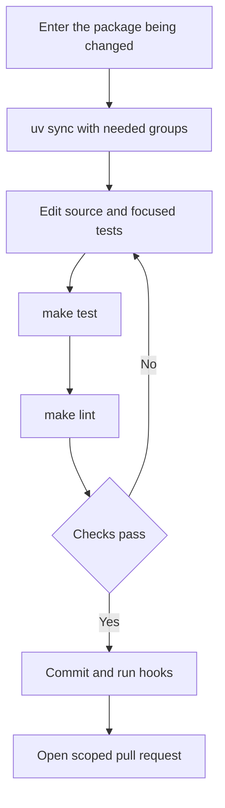
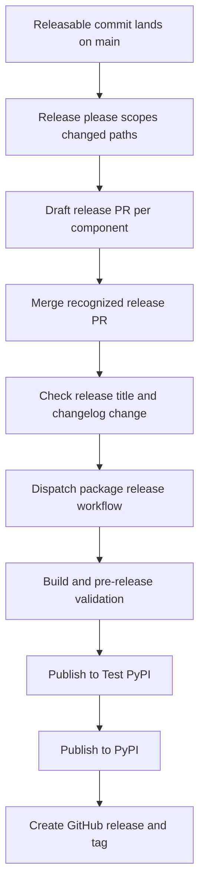

# Development & Build Operations

This repository is a monorepo of independently versioned Python packages under `libs/`, not one root Python project. Work at the package boundary: the package's `pyproject.toml`, `uv.lock`, and `Makefile` define its dependencies and supported commands. This page separates the routine edit–validate loop from repository-wide maintenance and release operations, where the consequences of a change extend beyond the edited package.

For repository locations, see [Source Map](../architecture/source-map.md); for initial checkout setup, see [Quickstart](../quickstart.md); for test conventions, see [Testing Guide](../testing/testing-guide.md); and for evaluation runs, see [Run Evals](../workflows/run-evals.md).

## Routine package development

Use `uv` for Python interpreters, environments, and dependencies, and `make` to invoke package tasks. Do not use `pip`, Poetry, or Conda. `uv` provisions a compatible interpreter from the package's `requires-python`, so there is no repository-wide Python version to pin.

Each package has its own `pyproject.toml`, `Makefile`, and README. Local dependencies are editable uv sources: a source edit in a dependency package is immediately visible to a sibling consumer. For example, the Code package points at editable `deepagents`, `deepagents-acp`, and partner integrations.

```bash
uv tool install pre-commit
pre-commit install --install-hooks

cd libs/deepagents
uv sync --all-groups
make test
make lint
```

Keep the environment reproducible:

1. Install dependencies explicitly with `uv sync`; add `--group <name>` or `--all-groups` as needed.
2. Do not create a virtual environment outside the package directory for normal monorepo work.
3. Do not mix environments in one session.
4. Follow the package's `requires-python` rather than pinning a global Python version.

The package Makefile is the command authority. Run `make help` inside the package rather than assuming a target or flags exist everywhere; help is generated from `##` comments in that Makefile.

| Command | Typical purpose and important variation |
| --- | --- |
| `make test` | Run unit tests. The inspected first-party packages disable network sockets while allowing Unix sockets. `deepagents` and `code` add parallel execution and coverage; `talon` first runs its Node WhatsApp bridge tests. Where supported, set `TEST_FILE=…` for a focused path. |
| `make integration_test` | Available in `deepagents` and `code`; runs their integration-test directory with network access and a timeout. It is deliberately distinct from the socket-disabled unit target. |
| `make lint` | Checks Ruff lint and formatting, then runs `ty`. Code also verifies the generated command catalog and process working-directory policy. |
| `make format` | Applies Ruff formatting and safe Ruff fixes. Review the resulting changes before committing. |
| `make type`, `make coverage`, `make test_watch` | Package-specific focused type, coverage, and watch-mode entrypoints. |

`deepagents`, `code`, and `talon` export `UV_FROZEN = true`, so their Makefile tasks fail on stale locks rather than silently updating them. Do not treat shared target names as a uniform contract: ACP and evals use different uv group/flag combinations and do not export that setting. The evals Makefile additionally provides `make evals MODEL=<id>` and `make evals-trials MODEL=<id> TRIALS=<n>`; both fail early when their required inputs are absent.



Caption: the normal development loop stays inside one package until package validation passes, then hands the change to repository gates.

### Code package CI-parity entrypoint

In `libs/code`, `make bootstrap` synchronizes the test group and installs repository hooks. Use `make check` before a substantial Code change or when reproducing common CI failures: it runs lint, imports, and unit tests, then checks extras synchronization, version equality, and lock freshness. The SDK-pin check is advisory when it reports a stale pin, but an unexpected error remains fatal. `uv run deepagents-code` runs the editable checkout.

## Repository-wide maintenance

Run fan-out commands from `libs/`. Its Makefile discovers library package Makefiles in direct children and `partners/*`, while lock operations also include examples with a `pyproject.toml`. Its loops use `set -e`, so the first failing package stops the operation.

| Command | Purpose |
| --- | --- |
| `make lint` | Invoke each library package's `lint` target. |
| `make format` | Invoke each library package's `format` target. |
| `make lock [no-cache]` | Recreate all discovered library/example locks; append `no-cache` to bypass uv's cache. |
| `make lock-check` | Run `uv lock --check` for every discovered lock. |
| `make lock-bump DEP=<pkg>` | Re-resolve every discovered lock using `-P <pkg>`; fails if `DEP` is omitted. |
| `make bench-all` | Run `bench` only for `deepagents` and `code`. |

Lock fan-out supplies explicit Python versions: ACP is locked with 3.14 and other discovered directories with 3.12. This is a lock-generation policy, not a replacement for package `requires-python` or CI matrices.

```bash
# Package-specific comprehensive check
make -C libs/code check

# Repository-wide lock consistency
make -C libs lock-check
```

### CI and hooks

The main CI workflow path-filters pull requests to affected packages for lint and unit tests, but runs all packages on pushes to `main`. Editable consumers include `libs/deepagents/**` in their filters, so an SDK change tests dependent packages before it lands. Reusable lint and test workflows synchronize the test group in frozen uv environments and call the package Makefile; tests use the caller-selected Python matrix.

Install local hooks with `pre-commit install --install-hooks`. The configuration installs `pre-commit`, `commit-msg`, and `pre-push` hooks, requiring pre-commit 3.2.0 or newer because older releases reject the configured git-hook stage names and invalidate the config. Commit-message validation accepts the configured Conventional Commit types; scope validation is performed in PR CI.

At commit time, file-scoped hooks run `make format lint` for changed `deepagents`, `code`, `evals`, and ACP paths. They regenerate Code `COMMANDS.md` and the eval catalog when applicable, and check lock freshness, extras synchronization, SDK/Code version equality, and duplicated branch-scope rules. Standard hygiene hooks also prevent direct commits to `main` and validate YAML, TOML, whitespace, and text formatting.

The always-run pre-push hook enforces `<github-username>/<scope>/<short-description>` for ordinary branches. It allows protected, automation, and release branches, and resolves the GitHub login from `git config github.user`, then `gh`, then the email local part. Set the explicit Git configuration if fallback identity is ambiguous. It can be bypassed with `git push --no-verify` or `SKIP=branch-name git push`; server-side branch checking is the backstop because pre-commit's route can inspect only one ref in a multi-ref push and does not run for a push with no new commits.

The root `AGENTS.md` is the contributor and coding-agent guide; `CLAUDE.md` redirects to it. Before opening a PR, read the LangChain contributing guide. External contributors must link a maintainer-approved issue or discussion and be assigned to it. Keep bump-worthy work scoped to one releasable component and move cross-package dependency/lock churn to a separate `chore(deps):` change.

## Release operations

Release-please manages nine independently versioned Python packages: `deepagents`, `deepagents-acp`, `deepagents-code`, `deepagents-talon`, `langchain-daytona`, `langchain-modal`, `langchain-runloop`, `langchain-vercel-sandbox`, and `langchain-quickjs`. Each configuration has Python release metadata, a component and package name, changelog path, version-bearing extra files, and a tests-path exclusion. With `separate-pull-requests: true`, release-please drafts a release PR per component rather than assigning a monorepo version.

`.release-please-manifest.json` is release state, with current independent baselines including `libs/deepagents` `0.7.12`, `libs/acp` `0.0.11`, `libs/code` `0.1.65`, and `libs/talon` `0.0.6`. Do not manually alter an existing baseline. To add a managed package, add both its configuration and manifest entries; when source starts at `0.0.1` and has never shipped, its manifest baseline should normally be `0.0.0` so the first release remains `0.0.1`.

Release attribution is based on changed paths, not just Conventional Commit scope. `feat`, `fix`, `perf`, and `revert` appear in changelogs; docs, style, chore, refactor, test, CI, and hotfix are hidden. The pre-1.0 settings make ordinary features patch bumps and breaking features minor bumps. A bump rewrites the package `pyproject.toml` and `_version.py`, while a change only in that package's tests path does not trigger its release. Tags include their component without a `v`, for example `deepagents==0.7.12`.



Caption: release-please prepares component release PRs, while the separately dispatched release workflow performs publishing after a recognized merge.

Release-please itself skips GitHub release creation. After a recognized `release(<component>): <version>` merge that changes the component `CHANGELOG.md`, it dispatches `release.yml`, which builds, validates the built package, publishes to Test PyPI and then PyPI, and creates the GitHub release. The release workflow can also be manually dispatched, but its UI explicitly describes manual release as exceptional.

### Prevent release fan-out

Path attribution makes commit partitioning an operational invariant:

- **Never put an empty commit on `main`.** With no paths, release-please falls back to all managed packages. `guard-empty-commit` stops it before release-please; its narrow history-repair exception is an empty `hotfix(repo): …` merge only when every introduced commit touches files.
- **Separate lock churn from bump-worthy source work.** A `feat` or `fix` that regenerates dependent `uv.lock` files can create a release PR for every touched package. Put that churn in a separate `chore(deps):` change.
- **Split real multi-component changes.** A bump-worthy commit touching non-lock files in multiple managed components creates a release PR for each. The scope check blocks this and lockfile-only fan-out unless `allow-lockfile-release` explicitly acknowledges it; the label does not prevent releases.

Closing an unintended release PR does not remove the triggering commit from `main`, so the PR can return. Remove or revert the unreleased bump instead. Finally, editable local sources prove developer integration but not public installation: release-PR dependency validation removes local sources and resolves against PyPI. For a coordinated new core line, it can report unresolved already-published dependents; `release-deps: acknowledged` makes that check report-only while retaining the follow-up work, so it is not a declaration that dependencies are solved.
