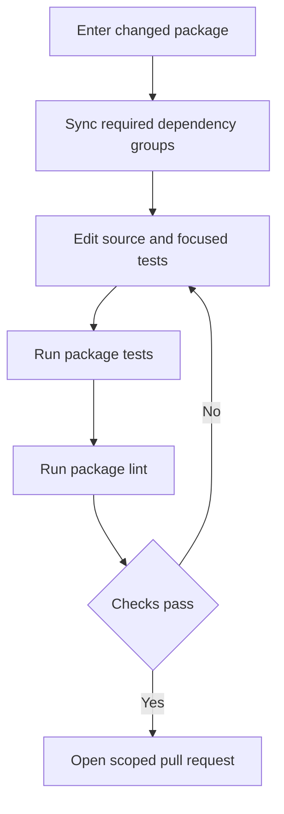
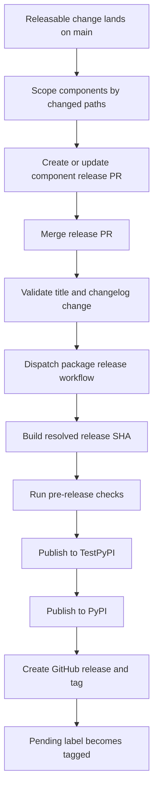

# Development, CI, and Releases

This is a monorepo of independently versioned Python packages under `libs/`, not one root Python project. A package owns its `pyproject.toml`, `uv.lock`, `Makefile`, and README; work in the package being changed. Editable sibling dependencies make in-tree changes visible to consumers during development, but release checks separately validate the public dependency graph.

For initial setup, see [Quickstart](../quickstart.md). See [Testing Guide](../testing/testing-guide.md) for test conventions, [Run Evals](../workflows/run-evals.md) for evaluation execution, and [Security](security.md) for security practices.

## Contribution and package-local validation

External pull requests need a maintainer-approved linked issue or discussion, with the contributor assigned before the PR is opened. Use `uv` for interpreters, environments, and dependencies and `make` as the task entrypoint; do not use `pip`, Poetry, or Conda. `uv` selects an interpreter compatible with the package's `requires-python`, so there is no repository-wide Python version to install or pin.

Install hooks once, then work from the package directory:

```bash
uv tool install pre-commit
pre-commit install --install-hooks

cd libs/deepagents
uv sync --all-groups
make test
make lint
```

`make help` lists the targets supported by that package. Sync dependency groups explicitly with `uv sync --group <name>` or `uv sync --all-groups`; do not create an environment outside the package or mix environments in one session. Package Makefiles are authoritative, so target availability and flags are not a universal API.

| Command | Typical purpose |
| --- | --- |
| `make test` | Run unit tests. In `deepagents`, this is parallel, socket-disabled pytest with coverage. |
| `make integration_test` | Run network-capable integration tests where the package supplies the target. |
| `make lint` | Check Ruff linting/formatting and the package type check. |
| `make format` | Apply Ruff formatting and safe fixes; review the diff. |
| `make type`, `make coverage`, `make test_watch` | Focused type, coverage, and watch entrypoints when provided. |

Package targets invoke tools through `uv run`. For example, `libs/deepagents/Makefile` exports `UV_FROZEN = true`, so a stale lockfile fails rather than being silently rewritten.



Caption: package-local validation is an edit, test, and lint loop before the change enters repository gates.

### Warnings and local CI parity

Unaccepted pytest warnings are errors. Fix actionable warnings; narrowly filter an expected warning at test scope with `@pytest.mark.filterwarnings`, reserving package-wide filtering for justified categorical or third-party cases. Prefer visible `default::` behavior to broad `ignore::` rules.

`libs/code` provides `make check` as a stronger local parity check. After linting, import checks, and unit tests, it checks extras synchronization, version equality, and lock freshness. Its SDK-pin result is advisory only when the checker reports a stale pin; other checker failures remain fatal.

## Repository fan-out, hooks, and CI

Run cross-package operations from `libs/`. The root library Makefile discovers direct library packages and `partners/*` packages with Makefiles; lock operations also include examples with `pyproject.toml`. Its loops use `set -e`, stopping at the first failed package.

| Command | Purpose |
| --- | --- |
| `make lint` / `make format` | Invoke that target in every discovered library package. |
| `make lock [no-cache]` | Regenerate discovered library and example locks; `no-cache` bypasses the uv cache. |
| `make lock-check` | Verify all discovered locks. |
| `make lock-bump DEP=<pkg>` | Re-resolve every discovered lock with `-P <pkg>`; omitting `DEP` fails. |
| `make bench-all` | Run `bench` for `deepagents` and `code`. |

The fan-out locking policy uses Python 3.14 for ACP and 3.12 for other packages. It does not replace each package's declared supported-Python range or CI matrix.

```bash
make -C libs/code check
make -C libs lock-check
```

The main CI entry workflow runs for pull requests, pushes to `main`, and merge-group events. Its change detector selects affected package jobs on PRs; package jobs also run unconditionally on `main` pushes. Filters include `libs/deepagents/**` for editable SDK consumers, so SDK changes validate those consumers before merge. `_test.yml` is a reusable workflow: it validates caller matrices, syncs the test group with frozen locks, runs the package Make target on non-Windows runners, and checks that tests leave a clean tree.

Entry workflows have no leading underscore; reusable `_*.yml` workflows are called via `workflow_call`. Prefer extending an existing reusable workflow rather than copying setup and checkout logic.

The hook configuration requires pre-commit 3.2.0 or later and installs `pre-commit`, `commit-msg`, and `pre-push` hooks. File-scoped local hooks run package Makefiles and lock/extras/version checks. The commit-message hook checks configured Conventional Commit types; CI validates scopes. The pre-push branch convention is `<github-username>/<scope>/<short-description>`; protected, automation, and release branches are exceptions. It is a local guard that can be bypassed, so server-side checks remain important.

### Adding a partner package

A partner package is independently versioned and owns its own environment, metadata, Makefile, and tests. Adding one requires coordinated registration across issue/label routing, Dependabot, CI detection and jobs, scope synchronization, `release.yml`, release detection, release-please configuration and manifest, release notes, dependency maintenance, and the credential inventory. Sandbox-backed partners additionally need Harbor and integration-test matrix/credential wiring. Set a first managed-release manifest baseline to `0.0.0`.

## Locks and public dependency validation

Regenerate a lock whenever project metadata or resolved dependencies change. For a shared dependency update, use `make -C libs lock-bump DEP=<pkg>` rather than editing locks by hand, then validate with package checks or `make -C libs lock-check`.

Editable local sources can conceal a public dependency graph that cannot resolve. On a `release(...)` PR, **Check Release Dependencies** strips local sources and resolves each changed managed manifest against public indexes using `uv pip compile --no-sources --universal --prerelease allow --all-extras`. `ci:ack-release-deps` is an acknowledgement for intentional coordinated release order: the job still runs and reports follow-up release debt, but does not block on its resolver result. It is not evidence that metadata is correct.

## Release lifecycle

Release-please manages nine independently versioned Python distributions: `deepagents`, `deepagents-acp`, `deepagents-code`, `deepagents-talon`, `langchain-daytona`, `langchain-modal`, `langchain-runloop`, `langchain-vercel-sandbox`, and `langchain-quickjs`. It uses draft, separate release PRs and `skip-github-release`; each managed package defines Python release metadata, component/package name, changelog, version-bearing extra files, and excluded test paths. A separate `release.yml` publisher creates the tag and GitHub release.

The manifest is the latest released-version baseline, not the source-version file:

| Package path | Baseline |
| --- | --- |
| `libs/deepagents` | `0.7.15` |
| `libs/acp` | `0.0.11` |
| `libs/code` | `0.1.71` |
| `libs/talon` | `0.0.8` |
| `libs/partners/daytona` | `0.0.8` |
| `libs/partners/modal` | `0.0.6` |
| `libs/partners/runloop` | `0.0.7` |
| `libs/partners/vercel` | `0.0.2` |
| `libs/partners/quickjs` | `0.3.7` |

For a new package whose source starts at `0.0.1`, add configuration and a `0.0.0` manifest baseline; otherwise release-please treats `0.0.1` as released and proposes `0.0.2`.

Release attribution follows changed paths, rather than Conventional Commit scope alone. Keep bump-worthy work to one managed component: `feat`, `fix`, `perf`, and `revert` produce visible changelog sections, while configured docs, style, chore, refactor, test, CI, and hotfix changes are hidden. The pre-1.0 configuration turns ordinary features into patch bumps and breaking features into minor bumps. Tags use the component and `==`, such as `deepagents==0.7.15`.



Caption: release-please prepares a component release PR, while the publisher builds, validates, publishes, and tags one resolved source tree.

A release is dispatched only when a merged commit has both `release(<component>): <version>` and that component's `CHANGELOG.md` change. The publisher normally requires an explicit 40-character release SHA, verifies the selected commit's `pyproject.toml` declares the requested version, builds from that SHA, and creates the tag at the same SHA. It also fails closed if PyPI is unreachable, responds unexpectedly, or already has the package version. Manual non-main dispatch is exceptional: `dangerous-nonmain-release` can use the dispatch SHA and skips normal version matching.

The build job has only read permission and is isolated from publishing and GitHub-release jobs, which receive the privileged capabilities needed for their work. Pre-release checks validate the built wheel in clean environments across the resolved Python matrix before TestPyPI and PyPI publishing. Release notes are fail-open: a notes failure does not prevent publication or tagging, and may leave an empty GitHub release body that requires repair.

After a release PR merge, publishing is dispatched before release-please refreshes sibling PRs. The maintenance guard waits across all merged PRs still carrying `auto:release-pending` (also recognizing the legacy pending label) so it does not recompute against a manifest advanced before its tag exists. A known failed publish needs recovery; unreadable release state fails closed, while a publish still in flight after the bounded wait defers the refresh to a later `main` push. Release-please then serializes its shared branch updates, and its lockfile updater regenerates locks after release-please changes package versions.

## Fan-out prevention and recovery

Changed paths are a release invariant:

- Never put an empty commit on `main`. It has no package path, so release-please can fan out to every managed component; `guard-empty-commit` stops it before release-please. The narrow history-repair exception is an empty two-parent `hotfix(repo): ...` merge whose introduced commits all change files.
- Keep bump-worthy changes in one component. A bump-worthy PR that changes only a managed lockfile, or real files in more than one managed component, is blocked by the release scope check unless `ci:allow-lockfile-release` acknowledges the intentional fan-out. The bypass does not prevent resulting release PRs.
- Put cross-package dependency and lock churn in a separate `chore(deps):` PR. Closing an unintended release PR is insufficient: its triggering commit remains on `main`; revert or remove the unreleased bump.

For a failure before PyPI publication, inspect the failed run, merge a `hotfix(<scope>): ...` that preserves the already-bumped version, then manually dispatch the same package/version with the explicit hotfix SHA. Confirm the original PR changes from `auto:release-pending` to `auto:release-tagged`; if the tag and GitHub release exist but the label update failed, repair only that label transition rather than republishing.

If the version is already on PyPI, never recreate its tag or retry the same version. Ship a new fix version (and consider yanking a harmful release). This preserves the invariant that a package version, its PyPI artifacts, and its GitHub tag identify one source tree. If only release-note generation failed, do not rerun publication: rebuild the body with `.github/scripts/release/build_release_notes.py` from a full-history, tag-complete checkout and apply it to the existing GitHub release with `gh release edit ... --notes-file`.
