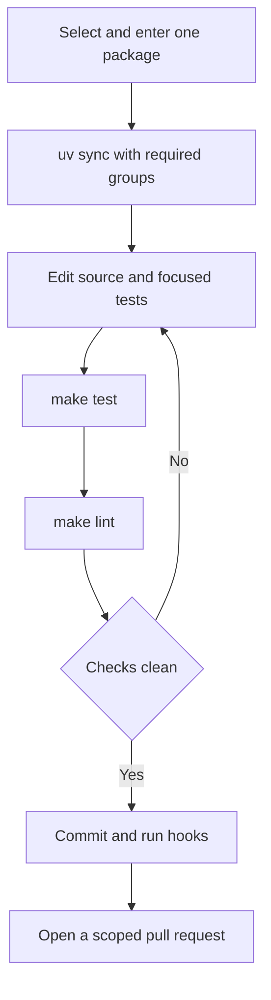
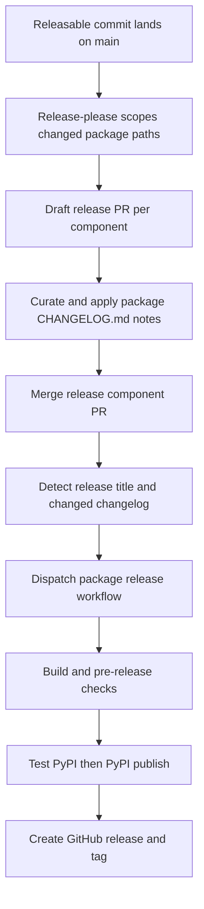

# Development & Build Operations

Deep Agents is a monorepo of independently versioned Python packages under `libs/`. There is no root `pyproject.toml`: work in the package you are changing and use that package's `pyproject.toml`, `uv.lock`, and `Makefile` as the operational boundary. This page describes the normal edit–validate–submit path, the checks that scale it across the repository, and the release controls that keep a package change from becoming an accidental multi-package release.

For source locations, see [Source Map](../architecture/source-map.md); for initial setup, see [Quickstart](../quickstart.md); for testing conventions and troubleshooting, see [Testing Guide](../testing/testing-guide.md). The coding agent has additional package-specific guidance in `libs/code/DEVELOPMENT.md`; evaluation execution is covered by [Run Evals](../workflows/run-evals.md).

## Package-local development

The first-party packages are `deepagents`, `acp`, `code`, `evals`, and `talon`; provider and sandbox integrations live under `libs/partners/`. Each package owns its build metadata, commands, dependencies, and lockfile. Local inter-package dependencies are uv editable path sources, so source edits in a dependency are visible to a sibling package without rebuilding or publishing it. For example, `libs/code` develops against editable `deepagents`, `deepagents-acp`, and all listed partner packages.

Use `uv` for interpreters, environments, and dependencies, and `make` as the task runner. Do not use bare `pip`, Poetry, or Conda. `uv` selects/provisions a compatible interpreter from the package's `requires-python`; do not impose a repository-wide Python version.

```bash
uv tool install pre-commit
pre-commit install --install-hooks

cd libs/deepagents
uv sync --all-groups
make test
make lint
```

### Environment invariants

Keep the package environment reproducible:

1. Explicitly install dependencies with `uv sync`, using `--group <name>` or `--all-groups` when needed.
2. Do not create a virtual environment outside the package directory for ordinary monorepo work.
3. Do not mix environments in a single session.
4. Follow each package's `requires-python` instead of pinning a global interpreter.

A package Makefile is authoritative for its supported commands; run `make help` rather than assuming every target exists everywhere. Its help output is generated from `##` target comments. `deepagents` and `code` share the fuller loop below, but targets and flags are package-local.

| Command | Where it applies | Purpose |
| --- | --- | --- |
| `make test` | All five first-party packages inspected | Run package tests. All disable network sockets and allow Unix sockets; `deepagents` and `code` also parallelize with `-n auto` and report coverage. Set `TEST_FILE=…` where the Makefile supports it. |
| `make integration_test` | `deepagents`, `code` | Run their integration-test directory with network access and a timeout. |
| `make lint` / `make format` / `make type` | All five first-party packages inspected | Check Ruff and formatting, type-check with `ty`, or apply Ruff formatting and safe fixes. `code` also checks its generated command catalog; `evals` checks its evaluation catalog. |
| `make coverage` | `deepagents`, `code` | Produce explicit coverage output, including XML. |

Tools run through `uv run`. `deepagents`, `code`, and `talon` export `UV_FROZEN = true`, so a stale lockfile fails rather than being silently refreshed; do not infer that setting from the shared target names in `acp` or `evals`. Unit tests in each inspected first-party Makefile use `--disable-socket` with Unix sockets explicitly allowed. The `deepagents` and `code` integration targets are the networked boundary.



Caption: the package-local loop moves from an explicit locked environment through focused validation before repository gates run.

### Code package CI-parity entrypoint

For `libs/code`, `make bootstrap` synchronizes the test group and installs the repository hooks. `make check` is the closest local CI gate: it runs linting, import checks, and unit tests, then checks extras synchronization, `pyproject.toml`/`_version.py` equality, and `uv.lock`; its SDK pin check is advisory only. Use `uv run deepagents-code` to run the editable checkout. Keep local tracing out of the monitored GA LangSmith project by setting `DEEPAGENTS_CODE_LANGSMITH_PROJECT` to a development project before noisy work.

## Repository-wide operations

Run fan-out commands from `libs/`. The top-level Makefile discovers library packages through `*/Makefile` and `partners/*/Makefile`; lock operations also include example projects that expose a `pyproject.toml`. Commands stop at the first failure because their loops use `set -e`.

| Command | Purpose |
| --- | --- |
| `make lint` | Invoke `lint` in every library package. |
| `make format` | Invoke `format` in every library package. |
| `make lock [no-cache]` | Refresh every discovered package/example lockfile; append `no-cache` to bypass uv's cache. |
| `make lock-check` | Run `uv lock --check` across every discovered package/example. |
| `make lock-bump DEP=<pkg>` | Re-resolve every discovered lockfile with `-P <pkg>`; fails if `DEP` is omitted. |
| `make bench-all` | Run the `bench` target for `deepagents` and `code` only. |

For locking, the fan-out Makefile supplies `--directory` and an explicit Python version: `acp` uses 3.14 and other discovered directories use 3.12. This mapping is a lock-generation operation; it does not replace the packages' declared supported Python ranges or CI test matrices.

### What CI adds

The main CI workflow runs on pull requests, `main` pushes, and merge-queue events. It uses path filters to select affected packages for linting and unit tests; pushes to `main` run all packages. Because editable dependencies make an SDK change visible to consumers, the relevant consumer filters include `libs/deepagents/**`, so an SDK change also validates those sibling packages. Reusable `_lint.yml` and `_test.yml` workflows establish a frozen uv environment, sync the test group, and invoke the package Makefile; test workflows use the caller's Python-version matrix rather than a single local interpreter.

Before submitting, run the changed package's focused checks and then the likely global integrity check:

```bash
make -C libs/code check
make -C libs lock-check
```

The root `AGENTS.md` is the repository-wide guide for contributors and coding agents; `CLAUDE.md` redirects to it. It requires Conventional Commit titles with a scope, branches named `<github-username>/<scope>/<short-description>`, behavioral unit coverage for features/fixes, and an approved, assigned issue or discussion for external contributions before a PR opens. Keep a bump-worthy change in one releasable component; move cross-package dependency and lockfile churn into a separate `chore(deps):` change.

## Commit hooks and their failure modes

Install hooks with `pre-commit install --install-hooks`. The configuration installs `pre-commit`, `commit-msg`, and `pre-push` hook types and requires pre-commit 3.2.0 or newer: older releases reject the git-hook-named stages, disabling the whole configuration.

At commit time, the local hooks:

- validate Conventional Commit *types* at `commit-msg` (scope validation is handled by PR CI);
- block direct commits to `main` and apply YAML/TOML and whitespace hygiene checks;
- run `make format lint` only for changed `deepagents`, `code`, `evals`, or `acp` paths, with the evals hook also rebuilding its evaluation catalog;
- regenerate `libs/code/COMMANDS.md` when its command registry or generator changes; and
- check lock freshness, extras synchronization, version equality for the SDK and Code package, and consistency of duplicated branch-scope rules.

The always-run pre-push hook checks branch names. It permits protected branches (`main`, `master`, `vX.Y…`), automation prefixes, and release prefixes; otherwise it resolves the expected GitHub login from `git config github.user`, then `gh`, then the email local part. Set `git config github.user <your-github-login>` when fallback identity is ambiguous. A developer can bypass it with `git push --no-verify` or `SKIP=branch-name git push`.

This is intentionally a local convenience rather than final enforcement. Through pre-commit, a multi-ref push may validate only one ref and a push with no new commits may run no hooks; `branch_name_check.yml` observes the PR head branch as the server-side backstop.

## Releases: independent packages, path-based scope

Release-please manages nine packages: `deepagents`, `deepagents-acp`, `deepagents-code`, `deepagents-talon`, `langchain-daytona`, `langchain-modal`, `langchain-runloop`, `langchain-vercel-sandbox`, and `langchain-quickjs`. The release configuration gives each package a Python release type, package name, component, changelog location, version-bearing extra files, and a test-directory exclusion. `separate-pull-requests: true` means each managed component gets an independent draft release PR rather than a repository version.

The current manifest baselines are independent: `libs/deepagents` is `0.7.10`, `libs/acp` is `0.0.11`, `libs/code` is `0.1.64`, `libs/talon` is `0.0.6`, and the partner packages are at their own versions. Treat `.release-please-manifest.json` as release-please state: do not manually edit an existing baseline. When adding a managed package, add both configuration and manifest entries; a new package whose source is `0.0.1` normally needs a `0.0.0` manifest baseline so its first release is not incorrectly incremented to `0.0.2`.

A release-worthy commit is assigned by the paths it changes, not merely its Conventional Commit scope. `feat`, `fix`, `perf`, and `revert` are visible changelog types; the pre-1.0 configuration makes `feat` a patch bump and a breaking `feat!` a minor bump. Docs, chores, refactors, tests, CI, styles, and hotfixes are hidden and do not independently open a release PR.



Caption: release-please prepares a component release PR; the separate release workflow publishes only after the merged release commit is recognized.

On a bump, release-please rewrites the package `pyproject.toml` and `_version.py`, and ignores changes only under that package's tests directory for release triggering. It uses component tags such as `deepagents==0.7.10` (`include-component-in-tag`, `==`, and no `v`). Although release-please is configured to skip creating a GitHub release itself, merging a recognized `release(<component>): <version>` commit with the component `CHANGELOG.md` changed dispatches `release.yml`; that workflow builds, runs pre-release validation, publishes to Test PyPI and then PyPI, and creates the GitHub release.

### Avoid accidental release fan-out

Path-based attribution makes change partitioning operationally important:

- **Never push an empty commit to `main`.** It has no changed paths, so release-please can propose releases for every managed package. `guard-empty-commit` blocks this before release-please runs; the narrow history-repair exception is an empty `hotfix(repo): …` merge whose introduced commits all touch files.
- **Do not mix a bump-worthy source change with dependent lockfile regeneration.** A `feat` or `fix` that changes other packages' `uv.lock` files is attributed to each of those packages. Place lock churn in a separate `chore(deps):` PR.
- **Split real multi-package bump-worthy work.** One feature/fix PR should touch real files in one release component; use a separate `chore(deps):` PR for cross-package metadata and locks.

`release_please_scope_check.yml` fails lockfile-only and real-file multi-component fan-out before merge, unless a maintainer applies `allow-lockfile-release`; the label acknowledges but does not prevent the fan-out. Closing an unintended release PR is insufficient because the unchanged commit remains in `main` and can recreate it. Remove or revert the unreleased bump instead. The post-merge fan-out watcher is an advisory safety net.

Finally, editable sources make local sibling tests convenient but do not prove public PyPI resolution. On release PRs, the release-dependencies check resolves package metadata without local sources. For a coordinated new core line, first update in-tree bounds, publish the core package with `release-deps: acknowledged` only when necessary, then release dependents in dependency order; that label reports outstanding public dependency work rather than declaring it solved.
