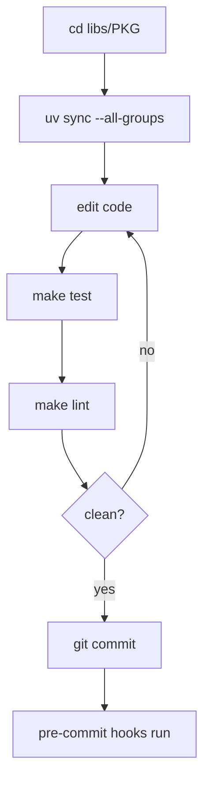

# Development & Build Operations

Deep Agents is a monorepo of independently versioned Python packages under `libs/`. There is **no root `pyproject.toml`**: you work inside the single package you are changing, and each package owns its own `pyproject.toml`, `Makefile`, and `README.md`. This page covers the day-to-day edit-test-lint loop, the repo-wide fan-out targets, the pre-commit gate, the conventions coding agents must follow, and how releases are cut per package.

For where source lives, see [Source Map](../architecture/source-map.md); for first-run setup see the [Quickstart](../quickstart.md); for test details see the [Testing Guide](../testing/testing-guide.md).

## Repository layout and the per-package model

Packages live under `libs/`: the core SDK (`deepagents`), the Agent Client Protocol integration (`acp`), the evaluation suite (`evals`), the prebuilt coding agent (`code`), the local runtime host (`talon`), and provider/sandbox integrations under `partners/` (`daytona`, `modal`, `vercel`, `runloop`, `quickjs`).

Each package is self-contained. Because there is no root project, all commands are scoped: `cd` into the package you change, or drive it with `make -C libs/<pkg> <target>`. Local package dependencies are wired **editable** via `[tool.uv.sources]`, so a change in a dependency package is immediately visible to sibling packages that depend on it during development — for example `libs/code` declares `deepagents`, `deepagents-acp`, and every partner package as `{ path = "...", editable = true }`.

## Toolchain: uv only

The toolchain is `uv` (interpreters, virtual environments, dependencies) plus `make` (task runner). Do not use `pip`, `poetry`, or `conda`. `uv` provisions the correct interpreter automatically, so there is no global Python version to install or pin — each package declares its own supported range in `requires-python`, and the repo-wide `libs/Makefile` maps `acp` to Python 3.14 and everything else to 3.12 for lock operations.

Install a package's dependencies explicitly:

```bash
cd libs/deepagents
uv sync --all-groups      # install the package + all dependency groups
make test
make lint
```

### Four monorepo rules

`libs/DEVELOPMENT.md` states four rules for working in this monorepo:

1. Install dependencies explicitly with `uv sync` (add `--group <name>` or `--all-groups` as needed); never let them install implicitly.
2. Do not create a virtual environment outside the package directory.
3. Do not mix environments within one session.
4. Do not pin a global Python version; defer to each package's `requires-python`.

## The edit-test-lint loop

Every package's `Makefile` is the source of truth for its commands; run `make help` in any package directory to list its targets. The `help` target auto-generates its listing by scanning `##` comments in the Makefile.

| Command | What it does |
| --- | --- |
| `make help` | List the package's available targets |
| `make test` | Run unit tests offline (`--disable-socket`), in parallel (`-n auto`), with coverage |
| `make test TEST_FILE=tests/unit_tests/test_foo.py` | Run a single test file |
| `make integration_test` | Run integration tests (network allowed, `--timeout 30`) |
| `make lint` | `ruff check` + `ruff format --diff` + the `ty` type checker |
| `make format` | Apply `ruff format` and safe `ruff check --fix` fixes |
| `make type` | Run the `ty` type checker only |
| `make coverage` | Coverage run with XML output |

All targets invoke tooling through `uv run` (e.g. `uv run --group test pytest ...`, `uv run --all-groups ruff check ...`), and package Makefiles export `UV_FROZEN = true` so a stale lockfile fails the run instead of being silently updated. `make test` disables sockets to keep unit tests network-free, matching the convention that networked tests belong in `tests/integration_tests/`.



Caption: the standard per-package edit-test-lint loop and where the pre-commit gate fits.

## Repo-wide fan-out targets

`libs/Makefile` provides targets that fan out across every package. Run them from `libs/`. It discovers packages by globbing `*/Makefile` and `partners/*/Makefile`, so new packages are picked up automatically.

| Command | What it does |
| --- | --- |
| `make lint` | Run each package's `lint` target |
| `make format` | Run each package's `format` target |
| `make lock` | `uv lock` every package's lockfile (append `no-cache` to bypass uv's cache) |
| `make lock-check` | `uv lock --check` every lockfile (fails CI if any is stale) |
| `make lock-bump DEP=<pkg>` | Bump one dependency (`-P <pkg>`) across all lockfiles |
| `make bench-all` | Run `bench` for the benched packages (`deepagents`, `code`) |

The fan-out targets run `set -e` so the first package failure stops the batch. `lock`, `lock-check`, and `lock-bump` invoke `uv lock` with `--directory` and the per-package `--python` version rather than a shared environment.

## Pre-commit hooks

The repo uses `pre-commit` for formatting, linting, lockfile checks, and commit-message validation. Install once with `uv tool install pre-commit` (or pipx) then `pre-commit install --install-hooks`. `.pre-commit-config.yaml` sets `default_install_hook_types: [pre-commit, commit-msg, pre-push]` and requires `minimum_pre_commit_version: '3.2.0'` because older versions reject the git-hook-named stages and would take down every hook in the file.

The hooks include:

- **Conventional Commit message validation** (`conventional-pre-commit`, `commit-msg` stage), whose allowed types mirror `.github/workflows/pr_lint.yml`.
- **Per-package `format`+`lint`** local hooks scoped by path — e.g. the `deepagents` hook runs `make -C libs/deepagents format lint` and only fires on `^libs/deepagents/` changes; `code`, `acp`, and `evals` have equivalents (the `evals` hook also regenerates its eval catalog).
- **Generated-artifact regeneration**, such as `make -C libs/code commands-catalog` when the coding agent's command registry changes.
- **Consistency checks** run as Python scripts: `lock-check` (lockfiles current), `extras-sync` (extras match required deps), `version-equality` (`pyproject.toml` version matches `_version.py`), and `branch-scopes-sync` (branch-name rules match across hook, CI, and `pr_lint`).
- **Standard hygiene hooks** — `no-commit-to-branch` blocks direct commits to `main`, plus YAML/TOML validation, end-of-file and trailing-whitespace fixers, and smartquote/space fixers, each with excludes for vendored eval data and snapshot fixtures.

### Branch-name pre-push hook

A `pre-push` stage hook (`bash .githooks/pre-push`, `always_run: true`) rejects pushes of branches that do not follow the `<github-username>/<scope>/<short-description>` convention. Because it runs through pre-commit, `pre-commit install --install-hooks` enables it; a checkout that installed hooks before this check was added has no `.git/hooks/pre-push` until the install command is re-run. Protected branches (`main`, `master`, `vX.Y`) and automation/release branch prefixes are always allowed, and the hook can be skipped with `git push --no-verify` or `SKIP=branch-name git push`. It is a local convenience backstopped by `.github/workflows/branch_name_check.yml`.

## Coding-agent conventions

`AGENTS.md` at the repo root is the authoritative guide for coding agents and contributors; `CLAUDE.md` simply points to it. It defines the development workflow, PR conventions (Conventional Commits with a mandatory scope, `<github-username>/<scope>/<short-description>` branch naming, PR-body template), core code/documentation principles (type hints, Google-style docstrings, small functions), and testing requirements. It also imposes a **required contributing-guide gate**: before opening a pull request you must read the LangChain contributing guide, and external PRs must link an issue or discussion a maintainer has approved with the contributor assigned before the PR is opened.

`AGENTS.md` further routes work: it lists scoped guides (`libs/code/AGENTS.md`, `libs/evals/AGENTS.md`, `libs/partners/AGENTS.md`) and prescribes search hygiene — target the specific package paths rather than searching the whole repo, and read installed dependency source directly for internals. Running `make format lint` in the changed package and `make lock-check` from `libs/` clears the most common CI gates.

## Release tooling: release-please

Releases are cut with [release-please](https://github.com/googleapis/release-please), configured for **independent per-package versioning**. `release-please-config.json` sets `separate-pull-requests: true` and lists each package under `packages` with its own `release-type: python`, `package-name`, `component`, and `changelog-path`. `.release-please-manifest.json` records the current version of every package independently (for example `libs/deepagents` and `libs/code` sit at unrelated version numbers), so a change to one package produces a release PR that bumps only that package.

Per-package config also declares `extra-files` (each package's `pyproject.toml` and its `_version.py`) that release-please rewrites on a version bump, and `exclude-paths` pointing at the package's `tests` directory so test-only changes do not trigger a release. Tags are formed with `include-component-in-tag: true` and `tag-separator: "=="` (e.g. `deepagents==0.7.9`), and `include-v-in-tag: false`. The config uses `skip-github-release: true` and `draft-pull-request: true`; the `version-equality` pre-commit hook enforces that the hand-visible `pyproject.toml` version and `_version.py` stay in sync between releases. Changelog sections surface `feat`, `fix`, `perf`, and `revert` while hiding chores, docs, refactors, tests, and CI entries. For the full release pipeline (CI guardrails, version branches, troubleshooting) see `.github/RELEASING.md`.
