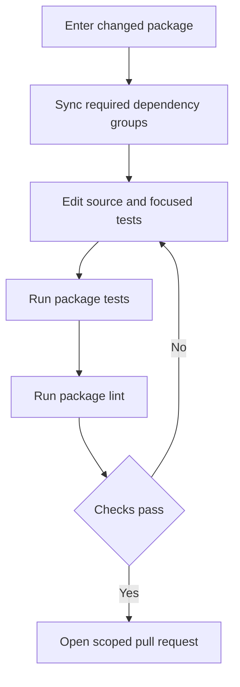
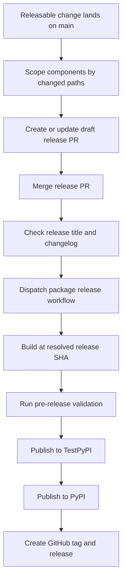

# Development, CI, and Releases

This repository is a monorepo of independently versioned Python packages under `libs/`, not a single root Python project. Work at a package boundary: its `pyproject.toml`, `uv.lock`, and `Makefile` own dependencies and supported commands. Repository-wide locking, CI, and releases deliberately cross those boundaries and add their own safeguards.

For setup, see [Quickstart](../quickstart.md). See [Testing Guide](../testing/testing-guide.md) for test conventions and [Run Evals](../workflows/run-evals.md) for evaluation execution.

## Package-local development

External contributors must link a PR to a maintainer-approved issue or discussion and be assigned to it before opening the PR. Choose the package being changed: every package owns a `pyproject.toml`, `Makefile`, and README, and local sibling dependencies can be editable during development.

Use `uv` for interpreters, environments, and dependencies and `make` for supported tasks. Do not use `pip`, Poetry, or Conda. `uv` provisions an interpreter compatible with the package's `requires-python`; there is no repository-wide Python pin.

Install hooks once, then work in the package directory:

```bash
uv tool install pre-commit
pre-commit install --install-hooks

cd libs/deepagents
uv sync --all-groups
make test
make lint
```

Run `make help` in that directory to find its actual targets. Makefiles are the command authority: targets and arguments are similar across packages, but are not a uniform API. Sync dependencies explicitly with `uv sync`, using `--group <name>` or `--all-groups` as needed; do not create an external environment or mix environments in one session.

| Command | Typical purpose |
| --- | --- |
| `make test` | Run unit tests. In `deepagents`, this is parallel, socket-disabled pytest with coverage. |
| `make integration_test` | Run network-capable integration tests where the package provides the target. |
| `make lint` | Run lint, formatting checks, and the package type check. |
| `make format` | Apply Ruff formatting and safe fixes; review the diff. |
| `make type`, `make coverage`, `make test_watch` | Focused package-specific entrypoints. |

Package Makefiles invoke tools through `uv run`. `deepagents`, for example, exports `UV_FROZEN = true`, so a stale lockfile fails rather than being silently updated.



Caption: the normal edit loop remains package-local until its validation passes.

### Warnings and local CI parity

Unaccepted pytest warnings are errors. Fix actionable warnings instead of broadly suppressing them. Scope an expected warning with `@pytest.mark.filterwarnings` at test level; package-level filters need a categorical or third-party justification, and `default::` is preferable to `ignore::` when continued visibility matters.

`libs/code` provides a stronger local CI-parity entrypoint. `make check` runs lint, import checks, and unit tests, then checks extras synchronization, version equality, and lock freshness. A stale SDK pin is advisory there, but other checker failures are fatal.

## Repository fan-out, hooks, and CI

Run cross-package operations from `libs/`. Its Makefile discovers direct child libraries and `partners/*` directories with a Makefile; locking also includes examples with a `pyproject.toml`. The loops use `set -e`, stopping at the first failure.

| Command | Purpose |
| --- | --- |
| `make lint` / `make format` | Invoke the corresponding target in each discovered library package. |
| `make lock [no-cache]` | Regenerate discovered library and example locks; `no-cache` bypasses the uv cache. |
| `make lock-check` | Verify discovered locks. |
| `make lock-bump DEP=<pkg>` | Re-resolve each discovered lock with `-P <pkg>`; a missing `DEP` is an error. |
| `make bench-all` | Run `bench` for `deepagents` and `code`. |

The fan-out locking policy uses Python 3.14 for ACP and 3.12 elsewhere. This does not replace an individual package's declared supported-Python range or CI matrix.

```bash
make -C libs/code check
make -C libs lock-check
```

The main CI workflow runs for PRs, pushes to `main`, and merge-group events. A change-detection job applies package path filters before package jobs run. PRs test matching packages; pushes run package jobs unconditionally. Editable SDK consumers include `libs/deepagents/**` in their filters, so SDK changes validate them. The quickjs partner additionally runs its prompt smoke test on SDK-only PRs when its full suite would not run. CI workflow or composite-action changes also match package filters to validate infrastructure changes.

GitHub Actions entry workflows have no leading underscore; reusable workflows are named `_*.yml` and called through `workflow_call`. Prefer extending a reusable workflow over duplicating shared setup.

The hook configuration requires pre-commit 3.2.0 or later and installs `pre-commit`, `commit-msg`, and `pre-push` hooks. Package format/lint hooks and lock, extras, and version checks are file-scoped. The pre-push branch check requires `<github-username>/<scope>/<short-description>` for ordinary branches and allows protected, automation, and release branches. It resolves the login from `git config github.user`, then `gh`, then the email local part; configure `github.user` if that is ambiguous. `git push --no-verify` or `SKIP=branch-name git push` bypasses only this local check.

## Dependency and lock validation

Regenerate a package lock whenever project metadata or resolved dependencies change, then run its package checks or `make -C libs lock-check`. For a shared dependency update, use `make -C libs lock-bump DEP=<pkg>` rather than editing locks manually.

Editable local sources prove in-tree integration but can mask an unsatisfiable public dependency graph. On a `release(...)` PR, **Check Release Dependencies** removes local sources and resolves changed package manifests against public indexes with `uv pip compile --no-sources --universal --prerelease allow --all-extras`. The `ci:ack-release-deps` label keeps that resolution and follow-up-release reporting running but changes it to report-only mode; use it only for an intentional coordinated release order, not to conceal incorrect metadata.

## Independently versioned release operations

Release-please manages nine independently versioned Python distributions: `deepagents`, `deepagents-acp`, `deepagents-code`, `deepagents-talon`, `langchain-daytona`, `langchain-modal`, `langchain-runloop`, `langchain-vercel-sandbox`, and `langchain-quickjs`. It creates separate draft release PRs. Each configuration entry declares Python release metadata, a distribution name and component, a changelog path, version-bearing extra files, and test-path exclusions. `skip-github-release` delegates GitHub releases to the publisher workflow.

The manifest records released-version baselines, not source versions, and is not manually advanced for an existing managed package:

| Package path | Baseline |
| --- | --- |
| `libs/deepagents` | `0.7.14` |
| `libs/acp` | `0.0.11` |
| `libs/code` | `0.1.69` |
| `libs/talon` | `0.0.8` |
| `libs/partners/daytona` | `0.0.8` |
| `libs/partners/modal` | `0.0.6` |
| `libs/partners/runloop` | `0.0.7` |
| `libs/partners/vercel` | `0.0.2` |
| `libs/partners/quickjs` | `0.3.7` |

When onboarding a managed package, add both configuration and manifest entries. For an unshipped package whose source begins at `0.0.1`, use a `0.0.0` manifest baseline so its first release is `0.0.1`.

Release attribution follows changed paths, not Conventional Commit scope alone. `feat`, `fix`, `perf`, and `revert` are changelog sections; configured docs, style, chore, refactor, test, CI, and hotfix types are hidden. All managed packages use pre-1.0 behavior: features produce patch bumps and breaking features produce minor bumps. Tags include the component without `v`, for example `deepagents==0.7.14`.



Caption: release-please prepares package PRs, while the publisher releases a selected immutable tree.

A merged `release(<component>): <version>` commit must also change that component's `CHANGELOG.md` before release-please dispatches `release.yml`. The publisher resolves an explicit release SHA and normally rejects it unless that commit's `pyproject.toml` declares the requested version. It builds and tags that SHA, and rejects versions already on PyPI. Its normal dependency order is build, pre-release checks, TestPyPI, PyPI, and GitHub release.

The build job has only read permission and is separated from privileged PyPI publishing and repository-write tagging. Release-notes generation is intentionally fail-open: a notes failure does not stop PyPI publication or tagging, so repair an empty GitHub release body after publication.

Manual dispatch is exceptional. Normal manual publishing requires a 40-character `release-sha`; `dangerous-nonmain-release` may use the dispatch SHA and skips normal version matching. Use that path only for deliberate backports or prerelease branches.

### Fan-out and release-state safeguards

Keep bump-worthy work in one releasable component.

- Never put an empty commit on `main`: with no package path, release-please can fan out to every managed component. `guard-empty-commit` blocks it before release-please. The narrow exception is an empty two-parent `hotfix(repo): ...` merge whose introduced commits all touch files.
- A bump-worthy change that also edits lockfiles or real files in another managed component can create a release PR per touched component. The scope check blocks lockfile-only and multi-component fan-out unless `ci:allow-lockfile-release` acknowledges it; acknowledgment does not prevent those releases.
- Put cross-package dependency or lock churn in a separate `chore(deps):` change. Closing an unintended release PR does not remove its triggering commit from `main`, so revert or otherwise remove the unreleased bump rather than relying on closure.

When a release PR merges, the publisher is dispatched before release-please refreshes other release PRs. The maintenance path waits for every merged PR still carrying `auto:release-pending` (and recognizes the legacy pending label) because the manifest can otherwise advance before the tag exists. It fails closed when GitHub release state is unreadable; a still-running publish times out into a deferred refresh on a later push, while a completed failed pending release needs recovery.

For a failure before PyPI, fix the cause without changing the already-bumped version, manually dispatch the exact hotfix SHA, and verify that the original release PR moves to `auto:release-tagged`. If a version is public, never recreate its tag or retry that version: release a new fix version and consider yanking a harmful release. One version must identify the same artifact and source tree for PyPI, tags, installers, and audit tooling.

## Extending the repository

Adding a partner is a repository-wiring change, not only a directory. Register issue areas and labels, Dependabot, CI detection and jobs, synchronized allowed scopes, release inputs and detection, release-please configuration and manifest, release documentation and notes mapping, dependency-maintenance coverage, and credentials. Sandbox-backed partners additionally require Harbor options and credential checks plus integration-test matrix and secret gating. For the first managed release, set the manifest baseline to `0.0.0`.
