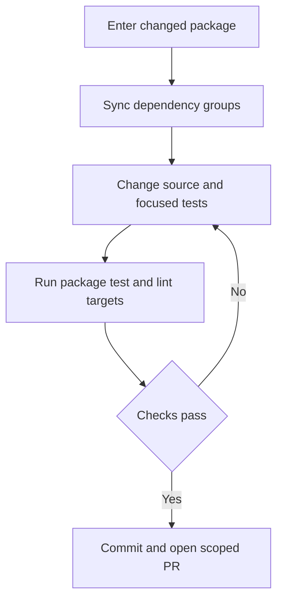
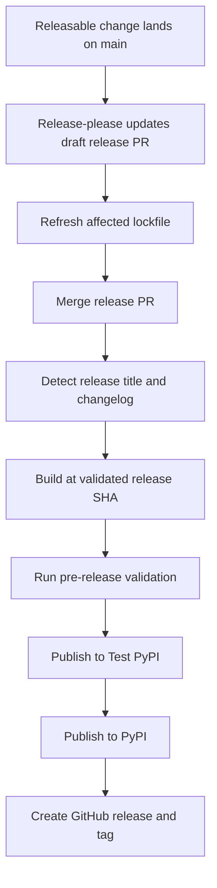
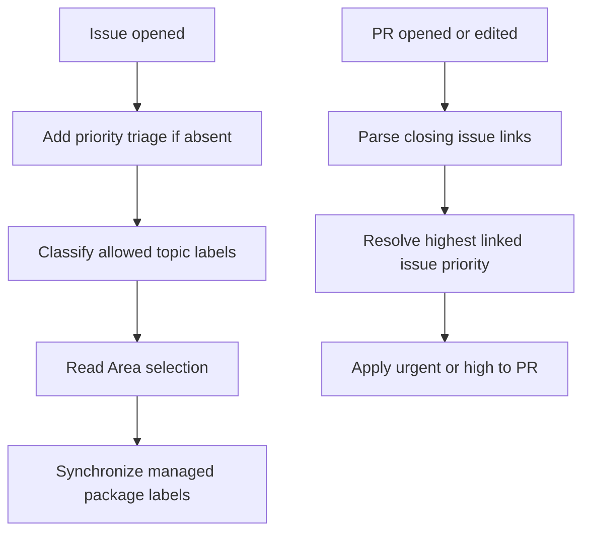

# Development, Dependency, Release, and Labeling Operations

This repository is a monorepo of independently versioned Python packages under `libs/`, rather than one root Python project. Work at a package boundary for ordinary changes; use the aggregate tooling for cross-package lock operations. For package structure and tests, see [Source Map](../architecture/source-map.md) and the [Testing Guide](../testing/testing-guide.md).

## Package-local development loop

External contributors must link their PR to a maintainer-approved issue or discussion and be assigned to it before opening the PR. Each package owns its `pyproject.toml`, `Makefile`, and README; there is no root `pyproject.toml`. The package Makefile is the command authority—run `make help` in the package instead of assuming every package has identical targets.

Use `uv` for interpreters, environments, and dependencies. A package's `requires-python` declares runtime support, rather than a repository-wide Python pin.

```bash
uv tool install pre-commit
pre-commit install --install-hooks

cd libs/deepagents
uv sync --all-groups
make test
make lint
```

`uv sync --all-groups` installs the package and every dependency group. Use a documented narrower group where appropriate, and use `uv run ...` for an exceptional one-off command. Package targets invoke tools through `uv run`; core Makefiles export `UV_FROZEN = true`, so a stale lock fails validation rather than being silently rewritten. Regenerate and commit the owning lock intentionally.


```mermaid
flowchart TD
    Enter["Enter changed package"] --> Sync["Sync dependency groups"]
    Sync --> Change["Change source and focused tests"]
    Change --> Validate["Run package test and lint targets"]
    Validate --> Result{"Checks pass"}
    Result -->|"No"| Change
    Result -->|"Yes"| Review["Commit and open scoped PR"]
```

Caption: the normal package-local loop synchronizes first and validates before review.

Typical package targets include `make test`, `make integration_test`, `make lint`, and `make format`; `make help` remains authoritative. For example, the Deep Agents `test` target runs socket-disabled unit tests in parallel with coverage, while its integration target permits network-capable tests.

### Editable dependencies, hooks, and Code parity

A package may resolve siblings through editable `[tool.uv.sources]` paths. Code does so for deepagents, ACP, and partner distributions, so in-tree source changes are visible to consumers. CI follows that topology: a deepagents change schedules Code, Talon, ACP, and partner checks; Talon also follows Code. Run dependent focused tests after an interface change.

The installed configuration enables `pre-commit`, `commit-msg`, and `pre-push` stages. It checks Conventional Commit types, protects `main`, performs basic file hygiene, runs package-specific format/lint hooks, and checks relevant locks, extras, and version equality. The lock hook checks only touched lock-owning packages/examples—or all of them when supplied no paths—and uses `uv lock --check`. Hooks are early feedback, not a substitute for package checks or CI.

The pre-push branch-name hook expects `<github-username>/<scope>/<short-description>` for ordinary branches. It can be bypassed locally and server-side enforcement is authoritative.

For `libs/code`, `make bootstrap` syncs the `test` group and installs hooks. `make check` is the local CI-parity entrypoint: after lint, import, and unit-test prerequisites, it checks extras synchronization, version equality, and lock freshness. A stale SDK pin is advisory only; other checker failures stop the command. The current `deepagents-code` version is `0.1.79` in its project metadata and `_version.py`, its changelog begins with that release, and its direct SDK pin is `deepagents==0.7.20`.

## Aggregate lock and dependency operations

Run fan-out operations from `libs/`. Its Makefile discovers library/partner packages with Makefiles and example projects with `pyproject.toml` for lock operations; the loops use `set -e`, stopping on the first failure.

| Command | Purpose |
| --- | --- |
| `make lint` / `make format` | Run the corresponding target across library packages. |
| `make lock [no-cache]` | Regenerate library and example locks; `no-cache` adds `--no-cache`. |
| `make lock-check` | Verify every discovered lock is current. |
| `make lock-bump DEP=<pkg>` | Re-resolve every discovered lock with `-P <pkg>`; `DEP` is required. |
| `make bench-all` | Run `bench` for deepagents and Code. |

Aggregate lock resolution uses Python 3.14 for ACP and Python 3.12 for every other package or example. That is a lock reproducibility policy, not the support floor: ACP supports `>=3.11`, Deep Agents `>=3.11,<4.0`, Code `>=3.12,<4.0`, and Talon `>=3.12`. When manifests or resolved dependencies change, regenerate the owner lock instead of editing `uv.lock` by hand; use `make -C libs lock-bump DEP=<pkg>` for a shared upgrade and commit every resulting lock.

The daily/manual dependency-minimums workflow raises compatible stable lower bounds for selected release-package manifests, regenerates locks, and opens or refreshes a PR. It changes eligible externally resolved LangChain-ecosystem `>=` or `~=` floors, preserving constraints and skipping exact pins. Failure to look up PyPI or validate a narrowed request is a failure, not an “up to date” result. After changing a manifest, it computes the transitive reverse closure of local path-source consumers so dependent locks are also regenerated under the repository interpreter policy.

## Independent versions and releases

Release-please manages nine independently versioned Python distributions—`deepagents`, `deepagents-acp`, `deepagents-code`, `deepagents-talon`, and five partner packages—with separate pull requests. Each managed package declares its Python release type, distribution/component names, changelog, extra version files, and excluded test paths.

The release manifest records the last-released baseline, not an ordinary development input:

| Manifest path | Baseline |
| --- | --- |
| `libs/deepagents` | `0.7.20` |
| `libs/acp` | `0.0.12` |
| `libs/code` | `0.1.79` |
| `libs/talon` | `0.0.8` |
| `libs/partners/daytona` | `0.0.8` |
| `libs/partners/modal` | `0.0.6` |
| `libs/partners/runloop` | `0.0.7` |
| `libs/partners/vercel` | `0.0.2` |
| `libs/partners/quickjs` | `0.3.8` |

Do not treat a manifest baseline as a standalone version change. Release-please updates release metadata; it does not regenerate `uv.lock`, so its `update-lockfiles` job refreshes locks on a release PR.


```mermaid
flowchart TD
    Main["Releasable change lands on main"] --> ReleasePR["Release-please updates draft release PR"]
    ReleasePR --> Lock["Refresh affected lockfile"]
    Lock --> Merge["Merge release PR"]
    Merge --> Detect["Detect release title and changelog"]
    Detect --> Build["Build at validated release SHA"]
    Build --> Checks["Run pre-release validation"]
    Checks --> TestPyPI["Publish to Test PyPI"]
    TestPyPI --> PyPI["Publish to PyPI"]
    PyPI --> Tag["Create GitHub release and tag"]
```

Caption: release-please prepares an independent release; publishing validates and releases one resolved source tree.

Component attribution comes from changed paths rather than Conventional Commit scope. Keep a bump-worthy PR within one managed component. An empty commit has no component path and could fan out to all packages, so the release workflow blocks it before release-please runs. After a release PR merge, the title and package changelog change trigger publishing. The publisher resolves a release SHA, verifies the requested package version at that SHA, builds there, and uses that SHA for the tag. It fails closed when PyPI already contains the version, is unreachable, or responds unexpectedly. The build job has minimal permissions and is isolated from the privileged publish/GitHub-release job.

## Labeling and routing operations

The label taxonomy is operational metadata, not a replacement for release conventions: PR type labels mirror a Conventional Commit title, but release-please still determines release behavior from commits. The model is `type:*` plus normally one `package:*`, optional `topic:*`/`integration:*`, provenance (`org:*`), optional priority, one PR size, and temporary `triage:*`, `auto:*`, or `ci:*` state. Every label needs a description.

### Package, type, topic, and size labels

`pr-labeler-config.json` is the shared mapping authority. It maps title scopes and changed path prefixes to additive `package:*` or `integration:*` labels; aliases normalize the Deep Agents family scopes. It also maps recognized Conventional Commit types to managed `type:*` labels and adds `type:breaking` for a `!` immediately before `:`. A recognized title edit replaces stale managed type labels; package and integration labels are additive, so title edits do not remove them. A `release(...)` title receives `auto:release-pr`.

Path-based `topic:*` rules are also additive and apply to PRs for the modules actually touched (for example middleware/subagents, backends/sandbox, or MCP modules). Issues additionally receive model-classified topics only when opened. The classifier filters output through the local topic manifest and adds labels without removing prior topics, allowing a maintainer removal to persist through later issue edits.

PR size labels are mutually exclusive: `size: XS` below 50 changed lines, `S` below 200, `M` below 500, `L` below 1000, and `XL` otherwise. `uv.lock` and `docs/` do not count toward size.

### Issue intake and priority propagation

On every newly opened issue, the issue workflow first adds `priority:triage` unless a priority already exists. It classifies issue topics on opening, then reads the form’s `Area` section on opening and editing to synchronize managed package/integration labels. Only labels represented by the Area mapping are removed when a selection changes; hand-applied unrelated labels remain intact.


```mermaid
flowchart TD
    Issue["Issue opened"] --> Triage["Add priority triage if absent"]
    Triage --> Topics["Classify allowed topic labels"]
    Topics --> Area["Read Area selection"]
    Area --> Sync["Synchronize managed package labels"]
    PR["PR opened or edited"] --> Links["Parse closing issue links"]
    Links --> Resolve["Resolve highest linked issue priority"]
    Resolve --> Apply["Apply urgent or high to PR"]
```

Caption: issue intake owns default triage and Area synchronization, while linked issue priority drives PR escalation.

Priority sync parses `Closes`, `Fixes`, or `Resolves #N` links. Across linked issues, `priority:urgent` outranks `priority:high`, which outranks `priority:backlog`; only urgent and high propagate to a PR. Triage and backlog leave a PR with no priority label, and the synchronizer strips obsolete `p0`–`p4` labels instead of mapping them. It reacts both to PR opening/editing and relevant issue label changes, and has a bounded manual backfill. Per-item concurrency allows independent issue events to race, but each recalculates the complete desired state, so last writer converges.

### Safely changing label automation

Treat `.github/LABELS.md` as the taxonomy contract and the config as mapping authority. For a new package, update scope/path maps, the PR title-scope validation, and the issue form Area option and workflow mapping together so issues and PRs receive the same identity. New labels created by the PR labeler are created on demand using configured descriptions and prefix colors. Workflows that only read labels—especially most `ci:*` overrides—require the repository label to exist already.

Do not add another PR label writer casually: the documented convention centralizes PR label changes in `pr_labeler.yml` to avoid races. Workflows needing downstream label-triggered automation use a GitHub App token because events created by the default `GITHUB_TOKEN` do not trigger subsequent workflows. `sync_priority_labels.yml` deliberately uses `pull_request_target` without checking out or executing PR-head code; preserve that boundary when modifying it.
