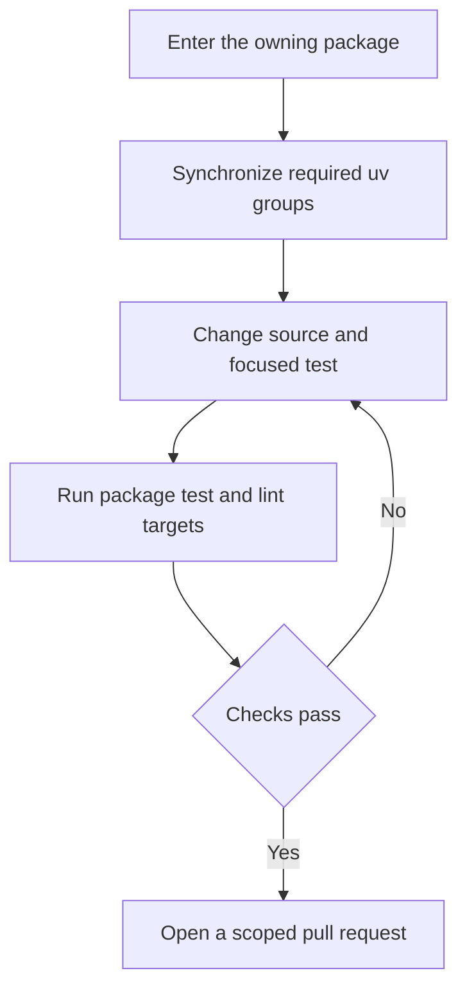
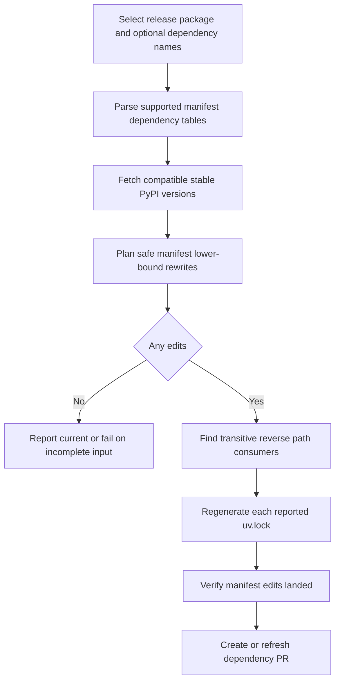
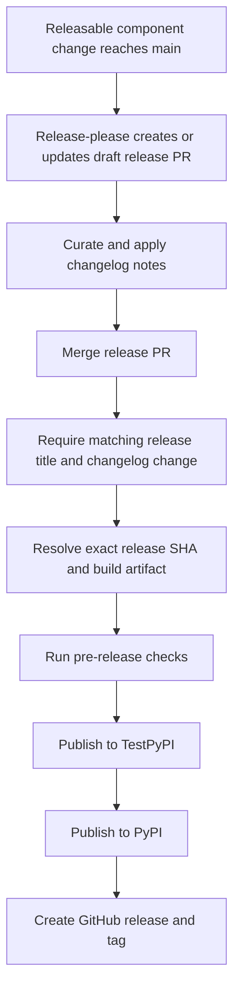

# Development, Dependencies, and Releases

This repository is a monorepo of independently versioned distributions under `libs/`, not a single root Python project. Work in the package that owns the change: its `pyproject.toml` defines Python compatibility and dependencies, and its `Makefile` is the command authority. Start with `make help`. See the [architecture overview](../architecture/overview.md), [sandbox partners](../integrations/sandbox-partners.md), [quickstart](../quickstart.md), and [Testing Guide](../testing/testing-guide.md) for adjacent concerns.

## Package-local development

Use `uv` for interpreters, environments, and dependencies; do not substitute `pip`, Poetry, or Conda. Install hooks once, then synchronize and validate the affected package. `uv` provisions the selected interpreter, so there is no repository-wide Python installation or range to impose.

```bash
uv tool install pre-commit
pre-commit install --install-hooks

cd libs/deepagents
uv sync --all-groups
make test
make lint
```

`uv sync --all-groups` installs the package and all declared dependency groups. Prefer package Make targets for normal work and `uv run ...` for direct exceptional commands. The Deep Agents and Code Makefiles set `UV_FROZEN = true`: an operation that would silently rewrite a stale lock instead fails, requiring an intentional lock update.


```mermaid
flowchart TD
    Work["Enter the owning package"] --> Sync["Synchronize required uv groups"]
    Sync --> Change["Change source and focused test"]
    Change --> Check["Run package test and lint targets"]
    Check --> Result{"Checks pass"}
    Result -->|"No"| Change
    Result -->|"Yes"| Review["Open a scoped pull request"]
```

*The local loop makes package manifest and lock state explicit before validation.*

### Common package targets

The target set varies, so run `make help` in the package. In `libs/deepagents` and `libs/code`, `make test` uses the `test` group and parallel pytest, disables non-Unix sockets while allowing Unix sockets, disables benchmarks, and reports coverage; set `TEST_FILE` to focus it. `make integration_test` selects `tests/integration_tests/` with a 30-second timeout. `make lint` verifies Ruff formatting, runs Ruff checks, and invokes `ty`; `make format` applies Ruff formatting and safe fixes.

Code has additional local CI-parity gates:

- `make bootstrap` synchronizes its `test` group and installs hooks.
- `make check` runs lint, import checks, and tests; then it checks extras synchronization, `pyproject.toml`/`_version.py` equality, and `uv.lock` freshness. Its SDK-pin check is advisory only when it exits `1`; another checker failure stops the target.
- `make commands-catalog` regenerates `COMMANDS.md`; `make commands-catalog-check` detects drift. Do not hand-edit that generated catalog.

External contributors must link an approved issue or discussion and be assigned before opening a PR.

## Dependency floors and lockfile closure

Each package owns its own compatibility range. In particular, ACP and QuickJS support Python 3.11+, while Code and Talon require Python 3.12+; Deep Agents supports Python 3.11 through the pre-4.0 range. These are package runtime contracts, not the resolver versions used for the aggregate lock job. Current representative package-local floors include:

| Package | Important current dependency constraints |
| --- | --- |
| `libs/deepagents` | `langchain>=1.4.4,<2.0.0`, `langchain-core>=1.6.7,<2.0.0`, `langsmith>=0.14.4` |
| `libs/code` | exact `deepagents==0.7.23`; LangChain and LangGraph components retain package-local lower and upper bounds |
| `libs/acp` | local editable `deepagents`, plus `agent-client-protocol>=0.10.1` |
| `libs/talon` | `deepagents>=0.7.0`, `deepagents-code>=0.1.71,<1.0.0`, LangChain/LangGraph floors |
| `libs/partners/quickjs` | `deepagents>=0.7.0,<0.8.0`, `langchain>=1.4.3,<2.0.0`, `langgraph>=1.2.14,<2.0.0` |

Local consumers use editable `[tool.uv.sources]` paths. For example, Code resolves Deep Agents, ACP, and partner integrations from sibling directories, so source changes can be consumed without publishing a distribution. That also makes producer-manifest changes cross-package lock concerns: a consumer lock embeds requirements resolved through its local path.

Regenerate the changed manifest owner's lock and every reverse path-dependent consumer lock; never edit `uv.lock` by hand. The aggregate resolver deliberately uses Python 3.14 for ACP and Python 3.12 for all other discovered library and example locks. This resolver policy does not change a package's `requires-python` contract.

From `libs/`, the aggregate Makefile discovers library/partner Makefiles and example manifests. Its fan-out recipes use `set -e`, so the first failure stops the operation.

| Command | Purpose |
| --- | --- |
| `make lint` / `make format` | Invoke that target across discovered library packages. |
| `make lock [no-cache]` | Resolve all discovered library and example locks; `no-cache` adds `--no-cache`. |
| `make lock-check` | Run `uv lock --check` for each discovered owner. |
| `make lock-bump DEP=<pkg>` | Re-resolve every discovered lock with `-P <pkg>`; `DEP` is required. |
| `make bench-all` | Run `bench` for Deep Agents and Code. |

## Automated dependency minimums

`raise_langchain_minimums.yml` runs daily at 09:00 UTC and can be dispatched for one release component or `all`. An optional comma-separated `dependencies` input narrows a run to exact normalized PyPI names. The workflow invokes `raise_langchain_minimums.py`, regenerates every reported `directory=Python` lock specification, verifies the reported manifest edits actually changed the tree, and creates or refreshes a generated dependency PR only when edits occurred.

The script scans project dependencies, optional dependencies, and dependency groups. By default it considers PyPI-resolved names with the prefixes `langchain`, `langgraph`, `langsmith`, or `deepagents`; a narrowed request replaces that prefix selection. It raises only `>=` and `~=` floors to the newest stable release with a non-yanked file that remains within the existing range. It preserves upper bounds, extras, and markers, leaves `==` pins alone, and never lowers a floor already ahead of the latest stable release.


```mermaid
flowchart TD
    Select["Select release package and optional dependency names"] --> Scope["Parse supported manifest dependency tables"]
    Scope --> Fetch["Fetch compatible stable PyPI versions"]
    Fetch --> Plan["Plan safe manifest lower-bound rewrites"]
    Plan --> Changed{"Any edits"}
    Changed -->|"No"| Done["Report current or fail on incomplete input"]
    Changed -->|"Yes"| Closure["Find transitive reverse path consumers"]
    Closure --> Lock["Regenerate each reported uv.lock"]
    Lock --> Verify["Verify manifest edits landed"]
    Verify --> PR["Create or refresh dependency PR"]
```

*The automation treats manifest rewrites and the complete path-consumer lockfile closure as one change set.*

Failure is deliberately fail-closed. PyPI lookup failures, malformed rewrites, an empty broad scope, and missing or unraiseable narrowed names fail rather than produce a misleading “up to date” result. The script plans manifest replacements before writing them, anchors replacements to quoted requirement literals, and checks that a new compatible-release spelling did not tighten the old range. Focused tests cover compatible and upper-bound behavior, preservation of extras and markers, exact pins, anchored replacement, dependency-group discovery, and transitive stale-lock discovery.

The normal lock set is a transitive reverse closure of `[tool.uv.sources]` consumers because each consumer's lock embeds its producer requirements. `--skip-dependent-locks` intentionally reports only directly changed package locks and leaves reverse consumers stale; use it only with an explicit follow-up plan.

## Release baselines and release-please

Release-please manages nine separately drafted Python release PRs. Configuration supplies each distribution name, component, changelog location, source metadata and `_version.py` extra version files, pre-1.0 bump behavior, and test-path exclusions. PR titles use `release(${component}): ${version}`. `skip-github-release` delegates publication and GitHub release creation to `release.yml`.

The release-please manifest records last-release state, not a development version input. Current baselines are:

| Manifest path | Baseline |
| --- | --- |
| `libs/deepagents` | `0.7.23` |
| `libs/acp` | `0.0.12` |
| `libs/code` | `0.1.83` |
| `libs/talon` | `0.0.9` |
| `libs/partners/daytona` | `0.0.8` |
| `libs/partners/modal` | `0.0.6` |
| `libs/partners/runloop` | `0.0.7` |
| `libs/partners/vercel` | `0.0.2` |
| `libs/partners/quickjs` | `0.3.8` |

When adding a managed package, update both `release-please-config.json` and `.release-please-manifest.json`. For an unreleased first source version `0.0.1`, use a `0.0.0` manifest baseline; a `0.0.1` baseline means that version was already released and would make the first release PR target `0.0.2`.

Code illustrates the version invariant: `deepagents-code` is `0.1.83` in project metadata and its annotated version marker, its changelog starts at that release, and it has the exact `deepagents==0.7.23` SDK pin. That pin is intentionally outside the lower-floor updater; after a successful Deep Agents publication, `release.yml` dispatches the separate Code SDK-pin workflow as a non-blocking convenience.

Release attribution is path-based. Keep bump-worthy work scoped to one managed component: a changed dependent lock may fan out to other components, while a pathless commit can fan out to every package. The release-please workflow rejects ordinary empty commits before release-please runs; its narrowly defined repository-hotfix merge exception still requires every merged second-parent commit to touch files. After a release PR merge, a publish dispatch requires both the matching `release(component): version` title and that component's `CHANGELOG.md` change.

## Curated notes and publication lifecycle

Keep a release PR draft while changes accumulate. The curated-notes gate applies only to trusted, open release-please branches targeting `main`; it derives the allowed component and changelog path from `release-please-config.json`, and rejects a title that disagrees with the branch component. Non-release PRs do not need curated notes.

When ready, review the bot-authored draft and comment `@release-bot apply`. The gate and apply path use the current release PR head; comment and manual refreshes create a native check on that head. An always-run finalizer converts an interrupted in-progress refresh check to failure so a required check cannot remain pending indefinitely.


```mermaid
flowchart TD
    Main["Releasable component change reaches main"] --> Draft["Release-please creates or updates draft release PR"]
    Draft --> Notes["Curate and apply changelog notes"]
    Notes --> Merge["Merge release PR"]
    Merge --> Detect["Require matching release title and changelog change"]
    Detect --> Build["Resolve exact release SHA and build artifact"]
    Build --> Validate["Run pre-release checks"]
    Validate --> Test["Publish to TestPyPI"]
    Test --> Publish["Publish to PyPI"]
    Publish --> Tag["Create GitHub release and tag"]
```

*Release-please prepares component-specific state; `release.yml` validates and publishes the resolved source tree.*

The release workflow maps a package to its working directory, resolves an exact commit SHA, and, for ordinary releases, verifies that the target tree's `pyproject.toml` version equals the requested version. It builds from that same tree, refuses an already-published version, and fails closed if PyPI cannot be consulted reliably. Pre-release checks and TestPyPI publishing precede PyPI publishing. Build jobs have read-only repository permissions; the publishing jobs receive PyPI trusted-publishing `id-token: write`, separating build-time dependencies from publish authority.

Release-note generation is intentionally non-blocking: publishing and GitHub release creation can complete with an empty release body if it fails. The GitHub release tags the same resolved SHA and updates the merged release PR from the pending label to the tagged label; that transition lets later release-please runs avoid calculating against half-published state.

If a release fails before PyPI publication, use the documented hotfix path and manually dispatch the preserved version from an explicit hotfix SHA. Once a version is on PyPI, do not reuse it or move its tag; ship a new patch release instead.
