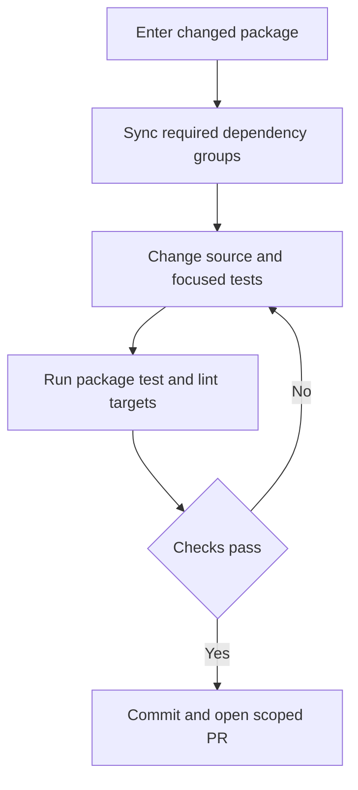
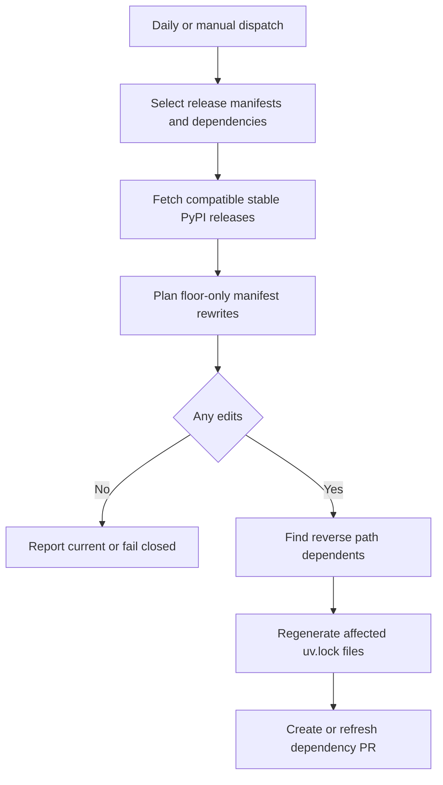
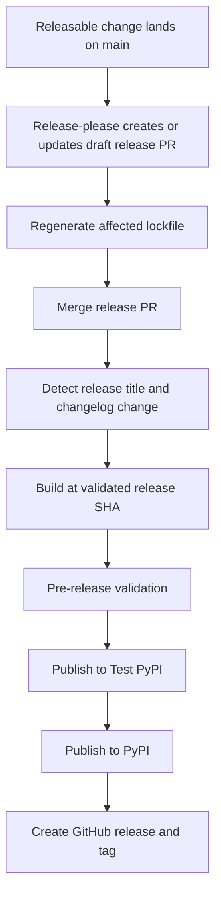

# Development, Dependency, and Release Operations

This repository is a monorepo of independently versioned Python packages under `libs/`, rather than one root Python project. Work at the package boundary for normal changes; use aggregate tooling for cross-package locks and dependency maintenance. For package structure, sandbox packages, tests, and evaluations, see [Source Map](../architecture/source-map.md), [Sandbox Partners](../integrations/sandbox-partners.md), [Testing Guide](../testing/testing-guide.md), and [Run Evaluations](../workflows/run-evals.md).

## Package-local development loop

External contributors must link their PR to a maintainer-approved issue or discussion and be assigned to it before opening the PR. Every package owns its `pyproject.toml`, `Makefile`, and README; there is no root `pyproject.toml`. The package Makefile is the command authority—run `make help` in the package rather than assuming all packages implement the same targets.

Use `uv` for interpreters, environments, and dependencies. `uv` chooses an interpreter compatible with the package's `requires-python`; runtime support therefore belongs to each package rather than to a repository-wide Python pin.

Install hooks once, then enter the package being changed:

```bash
uv tool install pre-commit
pre-commit install --install-hooks

cd libs/deepagents
uv sync --all-groups
make test
make lint
```

`uv sync --all-groups` installs the package and all dependency groups. A narrower `uv sync --group <name>` is appropriate when the package documents it; use `uv run ...` for one-off commands. Keep the environment and commands scoped to the package under change.


```mermaid
flowchart TD
    Enter["Enter changed package"] --> Sync["Sync required dependency groups"]
    Sync --> Change["Change source and focused tests"]
    Change --> Validate["Run package test and lint targets"]
    Validate --> Result{"Checks pass"}
    Result -->|"No"| Change
    Result -->|"Yes"| Review["Commit and open scoped PR"]
```

Caption: package-local synchronization and validation precede review.

Typical targets vary by package:

| Command | Purpose |
| --- | --- |
| `make test` | Run unit tests. Core package targets use socket-disabled pytest, often in parallel with coverage. |
| `make integration_test` | Run network-capable integration tests when the package supplies this target. |
| `make lint` | Check Ruff formatting/linting and type checking. |
| `make format` | Apply formatting and safe lint fixes. |
| `make type`, `make coverage`, `make test_watch` | Run a focused check when the package offers it. |

Package targets run their tools through `uv run`. Core package Makefiles export `UV_FROZEN = true`, so a stale lockfile causes validation to fail instead of being rewritten implicitly. Regenerate the owning lock intentionally and commit it.

### Editable local dependencies and CI fan-out

A package can resolve a sibling through `[tool.uv.sources]` with `path` and `editable = true`. For example, Code resolves `deepagents`, ACP, and the partner integrations from sibling paths. That makes source changes visible to a dependent package during local development, even where its published requirement specifies a PyPI version range or exact pin.

This topology also drives CI selection: a change under `libs/deepagents` schedules tests for packages that editable-install it. In particular, Code, Talon, ACP, and the partner packages include the SDK path in their CI filters; Talon also follows Code. Run a dependent package's focused tests when changing a sibling interface rather than relying only on the producer's unit suite.

### Hooks are early feedback, not the merge gate

The installed configuration enables `pre-commit`, `commit-msg`, and `pre-push` stages. It validates Conventional Commit types, blocks direct commits to `main`, checks YAML/TOML and file hygiene, and runs package-specific format/lint hooks for changed deepagents, Code, evals, and ACP paths. Other local hooks check relevant locks, dependency extras, and version equality for the SDK and Code packages.

The lock hook checks only lock-owning package or example directories touched by its supplied paths, or every such directory when it receives no paths. It runs `uv lock --check` under the designated lock interpreter. Hooks can be bypassed; they do not replace package checks or CI.

The pre-push branch-name hook checks ordinary branches against `<github-username>/<scope>/<short-description>` and can resolve the username from `github.user`, GitHub CLI, or the local part of `user.email`. It is explicitly bypassable locally; server-side validation remains authoritative.

### Code package CI parity

For `libs/code`, `make bootstrap` syncs the `test` group and installs hooks. `make check` is the local CI-parity entrypoint: after linting, import checks, and unit tests, it checks extras synchronization, `pyproject.toml`/`_version.py` equality, and lock freshness. A stale SDK pin is advisory only; any other checker failure stops the command.

The current `deepagents-code` source version is `0.1.78` in project metadata and `deepagents_code/_version.py`, and its changelog begins with that release. Its direct SDK requirement remains `deepagents==0.7.19`; a Code change that requires a newer SDK must update the pin, regenerate `libs/code/uv.lock`, and pass `make check`.

## Aggregate locks and interpreter policy

Run fan-out operations from `libs/`. Its Makefile discovers library and partner directories with Makefiles, and example projects with `pyproject.toml` for lock operations. The loops use `set -e`, so they stop at the first failed package.

| Command | Purpose |
| --- | --- |
| `make lint` / `make format` | Run the corresponding target in each discovered library package. |
| `make lock [no-cache]` | Regenerate library and example locks; `no-cache` adds `--no-cache`. |
| `make lock-check` | Verify all discovered locks are current. |
| `make lock-bump DEP=<pkg>` | Re-resolve every discovered lock with `-P <pkg>`; `DEP` is required. |
| `make bench-all` | Run `bench` for `deepagents` and `code`. |

Aggregate lock resolution uses Python 3.14 for ACP and Python 3.12 for every other package or example. This is a reproducibility policy for locks, not a package support floor: ACP declares `>=3.11`, Talon `>=3.12`, deepagents `>=3.11,<4.0`, and Code `>=3.12,<4.0`. Consult the package's `requires-python` for runtime compatibility.

When metadata or resolved dependencies change, regenerate the owning lock rather than hand-editing it. For a shared dependency upgrade, run `make -C libs lock-bump DEP=<pkg>` and commit every resulting lock. `lock-check` finds repository-wide drift.

## Automated lower-bound maintenance

The scheduled **Raise dependency minimums** workflow runs daily at 09:00 UTC, and can be manually dispatched for one release component or `all`. Its script examines project dependencies, optional dependencies, and dependency groups in release-managed manifests. By default it considers externally resolved names beginning `langchain`, `langgraph`, `langsmith`, or `deepagents`; a manual `dependencies` CSV replaces that prefix scope with an exact, PEP 503-normalized name list.

For each `>=` or `~=` floor, the job queries PyPI and selects the newest stable version with a non-yanked file that still satisfies the existing range. It preserves upper bounds, extras, and markers, never lowers a floor already ahead of stable PyPI, and deliberately leaves exact `==` pins untouched. A narrow request fails rather than succeeding silently if a requested dependency is absent, workspace-local, or has no raiseable floor. PyPI and manifest-rewrite failures are likewise failures, not “up to date.”


```mermaid
flowchart TD
    Schedule["Daily or manual dispatch"] --> Scope["Select release manifests and dependencies"]
    Scope --> PyPI["Fetch compatible stable PyPI releases"]
    PyPI --> Plan["Plan floor-only manifest rewrites"]
    Plan --> Changed{"Any edits"}
    Changed -->|"No"| Done["Report current or fail closed"]
    Changed -->|"Yes"| Closure["Find reverse path dependents"]
    Closure --> Locks["Regenerate affected uv.lock files"]
    Locks --> PR["Create or refresh dependency PR"]
```

Caption: dependency-floor automation changes manifests only after compatible planning, then refreshes every lock invalidated by local path dependencies.

The workflow computes a transitive reverse-dependent lock closure: a lock embeds requirements from local `[tool.uv.sources]` packages, so changing a producer manifest can stale the locks of packages that consume it. It regenerates each selected lock with the same interpreter policy used by the lock checker. An optional `skip_dependent_locks` dispatch switch intentionally omits that closure and leaves dependent locks stale; use it only as a deliberate recovery choice.

When changes exist, the workflow opens or refreshes an idempotent `chore(deps):` PR for the selected package/dependency set. It uses a GitHub App installation token rather than `GITHUB_TOKEN` so normal pull-request workflows run, verifies each claimed manifest changed on disk, and writes a summary of raised and unraised dependencies. If an unattended run fails, it creates or updates one marked tracking issue rather than silently stopping daily maintenance.

## Independent versions and releases

Release-please manages nine independently versioned Python distributions: `deepagents`, `deepagents-acp`, `deepagents-code`, `deepagents-talon`, `langchain-daytona`, `langchain-modal`, `langchain-runloop`, `langchain-vercel-sandbox`, and `langchain-quickjs`. `separate-pull-requests` is enabled. Each managed path configures the Python release type, distribution and component names, changelog, extra version files, and excluded test paths.

The release manifest is the last-released baseline, not necessarily a future editable source version:

| Manifest path | Baseline |
| --- | --- |
| `libs/deepagents` | `0.7.19` |
| `libs/acp` | `0.0.12` |
| `libs/code` | `0.1.78` |
| `libs/talon` | `0.0.8` |
| `libs/partners/daytona` | `0.0.8` |
| `libs/partners/modal` | `0.0.6` |
| `libs/partners/runloop` | `0.0.7` |
| `libs/partners/vercel` | `0.0.2` |
| `libs/partners/quickjs` | `0.3.7` |

Do not advance manifest values during ordinary development. For a new release-managed package beginning at `0.0.1` that has never shipped, register a `0.0.0` manifest baseline; otherwise release-please treats `0.0.1` as already released and proposes `0.0.2`. Release-please updates version metadata but does not regenerate `uv.lock`; its `update-lockfiles` job refreshes locks on release PRs.


```mermaid
flowchart TD
    Main["Releasable change lands on main"] --> ReleasePR["Release-please creates or updates draft release PR"]
    ReleasePR --> Lock["Regenerate affected lockfile"]
    Lock --> Merge["Merge release PR"]
    Merge --> Detect["Detect release title and changelog change"]
    Detect --> Build["Build at validated release SHA"]
    Build --> Checks["Pre-release validation"]
    Checks --> TestPyPI["Publish to Test PyPI"]
    TestPyPI --> PyPI["Publish to PyPI"]
    PyPI --> Tag["Create GitHub release and tag"]
```

Caption: release-please prepares independent package releases; the publisher validates and publishes the same resolved release tree.

Component attribution is based on changed file paths, not Conventional Commit scope alone. Keep bump-worthy changes limited to one managed component. Because an empty commit has no path and could otherwise fan out across managed packages, the release workflow rejects it before release-please runs.

After a release PR merges, release-please requires both a matching `release(<component>): <version>` title and the package changelog change before dispatching the release workflow. The publisher resolves an explicit release SHA and, on the normal path, verifies that the package metadata at that SHA declares the requested version. It builds from that resolved SHA; published artifacts and the GitHub tag thus identify the same tree.

The build checks PyPI before publication, failing if the version already exists or if PyPI is unreachable or returns an unexpected status. Publication proceeds through build, pre-release validation, TestPyPI, PyPI, and GitHub release/tag. The minimally permitted build job is isolated from trusted publishing and repository-write credentials used later in the process.
