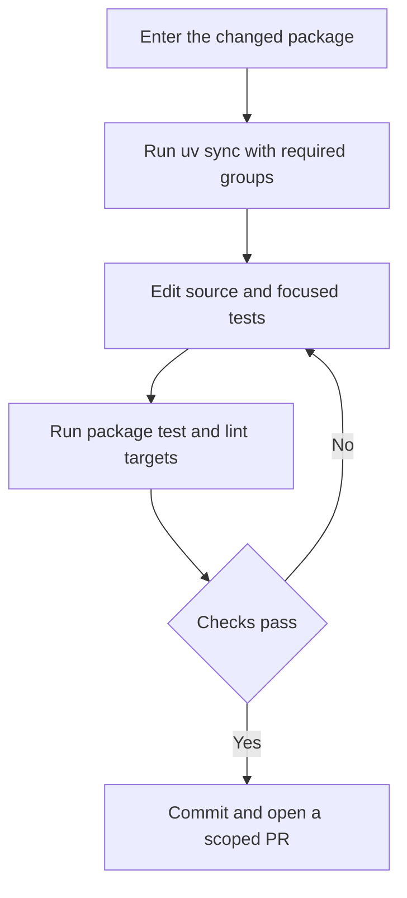
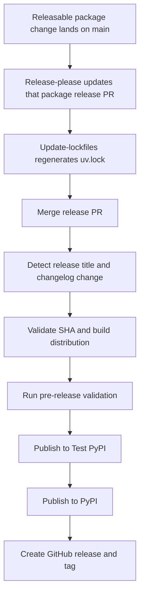

# Development, Packaging, and Releases

This repository is a monorepo of independently versioned Python distributions under `libs/`, not a single root Python project. Work in the package that owns the change; use the aggregate tools only when an operation must span packages. For package topology and test conventions, see the [Source Map](../architecture/source-map.md) and [Testing Guide](../testing/testing-guide.md).

## Package-local development

Each package owns its `pyproject.toml`, `Makefile`, and README, and there is no root `pyproject.toml`. Its Makefile is the command authority, so start with `make help` rather than assuming every package offers the same targets. External contributors must link a PR to a maintainer-approved issue or discussion and be assigned to it before opening the PR.

Use `uv` for interpreters, environments, and dependencies; do not substitute `pip`, Poetry, or Conda. The package’s `requires-python` field, rather than a repository-wide pin, defines its supported runtime range.

```bash
uv tool install pre-commit
pre-commit install --install-hooks

cd libs/deepagents
uv sync --all-groups
make test
make lint
```

`uv sync --all-groups` installs the package and all of its dependency groups. For normal work, use package Make targets; reserve `uv run ...` for exceptional direct commands. Core package Makefiles export `UV_FROZEN = true`, making a stale lockfile fail instead of silently rewriting it.


```mermaid
flowchart TD
    Enter["Enter the changed package"] --> Sync["Run uv sync with required groups"]
    Sync --> Change["Edit source and focused tests"]
    Change --> Verify["Run package test and lint targets"]
    Verify --> Pass{"Checks pass"}
    Pass -->|"No"| Change
    Pass -->|"Yes"| Review["Commit and open a scoped PR"]
```

Caption: the standard local loop synchronizes the package before validating the changed behavior.

### Tests, lint, and local gates

`make test` is the normal unit-test entrypoint. In Deep Agents and Code it runs the test dependency group, disables sockets except Unix sockets, runs in parallel with `-n auto`, and reports coverage. `make integration_test` targets the integration-test directory and permits network-capable tests. `make lint` runs Ruff checks, verifies formatting, and runs `ty`; `make format` applies Ruff formatting and safe fixes. Use `TEST_FILE=...` where a package Makefile supports focused execution.

The Code package adds two useful local entrypoints:

- `make bootstrap` syncs its `test` group and installs repository hooks.
- `make check` runs linting, import checks, and unit tests, then verifies extras synchronization, project/version-marker equality, and lock freshness. Its SDK-pin checker treats only exit status `1` (a stale SDK pin) as advisory; other failures stop the command.

The installed hook configuration covers commit messages, pre-commit checks, and pre-push. It validates Conventional Commit types, prevents direct commits to `main`, applies basic file hygiene, formats/lints relevant packages, and checks relevant lockfiles, extras, and version markers. The lock hook checks just the touched lock-owning package/example directories, or all such directories when no paths are supplied. The pre-push branch-name hook expects `<github-username>/<scope>/<short-description>` for ordinary branches; it is bypassable locally, while server-side checks remain authoritative.

## Editable package relationships

Sibling dependencies are deliberately resolved from editable paths. For example, Code maps `deepagents`, `deepagents-acp`, and Daytona, Modal, QuickJS, Runloop, and Vercel partner distributions to local paths in `[tool.uv.sources]`. Therefore a local source edit is consumed by Code without publishing an artifact.

Treat a change to a shared interface as a dependent-package change as well. CI path filters schedule Code, Talon, ACP, and partner checks for a `libs/deepagents` change; Talon also runs when Code changes. Run the affected consumer’s focused tests before relying on a green producer-only check.

## Lockfiles and compatibility policy

A `uv.lock` belongs to its package or example. Regenerate it after changing that owner’s manifest or its resolved dependencies; do not edit it by hand. Package Makefile commands run frozen so a mismatch is surfaced locally. Release-please changes package version metadata but does not regenerate locks, so its release-PR workflow explicitly regenerates affected locks.

From `libs/`, the aggregate Makefile discovers library/partner packages with Makefiles and examples with `pyproject.toml`. Its fan-out loops use `set -e`, so they stop at the first failure.

| Command | Purpose |
| --- | --- |
| `make lint` / `make format` | Run the corresponding target across library packages. |
| `make lock [no-cache]` | Resolve all discovered library and example locks; `no-cache` passes `--no-cache`. |
| `make lock-check` | Verify all discovered locks with `uv lock --check`. |
| `make lock-bump DEP=<pkg>` | Re-resolve every discovered lock with `-P <pkg>`; `DEP` is required. |
| `make bench-all` | Run the `bench` target for Deep Agents and Code. |

The lock interpreter is a reproducibility policy: ACP locks with Python 3.14, while other package and example locks use Python 3.12. It is not a runtime-support floor. Currently, ACP declares `>=3.11`; Deep Agents declares `>=3.11,<4.0`; Code declares `>=3.12,<4.0`; and Talon declares `>=3.12`. Confirm the target package’s `requires-python` before changing code or widening a dependency range.

### Automated lower-bound maintenance

The daily, manually dispatchable dependency-minimums workflow can raise stable lower bounds in release-package manifests, regenerate affected locks, and open or refresh its PR. It considers LangChain-ecosystem requirements with `>=` or `~=` floors, preserves upper bounds, extras, and markers, and skips exact pins. A failed PyPI lookup, manifest rewrite, or invalid narrowed request fails the run rather than presenting an incomplete result as current.

Because a local path consumer’s lock embeds the producer requirements, changing a manifest can stale dependent locks. The raiser computes the transitive reverse closure of `[tool.uv.sources]` consumers and locks both the changed package and its dependents using the same interpreter policy as the lock checker. Its `skip_dependent_locks` option intentionally leaves those dependent locks stale and should be used only when that consequence is understood.

## Versions and releases

Release-please manages nine independently versioned Python distributions with separate draft release PRs: Deep Agents, ACP, Code, Talon, and the Daytona, Modal, Runloop, Vercel, and QuickJS partners. Each configuration entry identifies a Python release type, distribution and component name, changelog, extra version files, and excluded test paths. The configuration also delegates GitHub-release creation to the separate publisher workflow.

The release manifest records last-released baselines, not ordinary development inputs:

| Manifest path | Baseline |
| --- | --- |
| `libs/deepagents` | `0.7.21` |
| `libs/acp` | `0.0.12` |
| `libs/code` | `0.1.79` |
| `libs/talon` | `0.0.8` |
| `libs/partners/daytona` | `0.0.8` |
| `libs/partners/modal` | `0.0.6` |
| `libs/partners/runloop` | `0.0.7` |
| `libs/partners/vercel` | `0.0.2` |
| `libs/partners/quickjs` | `0.3.8` |

Code currently declares `deepagents-code` version `0.1.79` and requires the exact local SDK version `deepagents==0.7.21`. Change these coordinated version relationships only through their package and release process.


```mermaid
flowchart TD
    Land["Releasable package change lands on main"] --> ReleasePR["Release-please updates that package release PR"]
    ReleasePR --> Lock["Update-lockfiles regenerates uv.lock"]
    Lock --> Merge["Merge release PR"]
    Merge --> Detect["Detect release title and changelog change"]
    Detect --> Build["Validate SHA and build distribution"]
    Build --> Validate["Run pre-release validation"]
    Validate --> TestPyPI["Publish to Test PyPI"]
    TestPyPI --> PyPI["Publish to PyPI"]
    PyPI --> GitHub["Create GitHub release and tag"]
```

Caption: release-please prepares a component-specific release, while the publisher validates and publishes one resolved source tree.

Component attribution is based on changed file paths, not Conventional Commit scope alone. Keep a bump-worthy PR to one managed component. An empty commit has no paths and could otherwise fan out into releases for every managed package; the release workflow blocks it before release-please runs. Lockfile churn can similarly attribute a bump-worthy commit to dependent packages, so isolate shared dependency/lock updates in a `chore(deps):` change when appropriate.

After a release PR merge, the workflow requires both a matching `release(<component>): <version>` title and that component’s `CHANGELOG.md` change before dispatching publishing. The publisher resolves the requested release SHA and, for normal releases, rejects it unless that tree’s `pyproject.toml` declares the requested version. It builds from that SHA and tags the same SHA, maintaining artifact/tag tree identity. It also refuses to publish a version already on PyPI and fails closed on unreachable or unexpected PyPI responses.

The build job has only read-level repository permission and is deliberately isolated from the later publishing/GitHub-release job, which needs trusted-publishing and repository-write authority. This separation keeps build-time code and dependencies away from publishing credentials.
