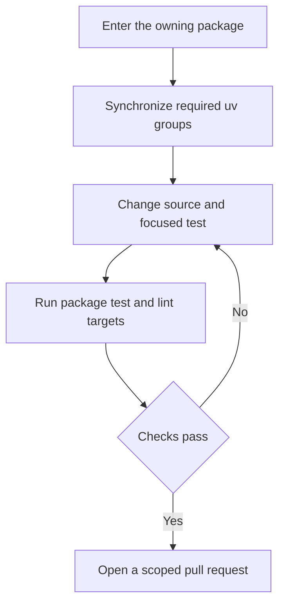
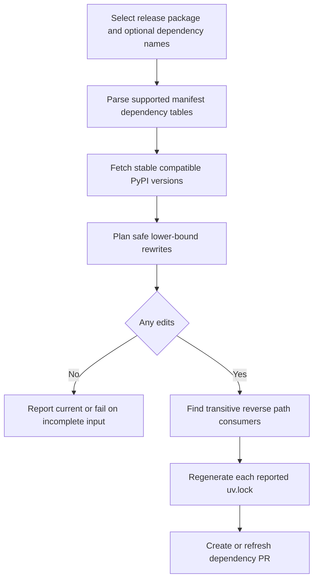
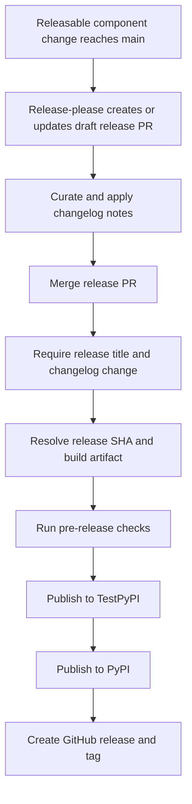

# Development, Dependencies, and Releases

This is a monorepo of independently versioned distributions under `libs/`, not one root Python project. Work from the directory of the package that owns the change: that package's `pyproject.toml` defines its Python support and dependencies, and its `Makefile` is the command authority. Start with `make help`. For ownership routing, see the [Source Map](../architecture/source-map.md); for behavior-level test design, see the [Testing Guide](../testing/testing-guide.md).

## Package-local loop

Use `uv` for interpreters, environments, and dependencies; the repository development guide explicitly says not to substitute `pip`, Poetry, or Conda. Install hooks once, then synchronize and validate the affected package. `uv` provisions the selected interpreter, so do not impose a repository-wide Python install or range.

```bash
uv tool install pre-commit
pre-commit install --install-hooks

cd libs/deepagents
uv sync --all-groups
make test
make lint
```

`uv sync --all-groups` installs the package and all of its declared dependency groups. Prefer the package Make targets for normal work and `uv run ...` for direct, exceptional commands. The Deep Agents and Code Makefiles export `UV_FROZEN = true`: operations that would silently rewrite a stale lock instead fail, requiring a deliberate lock update.


```mermaid
flowchart TD
    Work["Enter the owning package"] --> Sync["Synchronize required uv groups"]
    Sync --> Change["Change source and focused test"]
    Change --> Check["Run package test and lint targets"]
    Check --> Result{"Checks pass"}
    Result -->|"No"| Change
    Result -->|"Yes"| Review["Open a scoped pull request"]
```

*The local loop makes the package manifest and lock state explicit before validation.*

### Common package targets

The exact target set varies, so use `make help` in the target package. In both `libs/deepagents` and `libs/code`, `make test` uses the `test` group, parallel pytest, disables non-Unix sockets, disables benchmarks, and reports coverage; set `TEST_FILE` to a focused path. `make integration_test` selects `tests/integration_tests/` and has a 30-second timeout. `make lint` runs Ruff checks, formatting verification, and `ty`; `make format` applies Ruff formatting and safe fixes.

Code adds useful CI-parity targets:

- `make bootstrap` synchronizes its `test` group and installs hooks.
- `make check` runs lint, import checks, and tests, then verifies extras synchronization, `pyproject.toml`/`_version.py` equality, and lock freshness. Its SDK-pin check is advisory only for exit status `1`; any other checker failure stops the target.
- `make commands-catalog` regenerates `COMMANDS.md`, while `make commands-catalog-check` detects drift. Do not hand-edit the generated catalog.

External contributors must link an approved issue or discussion and be assigned before opening a PR. Hooks and CI complement, rather than replace, the package checks.

## Sibling dependencies and lockfiles

Local consumers use editable `[tool.uv.sources]` paths. For example, Code resolves `deepagents`, ACP, and its partner integrations from sibling directories, so local source edits are consumed without first publishing packages. This is convenient but makes a producer manifest change a cross-package lock concern: a consumer's `uv.lock` embeds requirements resolved through the local path.

Regenerate the lock owned by a changed manifest and every reverse path-dependent consumer. Do not edit `uv.lock` by hand. The lock check uses a deliberate resolver interpreter policy: ACP uses Python 3.14; other library and example packages use Python 3.12. That resolution choice is not the package runtime-support floor—read the package's `requires-python` before changing compatibility or dependencies.

From `libs/`, the aggregate Makefile discovers library/partner directories with Makefiles and examples with `pyproject.toml`; its fan-out recipes use `set -e` and stop on the first failure.

| Command | Purpose |
| --- | --- |
| `make lint` / `make format` | Invoke that target across discovered library packages. |
| `make lock [no-cache]` | Resolve all discovered package and example locks; `no-cache` adds `--no-cache`. |
| `make lock-check` | Run `uv lock --check` for each discovered owner. |
| `make lock-bump DEP=<pkg>` | Re-resolve every discovered lock with `-P <pkg>`; `DEP` is required. |
| `make bench-all` | Run `bench` for Deep Agents and Code. |

The pull-request lockfile workflow delegates changed-path selection and validation to `check_lockfiles_pre_commit.py`. Keep manifest and lock edits together so CI does not defer a stale lock failure to a later unrelated change.

## Automated dependency floors

`raise_langchain_minimums.yml` runs daily at 09:00 UTC and can be dispatched for one release component or `all`; an optional comma-separated `dependencies` input narrows a run to exact PyPI names. It invokes `raise_langchain_minimums.py`, then regenerates each lock reported by the script and opens or refreshes an idempotent dependency PR.

The script considers PyPI-resolved names beginning `langchain`, `langgraph`, `langsmith`, or `deepagents` in project dependencies, optional dependencies, and dependency groups. It raises only `>=` or `~=` floors to the latest compatible stable, non-yanked release. It preserves upper bounds, extras, and markers; does not lower a floor already ahead of PyPI; and leaves exact `==` pins alone. A narrow request fails if a requested dependency is absent, workspace-resolved, or has no raiseable floor, preventing a typo or no-op from reporting a successful targeted update.


```mermaid
flowchart TD
    Select["Select release package and optional dependency names"] --> Scope["Parse supported manifest dependency tables"]
    Scope --> Fetch["Fetch stable compatible PyPI versions"]
    Fetch --> Plan["Plan safe lower-bound rewrites"]
    Plan --> Changed{"Any edits"}
    Changed -->|"No"| Done["Report current or fail on incomplete input"]
    Changed -->|"Yes"| Closure["Find transitive reverse path consumers"]
    Closure --> Lock["Regenerate each reported uv.lock"]
    Lock --> PR["Create or refresh dependency PR"]
```

*The updater treats dependency rewrites and the resulting path-consumer locks as one change set.*

The failure policy is intentionally fail-closed. PyPI lookup failures, malformed rewrites, empty broad scope, or partial narrow requests produce failure instead of an “up to date” result. Before writing, it plans all replacements; it also verifies a rewritten range has not narrowed the prior upper-bound behavior. The focused tests cover upper and compatible-release bounds, marker/extra preservation, exact pins, anchored replacement, narrowing failure modes, and transitive stale-lock discovery. `--skip-dependent-locks` deliberately omits reverse consumers and leaves their locks stale; use it only with an explicit follow-up plan.

## Versions, changelogs, and release-please

Release-please manages separate draft release PRs for nine Python components. The configuration declares each component's distribution name, Python release type, changelog location, package metadata and `_version.py` marker as extra version files, and test-path exclusions. It uses separate PRs, pre-1.0 bump rules, title format `release(${component}): ${version}`, and `skip-github-release`; publishing is owned by the separate release workflow.

The manifest is release state—the last released baseline—not a normal development version input. Its current baselines are:

| Manifest path | Baseline |
| --- | --- |
| `libs/deepagents` | `0.7.23` |
| `libs/acp` | `0.0.12` |
| `libs/code` | `0.1.83` |
| `libs/talon` | `0.0.9` |
| `libs/partners/daytona` | `0.0.8` |
| `libs/partners/modal` | `0.0.6` |
| `libs/partners/runloop` | `0.0.7` |
| `libs/partners/vercel` | `0.0.2` |
| `libs/partners/quickjs` | `0.3.8` |

When adding a managed package, add it to both `release-please-config.json` and `.release-please-manifest.json`. For a first unreleased source version `0.0.1`, use a manifest baseline of `0.0.0`; a `0.0.1` baseline says that version was already released and causes the first release PR to target `0.0.2`.

Current Code version state illustrates the invariant: `deepagents-code` is `0.1.83` in project metadata and the annotated `_version.py` marker, the changelog begins with that release, and its exact SDK requirement is `deepagents==0.7.23`. Update the pin deliberately when Code needs newly released SDK behavior; it is intentionally outside the automated lower-floor raiser.

### Notes gate and publishing lifecycle

Keep a release PR as draft while changes accumulate. When it is ready, mark it ready for review; the release bot drafts curated notes. Review the bot-authored draft and comment `@release-bot apply` to update the package `CHANGELOG.md` and mirror notes to the PR body. The `curated release notes` required check applies only to release-please branches; non-release PRs pass without the gate. Refresh runs validate the current release head and explicitly finalize an in-progress check as failure if cancelled or timed out, rather than leaving a required check hanging.


```mermaid
flowchart TD
    Main["Releasable component change reaches main"] --> Draft["Release-please creates or updates draft release PR"]
    Draft --> Notes["Curate and apply changelog notes"]
    Notes --> Merge["Merge release PR"]
    Merge --> Detect["Require release title and changelog change"]
    Detect --> Build["Resolve release SHA and build artifact"]
    Build --> Validate["Run pre-release checks"]
    Validate --> Test["Publish to TestPyPI"]
    Test --> Publish["Publish to PyPI"]
    Publish --> Tag["Create GitHub release and tag"]
```

*Release-please prepares component-specific state; `release.yml` validates and publishes the resolved source tree.*

Release attribution depends on changed paths, not Conventional Commit scope alone. Keep bump-worthy work to one managed component: a changed dependent lock can fan out to other components, while an empty commit has no path and could fan out to every component. The release-please workflow blocks ordinary empty commits before invoking release-please.

After a release PR merge, dispatch occurs only when the commit title matches `release(<component>): <version>` **and** that component's `CHANGELOG.md` changed. The release workflow resolves an exact SHA, validates that its `pyproject.toml` declares the requested version for normal releases, builds from that tree, and tags the same tree. It refuses to publish a version already on PyPI and fails closed if the PyPI existence check cannot be trusted. Build jobs remain read-only, while publishing uses PyPI trusted publishing (`id-token: write`); this separates untrusted build-time dependencies from publish authority. Release-note generation is deliberately non-blocking, so a notes failure may yield an otherwise published release with an empty body.

If a release fails before PyPI publication, use the documented hotfix path and manually dispatch the preserved version from its explicit hotfix SHA. Once a version is on PyPI, never reuse it or move the tag; ship a new patch release instead. Related operational flows: [run evaluations](../workflows/run-evals.md) and the [quickstart](../quickstart.md).
