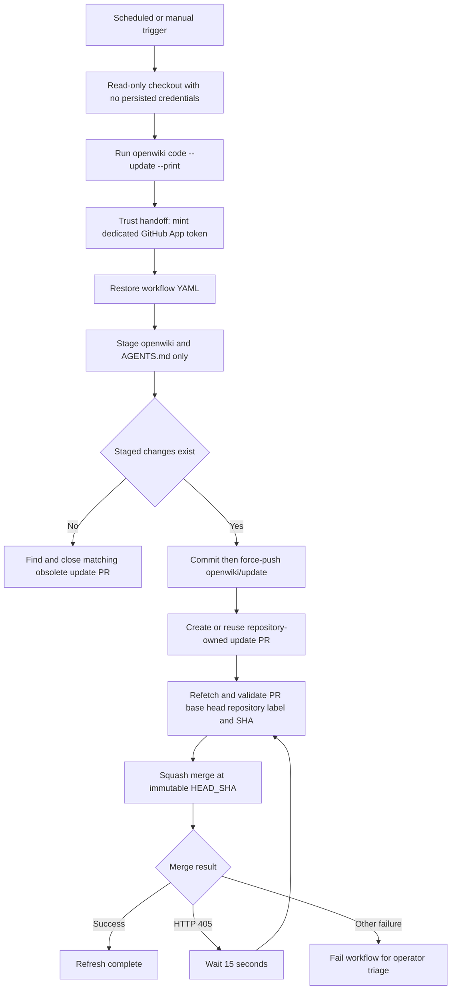

# OpenWiki Update Automation Runbook

The **OpenWiki Update** workflow is the repository-owned refresh path for the generated `openwiki/` documentation and its OpenWiki section in `AGENTS.md`. It runs daily at `0 8 * * *` and can also be started with `workflow_dispatch`. The workflow deliberately separates uncredentialed checkout and generation from repository mutation: it first runs `openwiki code --update --print`, then mints a dedicated GitHub App token only for the pull-request and merge work.

This runbook covers the automation boundary rather than how to author product documentation. For repository structure and contributor rules, see [Source Map](/openwiki/architecture/source-map.md), [Development, CI, and Releases](/openwiki/operations/development.md), [Security Boundaries and Secrets](/openwiki/operations/security.md), [Quickstart](/openwiki/quickstart.md), and the [Testing Guide](/openwiki/testing/testing-guide.md).

## Lifecycle and trust handoff

The flow shows the credential handoff and the generate-to-PR-to-merge lifecycle. The App token is not available to checkout or OpenWiki generation.

## Entrypoint, generation, and mutation boundary

The single `update` job uses the `openwiki` GitHub environment, while the workflow-level `GITHUB_TOKEN` permission is only `contents: read`. Checkout fetches full history but sets `persist-credentials: false`. Node.js is set up, `openwiki@0.4.2` is installed globally, and the generator runs before any App token is created.

Generation receives its model-provider settings only in the **Run OpenWiki** step. The later App-token step uses the dedicated App client variable and private-key secret, scopes the installation token to the current owner and repository, and requests only contents and pull-request write permissions. The generated token becomes `GH_TOKEN` only in the create-PR and merge steps.

GitHub environment configuration is external to the repository: selecting `environment: openwiki` does not demonstrate that environment secrets, protection rules, branch policy, or App installation permissions are actually configured. Treat the workflow YAML and its contract tests as the behavioral authority. In particular, reconcile the workflow's current environment-variable references with the intended-secret inventory in `.github/SECRETS.md` before changing configuration; do not infer or document credential values.

## Controlled staging and PR reconciliation

Before evaluating changes, the workflow restores `.github/workflows/openwiki-update.yml`. It then stages **only** `openwiki` and `AGENTS.md`; this intentionally allows OpenWiki to stage those paths and prevents its own workflow YAML or any other working-tree changes from being committed by this job.

When the index is unchanged, there is nothing to publish. The workflow locates an open PR by the `openwiki/update` head label and additionally requires that the PR head repository is the current repository. If found, it closes that numbered PR and deletes its branch because it now proposes obsolete documentation.

When content is staged, the workflow commits `docs(repo): update OpenWiki`, records that commit as `head_sha`, recreates `openwiki/update` at that commit, and force-pushes the branch. It finds the same repository-owned open PR or creates one targeting `main`; an existing PR is updated by the push rather than duplicated. The PR number and immutable commit SHA flow into the merge step.

### Operator checks for a surprising PR

1. Confirm the run was started from the scheduled or manual entrypoint and inspect the generator output before considering generated content legitimate.
2. Verify that the branch is `openwiki/update`, the base is `main`, and the head belongs to the current repository. A matching label alone is not sufficient for the workflow's lookup or merge checks.
3. Inspect the staged/committed scope. The automation's permitted generated paths are `openwiki` and `AGENTS.md`; the workflow YAML is restored before staging.
4. If the generated result equals the base, expect the workflow to close the obsolete matching PR. Do not reopen it merely to retain stale generated content.

## Merge guard and retry semantics

The merge step runs only when the create-PR step supplied a PR number. It first rejects malformed inputs, then, **on every attempt**, fetches the PR and validates all of the following before calling the merge API:

- base branch is `main`;
- head label is `<repository-owner>:openwiki/update`;
- head repository is the current repository;
- head SHA exactly equals the recorded 40-character `HEAD_SHA`;
- PR is open and is not reported as having merge conflicts.

It requests a squash merge using that exact SHA. This pins the merge to the commit that was created and pushed by the current run; any changed PR identity or head causes failure rather than merging an unexpected revision.

A retry is deliberately narrow: only an HTTP `405` response is retried, and each retry refetches and revalidates the expected base, head repository/label, and immutable SHA. The job makes at most 60 merge attempts, waiting 15 seconds after the first 59 `405` responses. Authentication/authorization, conflict, transport, malformed-success, and other HTTP failures are terminal. A successful HTTP response is not enough: its JSON must explicitly report `merged == true`.

### Failure triage and recovery

| Symptom | What the workflow establishes | Operator recovery |
| --- | --- | --- |
| No PR and a successful run | No allowed generated changes were staged; any matching repository-owned open update PR is closed as obsolete. | Check the generation log and base content. No manual PR is required unless source or generation configuration should have produced a different result. |
| PR merge retries then times out | Each attempted merge saw HTTP `405`; the job retried only within the bounded budget. | Inspect the PR's current merge requirements and status checks, then rerun the workflow after they are satisfied. Confirm the PR still has the expected base, repository-owned head label, and recorded SHA; a changed head must be regenerated/reconciled, not force-merged. |
| Immediate merge failure | Inputs, PR identity/state, mergeability, API response, or transport did not meet the fail-closed checks; non-405 responses are not retried. | Read the job output and inspect the PR/API condition. Resolve the concrete condition, then rerun rather than broadening retries or removing identity/SHA checks. |
| Token or provider failure | Generation and repository mutation use separate credentials and happen on opposite sides of the token-minting step. | Determine whether the failure is in the generation step or the later App-token/`gh` steps. Verify the external `openwiki` environment and the intended inventory against current workflow references without exposing credential material. |
| Unexpected file change | The workflow restores its own YAML and stages only `openwiki` and `AGENTS.md`. | Treat a change outside those staged paths as outside this publication path; investigate the runner/worktree rather than expanding `git add`. |

Do not convert a failed merge into an unpinned merge, retry arbitrary failures, or relax the expected PR repository, label, base, or SHA checks. Those constraints are the safety boundary for a force-pushed automation branch.

## Safely changing the automation

`openwiki-update.yml` is both the implementation and the operational contract. Keep the ordering boundary intact: uncredentialed checkout and generation first, dedicated token minting second, and mutation last. Changes to generated scope must be reviewed as an authority change, because the staging allowlist determines which files automation may publish. Changes to PR discovery or merge logic must preserve repository ownership checks and SHA pinning.

The workflow tests are focused executable contracts:

- `test_workflow_secret_scoping.py` statically verifies read-only default permissions, the `openwiki` environment, non-persistent checkout credentials, delayed token creation, the dedicated token inputs, and token injection only into the mutation steps.
- `test_openwiki_workflow.py` executes the merge shell with stubbed `gh`, `sleep`, and `jq` interactions. It covers SHA-pinned squash merges, CRLF response handling, the 405-only retry loop and budget, identity/state/input rejection, head changes between attempts, terminal HTTP/transport failures, and the required `merged == true` confirmation.

Run the focused workflow-contract tests after changing the workflow or its merge semantics, and review the resulting YAML as carefully as the shell logic. The tests require POSIX `bash` and `jq`, and skip on Windows or when either executable is unavailable.
