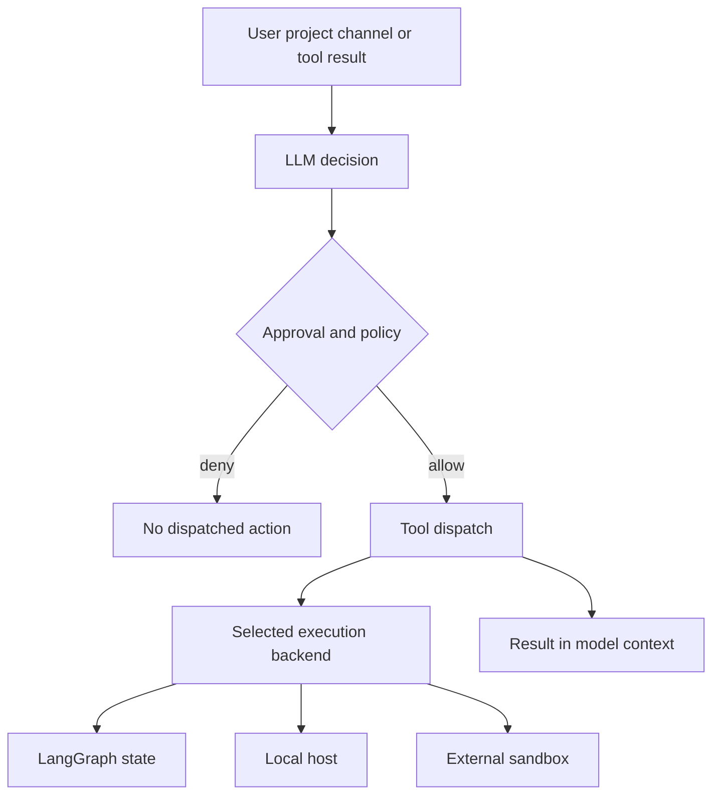
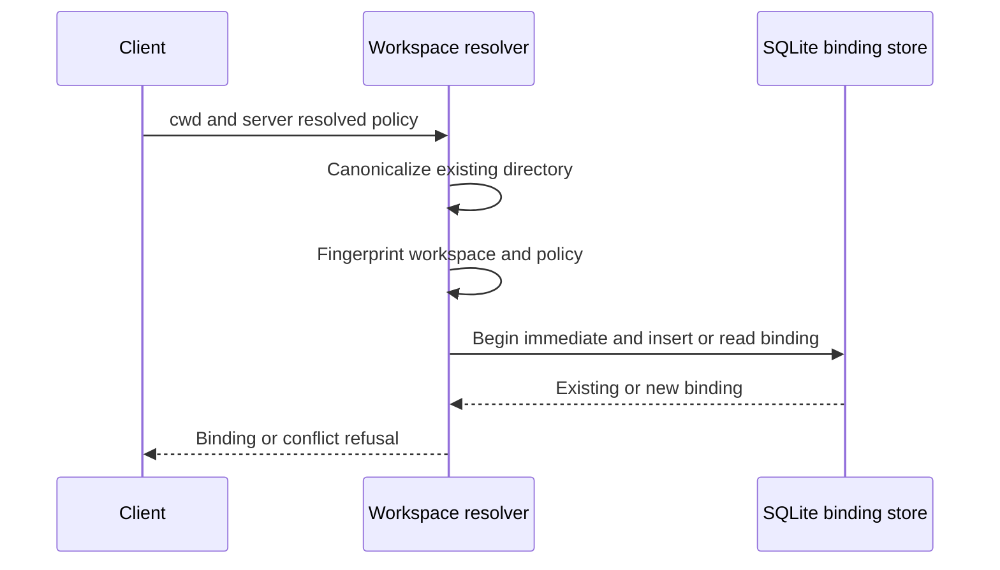

# Security Boundaries and Runbook

## Start with the actual boundary

The SDK and dcode use a **trust the LLM; enforce at tools and execution** posture. LLM behavior, jailbreak resistance, and model selection are outside their threat-model scope; tool results—including web content, MCP responses, and shell output—return to the model without prompt-injection scanning. Treat both model-directed arguments and returned content as untrusted. Put authority limits at approval, tool exposure, execution-backend, operating-system, and deployment boundaries—not in a prompt, a redacted view, or a warning.

The SDK compiles a LangGraph `CompiledStateGraph`; it does not host a service. The deployer therefore owns network exposure, authentication, TLS, process identity, checkpoint/store protection, application tools, and backends. The repository threat models are generated, experimental material rather than authoritative security assessments; validate them for the deployed version.

Related: [code agent architecture](../architecture/code-agent.md), [configuration layering](../concepts/config-layering.md), [permissions and HITL](../concepts/permissions-hitl.md), [state persistence](../concepts/state-persistence.md), [MCP](../integrations/mcp.md), [sandbox partners](../integrations/sandbox-partners.md), and [Talon](../integrations/talon.md).

This shows the authority path: approval can prevent dispatch, while the backend determines where an allowed action runs. No arrow implies that the model or result content is safe.

## SDK: deployment and execution containment

The SDK supplies no OS-level process isolation. For untrusted workloads, implement `BaseSandbox` or use container/VM isolation; sandbox backends are the containment boundary. dcode treats its supported sandbox services as trusted third parties and requires explicit `--sandbox` opt-in, so assess each provider's tenant isolation, identity, network, retention, and incident controls separately.

`StateBackend` is the default and keeps files in ephemeral LangGraph state. It is not a host shell. In contrast, `LocalShellBackend` uses unrestricted `subprocess.run(shell=True)` and has host access regardless of `virtual_mode`. `FilesystemBackend(virtual_mode=True)` restricts filesystem-tool path resolution only; it does not isolate execution. Choose the backend before enabling tools, and test the exact route that provides `execute`.

LLM calls re-enter framework execution at the framework/agent-code boundary. `SubAgentMiddleware` and `AsyncSubAgentMiddleware` validate `subagent_type`, but task descriptions and other tool arguments remain model-generated. Provider API credentials are read from process environment and are not written to disk or logged by framework code; that is not containment, because `LocalShellBackend(inherit_env=True)` exposes environment variables to shell commands.

### Filesystem rules are tool policy, not host confidentiality

`FilesystemPermission` rules apply ordered `allow`, `deny`, or `interrupt` decisions to filesystem-tool reads and writes. Patterns must be absolute and may not contain `..` or `~`; `interrupt` delegates to `HumanInTheLoopMiddleware`. Recursive delete handling is conservative where a deny pattern might cover the target or a descendant.

Do not describe these rules as a universal filesystem or secret boundary. The middleware rejects unscoped permissions with execution-capable backends because execute-tool permissions are not implemented. A shell command can still read an accessible absolute path. Use a separate UID, an OS keyring inaccessible to the agent process, or a sandbox when confidentiality matters.

## dcode: trusted workspace and local server

By default, dcode trusts the directory in which it runs, and project artifacts are read before an approval prompt. Do not run it in an untrusted checkout without a sandbox backend. Treat project prompts, skills, `AGENTS.md`, `.env` files, MCP definitions, hooks, and extensions as inputs capable of shaping agent behavior.

Both TUI and non-interactive runs start an ephemeral local `langgraph dev` subprocess over HTTP+SSE. It binds `127.0.0.1` and uses `LANGGRAPH_AUTH_TYPE=noop`. A local process that discovers the port can submit requests, read thread state, or inject messages. Loopback binding and host-process isolation—not server authentication—are the protection. Run dcode under a dedicated low-privilege account and do not treat a shared host as a trusted loopback environment.

The launcher copies the parent environment, strips selected cloud-auth and process-startup variables, and pins its own profile and carrier values. It removes `PYTHONPATH` from server interpreter startup but deliberately carries the launch value for later approval-gated agent execution. Provider credentials can therefore still reach the local server and child work. Keep secrets out of prompts, project files, and tool output, which may enter history or checkpoints.

### Project execution trust and approvals

HITL gates dcode side-effecting tools including `execute`, `write_file`, `edit_file`, `web_search`, `fetch_url`, `task`, and compaction/async-subagent work. Non-interactive mode uses a shell allow-list. `auto_approve` bypasses prompts, although Unicode and URL warnings still display. Warnings for bidi/invisible Unicode or suspicious URLs are review aids, not sanitization or prompt-injection defenses.

Project MCP servers and hooks require workspace trust or explicit opt-in before they may create subprocesses or network connections. Hook trust is keyed to a canonical project root. A session grant is bound to hook-file content and is re-evaluated after a working-directory change; headless policy ignores persisted trust and needs an explicit grant.

Extensions require `DEEPAGENTS_CODE_EXPERIMENTAL=1`. A project extension is arbitrary Python and loads only after project trust or `--trust-project-extensions`; tools that replace built-ins are not automatically included in dcode's approval map. A sandboxed agent rejects direct `FilesystemBackend` and `LocalShellBackend` extension routes, including subclasses, but does not recursively inspect arbitrary composite/custom wrappers. Wrapper authors own that isolation contract.

Managed `managed_config.toml` has highest precedence and fails closed for enforced settings. Its path, ownership, and permissions remain an administrator/OS concern. `DEEPAGENTS_HOME` is captured before dotenv loading and denied from dotenv layers so a project dotenv cannot relocate the trust root. Conversely, `class_path` imports a module before checking it is a `BaseChatModel`, so its top-level code executes; dotenv denylists for startup-hook keys such as `BASH_ENV` and `ENV` reduce known hazards but are not a complete containment mechanism.

### Immutable thread workspace policy

For server-hosted work, dcode validates and canonicalizes an existing absolute workspace directory, derives a workspace identity and policy fingerprint, then transactionally binds them to a thread. A later different workspace or conflicting policy is refused; the runtime context must agree with the durable binding. Older binding rows can migrate only after identity and applicable recorded policy checks. This prevents one thread from silently switching to another workspace or project-scoped execution policy; it is not access control against another process that can alter the database or host filesystem.

This is the first-bind and re-use flow; the stored binding, rather than a later client claim, is authoritative for the thread.

### MCP configuration and OAuth credentials

dcode resolves `${VAR}` and `${VAR:-default}` in MCP `command`, `url`, `args`, `env`, and `headers` from the active environment. It rejects malformed braced references and fails if a required variable is unset. This is configuration expansion, not secret mediation: resolved credentials may be passed to a command or remote server.

`FileTokenStorage` stores OAuth credentials under the profile's MCP-token directory. It restricts server-name path components, creates a `0600` temporary file, uses atomic replacement, serializes read-modify-write refreshes, and attempts `0700` directories and a `0600` final file. Failed permission hardening generates warnings. On a shared host, treat those warnings as secret-exposure events rather than evidence of a reliable boundary.

## Talon: operator authority, not a production boundary

Talon is experimental alpha software and is not intended for production or enterprise use. It explicitly lacks production-grade complete HITL policy, channel administrator controls, sandbox-backed execution isolation, and multi-tenant boundaries. Channel access should be treated as direct access to the operator's agent, model credentials, MCP tools, and local host resources.

Its default is a local `LocalShellBackend` with `virtual_mode=False`. Talon disables inherited environment and builds a filtered child environment with a fixed safe `PATH`, omitting secret-marked, tracing, and known environment-hijack keys. This reduces accidental environment exposure; it does not isolate execution. Talon creates namespaced assistant homes/state directories at `0700`, default files at `0600`, and rejects state paths resolving outside the assistant home. Those are file-hygiene protections, not a multi-user security model.

The WhatsApp bridge is loopback-only. Inbound exposure defaults to `self`; use `allowlist` with chat or mention controls for narrower delegation. `open` permits arbitrary senders only with both `DEEPAGENTS_TALON_WHATSAPP_EXPOSURE=open` and `DEEPAGENTS_TALON_WHATSAPP_OPEN_ACK=allow-arbitrary-senders`, and grants those senders the operator's effective authority. Do not expose an operator workstation through `open`.

### Talon MCP configuration is mediated change, not secrecy

On POSIX, `MCPConfigStore` provides `get_mcp_configuration` and `update_mcp_server` for a selected regular non-symlink file. It returns a redacted view, preserves stored values only when the caller supplies `<redacted>` placeholders, uses a process-keyed HMAC revision to reject stale updates, validates supported settings, atomically writes, and schedules reload only after a successful update. Successful edits become active after reload; running tasks retain old capabilities.

This redaction is **not** a confidentiality boundary. The store itself warns—not rejects—when configuration or credential paths lie inside the agent workspace, and Talon's local shell can bypass redaction, revision checks, and approval by reading/writing an accessible absolute path. Use `${ENV_VAR}` references for credentials and put their values somewhere the agent process cannot read; setting `DEEPAGENTS_TALON_MCP_CONFIG` outside the workspace only removes a relative path, not absolute shell access.

MCP configuration writes require approval by default. `DEEPAGENTS_TALON_MCP_CONFIG_AUTO_APPROVE=true` disables that interrupt, but auto-approved edits that reuse `<redacted>` values cannot change redirecting settings other than tool filters. Missing/rejected channel approval and cron-triggered calls skip the write. This limits the mediated tool path, not direct shell access.

Talon OAuth tokens are cleartext bearer/refresh credentials in `~/.deepagents/mcp-tokens`. Storage uses owner-only directory/file modes, locking, and atomic replacement, while warning if storage is within the agent workspace. The source explicitly classifies this as hardening rather than a boundary against Talon's default local shell.

## Operator checklist and incident response

1. Select a sandbox/container/VM or dedicated low-privilege OS identity before opening untrusted projects or channels. Verify no unintended `execute` route is available.
2. Keep dcode's loopback server on an account without hostile local peers. Protect its profile, database, checkpoints, config, and token directories with OS controls.
3. Keep `auto_approve` off. In CI/headless operation, make shell allow-lists minimal and grant project MCP, hooks, and extensions explicitly per project.
4. Test policy failures: attempt a workspace switch on an existing thread; change a trusted hook file; exercise denied filesystem-tool paths; and verify sandbox wrapper behavior independently.
5. Use environment references for MCP credentials. Never put literal secrets in prompts, repo files, history, MCP configuration, or tool output. Check logs and modes after OAuth login.
6. For Talon, test every configured channel as a non-operator; prefer `self` or an allowlist. Treat all channel participants as holders of operator-level authority unless deployment isolation proves otherwise.
7. On suspected server, token, MCP, extension, or channel compromise: stop the runtime; revoke/rotate provider, MCP, and channel credentials; remove and review trust grants; inspect state, profiles, logs, checkpoints, and sandbox artifacts; then redeploy with containment and approvals retested.

Focused checks include `libs/code/tests/unit_tests/test_workspace.py`, `libs/code/tests/unit_tests/test_repository_bounds.py`, and `libs/talon/tests/unit_tests/test_mcp_config.py`.
