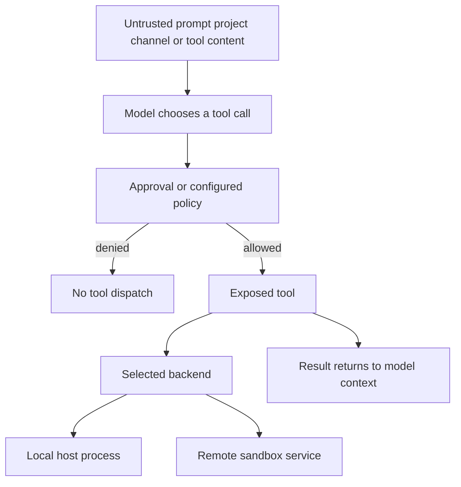
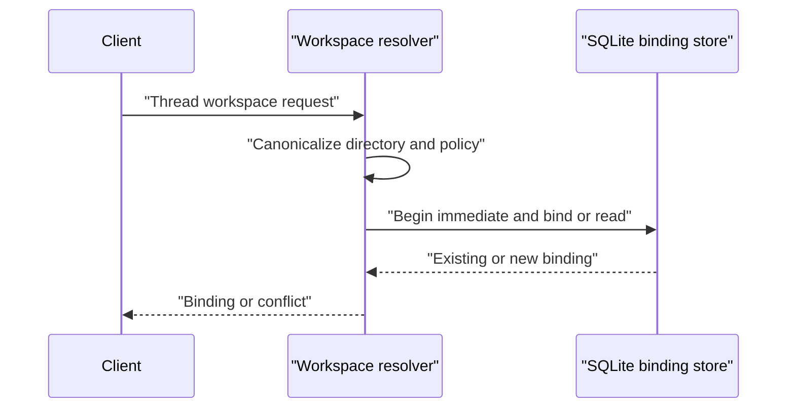

# Security Boundaries and Runbook

## Security model: put containment below the agent

Deep Agents follows a **trust the LLM** model: the agent can do what its exposed tools allow. Treat prompts, project files, channel messages, web content, MCP responses, and shell output as untrusted inputs to the model. HITL, allowlists, redaction, and prompt instructions can reduce accidental or reviewed actions, but they do not contain a process that has host shell access.

The SDK is a harness, not an OS isolation layer. `LocalShellBackend` executes `shell=True` commands on the local host with the process user's authority; `virtual_mode` affects filesystem operations, not shell commands. Use a sandbox implementation, container/VM boundary, or dedicated low-privilege OS identity for untrusted code or users. Select the backend and exposed tools before accepting the workload.

Related: [backends](../concepts/backends.md), [configuration layering](../concepts/config-layering.md), [permissions and HITL](../concepts/permissions-hitl.md), [filesystem tools](../concepts/tools-filesystem.md), [MCP](../integrations/mcp.md), [sandbox partners](../integrations/sandbox-partners.md), and [Talon](../integrations/talon.md).

This is the dispatch path, not a claim that approval or virtual filesystem mode isolates the host. The execution backend and OS identity determine where an approved command runs.

## SDK and filesystem controls

`FilesystemPermission` is an ordered tool policy: a matching filesystem operation is allowed, denied, or interrupted for human approval. Rule patterns must be absolute and cannot contain `..` or `~`. These rules govern the middleware's filesystem tools only.

Do not configure them as a shell confidentiality boundary. The middleware rejects unscoped filesystem permissions with an execution-capable backend because execute-tool permissions are not implemented. A local shell can use an accessible absolute path regardless of `virtual_mode` or filesystem-tool rules. Keep secrets in a location inaccessible to the agent process or execute in a sandbox.

## dcode: project, server, and workspace

### Treat the working directory as trusted code

dcode trusts the directory from which it is run, and it reads project artifacts before the approval prompt. Do not open an untrusted checkout with local execution. Use an explicitly selected remote sandbox for such work, and review project instructions, `.env` files, MCP configuration, hooks, and extensions as executable or behavior-shaping input.

Approvals are an interaction control, not containment. Keep auto-approval disabled for ordinary work; in unattended work, minimize the command allowlist and the tool set, and run it under an account with no production credentials. Assume tool results can influence later model decisions, even where a user approved the preceding fetch or call.

### The local server is protected by locality, not authentication

The dcode launcher starts an internal `langgraph dev` process on `127.0.0.1`, normally choosing an ephemeral port, and explicitly sets `LANGGRAPH_AUTH_TYPE=noop`. Consequently, any sufficiently privileged or same-host process that can discover the port is not stopped by server authentication. Do not expose this interface beyond loopback; do not rely on loopback alone on a hostile shared machine. Run dcode with an isolated user account and protect its profile, database, checkpoint, and configuration directories with OS controls.

The launcher starts from a copy of the environment and strips startup-sensitive variables, including `PYTHONPATH`, from the server interpreter. It deliberately relays a launch-time `PYTHONPATH` for later approval-gated agent execution, so this is startup hardening rather than a promise that agent commands cannot receive that value. Provider credentials inherited by the process should be treated as available to the runtime unless separately withheld.

### A thread cannot silently change workspaces

For server-hosted work, dcode validates that the requested workspace is an existing, canonical absolute directory and fingerprints the workspace and server-resolved policy. First binding is serialized in SQLite. Reuse with another workspace or policy is refused, and each runtime workspace payload must exactly match the durable binding.

This prevents an existing thread from being silently repointed by a later client request; it is not a defense against a principal that can modify the database or host filesystem.

The transaction makes concurrent first-bind attempts choose one durable workspace rather than mixing claims.

## dcode MCP: expansion is not secret mediation

dcode expands `${VAR}` and `${VAR:-default}` in MCP `command`, `url`, `args`, `env`, and `headers`. The `:-default` form also applies when the variable is empty. Malformed braced references are rejected, and an unset required variable fails resolution. Expansion prepares values for an MCP process or endpoint; it does not prevent a resolved secret from being sent there or later appearing in process-visible configuration.

Operationally, keep literal credentials out of repository MCP files, prompts, and tool output. Prefer a narrowly scoped environment variable supplied only to the process that needs it. Before enabling a project MCP server, verify its command or endpoint, its environment, and the tools it exposes. Treat a stdio MCP server as code execution and a remote MCP server as an external data recipient.

## Talon: experimental operator authority

Talon is an experimental alpha runtime, not a production or multi-tenant security boundary. It explicitly lacks production-grade complete HITL policy, channel administrator controls, sandbox-backed execution isolation, and multi-tenant boundaries. Anyone who can trigger a channel should be treated as receiving the operator's effective agent authority: model credentials, MCP capabilities, and local-host resources.

Talon's default backend is `LocalShellBackend` with `virtual_mode=False`. It disables inherited backend environment by default, builds a filtered child environment, and supplies a fixed safe `PATH`; this reduces accidental secret and startup-hook exposure but does not sandbox commands. Use an external execution boundary before connecting a channel to anything beyond a trusted operator.

### Channel exposure

For WhatsApp, the Python adapter communicates with its Node bridge over loopback. Inbound exposure defaults to `self` for the paired account. Use `allowlist` with explicit chat or mention settings for delegation. `open` permits arbitrary senders only after the explicit `DEEPAGENTS_TALON_WHATSAPP_OPEN_ACK=allow-arbitrary-senders` acknowledgement, and those senders receive the operator's model, channel, MCP, and local-host authority. Do not use `open` on an operator workstation.

### Talon MCP editing and OAuth tokens

Talon's MCP configuration tools provide mediated, redacted access to an operator-selected regular, non-symlink config file. Reads return a revision and redact stored strings except permitted enum values and exact environment references. Updates use a process-keyed HMAC revision, validate supported settings, atomically write the file, and schedule reload only after a successful write. A stale revision returns a conflict; a failed update does not schedule reload. Running work can retain its prior capabilities until a later invocation.

This interface is **not** secret containment. The implementation warns when the config or credential path is in the agent workspace, but its default local shell can read and overwrite any accessible absolute path, bypassing redaction, compare-and-swap, and tool approval. Keep the assistant home and MCP config outside the workspace for hygiene, but use a separate UID, inaccessible key store, or sandbox to make secrets unavailable to the agent process.

OAuth tokens are cleartext bearer and refresh credentials. Talon stores them under its MCP-token directory with owner-only directory/file hardening, a lock for read-modify-write updates, and atomic replacement. Treat failure to maintain those host filesystem protections as a credential incident, while recognizing that permissions alone do not protect against the default shell under the same identity.

## Operating checklist

1. **Choose containment first.** Use a remote sandbox, container/VM, or dedicated low-privilege account for untrusted repositories, arbitrary channel users, or code execution. Verify the actual backend for every `execute` route.
2. **Limit authority.** Expose only necessary tools and MCP servers. Keep automatic approval off; review noninteractive allowlists as code-execution policy, not merely convenience settings.
3. **Protect dcode local state.** Keep its loopback server private to a trusted local account. Protect profile/configuration, SQLite/checkpoint files, and environment credentials with OS permissions.
4. **Bind and test workspaces.** Attempt a workspace and policy change against an existing thread in staging; it should fail. Do not share or tamper with the binding database across trust domains.
5. **Treat MCP as an outbound and execution boundary.** Inspect stdio commands and remote endpoints before enabling them. Use environment references for credentials and rotate any credential placed in a repository, prompt, checkpoint, tool result, or literal MCP config.
6. **Constrain Talon channels.** Prefer `self`, then a minimal allowlist. Test authorization as a non-operator. Never regard Talon's approval prompts, MCP redaction, or assistant-home modes as sandboxing.
7. **Respond to suspected compromise.** Stop the runtime; revoke and rotate provider, MCP, and channel credentials; remove/review trust grants and MCP configuration; inspect local state, checkpoints, logs, and sandbox artifacts; then redeploy with containment and approvals retested.

## Focused verification

Use the repository tests as regression checks for the boundary properties that matter here:

- `libs/code/tests/unit_tests/test_workspace.py` covers idempotent binding, concurrent first bind, workspace/policy conflicts, runtime-context matching, and secret exclusion from durable workspace policy.
- `libs/talon/tests/unit_tests/test_mcp_config.py` covers redacted views, stale revisions, atomic update behavior, invalid input, and symlink rejection.

These tests validate the described mechanisms. They do not establish OS isolation, sandbox-provider isolation, model safety, or safe operation of an untrusted channel.
