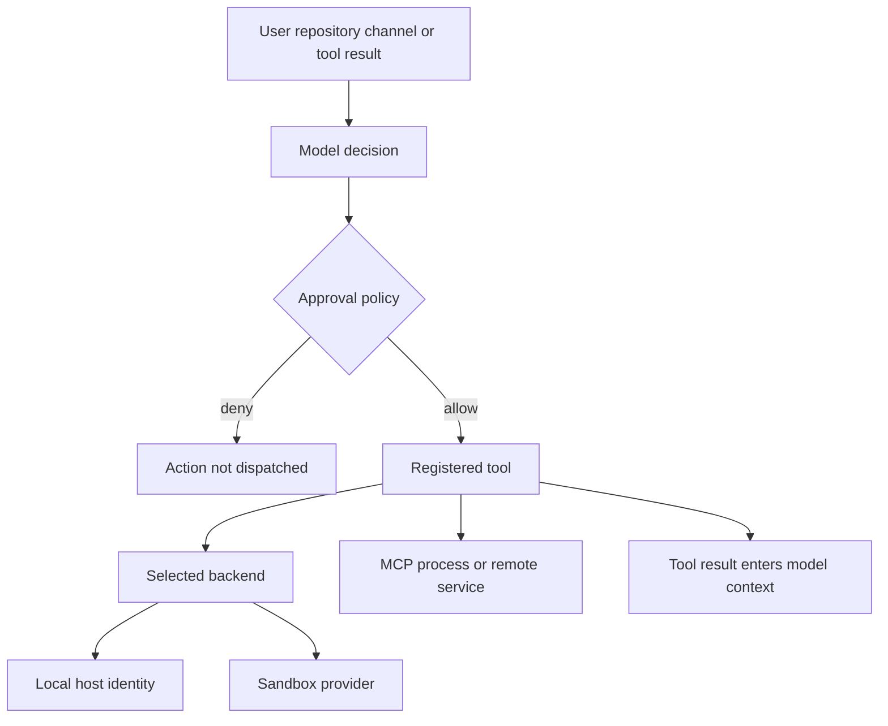
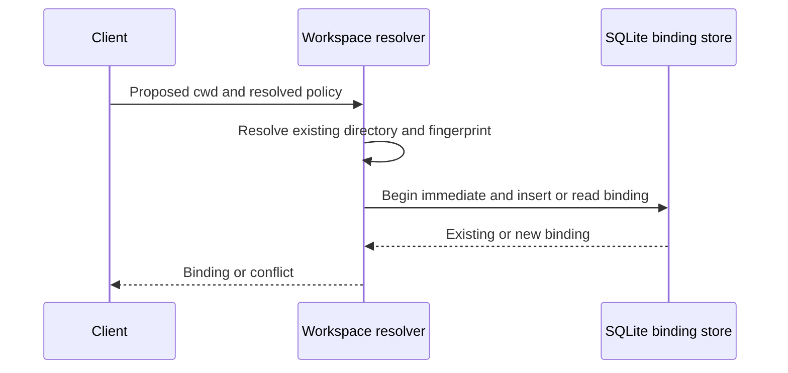

# Security Boundaries and Runbook

## Read this before deployment

The Deep Agents SDK compiles a `CompiledStateGraph`; it does not operate a service or supply deployment authentication, TLS, network exposure, process identity, or storage protection. The application/deployer owns those controls, its registered tools, its checkpointer/store, model choice, and execution backend. The SDK threat model and dcode threat model are generated, experimental documents: use them to locate controls, then validate the deployed version and topology.

Treat prompts, model-directed tool arguments, repository artifacts, web pages, MCP responses, shell output, restored state, skills, and memory as potentially adversarial content. Results can return to model context. Prompt instructions, redaction, content labels, and warning dialogs may help an operator review an action, but they are not a confidentiality boundary, sandbox, or prompt-injection defense.

This authority path shows that approval mediates a dispatched tool call, while the selected backend and process identity determine the authority it receives. It does not imply that inputs, outputs, or model behavior are safe.

Related: [backends](../concepts/backends.md), [configuration layering](../concepts/config-layering.md), [permissions and HITL](../concepts/permissions-hitl.md), [MCP](../integrations/mcp.md), and [Talon](../integrations/talon.md).

## Containment and filesystem scope

`StateBackend` is the SDK default and stores files in ephemeral LangGraph state; it is not a host shell. A `FilesystemBackend` reaches the filesystem selected by its configuration. `LocalShellBackend` is explicitly a local-development backend: it invokes `subprocess.run(..., shell=True)` under the process identity. Its timeout and output cap are operational limits, not isolation. Its `virtual_mode=True` path mapping applies to filesystem operations only; a shell command can still access any path that the OS identity can access. `inherit_env=True` also carries the parent environment into executed commands.

Use a container, VM, separate low-privilege OS account, or a properly implemented `BaseSandbox` when a workload, repository, channel participant, or tool content is untrusted. Evaluate sandbox providers as separate trusted services: their identity, tenant isolation, network egress, data retention, and incident controls are outside dcode and the SDK. Do not run a local-shell agent on a production host, shared workstation, or identity holding unrelated secrets.

`FilesystemPermission` is ordered, first-match policy for filesystem **tools**: an `allow`, `deny`, or `interrupt` rule governs matching read/write operations, and permission patterns must be absolute without `..` or `~`. `interrupt` uses `HumanInTheLoopMiddleware`. FilesystemPermission rules control filesystem-tool reads and writes but are not a shell or host confidentiality boundary; execute-tool permissions are not implemented for execution-capable backends. In particular, no filesystem rule transforms `cat /secret` into a denied local-shell operation.

**Operational rule:** keep credentials in an OS-managed secret store or a location unreadable by the agent process; do not merely move them outside its working tree. Test the actual tool/backend route, including custom `CompositeBackend` or wrapper implementations.

## dcode: project, server, and workspace boundaries

### Project trust comes first

By default, `dcode` trusts the directory from which it runs. Project artifacts are read before an approval prompt, so an untrusted checkout can influence the prompt and execution setup before HITL is reached. dcode trusts its current directory by default and reads project artifacts before approval, recommending a remote sandbox when operating on an untrusted repository.

Treat checked-in `.env`, `AGENTS.md`, skills, MCP configuration, hooks, extensions, subagent definitions, and build/project metadata as executable- or prompt-shaping inputs. Grant project MCP, hook, and extension trust only after review. Python project extensions are arbitrary Python, and a custom model `class_path` imports its module before its type is checked. Configuration layering and deny lists reduce known startup hazards but cannot make arbitrary project configuration safe.

dcode HITL gates its configured model-requested side-effecting tools. Keep `auto_approve` disabled and make headless shell allow-lists narrow. Approval is not a policy engine for direct host access: after approval, the tool executes with its backend authority; warnings for suspicious URLs or invisible/bidi Unicode are review aids, not sanitization.

### Loopback is an exposure boundary, not authentication

The dcode launcher starts an ephemeral `langgraph dev` child and its client uses local HTTP/SSE. dcode's local server binds loopback with noop authentication, so loopback binding and host-process isolation—not server authentication—protect its HTTP interface. A hostile local peer that can find the port can potentially interact with that interface; run it under a dedicated account and do not treat a multi-user host as a trusted loopback environment.

The child environment begins as a copy of the parent environment, although startup-sensitive and selected cloud-auth values are removed. `PYTHONPATH` is removed from the server interpreter startup path but its launch value is retained for later approval-gated agent execution. Assume provider credentials still reach the server and potentially child work; do not put secrets in prompts, repository files, tool output, or state that may be checkpointed.

### One thread, one workspace policy

For hosted work, dcode requires an existing absolute directory, resolves it canonically, fingerprints the workspace and resolved policy, and uses a SQLite immediate transaction to create or verify the thread binding. dcode workspace binding canonicalizes an existing absolute directory and persists a thread's workspace and policy fingerprint transactionally; a conflicting workspace or policy is refused, and runtime context must match the stored binding.

This prevents a client from silently moving an existing thread to another workspace or privileged policy. It is an integrity invariant, not access control against an actor that can alter the SQLite database or host filesystem.

This is the first-bind/reuse path: the durable binding, rather than a later client-supplied workspace claim, controls the thread.

## MCP and credentials

### dcode MCP configuration

dcode resolves braced environment references in MCP command, URL, arguments, environment, and headers, rejecting malformed references and failing when a required environment value is unset. `${VAR:-default}` uses the default when the variable is empty or unset. This is value expansion, not secret mediation: the resulting command or remote endpoint receives the resolved value. Restrict who can change MCP definitions, and remember that a stdio MCP server is a local subprocess while a remote server receives its configured headers and requests.

Use project MCP trust/approval as a decision to authorize a server definition, not as a claim that server output is trusted. Treat remote MCP output as untrusted model context and review the subprocess command, environment, endpoint, and tool list before enabling it.

### Talon mediated configuration and OAuth

Talon's `MCPConfigStore` exposes a redacted view and a one-server update API. On POSIX it opens only a selected regular, non-symlink file, derives a process-keyed HMAC revision from file content, rejects stale updates, validates supported fields, atomically replaces successful writes, and schedules reload only after success. Existing turns/tasks retain their original graph and capability snapshot until they finish or are cancelled.

Talon explicitly classifies MCP configuration redaction and placement warnings as non-confidentiality controls because its default local shell can access readable absolute paths outside the mediated configuration tools. A mediated update approval, `<redacted>` placeholder, stale-revision check, or moving a file outside `DEEPAGENTS_TALON_WORKSPACE` does not block direct shell reads/writes by the same agent identity. Use `${ENV_VAR}` references to avoid placing a literal value in the mediated MCP file, but protect the referenced value with OS/process isolation too.

Talon stores MCP OAuth credentials as cleartext tokens with owner-only file-system hardening and atomic writes, while warning that this hardening does not protect them from the default shell backend. The storage creates/hardens directories, serializes read-modify-write operations with a lock, writes a `0600` temporary file, fsyncs it, and atomically replaces the destination. Treat any unexpected mode/hardening failure or exposure of the runtime identity as a credential incident: stop use and rotate/revoke tokens.

## Talon channel and approval authority

Talon is an experimental alpha runtime that explicitly lacks production-grade complete HITL, channel administrator controls, sandbox execution isolation, and multi-tenant boundaries; channel access is operator-level authority. It runs a local host process and, by default, a `LocalShellBackend` with `virtual_mode=False`; filtering its child environment and owner-only assistant-home files are useful hardening, not execution isolation.

Talon tool approval is a per-assistant `tools.json` map of exact tool names to booleans. `true` requests a channel approval; `false` means no prompt and does not remove the tool or authorize it. Defaults include prompts for `update_tool_approvals`, `delete_conversations`, `update_mcp_server`, and `start_async_task`. Updates use a revisioned atomic compare-and-swap, apply on the next invocation, and an invalid policy fails closed for a later invocation. Policy self-edits are evaluated under the pre-edit policy. Only trusted operator identity—not a chat allowlist, mention match, model argument, or untrusted inbound metadata—may edit policy; scheduled/background work cannot initiate interactive approval or authorization.

Talon's WhatsApp channel defaults to 'self' exposure for the paired account; 'allowlist' can restrict triggering chats or mentions, while 'open' permits arbitrary senders only after the explicit DEEPAGENTS_TALON_WHATSAPP_OPEN_ACK acknowledgement and gives them the operator's model, channel, MCP, and local-host authority. Do not use `open` from an operator workstation. The WhatsApp Python adapter communicates with its Node bridge over loopback only, but that does not make arbitrary channel users safe once admitted.

## Runbook

### Before enabling an agent

1. **Choose containment.** Use a sandbox/VM/container or dedicated low-privilege identity for anything untrusted. Confirm which backend implements `execute`; verify network egress and mounted secrets separately.
2. **Define the trust set.** Review repository artifacts and explicitly grant only necessary project MCP servers, hooks, extensions, and subagents. Treat a changed definition as a new review.
3. **Protect local interfaces and state.** Keep dcode on a host without hostile local peers; protect its profile, databases/checkpoints, configuration, and token directories with OS controls.
4. **Minimize credentials.** Use short-lived, scoped provider/MCP credentials. Do not store literal secrets in prompts, repository files, MCP configuration, tool results, histories, or logs. Verify owner-only modes after OAuth/login but do not mistake modes for sandboxing.
5. **Keep approvals meaningful.** Leave `auto_approve` off. In headless mode, test each allow-list entry against argument-based escape routes. For Talon, configure and verify an operator identity, use `self` or a narrow allowlist, and do not delegate policy authority through channel metadata.

### Focused verification

Run or adapt tests that cover the control rather than only a happy path:

- `libs/code/tests/unit_tests/test_workspace.py` covers idempotent binding, competing first binds, workspace/policy conflicts, and substituted runtime context.
- `libs/talon/tests/unit_tests/test_mcp_config.py` covers redaction round trips, stale revisions, malformed inputs, symlink refusal, atomic-write failure, and concurrent updates.
- `libs/talon/tests/unit_tests/test_tool_approval_authorization.py` covers trusted operator derivation and removal of authority from scheduled/background work.

Also exercise a denied filesystem-tool operation, a shell read of an out-of-workspace test file, a project-trust refusal, and a non-operator channel request. The shell test is intentional: it demonstrates the stated non-boundary before production use.

### Incident response

1. Stop the dcode/Talon runtime and isolate the host or sandbox; preserve relevant state/log evidence under appropriate access controls.
2. Revoke and rotate provider, MCP OAuth, channel, and any credentials visible to the affected process. Assume shell-accessible cleartext tokens may have been read.
3. Remove/review project trust grants, MCP definitions, extensions, hooks, assistant policies, and channel exposure. Check workspace bindings and checkpoint/history stores for persistence of hostile content.
4. Rebuild from reviewed configuration under a contained identity. Re-run the focused checks above, then reopen channels only with the minimum required exposure.

## Explicit non-boundaries

- A prompt, model instruction, result label, HTML escaping, redaction, or Unicode/URL warning does not guarantee content safety or secrecy.
- Filesystem tool permissions and `virtual_mode` do not constrain `LocalShellBackend.execute()`.
- Loopback plus `LANGGRAPH_AUTH_TYPE=noop` is not server authentication; it relies on local process isolation.
- A dcode workspace binding protects thread/workspace consistency, not a compromised database or OS account.
- MCP redaction, revision checks, mediated-write approval, path-placement warnings, and owner-only modes do not protect a file from the same identity's unrestricted local shell.
- Talon channel allowlisting/approval configuration is not a multi-tenant, administrator, or sandbox boundary; an admitted channel participant can carry operator-level authority.
