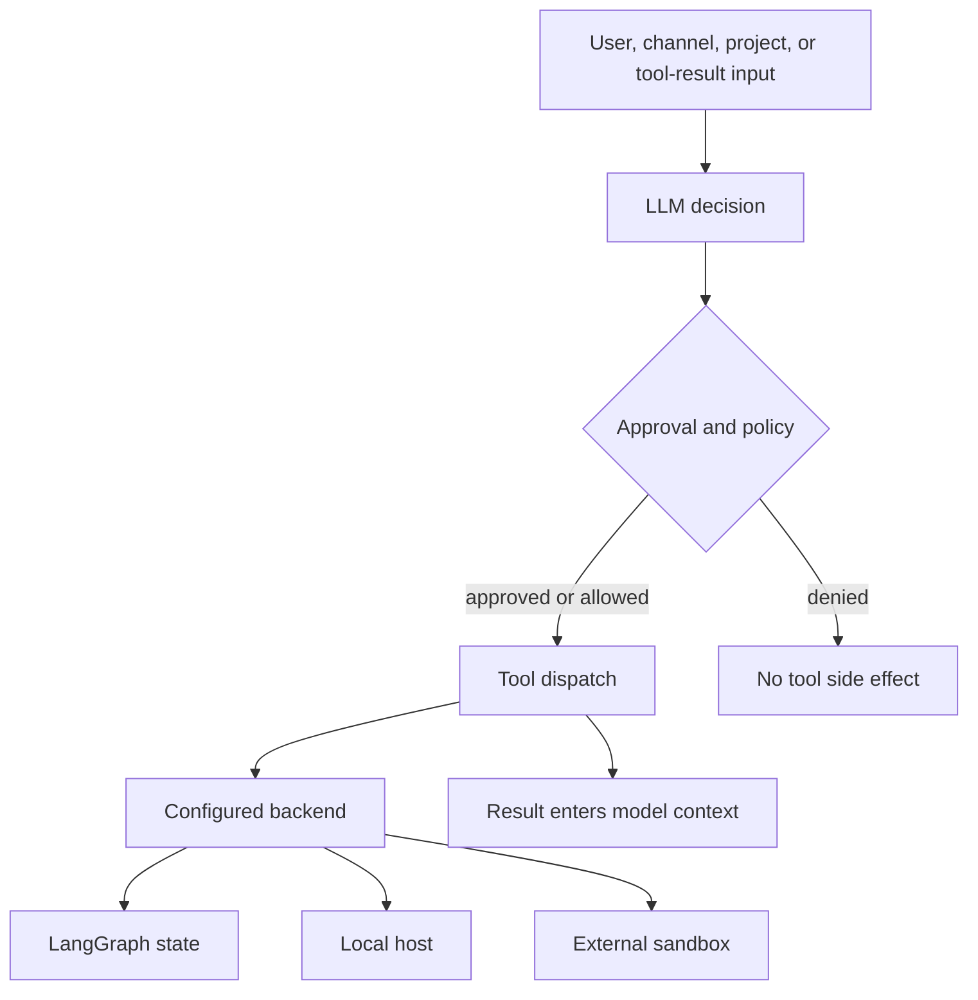

# Security and Trust Boundaries

Deep Agents uses a **trust-the-LLM, enforce-at-the-tool-and-execution-boundary** model. Model behavior, jailbreak resistance, and the safety of LLM-generated intent are explicitly outside the SDK and dcode threat-model scope. Tool output—including web pages, MCP responses, and shell output—also returns to model context without prompt-injection scanning. Therefore, treat model input and tool results as untrusted instructions, and put authority limits in approvals, backend selection, OS/deployment controls, and trust decisions for executable project configuration.

The repository threat models are generated, experimental guidance rather than authoritative security assessments. Validate their conclusions against the version and deployment being operated.

Related: [configuration layering](../concepts/config-layering.md), [permissions and HITL](../concepts/permissions-hitl.md), [GitHub Action](../integrations/github-action.md), [MCP](../integrations/mcp.md), and [sandbox partners](../integrations/sandbox-partners.md).

This diagram locates authority: an approval can stop an invocation, but the selected backend determines where an allowed operation executes. It does not make tool results safe to follow or imply that every runtime enables approvals by default.

## Operating posture

1. **Select containment before enabling execution.** The SDK provides no OS-level process isolation. Use a `BaseSandbox` implementation or container/VM isolation for untrusted workloads; external sandbox providers are trusted third parties whose tenancy, network, retention, and identity controls must be evaluated separately. dcode sandbox mode is an explicit `--sandbox` opt-in.
2. **Do not equate virtual paths with shell isolation.** `FilesystemBackend(virtual_mode=True)` constrains filesystem-tool paths, but `LocalShellBackend` executes commands with `shell=True` and has host access regardless of `virtual_mode`. `StateBackend`, the default, stores ephemeral LangGraph state rather than providing a host shell.
3. **Keep approval meaningful.** Avoid `auto_approve` and broad non-interactive shell allow-lists with untrusted content. Approval covers invocation, not model reasoning, the correctness of approved arguments, or the later interpretation of tool output.
4. **Treat checkout-controlled configuration as code.** Project MCP definitions, project hooks, `.env` values, memory and skill files, and project extensions need review and a deliberately scoped trust grant before they influence a privileged local process.
5. **Protect local boundaries and persisted secrets.** dcode's local server is loopback-only, not authenticated. Run it under a dedicated account without unrelated same-host adversaries, restrict profile/config ownership, and rotate credentials after a suspected compromise.

## SDK boundary: deployment, tools, and backends

`create_deep_agent` compiles a LangGraph `CompiledStateGraph`; it does not host a server. The application deployer owns authentication, TLS, network exposure, process identity, checkpoint/store protection, and the safety of application-supplied tools and backends.

LLM-generated calls re-enter framework execution at the framework/agent-code boundary. `SubAgentMiddleware` and `AsyncSubAgentMiddleware` validate `subagent_type`, but a task `description` and other tool arguments remain model-generated. Similarly, memory, skill, remote-subagent, shell, web, and MCP results are not content-scanned before they are available to the model. Configure HITL or an equivalent policy in the application when tool calls need review.

Provider credentials are sourced from the process environment and not written to disk or logged by framework code. This is not containment: `LocalShellBackend(inherit_env=True)` makes environment values available to shell commands. Prefer a low-privilege identity and leave inheritance disabled unless required.

### Filesystem permissions are an application policy layer

`FilesystemMiddleware` can apply ordered `FilesystemPermission` rules to read and write operations. A rule is `allow`, `deny`, or `interrupt`; `interrupt` delegates review to `HumanInTheLoopMiddleware`. Permission patterns must be absolute and cannot contain `..` or `~`. For a recursive delete, the middleware conservatively blocks a deletion if a deny-write rule could cover the target or a descendant, rather than relying on a permissive rule for only the top-level path. This layer limits filesystem-tool operations; it does not constrain shell commands.

## dcode boundaries

### HITL, Unicode, and local server exposure

 dcode places HITL interrupts around side-effecting tools including `execute`, `write_file`, `edit_file`, web tools, `task`, and compaction/async-subagent operations. Interactive users approve or reject actions; non-interactive execution applies a shell allow-list. `auto_approve` bypasses prompts, although Unicode/URL warnings are still displayed.

The warning helpers identify bidirectional and invisible Unicode controls and inspect URL hostnames for punycode, mixed-script, and confusable patterns. They are display/approval aids, not a general sanitizer or a tool-result prompt-injection defense.

Both TUI and non-interactive runs use an ephemeral local `langgraph dev` subprocess over HTTP+SSE. It binds `127.0.0.1` with `LANGGRAPH_AUTH_TYPE=noop`: any local process that discovers its port can submit requests, read thread state, or inject messages. Loopback and host-process isolation are the boundary, not server authentication.

### Project trust, hooks, and extensions

Project MCP servers and project hooks cross from checkout data to subprocess/network execution only after workspace trust or an explicit opt-in. For hooks, persistent trust records are keyed by a canonical workspace root. Session grants also bind the hash of the project hooks file, so an edited hooks file loses its session grant. The trust policy is resolved again when the working directory changes; it does not carry a trusted project grant into another workspace. Headless runs ignore persistent hook trust and require an explicit grant.

The hook trust store serializes updates across threads and processes, writes via a restrictive temporary file and atomic replacement, and refuses to overwrite an unreadable or structurally invalid store. A failed trust persistence operation is not an implicit grant.

Extensions require `DEEPAGENTS_CODE_EXPERIMENTAL=1`. Project extensions execute arbitrary Python only after project trust or `--trust-project-extensions`; a loaded extension can replace a built-in tool and is not automatically covered by dcode's approval map. For sandboxed agents, direct `FilesystemBackend` and `LocalShellBackend` extension routes, including subclasses, are rejected. Arbitrary composite/custom wrappers are not recursively inspected, so their authors own their isolation contract.

### Managed and executable configuration

A fixed administrator-managed `managed_config.toml` has highest precedence and fails closed for enforced settings. Its deployment path, ownership, and mode remain an OS-administrator responsibility. `DEEPAGENTS_HOME` is captured before dotenv processing and denied from all dotenv layers, preventing project-controlled dotenv files from relocating the profile/trust root.

A model `class_path` imports Python before the resulting object is checked as a `BaseChatModel`; module top-level code can already have run. Dotenv loading denies known shell/linker startup-hook keys such as `BASH_ENV` and `ENV`, but a denylist cannot be treated as complete execution isolation.

### Bounded repository inspection

The goal/rubric repository-inspection path uses `RepositoryBounds` to keep the LLM sub-agent read-only. It permits only `ls`, `read_file`, `glob`, and `grep`, rejects paths outside an absolute root as well as lexical traversal and home shorthand, and applies canonical containment checks where the backend supports them. In particular, a local symlink escaping the repository is rejected; containment-check failures fail closed as unavailable paths.

The same component limits a run to 25 repository calls, clamps `read_file` to 120 lines and `grep` to 100 matches, rejects files above 256,000 bytes and oversized directory listings, and caps rendered tool results at 12,000 characters. These are context and availability limits for the inspection agent, not authorization for other dcode filesystem tools.

### Workspace binding and MCP credentials

For server-hosted threads, dcode canonicalizes an existing absolute workspace directory and persists its workspace and policy fingerprint transactionally. A conflicting workspace or policy is refused, including in concurrent first-bind cases, and runtime context must match the stored binding. The persisted policy intentionally excludes model credentials and system-prompt material.

OAuth MCP tokens are stored below the selected profile's `mcp-tokens` directory. `FileTokenStorage` restricts server-name path components, uses a URL-hashed filename for remote servers, serializes refreshes with a sibling lock, writes a `0600` temporary file, then atomically replaces the final token file. It attempts to lock the directory to `0700` and file to `0600` and logs warnings when that hardening fails. Treat such warnings on a shared host as secret-exposure events.

Provider credentials still propagate to dcode's local agent server because it copies most of the parent environment after removing selected cloud-auth variables. Do not place secrets in prompts, `AGENTS.md`, project `.env` files, or tool output; tool history/checkpoints can persist that content.

## Talon: local operator authority

Talon is an experimental alpha runtime, not a production or enterprise security boundary. It does not implement production-grade complete HITL policy, channel administrator controls, sandbox-backed execution isolation, or multi-tenant boundaries. Channel access is equivalent to direct access to the operator's agent, model credentials, MCP tools, and local host resources.

Its default runtime uses a local `LocalShellBackend` with `virtual_mode=False`. It sets `inherit_env=False` and builds a filtered child environment with a fixed safe `PATH`, excluding secret-marked, tracing, and known environment-hijack keys. This reduces accidental environment disclosure, but commands still execute locally and are not isolated.

Talon configuration validates a constrained assistant identifier and places each assistant under a namespaced home. `ensure_home()` creates that home and state subdirectories with mode `0700`; default files are staged with mode `0600`. State-path resolution verifies that checkpoint, conversation, and history-vector files remain inside the assistant home. These are local file-hygiene controls, not a multi-user security model.

WhatsApp defaults to `self` exposure for the paired account. `open` exposure permits arbitrary senders only when both `DEEPAGENTS_TALON_WHATSAPP_EXPOSURE=open` and `DEEPAGENTS_TALON_WHATSAPP_OPEN_ACK=allow-arbitrary-senders` are set. Use a narrow allowlist when delegation is necessary.

### Talon MCP configuration: redacted capability

`MCPConfigStore` exposes an operator-selected MCP configuration through `get_mcp_configuration` and `update_mcp_server`, instead of general filesystem tools. Reads require a regular, non-symlink file and redact stored strings; transport/auth enums and exact `${ENV_VAR}` references remain visible without expansion. An update supplies the view's process-keyed HMAC revision, so a stale view conflicts rather than overwriting a concurrent change. The store accepts only supported settings, validates fields and environment-reference syntax, atomically writes the replacement, and schedules reload only after success.

MCP configuration changes can execute commands or send credentials to URLs. They require approval by default; `DEEPAGENTS_TALON_MCP_CONFIG_AUTO_APPROVE=true` opts out. A channel-triggered approval absence or rejection, and scheduled (`cron`) invocations, skip the gated call rather than writing. A successful edit becomes available only after reload; running tasks retain their previous capabilities.

## Verification and incident response

- Exercise the selected backend as a low-privilege test user. Test filesystem path rules and separately prove that no local `execute` route is exposed without intended sandboxing or local authority.
- In a disposable checkout, verify that project MCP, hooks, and extensions do not execute before their explicit trust path. Change a trusted hook file and confirm its session grant no longer applies.
- Run `libs/code/tests/unit_tests/test_repository_bounds.py` to cover unsafe roots/paths and symlink containment. Run `libs/talon/tests/unit_tests/test_mcp_config.py` to cover redaction, revisions, symlink rejection, atomic-write failures, concurrency, and runtime approval behavior.
- Inspect token/profile directory ownership and logs after OAuth login without rendering token objects. Treat permission-hardening warnings as incidents.
- For Talon, send test traffic as a non-operator on every configured channel, test every sensitive tool's approval behavior, and do not expose an operator workstation to arbitrary senders.
- On suspected local-server, token, extension, MCP, or channel compromise: stop the runtime; revoke and rotate provider, MCP, and channel credentials; remove/review trust grants; inspect checkpoints, profile files, logs, and sandbox archives; redeploy under a clean, low-privilege identity with containment and approvals retested.
