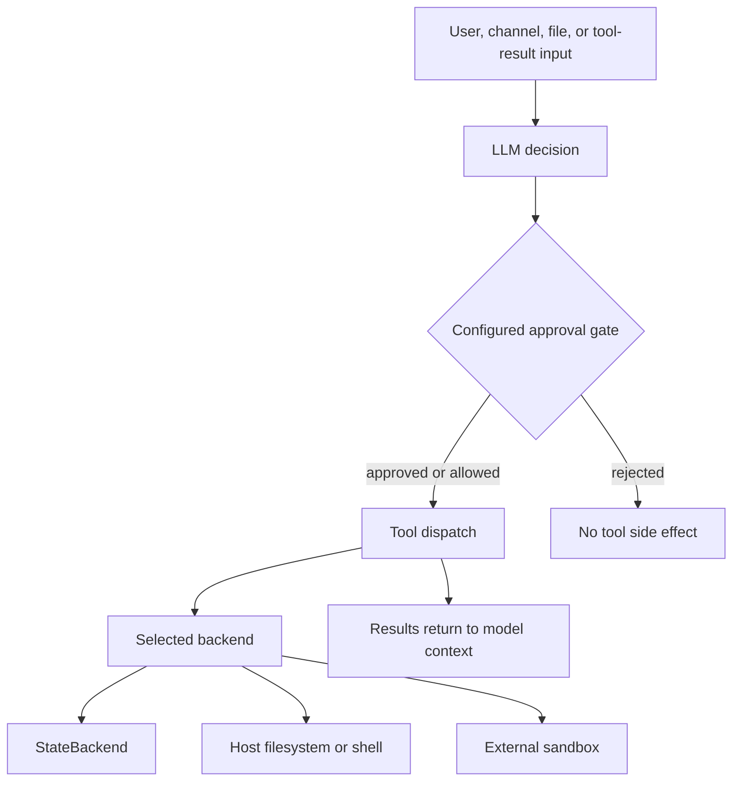

# Security Boundaries & Runbook

Deep Agents follows a **trust-the-LLM** model: an agent can do what its tools and backend allow. Neither the SDK nor dcode attempts to make model output, jailbreaks, or tool intent safe. Put enforcement at the tool-approval and execution/backend boundaries, and treat untrusted content returned by tools as capable of influencing later model decisions. The repository threat models are generated, experimental guidance—not an authoritative security assessment—and must be validated for a deployment.

Related: [backends](../concepts/backends.md), [permissions & HITL](../concepts/permissions-hitl.md), [MCP](../integrations/mcp.md), [sandbox partners](../integrations/sandbox-partners.md), and [Talon](../integrations/talon.md).

This is the control placement: approval can prevent a tool invocation, while the selected backend determines whether an approved invocation reaches state, the host, or a sandbox. It does **not** imply that all runtimes configure approval by default.

## Operational baseline

1. **Choose containment before enabling tools.** The SDK provides no OS-level isolation. `StateBackend` is the default and is ephemeral LangGraph state; it is not a shell execution environment. For untrusted work, supply a `BaseSandbox` implementation or use container/VM isolation. Treat sandbox providers as trusted third parties and verify their own identity, tenancy, network, retention, and egress controls. In dcode, sandbox operation requires `--sandbox`.
2. **Do not mistake virtual paths for shell containment.** `FilesystemBackend(virtual_mode=True)` constrains its file-operation paths. `LocalShellBackend` executes with `shell=True` and can reach the host regardless of `virtual_mode`. The SDK’s `FilesystemBackend` default is currently unrestricted when `virtual_mode` is omitted; explicitly set it when file-tool path confinement is intended.
3. **Keep approvals meaningful.** In dcode, do not use `auto_approve` or a permissive non-interactive shell allow-list for untrusted input. The approval gate protects model-initiated side effects, not prompt content or data returned from tools. Review URLs and Unicode warnings, and assume allow-listed interpreters/wrappers can expand the effective command capability.
4. **Protect local process and profile boundaries.** dcode’s local server is loopback-only but unauthenticated. Restrict same-host access and avoid running unrelated untrusted processes under the same account while it runs. Protect the selected `DEEPAGENTS_HOME` and any administrator-managed configuration with operating-system ownership and permissions.
5. **Treat extensions, project configuration, and MCP servers as executable trust grants.** Trust a checkout only after review; use explicit one-run flags in CI rather than durable trust where possible. An extension author and an MCP server own code, network, and storage behavior after loading.
6. **Minimize secrets and persisted data.** Provider credentials and MCP tokens are process/profile secrets. Do not place secrets in prompts, `AGENTS.md`, project `.env`, or tool output; set retention and access controls for checkpoints, logs, sandbox archives, and provider accounts.

## SDK: deployment and filesystem boundary

`create_deep_agent` returns a LangGraph `CompiledStateGraph`; the SDK does not host a server. The deployer owns authentication, TLS, network reachability, process identity, checkpointer/store protection, and the isolation of user-supplied tools and backends.

At the framework/agent-code boundary, tool calls are dispatched from LLM output. Subagent middleware validates the requested `subagent_type`, but task descriptions and other tool arguments remain LLM-generated. Memory, skill, checkpoint, remote-subagent, shell, web, and MCP results likewise enter agent context without prompt-injection scanning. HITL can constrain the resulting tool call only when the application configures it.

Credentials are read from the environment rather than written or logged by framework code. This is not a secret-isolation guarantee: `LocalShellBackend(inherit_env=True)` exposes the environment to shell commands. Keep `inherit_env` disabled unless that exposure is intended, and use a dedicated low-privilege runtime identity.

## dcode: local execution controls

### Tool gate and local server

dcode places HITL interrupts around side-effecting tools, including `execute`, file writes/edits, web tools, task and compaction/async-subagent operations. Interactive users approve or reject actions. Non-interactive mode uses a shell allow-list; `auto_approve` bypasses prompts, although Unicode/URL warnings are still shown. Approval is a mitigation against unwanted invocation—not validation of model reasoning, approved arguments, or downstream tool behavior.

Both the TUI and non-interactive client use an ephemeral local `langgraph dev` subprocess and `RemoteAgent` over HTTP+SSE. It binds to `127.0.0.1` with `LANGGRAPH_AUTH_TYPE=noop`; any local process that discovers the port can access it. Loopback is the containment boundary, not authentication.

### Project trust, configuration, and extensions

Project MCP configurations and project hooks require workspace trust or explicit opt-in before they may spawn a subprocess or connect to a network. This protects the transition from a checkout-controlled file to execution; it does not constrain an approved server or hook. A stdio MCP definition can pass arbitrary environment entries to its child process.

`class_path` model configuration imports Python before checking that the resulting class is a `BaseChatModel`, so its module top-level code is already executable. Dotenv loading blocks known shell/linker startup-hook variables, including `BASH_ENV` and `ENV`, but the denylist is not a general isolation boundary.

Extensions are experimental and require `DEEPAGENTS_CODE_EXPERIMENTAL=1`. Project extensions run arbitrary Python with the dcode process’s privileges and are scanned only after project trust; use `--trust-project-extensions` only for controlled code in headless runs. Plugin manifest paths are checked against traversal, absolute paths, symlink escapes, missing files, and non-Python entries. Extension setup is transactional, but a successfully loaded extension may replace a built-in tool and is not automatically added to dcode’s approval map. It must implement its own policy for sensitive work.

Sandboxed dcode agents reject direct `FilesystemBackend` and `LocalShellBackend` extension routes, including subclasses, because those routes would expose host storage. This is deliberately shallow: composite/custom wrappers are not recursively inspected, so their authors own the isolation contract. Shell `execute` remains attached to the default local or sandbox backend and cannot access a virtual extension route.

### Managed configuration and workspace binding

A fixed administrator-deployed `managed_config.toml` has highest precedence. Enforced unusable settings and corrupt/unreadable managed configuration fail closed for normal commands; OS ownership, permission mode, and privileged deployment of that file remain administrator responsibilities. `DEEPAGENTS_HOME` is captured before dotenv loading and denied from dotenv layers so checkout-controlled dotenv content cannot relocate the user trust root.

For server-hosted threads, dcode resolves a workspace claim only from an existing absolute directory, resolves symlinks, rejects traversal, and fingerprints canonical workspace policy. It persists the binding in SQLite under a transaction: a thread cannot silently switch workspace or privileged policy, including in a concurrent first-bind race. Runtime context must exactly match the stored binding; the server’s workspace endpoint rejects client policy that differs from server policy. The persisted workspace policy is deliberately non-secret: tests verify it excludes model credentials and system prompt material.

## MCP credentials and secrets

For OAuth MCP servers, dcode stores tokens under the selected profile’s `mcp-tokens` directory. Server names are restricted to a safe basename pattern; remote-server token filenames include a hash of the URL. Writes create a `0600` temporary file and replace the destination atomically, while a per-file lock serializes updates and a separate lock file serializes cross-process refresh. The directory is tightened to `0700` and the final file to `0600` where supported. A permission-tightening failure is logged as a warning: on shared hosts, treat that warning as a secret-exposure incident and repair the filesystem access control. Never log `OAuthToken` objects or exceptions that render them, because their representation contains access and refresh tokens.

Provider credentials are not written to disk or logged by framework code, but subprocess inheritance matters. dcode copies most parent environment values to its local agent server after stripping selected cloud-auth variables. The server should therefore be treated as trusted with the invoking user’s provider credentials. Conversely, Talon’s default shell backend uses a fixed safe `PATH`, `inherit_env=False`, and a filtered child environment that removes secret-marked, tracing, and known environment-hijack keys; this reduces accidental shell disclosure but is not a sandbox.

## Talon: channel exposure is operator access

Talon is an alpha experimental local runtime, not intended for production or enterprise use. It does not provide complete HITL policy, channel administrator controls, sandbox-backed execution isolation, or multi-tenant boundaries. Treat anyone allowed to send a channel message as having direct access to the operator’s agent, model credentials, MCP tools, and local host resources. These are documented absent controls, not mitigations.

Talon’s `DeepAgentRuntime` defaults to `LocalShellBackend` rooted at the current working directory unless `DEEPAGENTS_TALON_WORKSPACE` is set, with `virtual_mode=False`. The filtered child environment is useful hygiene, but commands still execute locally; deploy containment outside Talon when it handles untrusted channel traffic.

WhatsApp defaults to `self` exposure, allowing only the paired account. Use `allowlist` with narrowly scoped chat/mention configuration when delegation is needed. `open` allows arbitrary senders and requires both `DEEPAGENTS_TALON_WHATSAPP_EXPOSURE=open` and `DEEPAGENTS_TALON_WHATSAPP_OPEN_ACK=allow-arbitrary-senders`; do not enable it for a host with valuable credentials or local data.

`DEEPAGENTS_TALON_INTERRUPT_ON_TOOLS` additively marks named local or MCP tools for channel approval. This does not turn Talon into a complete policy engine. Approval can be unavailable for a channel or scheduled run, in which case Talon skips a gated tool call rather than executing it. MCP configuration changes require approval by default; `DEEPAGENTS_TALON_MCP_CONFIG_AUTO_APPROVE=true` opts out.

## Verification and incident checks

- Exercise the intended backend under a dedicated test account: verify that file tools cannot leave the intended root, and verify separately that no shell tool is exposed unless a sandbox or controlled local execution is intended.
- Validate dcode trust prompts/flags in a disposable checkout containing a project MCP file, hooks, and extension. Confirm that extension tools requiring sensitive action have explicit approval middleware.
- Run the focused workspace tests at `libs/code/tests/unit_tests/test_workspace.py`; they cover idempotence, conflicting/concurrent binds, stale runtime context, policy changes, and non-secret persistence.
- Run MCP OAuth token-storage tests at `libs/code/tests/unit_tests/test_mcp_auth.py`, then inspect profile permissions and logs without printing token objects.
- For Talon, test each configured channel exposure with a non-operator sender and test the approval handler for every named sensitive tool. Review activity logs carefully: redaction/truncation does not guarantee that application data is safe to expose.
- On suspected local-server, token, extension, or channel compromise: stop the runtime; revoke and rotate provider/MCP/channel credentials; revoke project/plugin trust as appropriate; inspect checkpoint, profile, sandbox, and log access; then redeploy under a clean low-privilege identity with containment and approvals revalidated.

## Source material

- `libs/code/THREAT_MODEL.md` and `libs/deepagents/THREAT_MODEL.md` provide generated boundary analysis; validate their findings against the deployed version.
- `libs/code/EXTENSIONS.md` defines extension lifecycle and trust behavior.
- `libs/code/deepagents_code/mcp_auth.py`, `libs/code/deepagents_code/workspace.py`, and `libs/talon/deepagents_talon/runtime.py` contain the enforcement points summarized here.
