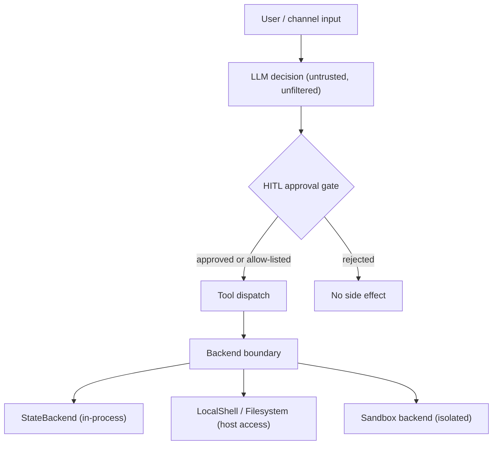

# Security & Threat Model

This page consolidates the trust model and threat-model boundaries that span the
three shipped runtimes: the `deepagents` SDK library, the `deepagents-code`
(dcode) terminal coding agent, and the experimental `Talon` host. It is a
navigational summary. For the full component/boundary/data-flow tables, follow
the links to the two source `THREAT_MODEL.md` documents, which are the
authoritative — though explicitly experimental and non-authoritative-reference —
detail.

Related pages: [code-agent architecture](../architecture/code-agent.md),
[permissions & HITL](../concepts/permissions-hitl.md),
[sandbox partners](../integrations/sandbox-partners.md).

## The core trust model: trust the LLM, enforce at the tool and sandbox level

None of these systems try to make the LLM itself safe. Model output — reasoning,
tool-call selection, tool arguments, and generated content — is treated as
untrusted-but-unfiltered input to the next layer, and enforcement is applied
where that output crosses into side effects: the tool-dispatch layer, the
human-in-the-loop (HITL) approval gate, and the storage/execution backend.

Both threat models make this explicit by placing LLM behavior *out of scope*.
The SDK model lists "model selection, and model behavior" and "model outputs,
jailbreaks" as user-controlled and external; the dcode model likewise scopes out
"LLM provider behavior (model outputs, jailbreaks)". Enforcement instead lives on
the boundaries where model output re-enters framework execution and where backend
operations reach the host.

Enforcement layers: model output is gated by HITL, then routed through tool
dispatch, then constrained by the chosen backend; the backend choice determines
how much host access a tool call can obtain.

## Sandbox isolation is the primary containment mechanism

The SDK deliberately does not provide OS-level process isolation. Its threat
model states that users who need isolation for untrusted workloads are expected
to extend `BaseSandbox` or use container/VM-level sandboxing. The default
`StateBackend` keeps files in ephemeral LangGraph state, and the opt-in
`LocalShellBackend` runs unrestricted `subprocess.run(shell=True)` with full host
access regardless of `virtual_mode`. Containment therefore comes from *where the
tools execute*, not from the tool implementations themselves.

Sandbox backends move file operations and shell execution into an external,
provider-managed environment (Daytona, LangSmith, Modal, Runloop, AgentCore).
The dcode model treats these backends as trusted third-party services whose
internals are out of scope: the runtime's responsibility ends at correctly
constructing and dispatching requests to them, and sandbox mode requires an
explicit `--sandbox` opt-in. See [sandbox partners](../integrations/sandbox-partners.md)
for the concrete integrations.

## Talon has no production security controls; channel access equals operator access

`Talon` is an experimental, alpha-status runtime that is explicitly not intended
for production or enterprise use. Its README states it does not yet implement
production-grade controls such as complete HITL approval policy, channel
administrator controls, sandbox-backed execution isolation, or multi-tenant
boundaries.

The critical operational consequence: **channel access should be treated as
direct access to the operator's agent, model credentials, MCP tools, and local
host resources.** The project does not accept security vulnerability reports for
the absence of these known, unimplemented hardening features while Talon remains
experimental.

Talon's exposure controls narrow *who* can reach the agent but do not change what
a reachable sender can do. WhatsApp defaults to `self` exposure (only the paired
account), and `open` exposure — arbitrary senders — requires an explicit
acknowledgement env var precisely because such a sender runs with the operator's
model credentials, channel credentials, MCP tool access, and local-host access.
`DEEPAGENTS_TALON_INTERRUPT_ON_TOOLS` can additively force channel approval on
named tools, but this is a local override on top of agent-provided HITL, not a
policy engine.

## SDK threat model (`libs/deepagents`) at a glance

The SDK compiles a LangGraph `CompiledStateGraph`; it does not run a server
itself, so deployment, hosting, auth, and network controls are the deployer's
responsibility. The trust boundaries it *does* own are:

- **User / Framework** — the user supplies model, tools, prompts, backends, and
  storage; the framework validates none of their safety or content.
- **Framework / LLM Provider** — message construction and tool routing are
  controlled; model behavior and provider data retention (notably OpenAI
  Responses API retention unless `store=False`) are not.
- **Framework / Agent Code** — LLM tool calls re-enter here; `SubAgentMiddleware`
  and `AsyncSubAgentMiddleware` validate `subagent_type`, but tool arguments and
  `description` content are LLM-generated and unvalidated.
- **Framework / Backend Storage** and **Backend / Host OS** — path restriction
  exists only for `FilesystemBackend(virtual_mode=True)`; `LocalShellBackend`
  with `shell=True` bypasses it entirely.
- **Framework / Remote LangGraph API** — `AsyncSubAgentMiddleware` calls
  user-configured remote deployments using credentials read from the environment.

Full component, data-classification, trust-boundary, and data-flow tables are in
the source document; do not rely on this summary for enforcement detail.

## dcode threat model (`libs/code`) at a glance

`deepagents-code` wraps the SDK in an interactive TUI and a headless
non-interactive mode, routing agent execution through a local `langgraph dev`
subprocess reached over HTTP+SSE via a `RemoteAgent` client. Its most
security-relevant boundaries include:

- **HITL tool gate (TB2)** — side-effecting tools (`execute`, `write_file`,
  `edit_file`, `web_search`, `fetch_url`, `task`, compaction, async-subagent
  tools) require interactive approval or, in non-interactive mode, pass a shell
  allow-list. `auto_approve` bypasses approval prompts while still showing
  Unicode/URL warnings.
- **Local dev server (TB10)** — the server binds `127.0.0.1` and runs with
  `LANGGRAPH_AUTH_TYPE=noop`; there is no authentication, so any localhost
  process that finds the ephemeral port can reach the API. Loopback binding is
  the containment.
- **MCP trust (TB4)** and **Hooks (TB5)** — project MCP servers and project
  hooks require workspace trust or explicit opt-in flags before spawning
  processes or connecting to networks.
- **Config-driven code execution (TB11)** — `class_path` in `config.toml` runs
  arbitrary module top-level code via `importlib` before the `BaseChatModel`
  type check; `.env` loading denies known shell/linker startup-hook keys.
- **Managed config (TB13)** and **user trust root (TB14)** — an
  administrator-deployed `managed_config.toml` at a fixed path takes highest
  precedence and fails closed, while `DEEPAGENTS_HOME` selection of the trusted
  profile is captured once and denied from every dotenv layer so project input
  cannot relocate the trust root.

The dcode model does not reproduce here; consult the source for the complete
tables and the many documented enforcement invariants (offload read guards, MCP
approval scoping, remote managed-config fetch rules, and more).

## Where boundaries are actually enforced

The consistent pattern across all three runtimes:

- **Prompt intent is never filtered.** Any input text is accepted; enforcement is
  deferred to the downstream tool call, not the prompt.
- **Tool results re-enter context verbatim.** Fetched web content, MCP responses,
  and shell/exec stdout are not scanned for prompt injection before returning to
  the model.
- **Backends are the containment boundary.** In-process state is isolated by
  default; local shell/filesystem backends grant host access; sandbox backends
  externalize execution. The choice of backend, not the tool code, sets the blast
  radius.
- **Credentials live in the process environment.** API keys are read from env
  vars and never written to disk by framework code, but they propagate to
  subprocesses (dcode's server subprocess via `os.environ.copy()`, the SDK's
  `LocalShellBackend(inherit_env=True)`, and any Talon channel-reachable tool).

## Sources

- [SDK threat model](../../libs/deepagents/THREAT_MODEL.md)
- [dcode threat model](../../libs/code/THREAT_MODEL.md)
- [Talon README security note](../../libs/talon/README.md)
