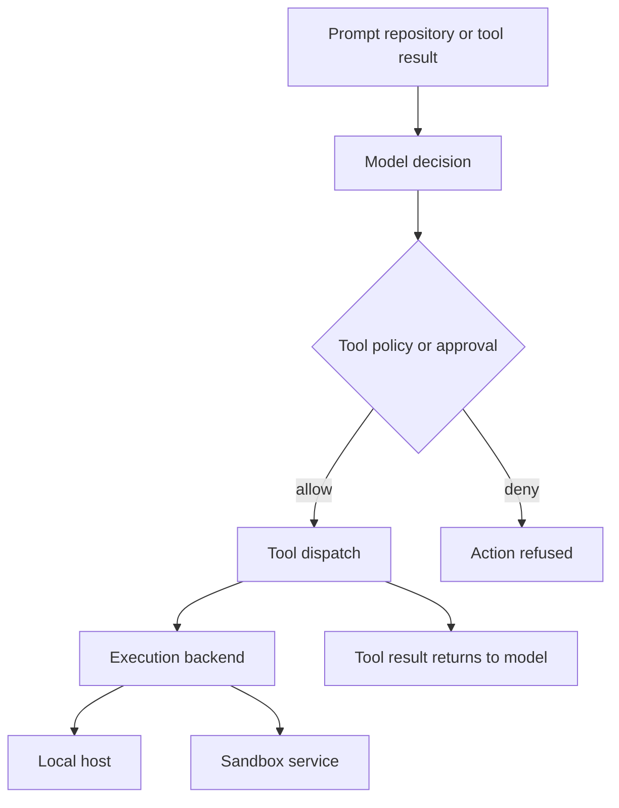
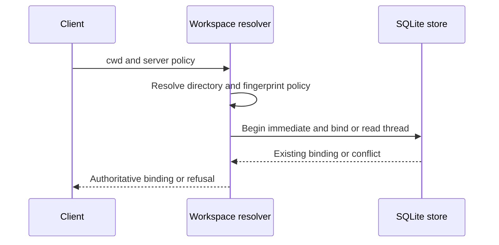

# Security Boundaries and Operational Risks

## Security posture: place authority below the model

Deep Agents follows a **trust the LLM** posture: an agent can do what its exposed tools permit. Treat user prompts, repository content, MCP and web responses, and tool output that returns to the model as untrusted instructions or data. Prompts, tool approval, redaction, and warnings can shape or mediate behavior, but the containment boundary is the selected execution backend plus the operating system and deployment controls.

Use a sandbox, container/VM, or dedicated low-privilege identity before allowing an agent to work on untrusted repositories or accept untrusted channel input. Verify the actual backend and every extension/wrapper route that can execute commands; selecting a sandbox is not, by itself, evidence that a custom route is isolated.

This is the authority path: a gate can stop a dispatched tool call, while the backend determines where an allowed action runs. Neither model behavior nor returned content is thereby made safe.

## dcode: workspace and local-process boundaries

`dcode` trusts the directory in which it starts. It reads project artifacts before any approval prompt, so do not open an untrusted checkout locally. A remote sandbox is the documented option for isolating execution from the workstation.

Both interactive and headless dcode use a local `langgraph dev` subprocess. It binds loopback and uses noop authentication: local-process isolation and the loopback network boundary, not HTTP authentication, protect the interface. Run it on an account without hostile local peers, do not expose the port, and protect its profile, database, checkpoints, and logs using OS controls.

### Durable workspace binding

For hosted work, dcode canonicalizes a client-provided workspace only after requiring an existing absolute directory. It derives workspace identity and a policy fingerprint, then atomically creates or verifies the SQLite binding for the thread. A different workspace or policy conflicts, and later runtime context must exactly match the durable payload; a re-resolution also detects a changed workspace identity.

This prevents an existing thread from silently switching workspace or recorded policy. It is not access control against a process that can modify the host filesystem or binding database.

### Narrow repository inspection

The repository-inspection helper used by bounded subagents accepts only `ls`, `read_file`, `glob`, and `grep`. Explicit paths must be absolute, lexical traversal-free, and under the configured root; sandbox and local-filesystem backends additionally perform canonical containment checks to reject symlink escapes. It fails closed to a bounded unavailable/path error when those checks fail, and caps calls, reads, listings, matches, and returned result size to protect the subagent context—not to secure the general agent filesystem.

### Filesystem policy is not shell confinement

`FilesystemPermission` rules decide filesystem-tool `allow`, `deny`, or `interrupt` outcomes and validate absolute non-traversing patterns. They are not a host confidentiality boundary. With a command-executing backend, unscoped permissions are rejected because execute-tool permissions are not implemented; even a supported, route-scoped configuration does not make arbitrary shell access safe. Keep secrets in a location the agent process cannot read, or isolate the process/backend.

### MCP configuration

In dcode MCP server configuration, `${VAR}` and `${VAR:-default}` expand in `command`, `url`, `args`, `env`, and `headers`. Malformed braced forms fail, as does an unset required variable; the `:-` default also applies to an empty value. This is convenience configuration, not secret handling: expansion can send a credential to a process or remote endpoint. Prefer least-privilege credentials and review every configured command and URL.

## GitHub Action: CI is an authority boundary

The composite action runs `dcode` in the configured `working_directory`, passes provider keys and `github_token` into its environment, and defaults to local execution unless `sandbox` is set. Its default shell allow-list is `recommended,git,gh`; treat this as an execution policy to minimize and review, not as a substitute for GitHub workflow permissions, runner isolation, or trusted inputs.

`skills_repo` is cloned with `gh` using `github_token`, and each discovered `SKILL.md` directory is copied into `.deepagents/skills`. Pin a trusted repository and ref, give the token only required repository access, and do not enable this for attacker-controlled workflow inputs. The action can cache the agent home, session database, and project `AGENTS.md`; memory defaults enabled with a repository-wide scope. Select the narrowest scope or disable memory for untrusted/secret-bearing runs, because cache restoration crosses workflow runs within that scope.

The action writes complete agent output to `GITHUB_OUTPUT`. It uses a random delimiter to prevent output from closing the multiline value, but output can still contain sensitive material: avoid placing secrets in prompts, repository files, tool results, and logs.

## Talon: experimental operator authority

Talon is experimental alpha software, not a production or enterprise security boundary. It explicitly lacks production-grade complete HITL policy, channel-administrator controls, sandbox-backed execution isolation, and multi-tenant boundaries. Treat a permitted channel participant as holding the operator's agent, model, MCP, and local-host authority. Talon tool-approval settings control prompts, not tool availability or authorization, and a same-UID shell can bypass their file API.

### Channel exposure

The WhatsApp bridge communicates over loopback. Inbound exposure defaults to `self`; `allowlist` can limit triggering chats or mention patterns. `open` permits arbitrary senders only after setting both the exposure variable and the explicit acknowledgement value. Do not use `open` for an operator workstation: such senders receive the operator's effective model, channel, MCP, and local-host authority.

### MCP configuration and OAuth

Talon's POSIX MCP configuration store exposes a redacted read view and a single-server update operation. It uses a process-keyed revision, a sidecar lock, regular-file/no-follow reads, validation, and atomic replacement; a successful edit schedules reload, and running tasks keep their existing capabilities. Updates normally require the configured approval policy. If an auto-approved update reuses `<redacted>` values, it may change only tool filters, preventing an unreviewed redirect of a hidden credential.

These are mediated-change controls, **not confidentiality controls**. The default local shell backend can read an accessible absolute configuration or token path and bypass redaction, revision checks, and approval. Keeping configuration or tokens outside the workspace merely removes a relative-path route; it does not prevent absolute-path access. Use `${ENV_VAR}` references and OS/process isolation that makes secret values unreadable by the agent process.

Talon stores MCP OAuth bearer and refresh tokens in cleartext. Its token store uses owner-only directory/file modes, locking, and atomic writes to reduce accidental exposure and lost concurrent refreshes, but explicitly does not claim to protect the tokens from Talon's default shell backend.

## Operational checklist

1. Before untrusted work, choose and test an OS/sandbox containment boundary; do not rely on prompts, approval, redaction, or workspace placement.
2. Keep dcode on a non-shared local account and protect its persisted state. Test that a bound thread refuses a workspace or policy change.
3. Review MCP commands, endpoints, tool lists, and credential routing. Use short-lived, least-privilege credentials and rotate them after suspected compromise.
4. In Actions, minimize `GITHUB_TOKEN` and workflow permissions, pin `skills_repo`, constrain the shell allow-list, select a sandbox deliberately, and narrow or disable cached memory.
5. Keep Talon channels at `self` or a reviewed allowlist. Do not represent its approval, redaction, state-file modes, or experimental controls as multi-tenant or production isolation.
6. On suspected compromise, stop the relevant runtime; revoke/rotate model, MCP, and channel credentials; inspect/restrict persisted state and caches; remove untrusted skills/configuration; and re-test containment before resuming.

Focused regression coverage includes `libs/code/tests/unit_tests/test_workspace.py`, repository-bound tests, and `libs/talon/tests/unit_tests/test_mcp_config.py`.
