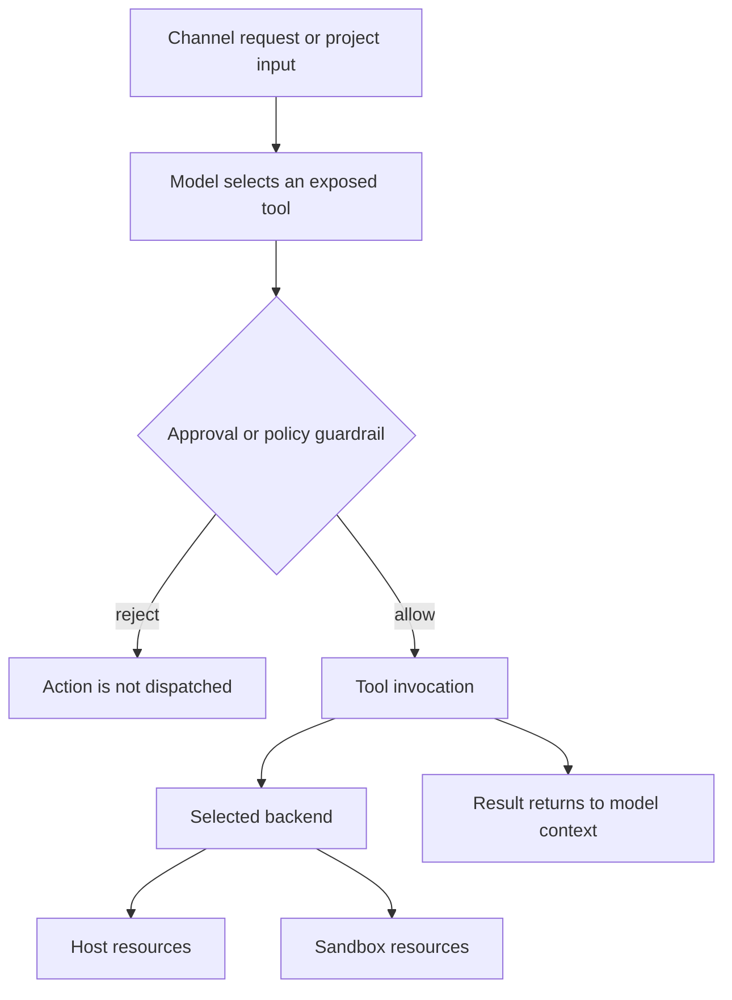
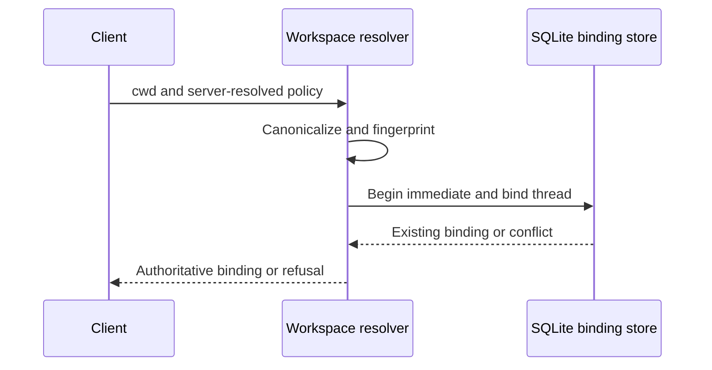

# Security Boundaries and Operational Safeguards

## Boundary model

Deep Agents follows a **trust-the-LLM** model: an agent can do what its exposed tools permit. Prompts, model behavior, tool arguments, project content, and tool results must therefore be treated as potentially untrusted. Put meaningful authority boundaries at the tool set, the execution backend, operating-system identity, network deployment, and—where needed—a container or VM. Human approval, allowlists, redaction, and warnings are useful guardrails, but none of them alone isolates a process from resources accessible to its execution backend. [Runtime behavior](../architecture/runtime-behavior.md), [backends](../concepts/backends.md), [permissions and HITL](../concepts/permissions-hitl.md), and [filesystem tools](../concepts/tools-filesystem.md) describe those layers.

This is the authority path: the guardrail can stop a mediated call, while the selected backend determines the resources an allowed call can reach.

### Filesystem policy is not shell isolation

`FilesystemPermission` rules apply ordered `allow`, `deny`, and `interrupt` decisions to filesystem-tool operations. Permission patterns must be absolute and cannot contain traversal or home-directory expansion. An `interrupt` asks `HumanInTheLoopMiddleware` for approval, and the first matching rule decides the result.

These rules are tool policy, not a host confidentiality boundary. Filesystem middleware does not implement execute-tool permissions for execution-capable backends; a shell that can access an absolute path is not constrained by filesystem-tool rules. Use an execution sandbox, a separate low-privilege OS identity, or storage the agent process cannot read when confidentiality or containment is required.

## dcode: server, project, and workspace safeguards

dcode's local server is deliberately an internal, ephemeral service: it uses a loopback default host and assigns an ephemeral port. Its server environment sets `LANGGRAPH_AUTH_TYPE=noop`. Consequently, loopback binding and host-process isolation—not HTTP authentication—protect that interface. Do not treat a shared local host as a trusted server boundary; run sensitive workloads under an appropriately isolated OS account or remote sandbox.

The server receives client configuration through `DEEPAGENTS_CODE_SERVER_` environment variables. It validates an explicit filesystem-tool allowlist in the receiving process and fails closed for malformed, empty, unknown, or `read_file`-omitting lists. Project-scoped authority is intentionally distinct from client-claimable session policy: MCP configuration, sandbox setup, and Python extensions are resolved per project directory, rather than accepted as a client claim. When a workspace differs from the launch project, dcode drops launch-project MCP and sandbox-setup policy and re-reads extension trust instead of carrying that authority across projects.

dcode trusts its current directory by default and reads project artifacts before approval. Treat an untrusted checkout as code- and instruction-bearing input; use a remote sandbox rather than running it on a trusted workstation.

### Immutable thread binding

For hosted execution, dcode canonicalizes a client `cwd` only if it is an existing absolute directory without traversal, derives workspace identity and a policy fingerprint, and stores the resulting binding per thread in SQLite. Binding uses an immediate transaction, so first-bind races have one winner. A later attempt to bind the same thread to another workspace or policy fails; runtime context and any claimed fingerprint must also match the stored binding. The workspace binding prevents silent thread switching, but it is not access control against a party that can modify the host filesystem or binding database.

This sequence shows the durable first-bind check and the refusal path for a conflicting workspace or policy.

### MCP configuration and OAuth storage

dcode expands `${VAR}` and `${VAR:-default}` in MCP `command`, `url`, `args`, `env`, and `headers`. It rejects malformed braced references and rejects an unset required variable; the default form also applies to an empty variable. This is configuration interpolation, not a secret boundary: the resolved value is supplied to the configured command or remote service.

Its `FileTokenStorage` keeps MCP OAuth material in the selected profile state directory. Server names are restricted to safe filename characters, writes use a private temporary file and atomic replacement, and token refresh updates are serialized. The code attempts owner-only directory and file modes and warns if hardening fails. Tokens are still bearer credentials on disk, so protect the profile through OS controls; never log token objects, whose representation may expose access and refresh tokens.

## GitHub Action and CI operations

The root composite action runs dcode non-interactively. It passes provider credentials and the GitHub token only into the run-agent step, but that step also receives the workflow prompt, selected working directory, optional startup command, MCP settings, sandbox settings, and an optional skills repository. Treat all of those inputs—especially a cloned skill and an unchecked-out project—as execution-relevant input. For production use, pin the action to a reviewed commit rather than a moving ref, give the workflow the minimum GitHub permissions, use a restrictive `shell_allow_list`, and select a sandbox when host execution is unacceptable.

The action deliberately does not expose interactive `--auto-approve`; headless shell authority is instead shaped by `shell_allow_list`. This is a guardrail for dcode's mediated shell route, not an OS sandbox. The action captures combined agent stdout and stderr as the `response` output. That output is raw and unfiltered; do not forward it to privileged systems or assume it contains no secrets.

Memory is enabled by default and restored/saved through `actions/cache`. The cache includes the selected agent home, session database, and a workspace instruction file; `memory_scope` can share it at PR, branch, or repository scope. Disable memory for sensitive or untrusted runs, and choose the narrowest scope because cached state can preserve agent context between runs.

The CI credential policy requires non-human service or project credentials where possible, narrow GitHub environment placement, and injection only into the step that consumes a credential. Environment selection in workflow YAML does **not** prove the environment's reviewers, branch rules, or secrets are configured. GitHub secret precedence and timing also matter operationally: an environment secret can override a same-named broader secret, and repository or organization secrets are read when queued while environment secrets are read when the job starts. Audit broader scopes before deleting an environment secret.

The scheduled OpenWiki workflow uses the `openwiki` environment, checks out without persisting checkout credentials, runs with read-only `GITHUB_TOKEN` contents permission, and creates a separately minted, explicitly scoped GitHub App token for the update pull request. This reduces the default token's authority but does not restrict the App token to workflow-level `permissions`; App installation permissions and environment protections remain external GitHub configuration that operators must verify.

## Talon: experimental operator authority

Talon is an experimental alpha runtime, not a production or enterprise security boundary. It explicitly lacks production-grade complete HITL policy, channel administrator controls, sandbox-backed execution isolation, and multi-tenant boundaries. Channel access is therefore operator-level authority over the agent, model credentials, MCP tools, and local host resources. See [Talon](../integrations/talon.md).

Talon's MCP configuration store offers a mediated read/update path: it redacts ordinary stored strings, preserves exact environment references, uses a process-keyed revision to reject stale writes, locks and atomically rewrites the selected regular non-symlink configuration file, and calls for reload only after a successful update. A tool-mediated update normally requires approval. When an update reuses `<redacted>` values without approval, changing redirecting settings is refused; only tool filters may change.

Those mechanisms are **not confidentiality controls**. The store explicitly warns rather than rejects configuration or credential storage inside the agent workspace, and Talon's default local shell can access readable absolute paths outside that workspace and bypass redaction, revision checks, and mediated approval. Keep credentials as environment references and, for actual secrecy, in a location the agent process cannot read.

Talon stores MCP OAuth credentials as cleartext tokens with owner-only filesystem hardening, locking, and atomic writes. This reduces accidental local exposure and protects against partial/concurrent writes; it does not protect a credential from Talon's default shell backend running with the same authority.

Talon's WhatsApp channel defaults to `self` exposure for the paired account. `allowlist` can narrow triggering chats or mentions. `open` exposure permits arbitrary senders only after the explicit `DEEPAGENTS_TALON_WHATSAPP_OPEN_ACK` acknowledgement, and those senders receive the operator's model, channel, MCP, and local-host authority. Do not use `open` for an operator workstation.

## Operating checklist

1. Before processing an untrusted repository or channel, select real containment: a sandbox, container/VM, or dedicated low-privilege OS identity. Verify the actual execution backend and its network and filesystem reach.
2. Keep dcode's loopback service and its state/profile storage away from untrusted local peers. Test workspace conflict refusal and stale runtime-context rejection after upgrades.
3. Keep credentials out of prompts, repository files, MCP literals, agent output, logs, and broad CI cache scopes. Use environment references only as indirection; they do not hide values from a process that can read its environment.
4. In GitHub Actions, pin dependencies/actions, minimize `permissions`, constrain the shell allowlist, disable or narrowly scope memory, and never treat raw `response` output as trusted data.
5. In Talon, prefer `self` or a narrow allowlist, keep approval enabled for mediated changes, and treat every admitted channel participant as an operator-equivalent principal unless separate isolation proves otherwise.
6. On suspected compromise, stop the affected runtime, revoke and rotate relevant provider/MCP/channel credentials, invalidate untrusted CI caches and trust grants, inspect persisted state and logs under appropriate access controls, then retest containment and approvals before redeployment.

Focused regression coverage includes `libs/code/tests/unit_tests/test_workspace.py` for atomic binding, conflicts, and runtime-context validation, and `libs/talon/tests/unit_tests/test_mcp_config.py` for redaction, stale revisions, atomic updates, and reload scheduling.
