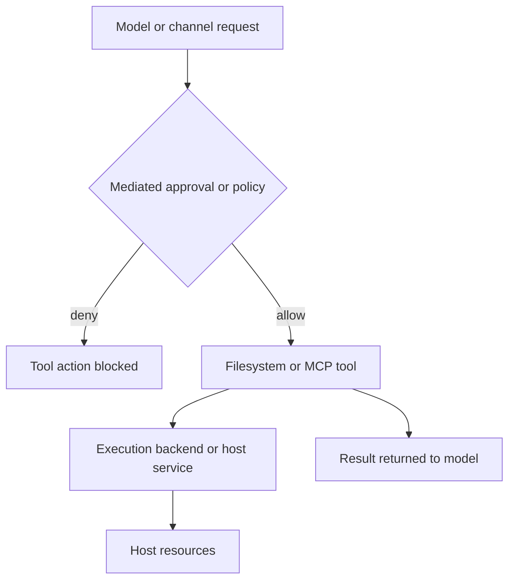
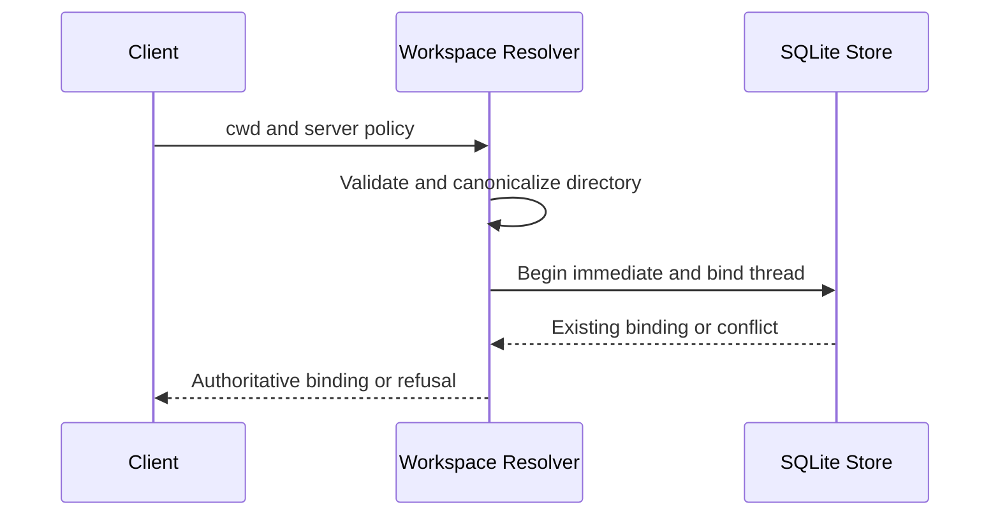

# Security Boundaries and Runbook

## The boundary to rely on

A tool approval, a filesystem permission rule, redaction, or a location outside an agent workspace is a **mediated-control mechanism**. It is not automatically a confidentiality or execution boundary. Real containment requires an execution backend and deployment controls that prevent the agent process from reading, writing, or executing against protected host resources. This distinction is especially important for execution-capable backends: filesystem-tool policy does not govern arbitrary shell commands.

Related: [permissions and HITL](../concepts/permissions-hitl.md), [filesystem tools](../concepts/tools-filesystem.md), [MCP](../integrations/mcp.md), and [Talon](../integrations/talon.md).

This is the authority path for mediated tools; host isolation must be supplied separately by the selected backend and deployment.

## SDK filesystem policy: scoped tools, not a shell boundary

`FilesystemPermission` classifies filesystem-tool operations as `read` or `write` and evaluates rules in order: the first matching rule produces `allow`, `deny`, or `interrupt`; no match allows the operation. Permission patterns must be absolute and cannot contain `..` or `~`. An `interrupt` rule sends the filesystem operation to `HumanInTheLoopMiddleware`; broad or unanchored glob patterns can deliberately over-match bulk operations conservatively.

FilesystemPermission rules control filesystem-tool reads and writes but are not a shell or host confidentiality boundary; execute-tool permissions are not implemented for execution-capable backends. In particular, do not attempt to protect a secret merely by denying a path to `read_file` when the same agent can execute shell commands. Use a sandbox, a separate OS identity, or storage that the agent process cannot access.

## dcode: project trust, local server, and durable workspaces

dcode trusts the directory from which it runs by default. It reads project artifacts before a human-approval prompt, so an untrusted checkout must be treated as input that can influence the run. Do not operate on such a repository without a sandbox backend; use a remote sandbox when execution must be isolated from the machine running dcode.

The dcode local server is intentionally ephemeral and binds to `127.0.0.1`; its production launch environment sets `LANGGRAPH_AUTH_TYPE=noop`. Consequently, loopback binding and isolation from untrusted local processes—not HTTP server authentication—protect the interface. Run it under an appropriate account and do not expose or proxy its local endpoint as though it had an authentication boundary.

The launcher strips environment variables that can alter interpreter or process startup, including `PYTHONPATH`, from the server process. It captures a launch-time `PYTHONPATH` in an internal carrier so it can later be reapplied only to approval-gated agent shell execution. This reduces server-startup injection risk but is not a claim that child execution cannot receive user environment values.

### Thread workspace binding

For server-hosted work, dcode validates a client-supplied workspace as an existing absolute directory without traversal, resolves it canonically, and derives a workspace identity plus a canonical policy fingerprint. It transactionally creates or verifies the binding for a thread in SQLite. A thread cannot silently move to a different workspace or policy; runtime workspace context and an optional claimed fingerprint must match the durable binding, and the workspace identity is re-resolved before use.

This first-bind/reuse flow prevents a thread from switching workspace or recorded policy through a later request; it does not protect the database or workspace from a separately privileged host process.

### dcode MCP configuration

In dcode MCP server definitions, `${VAR}` and `${VAR:-default}` are resolved in `command`, `url`, `args`, `env`, and `headers`. The fallback form applies when the variable is empty or unset; an unset required variable and malformed braced syntax fail resolution. Treat this as configuration substitution, not a secret vault: the resulting value can be passed to a subprocess or remote MCP server.

## Talon: channel authority and no production boundary

Talon is experimental alpha software, not a production or enterprise runtime. It explicitly lacks complete production-grade HITL policy, channel administrator controls, sandbox-backed execution isolation, and multi-tenant boundaries. Channel access is therefore operator-level authority over the agent, model credentials, MCP tools, and local host resources.

The default Talon backend is `LocalShellBackend` with `virtual_mode=False`. Talon disables inherited environment for that backend and constructs a filtered child environment with a fixed safe `PATH`, which reduces accidental exposure and startup hijacking risk. It does not sandbox shell execution or make an absolute host path inaccessible.

For WhatsApp, inbound exposure defaults to `self` for the paired account. Prefer `allowlist` to grant selected chat or mention access. Never use `open` on an operator workstation: it accepts arbitrary senders only after the explicit acknowledgement and gives those senders the operator's effective model, channel, MCP, and local-host authority.

## Talon MCP configuration: safe mediation, not secret storage

`MCPConfigStore` exposes a narrow management interface: `get_mcp_configuration` returns managed fields with strings redacted except supported enums and exact `${ENV_VAR}` references, while `update_mcp_server` replaces one server using a process-keyed HMAC revision. Reads require a regular non-symlink file on POSIX; updates take a bounded sidecar lock, reject stale revisions, validate the replacement, atomically write it, and schedule a refresh only after success. A scheduled or successful reload affects later turns; running tasks retain their original capabilities.

Talon explicitly classifies MCP configuration redaction and placement warnings as non-confidentiality controls because its default local shell can access readable absolute paths outside the mediated configuration tools. Redacted placeholders preserve existing stored strings during an update, so an unapproved update that reuses them is prohibited from changing managed settings other than `allowedTools` and `disabledTools`; this prevents redirecting a hidden credential via the mediated update route. It does not constrain direct shell access.

Use `${ENV_VAR}` references instead of literal credentials. Keeping the configuration and Talon assistant state outside the workspace removes an easy relative-path route and keeps them out of the working tree, but it does not protect a readable absolute path. Place the credential where the agent process cannot read it, or run the agent in a sandboxed or separately privileged environment.

Talon loads configured MCP servers, adds status and reload management tools, and adds `authenticate_mcp_server` only when an OAuth server is present. A refresh is serialized; loading failures are reported as server status rather than silently supplying tools. The reload tool only schedules the refresh before a later agent turn.

Talon stores MCP OAuth credentials as cleartext tokens with owner-only file-system hardening and atomic writes, while warning that this hardening does not protect them from the default shell backend. Token updates lock read-modify-write operations, preserve an existing refresh token when a refresh response omits one, write a `0600` temporary file, fsync it, and replace the target atomically. Permission modes and locking improve hygiene and consistency; they are not an isolation mechanism against code running as the agent's identity.

## Operator runbook

1. **Classify trust first.** Do not run dcode in an untrusted checkout without a remote sandbox. Treat every Talon channel participant as potentially able to exercise the configured agent authority.
2. **Choose actual containment.** Before enabling shell or MCP tools, use a sandbox/container/VM or an OS identity that cannot access host secrets. Test an absolute-path read through the exact execution route; filesystem-tool denial alone must not be accepted as proof.
3. **Protect the local server.** Keep dcode's loopback server on a host/account without untrusted local peers. Do not publish or proxy it without adding an authenticated deployment boundary.
4. **Keep workspace identity stable.** On a server-hosted thread, reject and investigate workspace-context or policy-fingerprint conflicts rather than creating a replacement binding. Test both a different directory and a changed policy.
5. **Use mediated Talon MCP edits.** Read the redacted configuration, retain its returned revision, submit one validated server replacement, then reload and verify tools on a subsequent turn. Treat conflict, malformed-file, symlink, and lock-timeout responses as no-change conditions requiring operator review.
6. **Place and rotate credentials correctly.** Use `${ENV_VAR}` references, avoid literal tokens in MCP files, and keep token/config paths inaccessible to the agent process. After suspected exposure, stop the runtime and rotate provider, MCP, and channel credentials; modes alone do not remediate same-identity shell access.
7. **Restrict channels.** Keep WhatsApp at `self` or use a deliberate allowlist. Do not set `DEEPAGENTS_TALON_WHATSAPP_EXPOSURE=open` unless arbitrary users are intentionally being granted operator-level authority in an isolated deployment.

Focused regression coverage includes `libs/code/tests/unit_tests/test_workspace.py` for idempotent binding, concurrent first bind, context substitution, policy drift, migration, and non-secret persisted policy; and `libs/talon/tests/unit_tests/test_mcp_config.py` for redaction, revision conflicts, symlink refusal, atomic-write failure, concurrent updates, and approval-gated writes.
