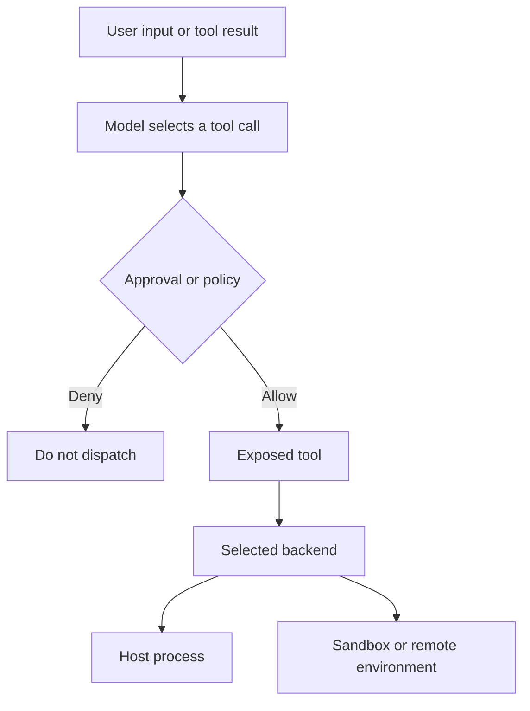
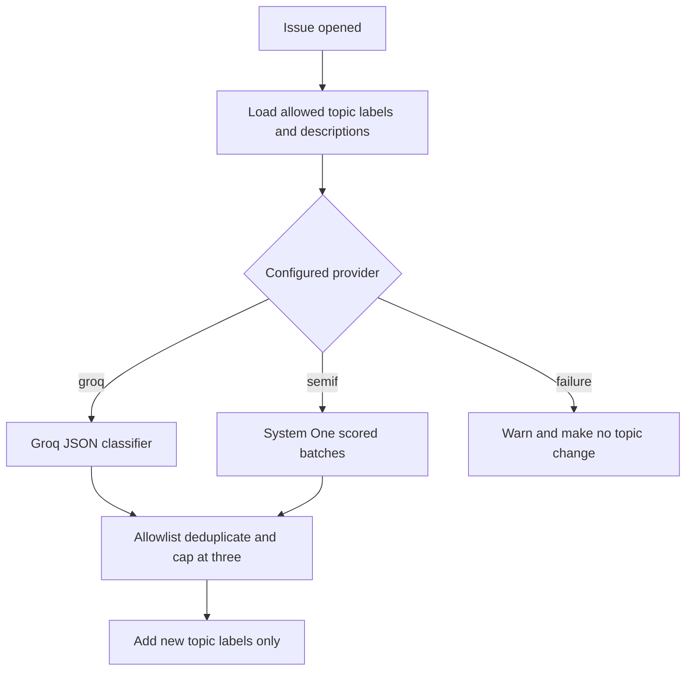
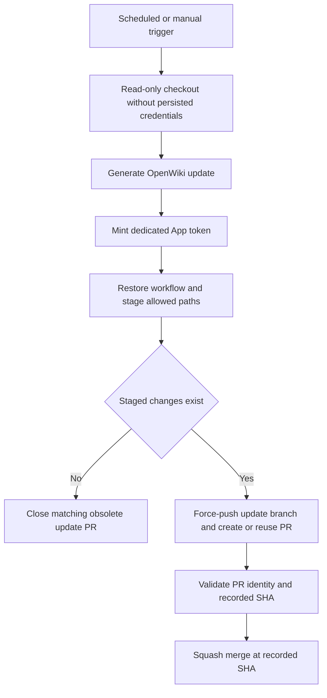

# Security Boundaries and Secrets

## Authority model and deployment boundary

Deep Agents follows a **trust the LLM** model: an agent can perform what its exposed tools permit. Prompts, model selection, and a tool's redacted presentation are not enforcement points. Establish authority at tool exposure, approvals, the execution backend, OS identity, network policy, and deployment environment. The application operator—not this library—secures the service that invokes an agent, its credentials, persistence, and external integrations.

*An approval can stop dispatch, while the selected backend determines where an allowed action executes.*

Related: [runtime behavior](../architecture/runtime-behavior.md), [GitHub Action](../integrations/github-action.md), [development](development.md), and [Run a dcode Session](../workflows/run-dcode-session.md).

## Filesystem policy is not execution containment

`FilesystemPermission` is an ordered, first-match policy for filesystem-tool operations. Its `allow`, `deny`, and `interrupt` modes respectively proceed, return a permission-denied error, or delegate an approval decision to `HumanInTheLoopMiddleware`. Permission patterns must be absolute and cannot contain traversal or home-directory shorthand.

This governs filesystem tools, not arbitrary host reads. `FilesystemMiddleware` refuses unscoped permissions with an execution-capable backend because it has no equivalent execute-tool permission enforcement. Do not use filesystem rules as a shell, host, or secret-confidentiality boundary; use a sandbox/VM/container or an OS identity and readable-path set that excludes sensitive material.

## dcode: project, local server, and workspace boundaries

dcode trusts the directory from which it runs; it reads project artifacts before a human-approval prompt. Treat an untrusted checkout as untrusted executable influence and use a remote sandbox rather than a trusted workstation.

Its local server chooses an ephemeral port and binds `127.0.0.1`; its subprocess environment sets `LANGGRAPH_AUTH_TYPE=noop`. The HTTP interface consequently depends on loopback exposure and host-process isolation rather than server authentication. A shared local host is not automatically a private trust zone.

For server-hosted threads, a workspace is a durable, server-authoritative binding. `cwd` must be an existing canonical absolute directory. The server resolves project policy instead of accepting client policy claims, records workspace identity plus durable policy and runtime fingerprints transactionally, and rejects an attempt to move a thread or change its durable policy. Runtime-only identity changes such as model settings may refresh the runtime fingerprint without rebinding the workspace. Binding context and fingerprint checks on later execution prevent a client from silently selecting another workspace or policy.

### Offload is a server-owned credential boundary

`/dcode/threads/{thread_id}/offload` validates a deliberately narrow request shape before running compaction. At the HTTP boundary, it removes client-supplied endpoint, proxy, transport, and injected-client keys from `model_params`; more importantly, it discards request model selection and restores the model and parameters recorded in the thread checkpoint. A local client cannot use offload to redirect the server's credentialed provider traffic or choose another credentialed model. The server still needs the normal loopback/host isolation boundary.

The route also rejects unknown workspace request fields and client claims that contain project workspace policy. Its conflict diagnostics contain allowlisted policy details, not paths, prompts, model parameters, or credentials. See [runtime behavior](../architecture/runtime-behavior.md) for the offload lifecycle and settlement semantics.

### MCP environment expansion and OAuth storage

dcode expands `${VAR}` and `${VAR:-default}` in MCP `command`, `url`, `args`, `env`, and `headers`; malformed braced references and an unset required value fail resolution. This is configuration interpolation, not secret mediation: expansion can still pass a credential to a command or remote endpoint.

`FileTokenStorage` writes MCP OAuth token state under the selected profile's state directory. Token values are sensitive; do not place credential values in configuration, prompts, logs, or diagnostics.

## Talon: operator authority and mediated administration

Talon is experimental alpha software and explicitly lacks production-grade complete HITL policy, channel administrator controls, sandbox execution isolation, and multi-tenant boundaries. A channel participant with agent access must therefore be treated as holding the operator's effective agent, model, MCP, and local-host authority.

WhatsApp defaults to `self` exposure for the paired account. `allowlist` narrows triggering chats or mentions. `open` requires the explicit `DEEPAGENTS_TALON_WHATSAPP_OPEN_ACK` acknowledgement and permits arbitrary senders; do not use it where that effective operator authority is unacceptable.

### Invocation snapshots and approval policy

`ToolApprovalStore` stores exact tool-name booleans and produces an immutable `ApprovalSnapshot` for an invocation. Updates validate the policy, use a lock and revision compare-and-swap, and a successful change applies only to the next invocation. Changing policy is separately operator-authorized: `update_tool_approvals` requires both a trusted operator marker and an active snapshot. A `false` value disables prompting; it does not establish authorization.

`MCPConfigStore` redaction, revision checks, locking, and placement warnings mediate its configuration-tool path but do not conceal credentials from a Talon agent using the default local shell. Talon MCP OAuth storage holds cleartext bearer and refresh tokens with owner-only filesystem hardening, locking, and atomic writes; that hardening is not a defense against a shell backend that can read the files. Keep secrets outside paths readable by the agent process and prefer `${ENV_VAR}` references to literals.

## GitHub Actions: intent, credentials, and external authority

`.github/SECRETS.md` is an inventory of intended non-`GITHUB_TOKEN` scopes, not a secret store. Selecting `environment:` in YAML does **not** prove that environment secrets, deployment restrictions, protection rules, branch policy, or GitHub App installation permissions exist. Workflow `permissions` describes the ambient `GITHUB_TOKEN`; it does not cap a separately minted App installation token. Verify the environment, App installation, repository policy, and provider-side scopes independently.

Use the narrowest environment and inject a credential only into its consuming step. The standard CI token is read-only for checks, contents, and pull requests. The issue-labeling job alone elevates its job token to `issues: write`; its model credentials are absent from workflow and job environments and appear only in **Apply topic labels**. Reusable eval runs keep read-only contents permission, select `evals`, and declare provider credentials as optional.

### Issue topic classification: untrusted text and bounded output

The issue workflow runs on `opened` and `edited`, but topic classification runs only on `opened`: an edit must not re-add a topic a maintainer removed. It obtains allowed `topic:*` names from the local manifest and descriptions from repository labels, skips topics without descriptions, and turns classifier failures into a warning with no label mutation. Package-label synchronization separately derives only managed package/integration labels from the issue form and leaves labels outside that set alone.

The classifier treats title and body as untrusted data, truncates the input to 20,000 characters, tells either provider to ignore embedded instructions, and accepts only the supplied allowlist. The Groq path requires JSON and filters, deduplicates, and caps results at three. The Semif path sends batches of at most 32 scored questions to the System One endpoint, validates each probability, applies a 0.8 cutoff, ranks across batches, and also caps results at three. Both paths have a 15-second abortable request budget. The configured provider chooses which injected key is consumed; the workflow currently supplies both potential provider keys only to this one classification step.

*Issue text reaches a credentialed model endpoint only in the scoped classifier step; output is constrained before labels are mutated.*

### Curated release notes: trusted automation, untrusted PR data

`release_notes.yml` uses `pull_request_target` for ready release PRs and `issue_comment` for manual commands. It checks out the automation from `main` into `trusted-source` with no persisted credentials; it does not check out or execute release-PR code. Validation accepts only an open, same-repository, `main`-targeting release-please branch whose component is present in the registry and agrees with the release title. A manual `@release-bot draft` or `apply` command additionally requires repository write, maintain, or admin permission; insider association only limits feedback and is not the privileged authorization check.

The draft job prepares PR content through the API at the validated head SHA, then invokes a fixed model endpoint without model tools, shell, or filesystem access to the untrusted text. Only the key selected by `RELEASE_BOT_MODEL` is in that drafting process. Repository mutations use the short-lived App token in specific helper steps. Apply revalidates and prepares state, creates a non-force Git Data API commit on the release branch, publishes the preview/metadata, and dispatches the required check for the resulting head.

The YAML requests contents, issues, and pull-request write scopes when minting that App token, but the effective token remains subject to the App's external installation configuration. Likewise, `release-bot` is an intended secret boundary, not proof that its environment restrictions or provider secrets exist.

### OpenWiki automation: containment and mediation

The scheduled or manually dispatched OpenWiki refresh runs with a read-only `GITHUB_TOKEN`, checks out without persisted credentials, generates documentation, then mints a dedicated repository-scoped App token requesting contents and pull-request write permission. The workflow gives that token only to publication and merge steps. This ordering limits token exposure to generated content, but it is workflow **intent**; GitHub environment and App configuration remain an external authority boundary.

*The workflow's intended handoff separates generation from the App-token publication path; externally configured environment and App permissions govern the actual credentials.*

Before staging, the workflow restores its own YAML and stages only `openwiki` and `AGENTS.md`. An empty diff closes only a matching repository-owned update PR; otherwise it force-pushes the update branch before creating or reusing its PR. Every merge attempt verifies base, repository-owned head, recorded SHA, open state, and no reported conflict, then requests a SHA-pinned squash merge. Only HTTP `405` is retried, at 15-second intervals for at most 60 attempts.

## Operational checklist

1. Before opening an untrusted project or channel, choose a real execution boundary: remote sandbox, VM/container, or dedicated low-privilege identity.
2. Treat filesystem permissions, MCP redaction, and approval prompts as mediation controls, not host containment.
3. Keep dcode's loopback server away from untrusted local peers. Do not allow offload callers to supply provider routing or model identity.
4. For Talon, prefer `self` or a restrictive allowlist; keep tokens outside agent-readable paths.
5. For CI, scope credentials to the narrowest environment and consuming step, then audit broader repository/organization fallbacks and external App/environment policy.
6. Preserve label-classifier input/output constraints: untrusted text instruction handling, provider-specific credential scope, allowlists, timeout, and add-only topic behavior.
7. Preserve release-note trusted-source checkout, validated API reads, manual permission check, selected-key-only drafting step, and non-force apply path.
8. Preserve OpenWiki delayed token minting, publication allowlist, PR ownership checks, SHA pinning, and bounded retry. Run `.github/scripts/tests/workflows/test_workflow_secret_scoping.py`, the classifier tests, and release-note tests when changing these boundaries.
