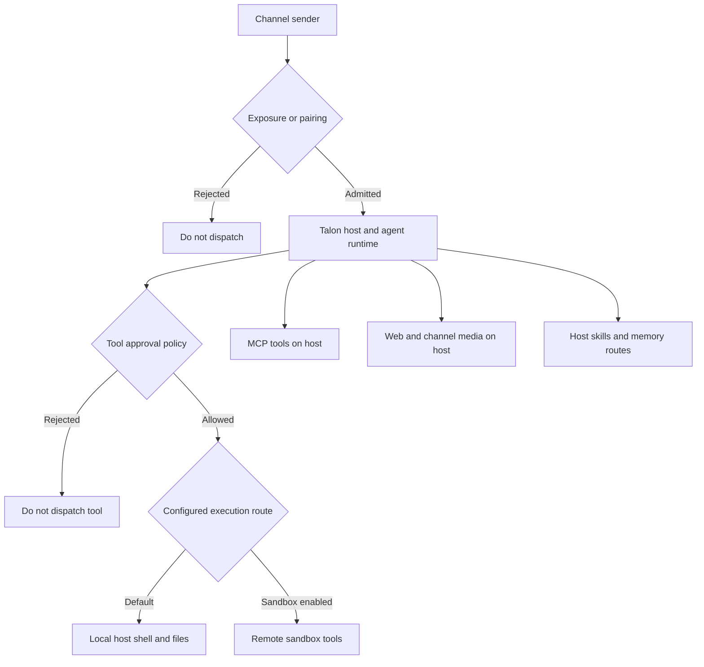

# Security Boundaries and Runbook

## Security posture and threat model

**Talon is experimental alpha software, not a production or enterprise security boundary.** It lacks production-grade complete HITL policy, channel administrator controls, and multi-tenant boundaries. Channel access is therefore operator-level authority: a sender who can trigger a run can influence an agent that has the operator's model credentials, configured MCP tools, channel credentials, and—without a sandbox—local-host access. Do not deploy it as a shared tenant service or accept exposure, pairing, allowlists, or approvals as substitutes for OS, network, credential, or tenant isolation.

```mermaid
flowchart TD
    Sender["Channel sender"] --> Admission{"Exposure or pairing"}
    Admission -->|"Rejected"| Drop["Do not dispatch"]
    Admission -->|"Admitted"| Host["Talon host and agent runtime"]
    Host --> Approval{"Tool approval policy"}
    Approval -->|"Rejected"| Stop["Do not dispatch tool"]
    Approval -->|"Allowed"| Route{"Configured execution route"}
    Route -->|"Default"| Local["Local host shell and files"]
    Route -->|"Sandbox enabled"| Remote["Remote sandbox tools"]
    Host --> MCP["MCP tools on host"]
    Host --> Web["Web and channel media on host"]
    Host --> Memory["Host skills and memory routes"]
```

*Conceptual authority path, not a proof of containment: admission and approval mediate selected actions, while the configured process, credentials, network, and execution routes determine actual authority.*

## Channel admission is not isolation

All channel adapters use the same exposure model:

- `self` is the default. It admits self-originated messages where that has meaning, or configured operator IDs for providers that require them.
- `allowlist` admits configured conversation IDs or matching mention patterns. Discord and Slack separately accept configured allowlisted user IDs for DMs.
- `open` admits every sender, but startup requires the channel-specific `*_OPEN_ACK=allow-arbitrary-senders` acknowledgement and logs the resulting risk.

These are **admission controls**. They restrict which inbound message reaches the host; they neither constrain what an admitted prompt can cause the agent to attempt nor isolate that sender from the operator's authority. Configure provider tokens and IDs as secrets, use the smallest practical allowlist, and keep `open` exceptional.

WhatsApp defaults to `self` exposure for the paired account; `allowlist` can restrict triggering chats or mentions, while `open` permits arbitrary senders only after the explicit `DEEPAGENTS_TALON_WHATSAPP_OPEN_ACK` acknowledgement and gives them the operator's model, channel, MCP, and local-host authority.

### Pairing

Discord, Slack, and Telegram can optionally admit a new **DM** sender by pairing. Pairing is unavailable for `open` exposure and does not apply to WhatsApp. An unadmitted sender is rejected before dispatch; when pairing is enabled, the adapter can offer a short code. The operator must approve that code from an operator surface. The code is bound to its provider and sender, expires after one hour, and is single-use. The pairing store is held in the assistant home; it serializes updates and uses atomic replacement. If it is unreadable or invalid, pairing fails closed and only environment-configured senders remain admitted.

Pairing grants the same DM admission as an allowlisted user, **not** operator control of Talon administration. A paired sender nevertheless obtains access to the same agent authority, so pair only a person who may use that authority. Revoking a paired sender does not remove an environment-configured sender; remove that ID from configuration and restart. Pairing, like an allowlist, is not authentication for a multi-tenant service.

## Assistant home, state, and history data

Talon derives a per-assistant home from `DEEPAGENTS_TALON_HOME` or `~/.deepagents`, appending a validated assistant ID. It creates the home and state subdirectories with mode `0700`, and default materialized files with mode `0600`. State-path checks require checkpoint, model, conversation, and vector-index files to resolve inside that home. This is useful local filesystem hardening, not a defense against another process with the same effective user or broader host access.

The default archive uses SQLite alongside the local checkpoint database; `DEEPAGENTS_TALON_HISTORY_URI` can select SQLite, MongoDB, PostgreSQL, or exactly one operator-installed history-backend entry point. The archive is namespaced by assistant ID. History URIs and backend/plugin startup errors are deliberately replaced with generic operator-facing errors because connection strings can contain credentials. Treat a remote history URI as a data egress and credential boundary: provide TLS/network controls and database authorization outside Talon.

Conversation-history tools are host-scoped to the current channel and chat, rather than taking their scope from model arguments. They can list, search, and read retained transcript content; history is data and may contain hostile instructions. Retention is not automatic expiry. Plan retention, backups, database access, and deletion procedures before enabling external history or semantic search; a remote embedding adapter additionally sends archived text and queries to its provider.

## Host execution and remote sandbox routing

Without `DEEPAGENTS_TALON_SANDBOX`, Talon uses an unsandboxed `LocalShellBackend` with `virtual_mode=False`. It launches shell children without inheriting the process environment and supplies only an allowlisted session environment plus a fixed safe `PATH`, scrubbing credential-like values and known loader, interpreter, and shell-startup hooks. This reduces accidental secret inheritance and environment-based hijacking, but commands can still read any filesystem location available to the Talon process.

Set `DEEPAGENTS_TALON_SANDBOX` to select a `deepagents-code` remote sandbox provider. Talon creates an owned sandbox for the host lifetime and closes it at shutdown; `DEEPAGENTS_TALON_SANDBOX_ID` attaches to an existing sandbox that Talon does not delete. A configured sandbox that cannot start raises an error—Talon does not silently fall back to local execution. Test that failure behavior in the deployment environment and explicitly manage the lifetime of attached sandboxes.

The sandbox is **routing for agent backend tools, not isolation for all Talon capabilities**. In sandbox mode, execution and default filesystem routes go to the remote sandbox, but host-side `skills/` and `memory/` remain explicit filesystem routes. Other assistant-state paths such as `tools.json` are not routed to the host. Talon accepts memory paths only when they resolve under the assistant `memory/` directory in sandbox mode. MCP tools, web operations, and channel-media handling still run on the host; provider credentials are read in the Talon process and are not forwarded into the sandbox. Use separate OS identities, network policy, and provider credential scoping for those host-held capabilities.

## MCP and approval limits

MCP configuration is privileged: stdio servers can start local processes and remote servers can receive headers and agent data. Tool approvals are dispatch mediation, not a general authorization layer. Talon's approval store validates exact-name boolean policies, uses revision compare-and-swap under a lock, and binds each invocation to an immutable snapshot so a successfully saved policy applies only on the next invocation. Talon requires a trusted operator marker and active approval snapshot before its tool can modify the persisted approval policy; a false policy value disables prompting rather than establishing authorization.

Do not mistake configuration protections for confidentiality. Talon explicitly classifies MCP configuration redaction and placement warnings as non-confidentiality controls because its default local shell can access readable absolute paths outside the mediated configuration tools. Talon stores MCP OAuth credentials as cleartext tokens with owner-only file-system hardening and atomic writes, while warning that this hardening does not protect them from the default shell backend. Keep the assistant home and MCP configuration outside an untrusted workspace, use credentials with narrow scope, and arrange OS/sandbox separation so the agent process cannot read secrets it must not disclose.

## Operational runbook

1. **Decide whether Talon is appropriate.** Do not use it to provide production-grade security or tenant separation. Identify every principal able to send a message, react to an approval, access the host, access history, or modify configuration.
2. **Use restrictive admission.** Start with `self`; use explicit operator IDs and narrow allowlists. Do not enable `open` merely because the acknowledgement permits it. Review platform bot permissions independently of Talon's exposure mode.
3. **Pair deliberately.** Enable pairing only for Discord, Slack, or Telegram DM admission. Approve codes only after out-of-band identity verification; revoke paired IDs when access ends, and remove environment-configured IDs separately.
4. **Protect the assistant home.** Place it outside the workspace, keep it on a filesystem with appropriate ownership and backups, and protect `tools.json`, pairing state, checkpoints, archives, manifests, skills, memory, artifacts, and MCP OAuth state as sensitive local data.
5. **Choose a real execution boundary.** For untrusted repositories or prompts, enable a remote sandbox and verify it starts. Still isolate the Talon host process: sandbox mode does not cover MCP, web/media work, skills, memory, or host-held credentials.
6. **Treat MCP as code and data egress.** Review server commands, URLs, headers, OAuth scopes, and who can modify configuration. Keep secrets out of readable host paths; redaction and owner-only modes do not protect against a same-UID host shell.
7. **Manage history as retained sensitive data.** Select and secure the storage backend, database identity, network path, retention period, backups, and deletion process. Assume content can include prompt injection and that remote embedding sends data to its configured provider.
8. **Use approvals as a second control.** Maintain exact tool policies and revisions, make sensitive changes as a trusted operator, and start a new invocation for saved policy changes to apply. Do not rely on a prompt as an authorization grant or on an approval policy as containment.

## Focused verification

When changing this area, exercise at least these behavior classes: invalid/open exposure configuration; a rejected channel message being dropped before dispatch; pairing disabled, code expiry, approval, and fail-closed store behavior; assistant-home path traversal and permissions; sandbox startup failure without host fallback; sandbox routing of `execute`, `memory/`, and `tools.json`; and history-backend URI/plugin failure paths that do not expose connection credentials. The sandbox unit tests specifically demonstrate that `memory/` remains host-routed, `tools.json` is sent to the sandbox route rather than written on the host, and a sandbox-start failure prevents opening a session.
