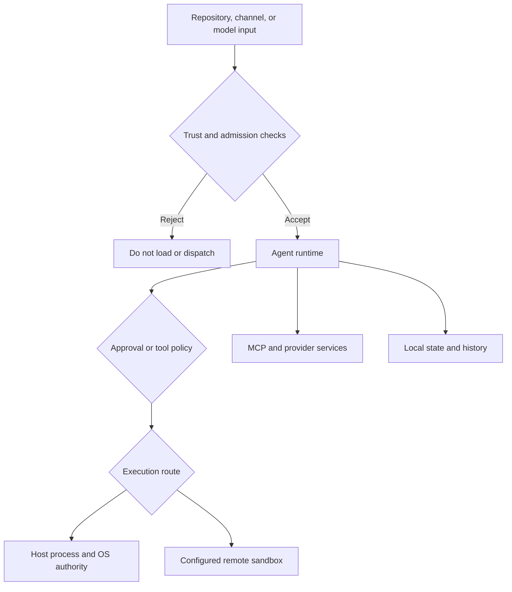

# Security Boundaries and Trust Decisions

## Read this as a boundary map

Neither **dcode** nor **Talon** turns untrusted natural-language input or repository content into safe code execution. Their controls decide what configuration, extensions, tools, channels, and storage may enter a run; OS identity, filesystem permissions, network policy, credential scope, and a correctly configured remote sandbox remain the containment boundary.

Talon is experimental alpha software, not a production or multi-tenant security boundary. It lacks production-grade complete HITL policy and channel-administrator controls. Anyone admitted by a Talon channel can influence an agent with the operator's configured model, MCP, channel, and—unless sandboxed—host authority.

```mermaid
flowchart TD
    Input["Repository, channel, or model input"] --> Gate{"Trust and admission checks"}
    Gate -->|"Reject"| Drop["Do not load or dispatch"]
    Gate -->|"Accept"| Agent["Agent runtime"]
    Agent --> Policy{"Approval or tool policy"}
    Policy --> Exec{"Execution route"}
    Exec --> Host["Host process and OS authority"]
    Exec --> Sand["Configured remote sandbox"]
    Agent --> External["MCP and provider services"]
    Agent --> State["Local state and history"]
```

*Trust gates constrain selected entrypoints; they are not a substitute for execution isolation or secret isolation.*

## dcode: workspace identity and project code

dcode's local `langgraph dev` server receives configuration through its server schema, builds the agent and MCP tools, and caches runtime resources. When execution includes a workspace context, the server—not the client—requires a persisted thread/workspace binding before selecting the workspace runtime.

A binding canonicalizes an existing absolute `cwd` and project root, stores server-resolved policy and fingerprints in SQLite, and exposes only identity fields to the client. On later execution, the echoed context and fingerprint must match. Policy changes are refused rather than silently changing a bound thread's authority; a model/runtime-only change rebuilds the runtime while preserving the compatible binding and its state. This prevents a client-provided path or a later config change from quietly retargeting an existing thread.

### Repository hooks and Python extensions

Project hooks and project extensions are executable repository content. Treat an approval as permission to run arbitrary Python or subprocess-capable code under the dcode process account—not as a review of individual tool calls.

- Project hook trust is resolved for the current workspace every time it matters. A one-session grant includes a content fingerprint, so changing `hooks.json` invalidates that session grant. Persisted trust is keyed by canonical workspace root and survives a hook edit; it must therefore be revoked deliberately when project ownership or intent changes.
- Headless operation uses an explicit-only hook policy: an interactive remembered grant does not silently authorize a later headless run.
- The trust store uses a process lock plus a sidecar file lock, restrictive directory/file modes, atomic replacement, and refuses to overwrite an unreadable or malformed store. Read failures resolve as untrusted.
- Extensions are experimental and only considered when the experimental flag and extension setting are enabled. User directories, trusted user-config paths, CLI paths, installed plugin manifests, and Python entry points are operator-supplied sources. Project `.deepagents/extensions` is considered only when project trust is explicitly granted, remembered, or configured `always`; `never` disables project extension loading.
- Loading an extension imports its module and calls its asynchronous `extension` factory. Import-time code already executes before the factory is checked. Failed initialization rolls its registrations back, but it does not undo arbitrary effects performed by imported code.

Extensions can dynamically replace or add tools at model-call and tool-dispatch time. Their backend routes cannot overlap dcode's protected internal storage; with a sandbox active, a directly registered `FilesystemBackend` is rejected. That validation is intentionally shallow, so a custom wrapper backend owns its isolation guarantee. Treat every trusted extension and plugin as part of the trusted computing base.

### Project MCP configurations

MCP configuration can start a stdio process or send agent data and headers to a remote endpoint. dcode records discovery provenance instead of trusting a path merely because it looks user-local: the exact profile `.mcp.json` is user scope, while `<project-root>/.deepagents/.mcp.json` and `<project-root>/.mcp.json` are project scope. If identity is ambiguous or a relocated profile config collides with project discovery, the config is demoted to project scope rather than inheriting user trust.

Project servers are filtered before activation. A disabled name always wins; otherwise a server needs a trusted whole config or a user-controlled scoped approval/allowlist. Use `--trust-project-mcp` only as an explicit run decision, review stdio commands, arguments, environment, remote URLs, headers, and OAuth scope, and re-approve materially changed server definitions. Configuration interpolation supports only `${VAR}` and `${VAR:-default}` in supported fields; malformed references and missing required variables fail rather than being passed through.

## Talon: admission is not authorization

Talon channel exposure defaults to `self`. `allowlist` admits configured conversation IDs or matching mention patterns, and `open` admits arbitrary inbound messages only after the channel-specific acknowledgement value `allow-arbitrary-senders`. These controls stop unadmitted messages before media preparation and host dispatch; they do not constrain what an admitted prompt can ask the operator-authorized agent to do.

Discord and Slack reject unadmitted inbound messages before preparing media or dispatching. Optional pairing is unavailable in `open` mode and only supports Discord, Slack, and Telegram DMs. It gives a sender/provider-bound code to the operator, expires in one hour, and persists approved senders under the assistant home. A corrupt or unreadable pairing store fails closed for paired senders. Pairing grants agent access, not Talon-administrator authority; environment-configured access must be removed separately.

WhatsApp's paired account defaults to `self`. In particular, `DEEPAGENTS_TALON_WHATSAPP_EXPOSURE=open` requires `DEEPAGENTS_TALON_WHATSAPP_OPEN_ACK=allow-arbitrary-senders`. Do not set it for a bot intended to mediate untrusted users.

## Talon state, approvals, MCP, and history

Talon validates the assistant ID, namespaces state under its per-assistant home, and creates the home/state directories with mode `0700`. It rejects named state paths that resolve outside that home. This protects against accidental exposure and traversal, not against the Talon process itself, a same-UID process, or a privileged host user.

The default host opens a local SQLite checkpointer and conversation archive together and wraps the checkpointer in `ConversationSaver`. The archive scope for history tools comes from a trusted invocation-scope provider rather than model arguments; the model can list, search, and read only that scope. Archives have no automatic retention expiry. Treat prompts, tool arguments/results, archives, checkpoints, pairing state, `tools.json`, manifests, and OAuth material as sensitive retained data.

A history URI selects the configured/default SQLite store, MongoDB, PostgreSQL, or exactly one installed history-backend entry point, with an assistant-ID namespace. Startup replaces backend errors that may contain connection credentials with generic configuration errors. Plugin entry points are operator-installed code; a remote URI is also data egress and a database-credential boundary.

Tool approvals are prompt policy, not authorization or containment. The store accepts exact tool-name boolean entries, saves changes with locked revision compare-and-swap, and snapshots policy for an invocation. A saved update applies to the next invocation; `false` means no approval prompt, not permission. Updating the policy tool additionally requires the trusted operator marker and an active snapshot. Do not assume an agent shell, remote graph, or same-UID local process is constrained by this file.

Talon's MCP configuration read/update tools redact stored strings, but that is explicitly not a confidentiality control. With the default local shell backend, the agent can read a readable absolute path and bypass mediated tools. OAuth credentials are cleartext files hardened with owner-only modes, a lock, and atomic replacement; those protections do not hide them from that shell. Keep secrets outside the workspace **and** inaccessible to the Talon process if they must not be disclosed.

## Execution and sandbox limits

Without `DEEPAGENTS_TALON_SANDBOX`, Talon uses an unsandboxed `LocalShellBackend` with `virtual_mode=False`. It launches shell children with a curated environment and safe `PATH`, rather than inheriting the process environment, which reduces accidental credential and startup-hook inheritance. It does not prevent commands from reading any path the Talon process can access.

With `DEEPAGENTS_TALON_SANDBOX`, Talon starts or attaches to a remote sandbox for the host lifetime. A startup failure is fatal rather than falling back to host execution; an attached sandbox ID is never deleted by Talon. The backend routes execution and default filesystem operations to the sandbox, while only assistant `skills/` and `memory/` remain host filesystem routes. `tools.json` and other assistant state are not host-routed, and sandbox-mode memory paths outside the assistant memory directory are ignored.

This is deliberately partial isolation: MCP tools, web operations, channel media, and provider credentials remain in the Talon host process. Use a separate OS identity and network/credential policy for that process even when a sandbox is enabled.

## Operational checklist and focused tests

1. **Classify every input and principal.** Treat repositories, MCP replies, history, media, web content, and channel messages as potentially adversarial instructions. Do not expose Talon channels or trust a dcode project unless its users may exercise the resulting authority.
2. **Default-deny project code.** Keep project hooks/extensions/MCP untrusted until an operator reviews and grants the correct workspace-specific trust. For CI/headless dcode runs, require explicit project-hook trust.
3. **Protect the runtime identity.** Do not reuse a thread across a different workspace or weaken a bound workspace policy. Handle a policy-drift refusal by intentionally re-binding/restarting after review, not by bypassing it.
4. **Minimize Talon admission.** Start with `self`; use narrow allowlists; keep `open` exceptional. Verify pairing out of band and revoke pairing/configured IDs independently.
5. **Separate secrets and host authority.** Put assistant homes and MCP configuration outside repositories, but rely on separate identities/key stores/sandboxing—not redaction or file modes alone—where the agent must not read a secret.
6. **Verify sandbox reality.** Test provider startup failure, execution routing, host `skills/`/`memory/` exceptions, and the fact that MCP/media/web remain host-side before treating a deployment as isolated.
7. **Manage retained history.** Secure the local or remote store, define retention/backups/deletion, and recognize that remote semantic embedding sends archived text and queries to its provider.

Focused tests should cover corrupted trust/pairing/approval stores failing closed; project-hook session grant invalidation on edits and headless explicit opt-in; workspace context and policy drift rejection; project MCP provenance collisions and disabled-server precedence; extension protected-route rejection; pre-dispatch channel rejection; sandbox startup without host fallback; and history/backend errors that avoid leaking credential-bearing URIs.
