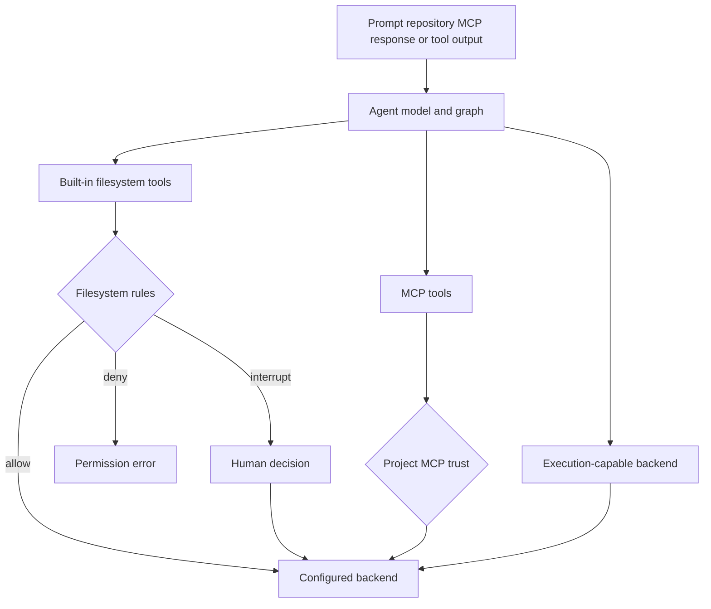

# Security and Operational Boundaries

## Trust model: tools and the runtime are the boundary

Deep Agents follows a **trust-the-LLM** model: an agent can do what its configured tools and backend allow. Instructions in a prompt, a repository, tool output, an MCP response, or a generated title are data for a model, not an access-control mechanism. Put confidentiality, integrity, and egress boundaries in the backend, sandbox, operating-system identity, network policy, and explicit tool configuration—not in a system prompt or in the expectation that the model will decline unsafe instructions.

This distinction matters for all controls below:

- `FilesystemPermission` constrains Deep Agents' built-in filesystem **tools**; it does not mediate direct backend use.
- Human approval pauses a configured tool call; it is not a sandbox or a credential boundary.
- A workspace binding prevents a client or a stale thread from silently changing the server-selected workspace and resource policy; it does not make a workspace safe to execute.
- Project configuration, `.env`, MCP definitions, and repository contents should be treated as untrusted input until an operator or trusted policy admits them.

```mermaid
flowchart TD
    Input["Prompt repository MCP response or tool output"] --> Agent["Agent model and graph"]
    Agent --> Fs["Built-in filesystem tools"]
    Agent --> Mcp["MCP tools"]
    Agent --> Exec["Execution-capable backend"]
    Fs --> Rules{"Filesystem rules"}
    Rules -->|"deny"| Refuse["Permission error"]
    Rules -->|"interrupt"| Review["Human decision"]
    Rules -->|"allow"| Backend["Configured backend"]
    Review --> Backend
    Mcp --> Trust{"Project MCP trust"}
    Trust --> Backend
    Exec --> Backend
```

*The graph's policy mechanisms gate mediated tool calls; the selected backend, MCP configuration, process identity, and network controls ultimately define authority.*

## Filesystem permissions and approval flow

`FilesystemPermission` is a declarative rule containing `read` and/or `write` operations, absolute POSIX glob paths, and an `allow`, `deny`, or `interrupt` mode. Paths with `..` are rejected and `~` is unsupported. Rules are checked in declaration order, with the first matching rule taking effect; when no rule matches, the built-in filesystem tool is allowed. Design allowlists with a later catch-all deny when the intended policy is “only this subtree,” for example an allow under `/workspace/**` followed by a deny for `/**`.

`deny` causes the tool to return a permission error. Read-denied entries are filtered from `ls`, `glob`, and `grep` results, so a bulk search cannot disclose a denied path merely by listing it. Writes cover `write_file`, `edit_file`, and `delete`. Recursive deletion receives additional conservative protection: if a denied write pattern can overlap the target subtree, deletion is refused before anything is removed. This prevents a broad delete from bypassing a more-specific denied descendant.

`interrupt` is converted during graph assembly into `HumanInTheLoopMiddleware` rules. Exact-path tools interrupt only for a matching path. Bulk tools (`ls`, `glob`, `grep`, and recursive deletion) interrupt when their search area may overlap an interrupt rule; a pathless bulk request is treated conservatively. The `glob` predicate separately considers an absolute pattern, so `path="/workspace"` cannot hide a glob rooted at another location. An approver may approve, edit, reject, or respond; an edited call is still subjected to the tool's pre-execution deny check.

Permissions are a **tool-level** control. `create_deep_agent` documents that direct calls to the backend do not incorporate these rules. Execution requires a backend implementing `SandboxBackendProtocol`; therefore use an execution backend with its own filesystem, process, and network isolation if arbitrary commands must not inherit the application process's authority. Subagents inherit the parent rules only when they do not specify their own `permissions`; a subagent-supplied list replaces the inherited policy. Remote async subagents also require their own approval configuration.

## Approval is deliberate interaction, not authorization

Use interrupt rules or `interrupt_on` for actions an operator needs to inspect in context, such as writes outside a routine work area, destructive operations, or sensitive MCP calls. Approval is meaningful only if the serving application presents the paused state to an authenticated human and resumes with that decision. It does not retroactively constrain already-issued credentials, direct backend access, an unmediated tool, or a remote service's authority.

For operational safety, make the default backend and tool set least-privileged first, then use approval as an additional decision point. Test both approval and rejection paths, including an edited request whose destination moves into a denied path.

## Configuration and dotenv are trust-sensitive inputs

Deep Agents Code recognizes that a checked-out project can carry hostile configuration. Project dotenv loading is separately configurable. The loader denies high-risk variables from every dotenv layer, including process/profile relocation, dynamic-loader settings, interpreter and shell startup hooks, `PATH`/`PYTHONPATH`, askpass helpers, and Git execution/configuration injection. It also blocks project `.env` from setting trust decisions such as the project MCP allow/deny lists, the Auto approval classifier model and timeout, forked-subagent behavior, and the graph recursion default.

The dotenv precedence is shell, then nearest project `.env`, then global profile `.env` for otherwise-unset values. Before loading a project `.env`, the loader reads the trusted global `startup.read_project_dotenv` toggle. If that global file cannot be inspected, it skips the project file rather than assuming project dotenv is allowed. This is intentionally fail-closed against a repository-controlled `.env`; deployers who do not need it should disable project dotenv loading.

Do not place secrets, endpoint authority, or approval-policy choices in a cloned repository. Supply them through the launch environment, a managed/user-level configuration surface, or platform secret injection, and run the service under an OS identity that has access only to the needed material.

## MCP: project definitions require an out-of-repository grant

A project `.mcp.json` may describe a local command or a remote endpoint that performs discovery with environment interpolation. Deep Agents Code therefore loads project-MCP trust lists only from user-level or managed configuration and selected process environment variables, never from repository configuration. A project cannot self-approve a malicious MCP server by committing both `.mcp.json` and an in-repo config or `.env`.

Project-server approval is scoped rather than merely name-based: persisted approval includes a server-definition fingerprint and binds fixed remote URLs to a validated local Git repository, while local commands and interpolated remote URLs are bound to the exact worktree. A changed definition or different clone asks again. Managed policy has highest precedence; a managed explicit approval list can replace lower permissive grants. Denies accumulate across sources and rejection wins. If trust configuration is unreadable or malformed, callers receive a read error so they can treat project configuration as untrusted rather than silently treating the deny list as empty.

The `DEEPAGENTS_CODE_DANGEROUSLY_ENABLE_PROJECT_MCP_SERVERS` setting is an explicit process-level escape hatch, not a repository setting. Review each approved MCP server as code plus egress policy: stdio commands execute locally, and remote servers can receive requests and any headers or environment-derived values that the configuration permits.

## MCP OAuth credentials are protected files, not a vault

`FileTokenStorage` persists MCP OAuth state under the selected profile's state directory in `mcp-tokens`. Token-file names require safe server names and include a hash of the server URL, separating identically named servers at different endpoints. The JSON envelope can contain bearer tokens, client registration data, OAuth metadata, and expiry state. Treat it as credential material.

Writes serialize a read-modify-write operation with an in-process path lock, create the token directory with owner-only permissions where supported, write a temporary file using mode `0600`, atomically replace the destination, and apply `0600` again. The implementation warns when it cannot set directory mode `0700` or file mode `0600`. Atomic replacement ensures a reader sees an old or new complete file rather than a partial JSON document; it does not protect against another process that can read the account's files.

Token values must never be logged: the OAuth token model's normal representation includes access and refresh tokens. Corrupt, non-object, or unsupported-version token files fail with recovery instructions to delete the file and log in again. Back up or migrate this state only through a protected secret-handling process; do not commit it, expose it through shared volumes, or assume file modes defend against the same user, an administrator, or a compromised host.

## Server-authoritative workspace sharing

In server mode, a thread's workspace is not a client-owned capability. `bind_thread_workspace` validates an untrusted `cwd` as an existing absolute canonical directory without traversal, resolves its project root, and persists an immutable thread binding in SQLite. The binding records workspace identity, a server-resolved policy payload, and policy/runtime fingerprints. The public payload deliberately excludes the persisted policy and fingerprints; a client can echo workspace identity but cannot assert the server policy.

On each run, `require_thread_workspace` requires a matching payload and, when supplied, matching server configuration fingerprint. It rejects unbound threads, substituted/stale context, configuration mismatch, unsupported schemas, and a workspace whose resolved identity changed. Binding is transactionally serialized with `BEGIN IMMEDIATE`; concurrent first claims cannot mix different workspaces. A compatible runtime/model change can refresh the runtime fingerprint, but policy drift is refused. Persisted workspace policy is intentionally non-secret: tests verify that model API keys and system prompts are excluded.

Use this boundary when multiple clients can reconnect to a server, but keep tenant isolation outside it. The database, workspace directories, session/checkpoint storage, model provider, and tool backend still need deployment-specific authentication, authorization, storage permissions, and network segmentation.

## Untrusted model inputs and secondary model calls

Repository text, shell output, MCP responses, and conversation content can contain prompt injection. Preserve provenance where possible, minimize what a secondary model receives, and do not reuse user-controlled instructions as privileged system content. Deep Agents Code's thread-title generator illustrates this approach: it labels the conversation untrusted in its system prompt, sends only human and AI text, excludes system/internal/control and user-shell messages, caps input at 8,000 characters, disables callbacks, runs a tool-free model, applies a 10-second timeout, and normalizes the resulting title to the same safe shape as a manual name.

This containment is scoped to title generation; it does not sanitize the primary agent conversation or turn malicious text into trusted content. For any new summarizer, classifier, extractor, or automation model call, define an explicit data allowlist, size limit, tool/callback policy, timeout, output validation, and a no-secret/no-privilege assumption.

## Deployment checklist and focused tests

1. **Choose the enforcement layer.** Use a sandboxed execution backend, separate service account, read-only mounts, restricted egress, and narrowly scoped credentials for hard boundaries. Do not rely on prompting, filesystem middleware, or approval alone.
2. **Make filesystem policy explicit.** Use absolute patterns, test first-match ordering, include a catch-all deny for isolation, and test bulk-search filtering and all-or-nothing recursive deletion.
3. **Protect the approval surface.** Ensure only authenticated operators can decide interrupts, record decisions as appropriate for the deployment, and test malformed, pathless, and edited tool requests.
4. **Treat repositories as hostile until trusted.** Disable project dotenv where practical; keep trust controls in launch, user, or managed configuration; review project MCP definitions before granting an out-of-repository approval.
5. **Operate OAuth state as a secret.** Protect the selected profile state directory, watch permission-hardening warnings, avoid token logging, and verify corrupt-file recovery and endpoint-separated storage.
6. **Keep workspace identity server-side.** Require bindings on every server run, reject policy drift, protect the SQLite database, and do not persist credentials or prompts in workspace-policy records.
7. **Test injection boundaries.** Include adversarial repository text, tool output, shell output, and MCP responses in tests for secondary model calls and approval flows.

See [permissions and HITL](/openwiki/concepts/permissions-hitl.md), [filesystem tools](/openwiki/concepts/tools-filesystem.md), [MCP](/openwiki/integrations/mcp.md), and [sandbox providers](/openwiki/integrations/sandbox-partners.md) for adjacent component guidance.
