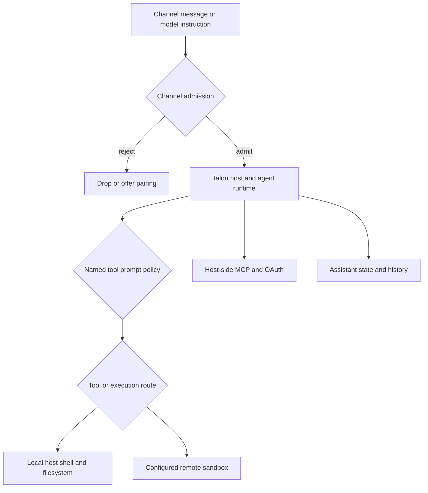

# Security Boundaries and Operational Risks

## Start with the actual boundary

> **Talon is experimental alpha software, not a production-grade security boundary.** It is not intended for production or enterprise use and does not provide complete production-grade HITL policy, channel-administrator controls, sandbox execution isolation, or multi-tenant boundaries. Treat channel access as access to the operator's configured agent, model credentials, MCP tools, and—unless execution is sandboxed—local-host resources.

Admission, redaction, approval prompts, restrictive file modes, and workspace-placement warnings each solve narrower problems. None prevents a host-executing agent from using authority already available to the Talon process. Use a dedicated OS identity, least-privilege credentials, host filesystem permissions, network egress controls, and a sandbox provider whose deployment policy has been reviewed.

```mermaid
flowchart TD
    Input["Channel message or model instruction"] --> Admit{"Channel admission"}
    Admit -->|"reject"| Drop["Drop or offer pairing"]
    Admit -->|"admit"| Host["Talon host and agent runtime"]
    Host --> Prompt{"Named tool prompt policy"}
    Prompt --> Execute{"Tool or execution route"}
    Execute --> Local["Local host shell and filesystem"]
    Execute --> Sandbox["Configured remote sandbox"]
    Host --> MCP["Host-side MCP and OAuth"]
    Host --> State["Assistant state and history"]
```

*Channel admission decides who can invoke the agent; execution routing and the process identity determine what that invocation can reach.*

## Channel exposure is an invocation gate

Talon's shared exposure policy defaults to `self`. In `self`, an adapter accepts a host-recognized self message or a configured operator ID. `allowlist` accepts configured conversation IDs or glob-style mention patterns; those patterns match message text and are not sender authentication. `open` accepts every message, but startup requires the provider-specific `*_OPEN_ACK=allow-arbitrary-senders` acknowledgement and logs that arbitrary senders can reach operator credentials and local-host access.

For WhatsApp, the paired account defaults to `self`. `DEEPAGENTS_TALON_WHATSAPP_EXPOSURE=allowlist` can limit triggering chats or mentions. `DEEPAGENTS_TALON_WHATSAPP_EXPOSURE=open` additionally requires `DEEPAGENTS_TALON_WHATSAPP_OPEN_ACK=allow-arbitrary-senders`; do not use it to mediate untrusted users.

Adapters make this decision before expensive work and before host dispatch. For example, Slack constructs a normalized message, rejects an unadmitted event before fetching thread context or preparing media, and may offer pairing only after rejection. A successful admission is **not** a constrained user session or administrator role: it lets the sender influence the operator-authorized agent.

### Pairing is revocable invocation access, not operator authority

Optional sender pairing is supported for Discord, Slack, and Telegram, not WhatsApp, and cannot be enabled with `open` exposure. Pending requests are sender- and provider-bound, use a cryptographically generated code with a one-hour lifetime, and are approved through operator surfaces. The private assistant-home store uses a sidecar lock and atomic replacement; unreadable or invalid pairing state fails closed for paired access, although environment-configured admission remains available.

A paired sender may invoke the agent in every chat visible to the adapter, but cannot administer Talon controls such as pairing or tool-approval policy. Revoke configured IDs in configuration; revoke a paired sender through the live host when immediate containment matters, because host revocation also cancels tracked work and pauses that sender's jobs.

## Host execution is the high-power default

Without `DEEPAGENTS_TALON_SANDBOX`, Talon builds a `LocalShellBackend` with `virtual_mode=False`. The shell child does not inherit the full process environment: Talon passes only allowed session variables, sets a fixed safe `PATH`, and scrubs credential markers and known loader, interpreter, and shell-startup hooks. This reduces accidental environment leakage, but it is not filesystem confinement. A command can read or modify paths reachable by the Talon process, including by absolute path.

This is why `FilesystemPermission` rules, mediated configuration tools, and putting a sensitive file outside `DEEPAGENTS_TALON_WORKSPACE` cannot protect a secret from a host-executing Talon agent. Filesystem middleware provides permission checks for filesystem tools while an execution-capable backend adds `execute`; Talon's MCP configuration code explicitly treats placement as a warning, not secrecy. Moving a file out of the workspace removes a relative-path route and model-working-tree exposure, not the absolute-path route. If the agent must not read a secret, keep it in a key store or directory inaccessible to the Talon process, preferably under a separate identity.

## MCP configuration: mediated change, not confidentiality

`MCPConfigStore` exposes `get_mcp_configuration` and `update_mcp_server` for an operator-selected file. The view redacts stored strings except transport/auth enums and exact `${ENV_VAR}` references, and does not expand those references. Updates use an HMAC-derived revision, a sidecar lock, validation, and atomic replacement; a successful write requests reload, and the new capability becomes available only after a successful reload before a subsequent turn. Running tasks keep their prior capabilities.

Redaction supports safer model-facing inspection and editing, but is **not** a secret boundary. With the default local shell, the agent can read or overwrite a readable absolute configuration path outside these tools, bypassing redaction, CAS, `O_NOFOLLOW`, and a configuration-update approval. Do not present configuration redaction or workspace placement warnings as protection from a host-executing agent.

The managed schema limits fields and validates server shape. It permits `${NAME}` references in command, URL, arguments, environment, and headers, rejects malformed references, and validates remote OAuth settings. When an unapproved update tries to preserve a `<redacted>` value, it may change only tool filters: changing another managed setting could redirect an unseen stored credential to a command or endpoint selected by the model. A deliberately approved change can still execute a local command or send credentials to a remote endpoint, so treat MCP server definitions and reloads as privileged operational changes.

### OAuth credentials and interactive authorization

MCP OAuth credentials are stored in cleartext JSON under `~/.deepagents/mcp-tokens`. The filename incorporates the server URL and, for non-default public-client settings, the OAuth configuration identity; this separates credentials for distinct endpoints or client configurations. The storage directory is hardened to mode `0700`, files to `0600`, and updates are lock-protected and atomically replaced. Refreshes retain a prior refresh token when a refresh response omits one; a fresh authorization records the new grant rather than carrying an old refresh token forward.

These file protections reduce accidental exposure and concurrent-write loss. They do **not** protect tokens from Talon's default shell backend or another process with the same effective authority. Use OS- or deployment-level secret isolation for credentials the runtime must not disclose.

For an attended channel OAuth code flow, the runtime creates a task-local binding with server name, invocation ID, expiry, and expected redirect URI. The host delivers the authorization URL outside model context, records the provider, conversation, initiating sender, and agent conversation, then accepts a callback only from that same binding context before passing it to the OAuth provider. Device-code instructions likewise go through the host rather than model text. Scheduled jobs and background-result turns receive no authorization handler and fail rather than waiting for a nonexistent user.

Explicit public OAuth configuration accepts only `client_id`, `callback_url`, and `scopes`; it has no client secret field. A custom callback must be a canonical HTTP loopback URL with an explicit valid port and path and no credentials, query, or fragment. Scopes require an explicit client ID. These checks constrain configuration and diagnostics, but the selected MCP server and OAuth scope remain an operator trust decision.

## Approval policy is not authorization or containment

Each assistant can maintain `tools.json`, an exact tool-name-to-boolean prompt policy. Missing policy files receive defaults for selected sensitive operations. `true` means the named call should prompt; `false` and an absent key mean no prompt, **not** permission, availability, or authorization. The store validates bounded regular JSON without duplicate or wildcard names, locks and compare-and-swaps revisions, and atomically writes updates.

Every invocation receives an immutable approval snapshot. A saved policy applies to the next invocation, so an in-flight graph retains its original prompt policy. Updating the policy additionally requires a trusted operator marker and an active snapshot; the pre-edit policy governs the policy-edit tool itself. Do not use `tools.json` as an ACL for shell commands, MCP internals, opaque remote graphs, or same-UID processes.

## Sandboxing changes execution routing, not the whole trust plane

Set `DEEPAGENTS_TALON_SANDBOX` to opt into a `deepagents-code` remote sandbox provider. Talon opens or attaches to it for the host lifetime. An owned sandbox is cleaned up on exit; `DEEPAGENTS_TALON_SANDBOX_ID` attaches an existing sandbox that Talon does not delete. If configured sandbox startup fails, Talon raises an error instead of silently falling back to host execution.

In sandbox mode, Talon's composite backend routes default filesystem operations and every `execute` call to the remote sandbox. It retains virtual host filesystem routes only for the assistant `skills/` and `memory/` directories; this keeps `tools.json` and other assistant state out of sandbox tool reach. Memory paths outside that assistant memory directory are ignored because they would otherwise be created on the host but read from the sandbox.

This is partial isolation, not a multi-tenant boundary. MCP and web tools, channel media handling, provider credentials, and host-side state remain in the Talon process. Select a provider based on its actual image, network, filesystem, identity, retention, and egress controls; provider protocol conformance alone does not establish containment.

## State and retained-data operations

Talon validates assistant IDs, namespaces state under a per-assistant home, creates the home and state directories with mode `0700`, and rejects configured state paths that resolve outside the home. This protects against accidental path traversal and inappropriate access by other OS users, not the Talon process itself, same-UID processes, or host administrators.

Conversation checkpoints and archives retain prompts, messages, tool arguments and results according to their configured lifecycle. The default archive has no automatic expiry. Secure backups and remote history databases, define retention and deletion procedures, and assess egress before enabling remote embedding: remote adapters send archived text and queries to their provider. Local activity logs redact and truncate tool values, but may still contain sensitive application data; enable them only where log access is controlled.

## Deployment safeguards and focused verification

1. **Keep Talon out of production trust roles.** Do not expose it as a multi-tenant service or assume its HITL, channel rules, or sandboxing form a production security boundary.
2. **Minimize callers.** Start at `self`, use narrow static allowlists, and make `open` exceptional. Treat mention patterns as text triggers, not identity checks. Verify pairing approvals out of band and revoke paired access through the running host.
3. **Separate authority.** Run Talon under a dedicated OS account with narrowly scoped model, channel, database, and provider credentials. Limit network egress and protect the assistant home, backups, logs, and history store.
4. **Treat MCP as code and egress.** Review stdio commands, arguments, URLs, headers, OAuth scopes, and tool filters. Prefer `${ENV_VAR}` references over literal credentials, but do not confuse them or config redaction with isolation.
5. **Use a real sandbox deliberately.** Test the selected provider's network, identity, data retention, and cleanup behavior. Confirm that sandbox startup failure halts deployment and that only `skills/` and `memory/` remain host-routed.
6. **Test the failure paths.** Cover pre-dispatch Slack rejection and pairing-store failure; CAS and inactive policy snapshots; MCP redaction-restoration and unsafe auto-approved-update rejection; cleartext token modes, atomic writes, endpoint/configuration isolation, and malformed-file diagnostics; OAuth callback sender/conversation binding and unattended authorization failure; and sandbox startup without host fallback.

See [Talon channel admission](/openwiki/concepts/talon-channel-admission.md), [permissions and HITL](/openwiki/concepts/permissions-hitl.md), [MCP](/openwiki/integrations/mcp.md), [sandbox providers](/openwiki/integrations/sandbox-partners.md), and [the Talon runtime](/openwiki/integrations/talon.md) for component-level behavior.
