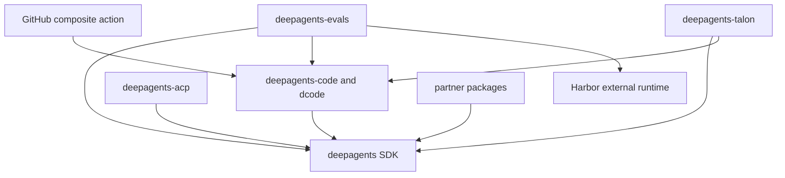

# Deep Agents Monorepo Quickstart

Deep Agents is an opinionated agent harness. `create_deep_agent()` configures backends, subagents, skills, memory, profiles, and middleware, then delegates construction to LangChain's `create_agent()` on the LangGraph runtime. This page is the maintainer entry point: choose the owning package and task boundary here, then follow the focused guide rather than treating the checkout as one deployable Python project.

## Choose an entry path

- **Try the coding agent:** dcode is the prebuilt terminal product.

  ```bash
  curl -LsSf https://langch.in/dcode | bash
  dcode
  ```

  For interactive, headless, resume, approval, MCP, sandbox, or ACP work, use [Run and Change a dcode Session](./workflows/run-dcode-session.md).
- **Build an agent:** install the SDK with `uv add deepagents`, then call `create_deep_agent(model=..., tools=..., system_prompt=...)`. Follow [Build and Customize a Deep Agent](./workflows/build-a-deep-agent.md).
- **Change this checkout:** enter the package that owns the behavior, run `uv sync --all-groups` (or the needed package group), and use that package's `make` targets. See [Development, CI, and Releases](./operations/development.md) before changing dependencies, locks, or release metadata.

## Start with the owner

Deep Agents is a three-layer stack:

- **LangGraph** owns graph state, checkpoints, streaming, and interrupts.
- **LangChain `create_agent`** owns the model, tools, middleware, and agent loop.
- **Deep Agents** is the opinionated harness above `create_agent`, not a new runtime; it supplies default middleware, backends, and profiles.

Use [Architecture Overview](./architecture/overview.md) to locate the layer, [Source Map and Public Surfaces](./architecture/source-map.md) to locate implementation and nearby tests, and [SDK Construction and Execution](./architecture/sdk-construction-execution.md) for construction-to-execution flow.

This is a monorepo of independently versioned packages under `libs/`; there is no root `pyproject.toml`. Each package has its own `pyproject.toml`, `Makefile`, and README. Work inside the package you change. Local sibling dependencies are editable, so a consuming package can observe a source change without publishing it first.

| Package | Path | `requires-python` | Owns |
| --- | --- | --- | --- |
| `deepagents` | `libs/deepagents/` | `>=3.11,<4.0` | SDK harness: `create_deep_agent`, middleware, backends, and profiles. |
| `deepagents-code` / dcode | `libs/code/` | `>=3.12,<4.0` | Prebuilt terminal coding application: CLI, TUI, sessions, tools, configuration, and runtime. |
| `deepagents-acp` | `libs/acp/` | `>=3.11` | Reusable Agent Client Protocol adapter for editor integration. |
| `deepagents-evals` | `libs/evals/` | `>=3.12,<3.14` | Real-model evaluations and Harbor benchmarks. |
| `deepagents-talon` | `libs/talon/` | `>=3.12` | Experimental long-running local host, channel adapters, and schedules. |
| Partner packages | `libs/partners/` | Current provider packages: `>=3.11,<4.0` | Daytona, Modal, Runloop, Vercel, and QuickJS SDK integration boundaries. |
| GitHub Action | repository-root `action.yml` | Not a Python package | Composite workflow adapter that installs and runs dcode. |

The compatibility ranges are **package-local**, not a repository-wide promise. Select an interpreter that satisfies the manifest of the package you run: evals excludes Python 3.14, while the SDK and dcode permit it; ACP and Talon state no upper bound. `uv` provisions a suitable interpreter—do not create a repository-wide Python pin.

## Understand package relationships

These arrows are declared manifest dependencies, not a runtime call graph. dcode depends on the SDK; ACP depends on the SDK; evals and Talon each consume the SDK and dcode; evals also consumes Harbor. The provider packages consume the SDK but remain separately released integration boundaries.



Caption: Declared package and integration dependency direction; arrows point from a consumer or adapter to the capability it uses.

Talon is experimental rather than a production or enterprise host. It lacks complete HITL policy, channel administrator controls, sandbox-backed execution isolation, and multi-tenant boundaries. Treat channel access as direct access to the operator's agent, credentials, MCP tools, and local resources; read [Talon Long-Running Assistant Host](./integrations/talon.md) and [Security and Trust Boundaries](./operations/security.md) before operating or extending it.

## Route a change task

| If the task is… | Start with | Then consult |
| --- | --- | --- |
| **SDK:** construct a custom agent or change models, backends, tools, middleware, skills, subagents, memory, or approvals | [Build and Customize a Deep Agent](./workflows/build-a-deep-agent.md) | [SDK Construction and Execution](./architecture/sdk-construction-execution.md), [Middleware Stack and Customization Boundaries](./architecture/middleware-stack.md), [Backends and Storage Routing](./concepts/backends.md), and [Permissions and Human Approval](./concepts/permissions-hitl.md). |
| **dcode:** change the graph, CLI/TUI, loopback client/server boundary, configuration, persistence, streaming, or terminal session | [Run and Change a dcode Session](./workflows/run-dcode-session.md) | [Deep Agents Code Architecture](./architecture/code-agent.md), [dcode Configuration Layering](./concepts/config-layering.md), and [dcode Sessions, Cost, and Observability](./operations/cost-and-sessions.md). |
| **ACP:** connect an editor or decide between the reusable adapter and dcode ACP mode | [Agent Client Protocol Integration](./integrations/acp.md) | [Deep Agents Code Architecture](./architecture/code-agent.md) and [Testing Strategy and Change Validation](./testing/testing-guide.md). |
| **Talon:** change channels, scheduled runs, conversation recovery, or host lifecycle | [Talon Long-Running Assistant Host](./integrations/talon.md) | [Security and Trust Boundaries](./operations/security.md) and [State, Checkpoints, Memory, and Conversation Archives](./concepts/state-persistence.md). |
| **Evaluation:** add or run deterministic eval-harness tests, real-model behavioral evaluations, trials, or Harbor benchmarks | [Run and Extend Evaluations](./workflows/run-evals.md) | [Testing Strategy and Change Validation](./testing/testing-guide.md). |
| **Partner or sandbox:** add a provider, adapt remote execution, or change sandbox lifecycle | [Sandbox and Partner Integrations](./integrations/sandbox-partners.md) | [Backends and Storage Routing](./concepts/backends.md) and [Source Map and Public Surfaces](./architecture/source-map.md). |
| **GitHub Action:** change workflow inputs, credentials, memory cache, workspace, MCP, sandbox, or headless dcode behavior | [GitHub Action Integration](./integrations/github-action.md) | [Run and Change a dcode Session](./workflows/run-dcode-session.md) and [Security and Trust Boundaries](./operations/security.md). |
| **MCP:** add, authenticate, trust, reload, or troubleshoot MCP tools | [MCP Integration and Credential Lifecycle](./integrations/mcp.md) | [Tools, Filesystem, and Execution](./concepts/tools-filesystem.md) and [Security and Trust Boundaries](./operations/security.md). |
| **Release, lock, setup, or validation:** change dependencies or release metadata, or prepare a package change | [Development, CI, and Releases](./operations/development.md) | [Testing Strategy and Change Validation](./testing/testing-guide.md). |

## Safe package-local loop

Use `uv` for interpreters, environments, and dependencies; do not substitute `pip`, Poetry, or Conda. A package-local `Makefile` is the command authority, so run `make help` in the package before assuming a target exists. Use `uv run ...` for one-off commands, and use the fan-out targets from `libs/` only when a repository-wide check is intentional.

For each change: identify the package and runtime layer that own the behavior or state; synchronize that package environment; make the focused edit; and adjust the closest test that observes the boundary. The standard SDK and dcode Makefiles provide `make test`, `make integration_test`, and `make lint`; their unit targets disable network sockets, whereas integration targets do not. Evals has a separate real-model path: `make evals MODEL=<id>` requires a model and runs `tests/evals`, so it complements rather than replaces deterministic tests.

For a broader index, browse [architecture](./architecture/overview.md), [workflows](./workflows/build-a-deep-agent.md), [integrations](./integrations/acp.md), [operations](./operations/development.md), and [testing](./testing/testing-guide.md).
