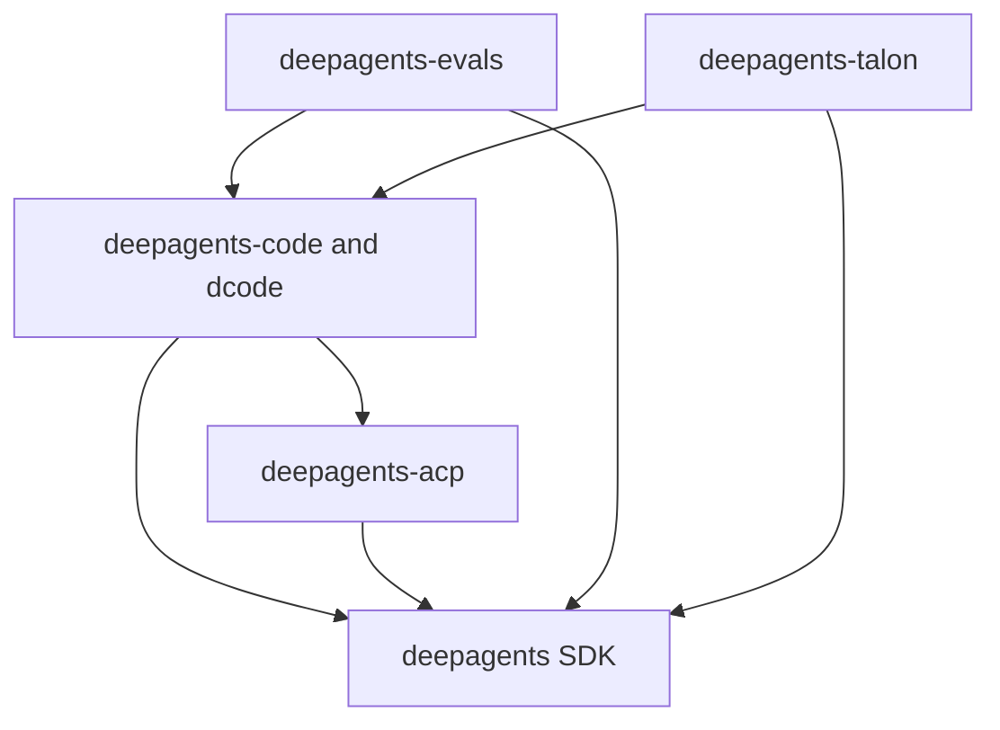

# Quickstart & Wiki Map

Deep Agents is an opinionated agent harness. `create_deep_agent()` assembles its middleware and optional backends, subagents, skills, memory, and profiles on LangChain's `create_agent()`, while LangGraph supplies the graph runtime. Use this page to choose the owner; use the linked domain page before changing implementation details.

## Choose an entry path

| Goal | Supported starting command or API | Owning boundary |
| --- | --- | --- |
| Try the ready-made terminal coding agent | `curl -LsSf https://langch.in/dcode | bash`, then `dcode` | `libs/code` (`deepagents-code`) |
| Build an application-specific agent | `uv add deepagents`; call `create_deep_agent(model=..., tools=..., system_prompt=...)` | `libs/deepagents` |
| Run a custom agent in an ACP-capable editor | `uv add deepagents-acp`; serve `AgentServerACP` with ACP's `run_agent` | `libs/acp` |
| Run the prebuilt coding agent as an ACP server | `dcode --acp` | `libs/code`, using the ACP integration |
| Run model evaluations | From `libs/evals`, `make evals MODEL=<id>` | `libs/evals` |
| Exercise the local long-running host | From `libs/talon`, `AGENT_ASSISTANT_ID=local AGENT_MODEL=<provider>:<model-id> uv run deepagents-talon --once` | `libs/talon` |

`dcode` and `deepagents-code` are both console-script aliases for the same CLI entrypoint. dcode trusts the directory in which it runs; approval gates model-requested tool calls, but project artifacts are read before approval. Do not run it in an untrusted directory without a sandbox backend.

## Ownership model

The runtime layers answer different questions:

- **LangGraph** owns graph execution, state, checkpoints, streaming, and interrupts.
- **LangChain `create_agent`** owns the model, tool, and middleware agent loop.
- **Deep Agents** adds an opinionated harness—defaults, middleware, backends, and profiles—rather than another runtime.

`create_deep_agent()` is the SDK assembly seam. It configures the default middleware stack and optional backends, subagents, skills, memory, and profiles, then delegates construction to LangChain's `create_agent()`. Start with [Architecture Overview](/openwiki/architecture/overview.md) for layer ownership or the [Source Map](/openwiki/architecture/source-map.md) for public seams and focused tests.

## Packages and compatibility

This is a monorepo of **independently versioned packages under `libs/`**. There is no root `pyproject.toml`; every package has its own `pyproject.toml`, `Makefile`, and README. Work inside the package you are changing. Local sibling dependencies are editable, so a consumer sees a dependency's source changes during development.

| Package | Python requirement | Owns |
| --- | --- | --- |
| `libs/deepagents` / `deepagents` | `>=3.11,<4.0` | SDK harness, `create_deep_agent`, middleware, backends, and profiles. |
| `libs/code` / `deepagents-code` | `>=3.12,<4.0` | Prebuilt dcode terminal agent, including its client/server runtime and sessions. |
| `libs/acp` / `deepagents-acp` | `>=3.11` | Agent Client Protocol adapter for a Deep Agent in editors. |
| `libs/evals` / `deepagents-evals` | `>=3.12,<3.14` | Evaluation suite and Harbor benchmark integration. |
| `libs/talon` / `deepagents-talon` | `>=3.12` | Experimental local host for long-running channels and schedules. |
| `libs/partners` | Package-specific | Provider and sandbox integrations: Daytona, Modal, Runloop, Vercel, and QuickJS. |

These are package-local constraints, not one repository-wide Python promise. In particular, evals excludes Python 3.14. Talon is alpha rather than a production security boundary: it lacks complete HITL policy, channel administrator controls, sandbox-backed execution isolation, and multi-tenant boundaries. Treat channel access as direct access to the operator's agent, credentials, MCP tools, and local resources.

### Declared first-party dependencies

The arrows are **manifest dependency** directions, from a consuming package to its dependency—not runtime call flow. `deepagents-code` pins `deepagents==0.7.13` and requires `deepagents-acp>=0.0.10,<1.0.0`; ACP depends on `deepagents`; evals depends on the SDK and dcode; Talon depends on the SDK and dcode. Evals also has external Harbor dependencies, but Harbor is not a package in this diagram.

Caption: Core package dependencies declared in the current package manifests.

## Route a task to its guide

| If the task is… | Start here | Use next when needed |
| --- | --- | --- |
| Build an agent; add tools; select middleware or a backend | [Build a Deep Agent](/openwiki/workflows/build-a-deep-agent.md) | [Architecture Overview](/openwiki/architecture/overview.md), then [Source Map](/openwiki/architecture/source-map.md) |
| Change dcode configuration, graph behavior, streaming, sessions, or its client/server boundary | [Run & Extend a dcode Session](/openwiki/workflows/run-dcode-session.md) | [Deep Agents Code Architecture](/openwiki/architecture/code-agent.md) |
| Integrate an editor or decide between a reusable adapter and `dcode --acp` | [ACP Integration](/openwiki/integrations/acp.md) | [Deep Agents Code Architecture](/openwiki/architecture/code-agent.md) |
| Add an eval, benchmark with Harbor, or interpret evaluation setup | [Run Evals](/openwiki/workflows/run-evals.md) | [Testing Guide](/openwiki/testing/testing-guide.md) |
| Change Talon channels, host lifecycle, scheduling, or local operations | [Talon: Local Runtime Host](/openwiki/integrations/talon.md) | [Source Map](/openwiki/architecture/source-map.md) |
| Add a provider or sandbox integration | The package README and `libs/partners/AGENTS.md` | [Source Map](/openwiki/architecture/source-map.md) |
| Set up, validate, update locks, or prepare a release | [Development & Build Operations](/openwiki/operations/development.md) | [Testing Guide](/openwiki/testing/testing-guide.md) |

## Safe contributor loop

Use `uv` for interpreters, environments, and dependencies; use the affected package's Makefile as the command authority. `uv` provisions a compatible interpreter, so do not pin a global Python version. Start with `make help`; run `uv sync --all-groups` as appropriate and then the package's focused `make test` and `make lint`. Use `libs/` fan-out targets only when a repository-wide check is intended.

For a safe change, identify the package that owns the state or behavior, make the smallest package-local change, and add a test at the boundary that observes it. The [Testing Guide](/openwiki/testing/testing-guide.md) distinguishes offline package tests from externally dependent integration and evaluation work.
