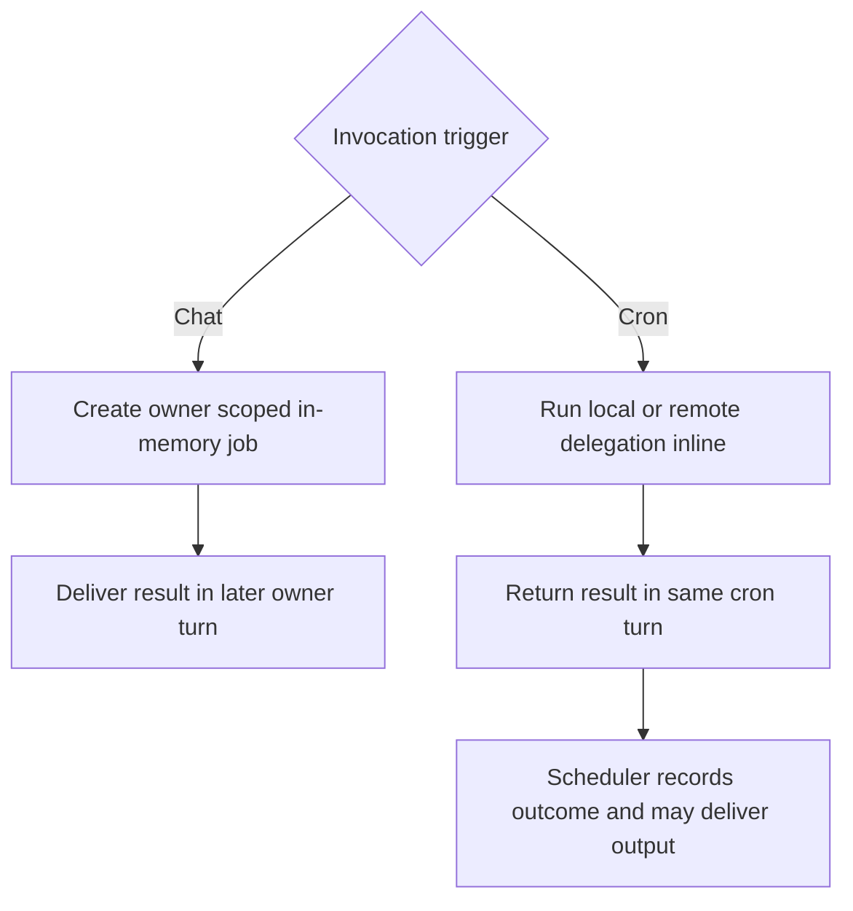
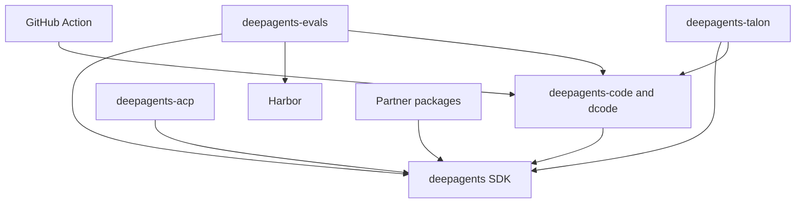

# Deep Agents Repository Quickstart

Start in the package that owns the behavior, not at the repository root. Deep Agents is an opinionated harness: `create_deep_agent()` assembles its middleware and configuration, then delegates agent construction to LangChain's `create_agent()` on the LangGraph runtime. This page routes maintenance work; use the linked pages for the detailed contracts.

## Route the task

| If you are changing… | Start here | Read before changing it | First focused validation |
| --- | --- | --- | --- |
| SDK graph assembly, middleware, backends, permissions, skills, memory, or SDK delegation | `libs/deepagents/` | [Architecture overview](./architecture/overview.md) and [Source map](./architecture/source-map.md) | Closest `libs/deepagents/tests/unit_tests/` test, then `make test TEST_FILE=...` |
| dcode CLI/TUI, client/server execution, rendering, media, debug console, or diagnostic logs | `libs/code/` | [Deep Agents Code architecture](./architecture/code-agent.md) | Closest dcode unit test, then `make test TEST_FILE=...`; use integration coverage for process, ACP, sandbox, or provider behavior |
| ACP stdio sessions, editor projection, cancellation, durable recovery, or `dcode --acp` | `libs/acp/` for the reusable bridge; `libs/code/` for the dcode launcher | [ACP bridge](./integrations/acp.md) and [dcode architecture](./architecture/code-agent.md) | `make test TEST_FILE=...` in the owning package; test ACP mode separately from normal dcode |
| Talon channels, conversations, cron jobs, approvals, or authorization resumption | `libs/talon/` | [Talon long-running host](./integrations/talon.md), [permissions and human approval](./concepts/permissions-hitl.md), and [state persistence](./concepts/state-persistence.md) | Closest Talon test; use `tests/integration_tests/` when host orchestration is the contract |
| **Talon scheduled delegation**—inline local or remote work, fan-out, timeout, result handling, or unattended authority | `libs/talon/deepagents_talon/background.py` | [Talon long-running host](./integrations/talon.md#inline-delegation-in-a-cron-turn), [subagents and skills](./concepts/subagents-skills.md), [permissions and human approval](./concepts/permissions-hitl.md), and [state persistence](./concepts/state-persistence.md) | `make test TEST_FILE=tests/unit_tests/test_background.py`, then scheduler, host, and approval-authority routes below |
| Talon MCP loading, OAuth/login, server status, configuration edits, tool middleware, or reload races | `libs/talon/` | [MCP integration](./integrations/mcp.md) | Focused MCP/auth/middleware/config test, then `make test TEST_FILE=...` |
| Talon local research agents, capability attachment, chat background jobs, or subagent reload | `libs/talon/` | [Subagents and skills](./concepts/subagents-skills.md) | Focused research-subagent, background, or reload test, then `make test TEST_FILE=...` |
| Evaluation scenarios, Harbor staging/jobs, trial aggregation, or model credentials | `libs/evals/` | [Run evals](./workflows/run-evals.md) and [Testing guide](./testing/testing-guide.md) | Unit tests first; use `make evals MODEL=<id>` only for real-model evaluation |
| Provider or sandbox integration | Matching `libs/partners/<provider>/` | [Sandbox and partner backends](./integrations/sandbox-partners.md) | Owning package tests and the integration contract that changed |
| Package metadata, locks, release-please, or cross-package checks | Changed package, then `libs/` only for aggregate work | [Development, CI, and releases](./operations/development.md) | Package validation; `make -C libs lock-check` when lock validity is in scope |
| Repository-owned OpenWiki generation, update PR, merge behavior, or credentials | `.github/workflows/openwiki-update.yml` | [OpenWiki automation runbook](./operations/openwiki-automation.md) and [Security](./operations/security.md) | Focused workflow contract tests |
| Public dcode GitHub Action inputs, outputs, or command translation | Root `action.yml` | [GitHub Action integration](./integrations/github-action.md) | Action/workflow contract tests |

The OpenWiki Update workflow and root `action.yml` are separate systems: the former is scheduled/manual repository documentation maintenance; the latter is the public composite Action for a headless dcode task. The Action requires a prompt and exposes provider credentials, workspace, memory, skills, sandbox, MCP, and headless-output inputs; it does not publish OpenWiki.

## Talon scheduled-delegation change map

A normal chat turn and a cron turn deliberately use different delegation lifecycles. Chat delegation creates an owner-scoped in-memory job and later feeds its result into a follow-up turn. A cron turn has neither an interactive user nor a later delivery turn, so `BackgroundSubagents` runs `task` and `start_async_task` inline and returns the outcome to the same graph turn. Inline remote work streams the configured remote graph rather than creating a task ID. It creates no background job record, and nested delegation is refused while the child runs.


*Chat delegation is deferred background work; cron delegation resolves within the scheduled turn that requested it.*

For a scheduled turn, the middleware replaces the normal background instructions, hides job-inspection and cancellation tools that would have no work to report, and uses a semaphore shared by configured middleware copies. Up to four inline delegations can run at once; excess calls queue rather than fail, and their 10-minute execution budget begins only after a slot is acquired. This pool is separate from detached chat-worker capacity.

Do not let an inline exception escape the tool call: it would be retryable at the graph boundary and could replay sibling delegations. The middleware instead returns a generic timeout or failure `ToolMessage` without invocation arguments, and caps text results at 64,000 characters because the cron graph thread is reused. Scheduled invocations are unattended: they have no approval or authorization handler, and protected calls are denied rather than paused for a person.

Use the detailed guides by concern:

- **Host, scheduler, delivery, recovery, and remote delegation:** [Talon long-running host](./integrations/talon.md).
- **Why a cron turn cannot inherit interactive approval or OAuth authority:** [Permissions and human approval](./concepts/permissions-hitl.md).
- **What survives restart:** [State persistence](./concepts/state-persistence.md). Cron records and their graph threads are durable in the normal persistent host; inline delegation is not a persisted job or a deferred-delivery record.
- **Local role capabilities and the chat-versus-cron delegation split:** [Subagents and skills](./concepts/subagents-skills.md).
- **Observable regression contracts and escalation:** [Testing guide](./testing/testing-guide.md#focused-talon-cron-delegation-and-host-routes).

### Focused Talon test route

Run the smallest relevant test first, then the complete Talon target:

```bash
cd libs/talon
uv sync --group test
make test TEST_FILE=tests/unit_tests/test_background.py
make test TEST_FILE=tests/cron/test_scheduler.py
make test TEST_FILE=tests/test_host.py
make test TEST_FILE=tests/unit_tests/test_tool_approval_authorization.py
make test
make lint
```

`test_background.py` is the primary scheduled-delegation regression suite. It covers inline/no-job behavior for local delegation, remote streaming, concurrent fan-out and semaphore queuing, timeout-versus-failure messages, argument redaction, result truncation, the scheduled prompt and tool surface, and context-flag cleanup. It also protects the separate chat contract: detached jobs retain owner isolation, result acknowledgement/requeue behavior, cancellation, and sanitized worker errors.

`test_scheduler.py` verifies claim-before-run, stored outcomes, silent-output suppression, delivery failures, lifecycle events, ticker recovery, and the bounded scheduled-run behavior that lets later due work proceed. `test_host.py` covers lifecycle unwinding, turn replacement and recovery, job-thread serialization, and timeout repair. Use `test_tool_approval_authorization.py` for the host-to-runtime rule that cron and background-delivery turns remove operator authority.

## Package and release map

`libs/` is a monorepo of independently versioned packages. Each package owns its `pyproject.toml`, `Makefile`, and README; there is no root `pyproject.toml`. Local first-party dependencies are editable, so a change is visible to a sibling consumer during development.

| Release unit | Current baseline | Responsibility | Python requirement |
| --- | ---: | --- | --- |
| `deepagents` | `0.7.15` | SDK: `create_deep_agent`, middleware, and backends | `>=3.11,<4.0` |
| `deepagents-code` | `0.1.71` | dcode terminal coding agent | `>=3.12,<4.0` |
| `deepagents-acp` | `0.0.12` | Agent Client Protocol integration | `>=3.11` |
| `deepagents-talon` | `0.0.8` | Experimental local long-running host | `>=3.12` |
| `deepagents-evals` | source version `0.0.1` | Evaluation suite and Harbor integration | `>=3.12,<3.14` |
| Partner packages | Daytona `0.0.8`, Modal `0.0.6`, Runloop `0.0.7`, Vercel `0.0.2`, QuickJS `0.3.7` | Provider and sandbox boundaries | `>=3.11,<4.0` |

Select an interpreter from the manifest of the package being run; there is no repository-wide Python pin. `uv` provisions a compatible interpreter. The declared dependency direction matters when coordinating changes: Code pins `deepagents==0.7.15`; ACP depends on `deepagents`; evals depends on Deep Agents, dcode, and Harbor; Talon depends on Deep Agents and dcode; and the listed partners depend on Deep Agents.


*Declared package and integration dependencies point from each consumer or adapter to the capability it uses.*

Talon is an alpha local host, not a production security boundary. It lacks complete HITL policy, channel administrator controls, sandbox-backed execution isolation, and multi-tenant boundaries. Treat channel access as direct access to the operator's agent, model credentials, MCP tools, and local resources.

## Safe edit–test loop

Use `uv` for interpreters, environments, and dependencies. Work from the owning package, install its dependencies explicitly, and treat its `Makefile` as the command authority:

```bash
cd libs/talon
uv sync --group test
make help
make test TEST_FILE=tests/unit_tests/test_background.py
make lint
```

Use `uv run ...` for a one-off command. Use `libs/` fan-out targets such as `make lint`, `make lock`, and `make lock-check` only when deliberately validating aggregate behavior. Do not create an environment outside the package or mix environments in one session.

Talon's `make test` first runs WhatsApp bridge Node unit tests, then runs pytest with non-Unix network sockets disabled, a 10-second timeout, and coverage options. `TEST_FILE` defaults to `tests/`, so it is the supported focused-test selector. The test dependency group supplies pytest, asyncio, coverage, socket, timeout, watcher, Ruff, and ty; the package uses editable local `deepagents` and `deepagents-code` sources in development.

For workflow or Action changes, package tests are not sufficient. Run the workflow contracts:

```bash
python -m pytest .github/scripts/tests/workflows/test_workflow_secret_scoping.py -v
python -m pytest .github/scripts/tests/workflows/test_openwiki_workflow.py -v
```

Those checks cover OpenWiki's restricted credential boundary and its SHA-pinned, fail-closed squash-merge behavior, including the bounded retry limited to HTTP 405 responses. The workflow runs daily or by manual dispatch, generates documentation before minting its dedicated App token, restores its workflow file, and stages only `openwiki` and `AGENTS.md` before reconciling or publishing the update pull request.
