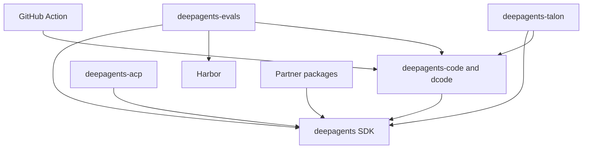

# Deep Agents Repository Quickstart

Deep Agents is an opinionated agent harness. `create_deep_agent()` assembles harness behavior and delegates construction to LangChain's `create_agent()` on the LangGraph runtime. Start with the task's owner—not the repository root—and use the linked guide for the detailed lifecycle or operational contract.

## Route the task first

| If you are changing… | Owner and first destination | Validate next |
| --- | --- | --- |
| SDK graph construction, middleware, filesystem/shell backends, tools, delegation, skills, memory, profiles, or approvals | `libs/deepagents/`; [Repository Architecture Overview](./architecture/overview.md) and [Source Map](./architecture/source-map.md) | Package-local tests; see [Testing Guide](./testing/testing-guide.md) |
| dcode CLI/TUI, server/client execution, workspace/session state, streaming, configuration, or context offload | `libs/code/`; [dcode session guide](./workflows/run-dcode-session.md) | dcode package tests |
| ACP sessions or editor projection | `libs/acp/`; [ACP integration](./integrations/acp.md) | ACP package tests |
| Talon channels, schedules, host lifecycle, history, or MCP loading | `libs/talon/`; [Talon integration](./integrations/talon.md) | Talon tests and [Security](./operations/security.md) |
| Evaluation scenarios, trial aggregation, model credentials, or Harbor jobs | `libs/evals/`; [eval guide](./workflows/run-evals.md) | Evals package tests |
| A provider, sandbox, or partner integration | the matching `libs/partners/<provider>/`; [Sandbox and Partner Backends](./integrations/sandbox-partners.md) | Owning package tests |
| **Scheduled or manually dispatched OpenWiki maintenance**—generation, update PRs, merge behavior, or its credentials | `.github/workflows/openwiki-update.yml`; [OpenWiki Update Automation Runbook](./operations/openwiki-automation.md) | The two focused workflow contracts below and [Security](./operations/security.md) |
| **Public dcode-in-workflow interface**—root Action inputs, outputs, or command translation | root `action.yml`; [GitHub Action Integration](./integrations/github-action.md) | Action/workflow contract tests |
| Locks, releases, ordinary CI, or cross-package validation | [Development, CI, and Releases](./operations/development.md) | [Testing Guide](./testing/testing-guide.md) |

The two GitHub Actions rows are intentionally different. **OpenWiki Update** is repository-owned scheduled/manual maintenance that generates and publishes `openwiki/` content. Root `action.yml` is the public composite Action that runs one headless `dcode` task in a caller's workflow; it does not own OpenWiki publication or the package runtime.

## Package boundaries and runtime ownership

`libs/` is a monorepo of **independently versioned packages**, not one root Python project: there is no root `pyproject.toml`, and each package owns its `pyproject.toml`, `Makefile`, and README. First-party local dependencies are editable, so a sibling consumer sees changes from its checked-out dependency during development.

| Need to change | Release unit and responsibility | Python requirement |
| --- | --- | --- |
| Reusable agent assembly, middleware, backends, profiles, skills, memory, or subagents | `libs/deepagents/` — `deepagents` SDK | `>=3.11,<4.0` |
| Terminal UI, CLI/headless mode, sessions, workspaces, configuration, or dcode tools | `libs/code/` — `deepagents-code`, run with `dcode` | `>=3.12,<4.0` |
| Editor-facing Agent Client Protocol sessions | `libs/acp/` — `deepagents-acp` | `>=3.11` |
| Long-running channels, schedules, and local host lifecycle | `libs/talon/` — experimental `deepagents-talon` | `>=3.12` |
| Behavioral evaluations and Harbor benchmarks | `libs/evals/` — `deepagents-evals` | `>=3.12,<3.14` |
| Provider and sandbox extensions | `libs/partners/{daytona,modal,runloop,vercel,quickjs}/` — separate integration packages | `>=3.11,<4.0` for the five listed packages |

Select Python from the manifest of the package being run—there is no repository-wide pin. `uv` provisions the interpreter for package work. The manifests express consumer direction, not a runtime call graph: `deepagents-code` pins `deepagents==0.7.15`; ACP depends on `deepagents`; evals depends on Deep Agents, dcode, and Harbor; Talon depends on Deep Agents and dcode; and each listed partner package depends on Deep Agents.



The diagram shows declared package and integration dependency direction; arrows point from a consumer or adapter to the capability it uses.

The SDK stack has three ownership layers:

1. **LangGraph** provides state, checkpoints, streaming, and interrupts.
2. **LangChain `create_agent`** provides the model, tools, middleware, and agent-loop abstraction.
3. **Deep Agents** adds an opinionated harness rather than a new runtime. Its `create_deep_agent()` assembly can configure the default middleware stack, backends, subagents, skills, memory, and profiles before it calls `create_agent()`.

For a custom agent, install `deepagents` and construct it with `create_deep_agent(model=..., tools=..., system_prompt=...)`. To try the terminal product instead:

```bash
curl -LsSf https://langch.in/dcode | bash
dcode
```

## Safe local edit–test loop

Use `uv` for interpreters, environments, and dependencies; do not substitute `pip`, Poetry, or Conda. From the package you are changing, install required groups and use its `Makefile` as the command authority:

```bash
cd libs/deepagents
uv sync --all-groups
make help
make test
make lint
```

Use `uv run ...` for a direct one-off command; use `libs/` fan-out targets such as `make lint`, `make lock`, or `make lock-check` only when intentionally validating the aggregate. Do not create a virtual environment outside the package or mix environments in one session.

For a focused runtime change, identify the public boundary and state owner, change the narrowest owning package, and run its nearest observable test. SDK and dcode `make test` targets disable network sockets and expose separate integration targets. Evals `make test` also disables network sockets; `make evals MODEL=<id>` rejects a missing `MODEL` and runs real-model tests in `tests/evals`, so it complements deterministic tests rather than replacing them.

For `.github` automation, do not substitute a package test. Workflow/action YAML contracts belong in `.github/scripts/tests/workflows/`. After editing OpenWiki workflow or merge semantics, run:

```bash
python -m pytest .github/scripts/tests/workflows/test_workflow_secret_scoping.py -v
python -m pytest .github/scripts/tests/workflows/test_openwiki_workflow.py -v
```

The credential-scope test statically checks the read-only default, `openwiki` environment, non-persistent checkout credentials, delayed dedicated App-token minting, and token use only in mutation steps. The merge harness extracts and runs the workflow's real Bash merge body with stubbed `gh` and `sleep` and real `jq`; it verifies the SHA-pinned squash merge, fail-closed PR validation, and the 405-only bounded retry behavior. It requires POSIX `bash` and `jq` and skips when they are unavailable or on Windows. Use the [OpenWiki runbook](./operations/openwiki-automation.md) for lifecycle and recovery, and [Security](./operations/security.md) before changing its trust boundary.

## Talon operating boundary

Talon is an alpha, experimental local host, not a production security boundary. It does not provide complete HITL policy, channel administrator controls, sandbox-backed execution isolation, or multi-tenant boundaries. Treat channel access as direct access to the operator's agent, model credentials, MCP tools, and local host resources. Read [Talon Long-Running Host](./integrations/talon.md) and [Security Boundaries and Secrets](./operations/security.md) before operating or extending it.
