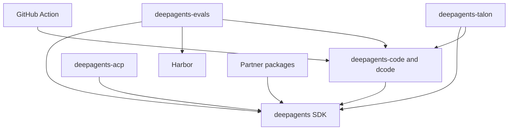

# Deep Agents Repository Quickstart

Deep Agents is an opinionated agent harness. `create_deep_agent()` assembles its harness behavior and delegates construction to LangChain's `create_agent()` on the LangGraph runtime. Use this page to select an owner and a safe local loop; use the linked guides for implementation detail.

## Start with the task, not the repository root

- **Try or change the terminal coding product:** dcode is the prebuilt terminal agent in `libs/code`.

  ```bash
  curl -LsSf https://langch.in/dcode | bash
  dcode
  ```

  For interactive or headless execution, session recovery, MCP, approvals, or sandboxes, use [Run and Debug a dcode Session](./workflows/run-dcode-session.md).
- **Build a custom agent:** install `deepagents` and construct it with `create_deep_agent(model=..., tools=..., system_prompt=...)`. Continue with [Build and Customize a Deep Agent](./workflows/build-a-deep-agent.md).
- **Change package behavior:** work in the owning `libs/<package>/` directory, sync that package, and use its `Makefile`. Begin operational work with [Development, CI, and Releases](./operations/development.md).

## Package boundaries and compatible Python

`libs/` is a monorepo of **independently versioned packages**, not one root Python project: there is no root `pyproject.toml`, and each package owns its `pyproject.toml`, `Makefile`, and README. First-party local dependencies are editable, so a sibling consumer sees changes from its checked-out dependency during development.

| Need to change | Release unit and responsibility | Python requirement | Read first |
| --- | --- | --- | --- |
| Reusable agent assembly, middleware, backends, profiles, skills, memory, or subagents | `libs/deepagents/` — `deepagents` SDK | `>=3.11,<4.0` | [Build and Customize a Deep Agent](./workflows/build-a-deep-agent.md) · [SDK Construction and Agent Execution](./architecture/sdk-construction-execution.md) |
| Terminal UI, CLI/headless mode, sessions, workspaces, configuration, or dcode tools | `libs/code/` — `deepagents-code`, run with `dcode` | `>=3.12,<4.0` | [Run and Debug a dcode Session](./workflows/run-dcode-session.md) · [Deep Agents Code Architecture](./architecture/code-agent.md) |
| Editor-facing Agent Client Protocol sessions | `libs/acp/` — `deepagents-acp` | `>=3.11` | [Agent Client Protocol Bridge](./integrations/acp.md) |
| Long-running channels, schedules, and local host lifecycle | `libs/talon/` — experimental `deepagents-talon` | `>=3.12` | [Talon Long-Running Host](./integrations/talon.md) |
| Behavioral evaluations and Harbor benchmarks | `libs/evals/` — `deepagents-evals` | `>=3.12,<3.14` | [Run and Interpret Evals](./workflows/run-evals.md) |
| Provider and sandbox extensions | `libs/partners/{daytona,modal,runloop,vercel,quickjs}/` — separate integration packages | `>=3.11,<4.0` for the five listed packages | [Sandbox and Partner Backends](./integrations/sandbox-partners.md) |
| Workflow use of dcode | root `action.yml` — composite GitHub Action | Action runner environment | [GitHub Action Integration](./integrations/github-action.md) |

Select Python from the manifest of the package being run—there is no repository-wide pin. `uv` provisions the interpreter for package work; the aggregate `libs/Makefile` deliberately locks ACP with Python 3.14 and other packages with 3.12, which is a repository lock-maintenance policy rather than a replacement for each manifest's `requires-python`.

The manifests express consumer direction, not a runtime call graph: `deepagents-code` pins `deepagents==0.7.15`; ACP depends on `deepagents`; evals depends on Deep Agents, dcode, and Harbor; Talon depends on Deep Agents and dcode; and each listed partner package depends on Deep Agents.



The diagram shows declared package and integration dependency direction; arrows point from a consumer or adapter to the capability it uses.

## Orient before changing a layer

The SDK stack has three ownership layers:

1. **LangGraph** provides state, checkpoints, streaming, and interrupts.
2. **LangChain `create_agent`** provides the model, tools, middleware, and agent loop abstraction.
3. **Deep Agents** adds an opinionated harness rather than a new runtime. Its `create_deep_agent()` assembly can configure the default middleware stack, backends, subagents, skills, memory, and profiles before it calls `create_agent()`.

Use [Repository Architecture Overview](./architecture/overview.md) for product boundaries, [Source Map and Ownership Boundaries](./architecture/source-map.md) to locate public surfaces and tests, and [Middleware Stack Assembly](./architecture/middleware-stack.md) before changing order-sensitive SDK behavior.

## Task-routing map

| If you are changing… | Primary guide | Follow-up guide |
| --- | --- | --- |
| SDK graph construction, middleware, filesystem/shell backends, tools, delegation, skills, memory, profiles, or approvals | [Build and Customize a Deep Agent](./workflows/build-a-deep-agent.md) | [SDK Construction and Agent Execution](./architecture/sdk-construction-execution.md), [Testing Strategy and Local Test Guide](./testing/testing-guide.md) |
| dcode CLI/TUI, server/client execution, workspace/session state, streaming, configuration, or context offload | [Run and Debug a dcode Session](./workflows/run-dcode-session.md) | [Code Runtime and Session Behavior](./architecture/runtime-behavior.md), [Code Configuration Layering](./concepts/config-layering.md), [Context Management and Offloading](./concepts/context-management.md) |
| Model selection, profile overlays, retries, or provider behavior | [Models and Harness Profiles](./concepts/profiles-models.md) | The SDK or dcode architecture page for the owning layer |
| ACP sessions, streamed editor projection, cancellation, or durable sessions | [Agent Client Protocol Bridge](./integrations/acp.md) | [Testing Strategy and Local Test Guide](./testing/testing-guide.md) |
| Talon channels, cron, host lifecycle, history, or MCP loading | [Talon Long-Running Host](./integrations/talon.md) | [State, Checkpoints, and Durable Records](./concepts/state-persistence.md), [Security Boundaries and Secrets](./operations/security.md) |
| Eval scenarios, trial aggregation, model credentials, or Harbor jobs | [Run and Interpret Evals](./workflows/run-evals.md) | [Testing Strategy and Local Test Guide](./testing/testing-guide.md) |
| MCP configuration, authentication, reload, or trust | [MCP Integration Across Products](./integrations/mcp.md) | [Security Boundaries and Secrets](./operations/security.md) |
| A sandbox, remote execution provider, or a partner package | [Sandbox and Partner Backends](./integrations/sandbox-partners.md) | [Backends and Capability Routing](./concepts/backends.md) |
| GitHub Action inputs or dcode-in-workflow behavior | [GitHub Action Integration](./integrations/github-action.md) | [Run and Debug a dcode Session](./workflows/run-dcode-session.md) |
| Locks, releases, CI, or cross-package validation | [Development, CI, and Releases](./operations/development.md) | [Testing Strategy and Local Test Guide](./testing/testing-guide.md) |

The composite Action requires `prompt`; it exposes optional model/provider credentials and working directory plus inputs that control cached memory scope, skills, shell allow-list, sandbox, MCP, interpreter, turn/timeout limits, and streamed or JSON/headless output. Trace an Action input through dcode before changing its meaning.

## Safe local edit–test loop

Use `uv` for interpreters, environments, and dependencies; do not substitute `pip`, Poetry, or Conda. From the package you are changing, inspect its supported commands and explicitly install the needed groups:

```bash
cd libs/deepagents
uv sync --all-groups
make help
make test
make lint
```

Package Makefiles are the command authority. Use `uv run ...` for a direct one-off command; use `libs/` fan-out targets such as `make lint`, `make lock`, or `make lock-check` only when intentionally validating the aggregate. Do not create a virtual environment outside the package or mix environments in one session.

For a focused change, identify the public boundary and state owner, change the narrowest owning package, and run its nearest observable test. SDK and dcode `make test` targets disable network sockets and their `integration_test` targets allow integration coverage. Evals `make test` also disables network sockets; `make evals MODEL=<id>` rejects a missing `MODEL` and runs real-model tests in `tests/evals`, so it complements deterministic tests rather than replacing them.

## Talon operating boundary

Talon is an alpha, experimental local host, not a production security boundary. It does not provide complete HITL policy, channel administrator controls, sandbox-backed execution isolation, or multi-tenant boundaries. Treat channel access as direct access to the operator's agent, model credentials, MCP tools, and local host resources. Read [Talon Long-Running Host](./integrations/talon.md) and [Security Boundaries and Secrets](./operations/security.md) before operating or extending it.
