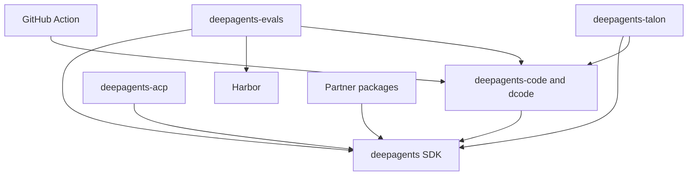

# Deep Agents Repository Quickstart

Start with the package that owns the behavior, not the repository root. Deep Agents is an opinionated harness: `create_deep_agent()` assembles harness behavior and delegates agent construction to LangChain's `create_agent()` on the LangGraph runtime. The routes below point to the detailed lifecycle and safety contracts rather than duplicating them.

## Route the task

| If you are changing… | Start here | Read before changing it | First focused validation |
| --- | --- | --- | --- |
| SDK graph assembly, middleware, backends, permissions, skills, memory, or SDK delegation | `libs/deepagents/` | [Architecture overview](./architecture/overview.md) and [Source map](./architecture/source-map.md) | The closest `libs/deepagents/tests/unit_tests/` test, then `make test TEST_FILE=...` |
| dcode CLI/TUI, client/server execution, Textual rendering, media, debug console, or diagnostic/file logs | `libs/code/` | [Deep Agents Code architecture](./architecture/code-agent.md) | The closest dcode unit test, then `make test TEST_FILE=...`; use integration coverage for process, ACP, sandbox, or provider behavior |
| ACP stdio sessions, editor projection, cancellation, durable recovery, or `dcode --acp` | `libs/acp/` for the reusable bridge; `libs/code/` for the dcode launcher | [ACP bridge](./integrations/acp.md) and [dcode architecture](./architecture/code-agent.md) | `make test TEST_FILE=...` in the owning package; test ACP mode separately from normal dcode |
| Talon host/channel lifecycle, conversations, cron, approvals, or authorization resume | `libs/talon/` | [Talon long-running host](./integrations/talon.md) and [permissions and human approval](./concepts/permissions-hitl.md) | Closest Talon unit test; use `tests/integration_tests/` when host orchestration is the contract |
| Talon MCP loading, OAuth/login, server status, configuration edits, tool middleware, or reload races | `libs/talon/` | [MCP integration](./integrations/mcp.md) | Focused MCP/auth/middleware/config test, then `make test TEST_FILE=...` |
| Talon local research agents, capability attachment, background jobs, or subagent reload | `libs/talon/` | [Subagents and skills](./concepts/subagents-skills.md) | Focused research-subagent, async-subagent, or reload test, then `make test TEST_FILE=...` |
| Evaluation scenarios, Harbor staging/jobs, trial aggregation, or model credentials | `libs/evals/` | [Run evals](./workflows/run-evals.md) and [Testing guide](./testing/testing-guide.md) | Unit tests first; use `make evals MODEL=<id>` only for real-model evaluation |
| Provider or sandbox integration | The matching `libs/partners/<provider>/` | [Sandbox and partner backends](./integrations/sandbox-partners.md) | Owning package tests and the integration contract that changed |
| Package metadata, locks, release-please, or cross-package checks | The changed package, then `libs/` only for aggregate work | [Development, CI, and releases](./operations/development.md) | Package validation; `make -C libs lock-check` when lock validity is in scope |
| Repository-owned OpenWiki generation, update PR, merge behavior, or credentials | `.github/workflows/openwiki-update.yml` | [OpenWiki automation runbook](./operations/openwiki-automation.md) and [Security](./operations/security.md) | Focused workflow contract tests |
| Public dcode GitHub Action inputs, outputs, or command translation | Root `action.yml` | [GitHub Action integration](./integrations/github-action.md) | Action/workflow contract tests |

The last two rows are deliberately separate: **OpenWiki Update** is scheduled/manual repository maintenance that generates and publishes documentation, while root `action.yml` is the public composite Action that runs a headless dcode task in a caller workflow. The Action requires a prompt and offers provider credentials, workspace, memory, skills, sandbox, MCP, and headless-output inputs; it is not an OpenWiki publisher.

## Package and release map

`libs/` is a monorepo of independently versioned packages. Each package owns its `pyproject.toml`, `Makefile`, and README; there is no root `pyproject.toml`. Local first-party dependencies are editable, so a change is visible to a sibling consumer during development.

| Release unit | Current baseline | Responsibility | Python requirement |
| --- | ---: | --- | --- |
| `deepagents` | `0.7.15` | SDK: `create_deep_agent`, middleware, and backends | `>=3.11,<4.0` |
| `deepagents-code` | `0.1.71` | dcode terminal coding agent | `>=3.12,<4.0` |
| `deepagents-acp` | `0.0.12` | Agent Client Protocol integration | `>=3.11` |
| `deepagents-talon` | `0.0.8` | Experimental local long-running host | `>=3.12` |
| `deepagents-evals` | unreleased `0.0.1` source package | Evaluation suite and Harbor integration | `>=3.12,<3.14` |
| Partner packages | Daytona `0.0.8`, Modal `0.0.6`, Runloop `0.0.7`, Vercel `0.0.2`, QuickJS `0.3.7` | Provider and sandbox boundaries | `>=3.11,<4.0` |

Select an interpreter from the manifest of the package being run; there is no repository-wide Python pin. `uv` provisions the compatible interpreter. The declared dependency direction is meaningful when coordinating changes: Code pins `deepagents==0.7.15`; ACP depends on `deepagents`; evals depends on Deep Agents, dcode, and Harbor; Talon depends on Deep Agents and dcode; and the listed partners depend on Deep Agents.


*Declared package and integration dependencies point from each consumer or adapter to the capability it uses.*

For a user-facing starting point, dcode is the fastest way to try the product; use the SDK to build a custom agent:

```bash
curl -LsSf https://langch.in/dcode | bash
dcode
```

## Safe edit–test loop

Use `uv` for interpreters, environments, and dependencies; do not substitute `pip`, Poetry, or Conda. Work from the package directory, install dependencies explicitly, and treat that package's `Makefile` as the command authority:

```bash
cd libs/deepagents
uv sync --all-groups
make help
make test
make lint
```

Use `uv run ...` for a one-off command. Use `libs/` fan-out targets such as `make lint`, `make lock`, and `make lock-check` only when deliberately validating aggregate behavior. Do not create an environment outside the package or mix environments in one session.

Package unit targets are socket-disabled and separate integration targets cover boundaries that need network or external processes. Talon's `make test` also runs its WhatsApp bridge unit tests; ACP, dcode, and the SDK accept `TEST_FILE=...` for a narrow target. Evals requires `MODEL` for `make evals MODEL=<id>`, which runs `tests/evals` and complements deterministic tests rather than replacing them. See the [Testing guide](./testing/testing-guide.md) for concrete focused routes, escalation rules, and dcode diagnostic/media coverage.

For workflow or Action changes, package tests are not sufficient. Run the workflow contracts:

```bash
python -m pytest .github/scripts/tests/workflows/test_workflow_secret_scoping.py -v
python -m pytest .github/scripts/tests/workflows/test_openwiki_workflow.py -v
```

Those checks cover OpenWiki's restricted credential boundary and its SHA-pinned, fail-closed squash-merge behavior, including the bounded retry that is limited to HTTP 405 responses. The workflow runs daily or by manual dispatch, generates documentation before minting its dedicated App token, restores its own workflow file, and stages only `openwiki` and `AGENTS.md` before reconciling or publishing the update PR. Its executable merge-shell harness uses stubbed `gh` and `sleep` with real `jq` to verify those merge semantics.

## Operational boundaries to keep in view

- **Talon is experimental, not a production security boundary.** It lacks complete HITL policy, channel administrator controls, sandbox-backed execution isolation, and multi-tenant boundaries. Treat channel access as direct access to the operator's agent, credentials, MCP tools, and local resources. Start with [Talon](./integrations/talon.md), [MCP](./integrations/mcp.md), and [Security](./operations/security.md).
- **Talon's MCP and delegation are explicit boundaries.** MCP configuration can launch commands or reach remote endpoints, and local subagents are fresh task-only graphs with explicitly selected capabilities. Use the linked MCP and subagent pages before changing authorization, reload, background work, or child-tool behavior.
- **ACP is an adapter, not a runtime.** It projects an application-owned LangGraph graph over stdio; graph construction, tools, checkpointing, and interrupt policy remain application responsibilities. Normal dcode and `dcode --acp` have separate execution paths.
- **Releases are package-local.** Release-please manages independent distributions and their baseline versions. Do not manually advance release values for ordinary dependency work; follow the [release lifecycle](./operations/development.md#release-lifecycle), including the relevant lock update.
- **Automation has its own trust boundary.** The OpenWiki workflow has a read-only default token and creates its write-capable App token after generation for publication steps; do not conflate it with the public dcode Action.
