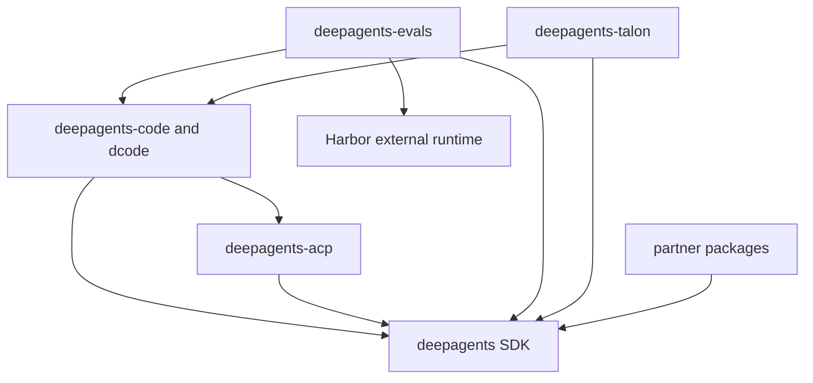

# Quickstart & Wiki Map

Deep Agents is an opinionated agent harness. `create_deep_agent()` configures backends, subagents, skills, memory, profiles, and middleware, then delegates agent construction to LangChain's `create_agent()` on the LangGraph runtime. This page is the maintainer entry point: select the owner and task boundary here, then use the linked focused guide rather than treating the monorepo as one deployable unit.

## Choose an entry path

- **Try the coding agent:** dcode is the prebuilt terminal product. Install and start it with:

  ```bash
  curl -LsSf https://langch.in/dcode | bash
  dcode
  ```

  For interactive, headless, resume, approval, MCP, hook, sandbox, or ACP work, use [Workflow: Run & Extend a dcode Session](/openwiki/workflows/run-dcode-session.md).
- **Build an agent:** install the SDK with `uv add deepagents`, then call `create_deep_agent(model=..., tools=..., system_prompt=...)`. Follow [Workflow: Build a Deep Agent](/openwiki/workflows/build-a-deep-agent.md) for the construction and validation path.
- **Change this checkout:** enter the package that owns the behavior, run `uv sync --all-groups`, and use that package's `make` targets. Start with [Development, Build & Release Operations](/openwiki/operations/development.md) before altering dependencies, locks, or release metadata.

## Locate behavior by layer and package

### Runtime ownership

The layers are deliberately distinct:

- **LangGraph** owns runtime behavior: graph state, checkpoints, streaming, and interrupts.
- **LangChain `create_agent`** owns the model, tools, middleware, and agent loop.
- **Deep Agents** is the opinionated harness above `create_agent`, not another runtime; it supplies the default middleware, backends, and profiles.

Use [Architecture Overview](/openwiki/architecture/overview.md) to decide which layer owns an observed behavior. Then use [Source Map & Change Boundaries](/openwiki/architecture/source-map.md) to find implementation and nearby tests. For construction-to-execution control flow, see [SDK Construction & Execution](/openwiki/architecture/sdk-construction-execution.md); for default ordering and caller composition, see [Middleware Stack & Composition](/openwiki/architecture/middleware-stack.md).

### Package ownership and interpreter constraints

This is a monorepo of independently versioned packages under `libs/`; there is no root `pyproject.toml`. Each package has its own `pyproject.toml`, `Makefile`, and `README.md`. Work inside the package you change. Local package dependencies are editable, so a sibling consumer can observe source changes during development without publishing first.

| Package | Path | Package-local `requires-python` | Start here when you need to… |
| --- | --- | --- | --- |
| `deepagents` | `libs/deepagents/` | `>=3.11,<4.0` | Build or modify the SDK: `create_deep_agent`, middleware, backends, profiles, and harness behavior. |
| `deepagents-code` / dcode | `libs/code/` | `>=3.12,<4.0` | Change the terminal coding agent, including its client/server runtime, configuration, sessions, tools, and TUI. |
| `deepagents-acp` | `libs/acp/` | `>=3.11` | Adapt a Deep Agents graph to the Agent Client Protocol used by editors. |
| `deepagents-evals` | `libs/evals/` | `>=3.12,<3.14` | Run or add real-model evaluations and Harbor-backed benchmarks. |
| `deepagents-talon` | `libs/talon/` | `>=3.12` | Change the experimental local host, channel adapters, or schedules. |
| Partner packages | `libs/partners/` | Package-specific; current provider packages declare `>=3.11,<4.0` | Maintain the Daytona, Modal, Runloop, Vercel, or QuickJS integration boundary. |

These are **package-local dependency and interpreter constraints**, not a repository-wide compatibility guarantee. Choose an interpreter that satisfies the manifest for the package being run: for example, `evals` excludes Python 3.14, while the listed SDK, dcode, and partner manifests permit it and ACP/Talon do not state an upper bound. `uv` provisions a suitable interpreter; do not create a repository-wide Python pin.

### Declared first-party dependency direction

The graph describes manifest dependencies, not runtime calls. `deepagents-code` has an exact `deepagents==0.7.13` dependency and a `deepagents-acp>=0.0.10,<1.0.0` dependency. ACP depends on `deepagents`; evals depends on `deepagents`, `deepagents-code`, and the external Harbor runtime; Talon depends on `deepagents` and `deepagents-code`. Partner packages depend on the SDK but remain separate provider boundaries.



Caption: Declared first-party package dependency direction; arrows point from a consumer to its dependency.

Talon is experimental, not a production or enterprise host. It lacks complete HITL policy, channel administrator controls, sandbox-backed execution isolation, and multi-tenant boundaries. Treat channel access as direct access to the operator's agent, model credentials, MCP tools, and local host resources; use [Talon Local Runtime Host](/openwiki/integrations/talon.md) and [Security Boundaries & Runbook](/openwiki/operations/security.md) before operating or extending it.

## Route a task to the focused guide

| If the task is… | Start with | Then consult |
| --- | --- | --- |
| Construct a custom agent; select a model, backend, tools, middleware, skills, subagents, memory, or approvals | [Build a Deep Agent](/openwiki/workflows/build-a-deep-agent.md) | [Models, Providers & Profiles](/openwiki/concepts/profiles-models.md), [Backends & Storage Routes](/openwiki/concepts/backends.md), [Tools & Filesystem](/openwiki/concepts/tools-filesystem.md), and [Permissions & Human Approval](/openwiki/concepts/permissions-hitl.md). |
| Change SDK assembly, prompt/tool composition, or execution behavior | [SDK Construction & Execution](/openwiki/architecture/sdk-construction-execution.md) | [Middleware Stack & Composition](/openwiki/architecture/middleware-stack.md), [Middleware Capability Catalog](/openwiki/concepts/middleware-catalog.md), or [Runtime Behavior & Failure Findings](/openwiki/architecture/runtime-behavior.md). |
| Change dcode’s graph, loopback client/server boundary, configuration, persistence, streaming, or terminal session | [Run & Extend a dcode Session](/openwiki/workflows/run-dcode-session.md) | [Deep Agents Code Architecture](/openwiki/architecture/code-agent.md), [dcode Configuration Layering](/openwiki/concepts/config-layering.md), [State, Sessions & Persistence](/openwiki/concepts/state-persistence.md), and [dcode Cost Tracking & Session Operations](/openwiki/operations/cost-and-sessions.md). |
| Connect an editor over ACP or choose the reusable adapter versus dcode ACP mode | [Agent Client Protocol Integration](/openwiki/integrations/acp.md) | [Deep Agents Code Architecture](/openwiki/architecture/code-agent.md). |
| Add, authenticate, trust, or troubleshoot MCP tools | [Model Context Protocol Integration](/openwiki/integrations/mcp.md) | [Tools & Filesystem](/openwiki/concepts/tools-filesystem.md) and [Security Boundaries & Runbook](/openwiki/operations/security.md). |
| Add a sandbox provider or change sandbox execution semantics | [Sandbox & Partner Integrations](/openwiki/integrations/sandbox-partners.md) | [Backends & Storage Routes](/openwiki/concepts/backends.md) and [Source Map & Change Boundaries](/openwiki/architecture/source-map.md). |
| Change delegation, skill discovery, context compaction, or persisted state | [Subagents & Skills](/openwiki/concepts/subagents-skills.md), [Context Management & Offload](/openwiki/concepts/context-management.md), or [State, Sessions & Persistence](/openwiki/concepts/state-persistence.md) | [SDK Construction & Execution](/openwiki/architecture/sdk-construction-execution.md). |
| Work on channels, scheduled runs, conversation recovery, or Talon host lifecycle | [Talon Local Runtime Host](/openwiki/integrations/talon.md) | [Security Boundaries & Runbook](/openwiki/operations/security.md). |
| Run offline tests, integration tests, benchmarks, or real-model behavior evaluation | [Testing Guide & Boundaries](/openwiki/testing/testing-guide.md) | [Workflow: Evaluate & Benchmark Agents](/openwiki/workflows/run-evals.md) for evals and Harbor. |
| Set up a package, validate a change, update locks, or prepare a release | [Development, Build & Release Operations](/openwiki/operations/development.md) | [Testing Guide & Boundaries](/openwiki/testing/testing-guide.md). |

## Browse by domain

- **Architecture:** [overview](/openwiki/architecture/overview.md), [SDK construction and execution](/openwiki/architecture/sdk-construction-execution.md), [middleware stack](/openwiki/architecture/middleware-stack.md), [dcode architecture](/openwiki/architecture/code-agent.md), [runtime behavior](/openwiki/architecture/runtime-behavior.md), and [source map](/openwiki/architecture/source-map.md).
- **Concepts:** [backends](/openwiki/concepts/backends.md), [configuration](/openwiki/concepts/config-layering.md), [context management](/openwiki/concepts/context-management.md), [middleware catalog](/openwiki/concepts/middleware-catalog.md), [permissions](/openwiki/concepts/permissions-hitl.md), [profiles](/openwiki/concepts/profiles-models.md), [state](/openwiki/concepts/state-persistence.md), [subagents and skills](/openwiki/concepts/subagents-skills.md), and [tools](/openwiki/concepts/tools-filesystem.md).
- **Workflows:** [build a deep agent](/openwiki/workflows/build-a-deep-agent.md), [run a dcode session](/openwiki/workflows/run-dcode-session.md), and [evaluate and benchmark agents](/openwiki/workflows/run-evals.md).
- **Integrations:** [ACP](/openwiki/integrations/acp.md), [MCP](/openwiki/integrations/mcp.md), [sandboxes and partners](/openwiki/integrations/sandbox-partners.md), and [Talon](/openwiki/integrations/talon.md).
- **Operations and quality:** [development](/openwiki/operations/development.md), [costs and sessions](/openwiki/operations/cost-and-sessions.md), [security](/openwiki/operations/security.md), and [testing](/openwiki/testing/testing-guide.md).

## Safe maintainer loop

Use `uv` for interpreters, environments, and dependencies; do not substitute `pip`, Poetry, or Conda. A package-local `Makefile` is the command authority, so run `make help` in the package before assuming a target exists. Use `uv run ...` for one-off commands, and use the fan-out targets from `libs/` only when a repository-wide check is intentional.

For each change, identify the package and runtime layer that author the state or behavior, make the focused package-local edit, and add or adjust a test at the boundary that observes it. The testing guide distinguishes offline package tests from networked integration coverage and real-model evaluations; do not treat a successful test category as evidence for a boundary it does not exercise.
