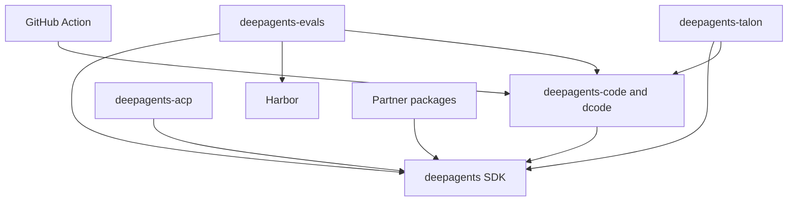

# Repository Quickstart

This is the maintainer entry point. First locate the package that owns the public behavior, then work in that package's environment and validate its nearest observable contract. For the overall model, start with [Architecture Overview](./architecture/overview.md); for implementation-level ownership and regression coverage, use [Source Map and Change Routing](./architecture/source-map.md).

## Choose the product entry point

- **Use or change the terminal coding agent:** dcode is `deepagents-code` in `libs/code/`.

  ```bash
  curl -LsSf https://langch.in/dcode | bash
  dcode
  ```

  For interactive, headless, resume, approval, MCP, sandbox, or ACP operation, read [Run a dcode Session](./workflows/run-dcode-session.md).
- **Build a custom agent:** use the `deepagents` SDK in `libs/deepagents/` and `create_deep_agent()`. Start with [Build and Customize a Deep Agent](./workflows/build-a-deep-agent.md), then [SDK Construction and Execution](./architecture/sdk-construction-execution.md).
- **Change repository behavior:** select the owning package below, then follow [Development, CI, and Releases](./operations/development.md) and [Testing Strategy and Change Validation](./testing/testing-guide.md).

Deep Agents is a harness, not a second runtime: LangGraph owns state, checkpoints, streaming, and interrupts; LangChain's `create_agent` provides the model/tool/middleware loop; and `create_deep_agent()` assembles Deep Agents defaults before delegating construction to `create_agent()`.

## Select the owning release boundary

`libs/` is a monorepo of independently versioned packages. There is no root `pyproject.toml`; every package has its own `pyproject.toml`, `Makefile`, and README, so work from the package being changed. Local first-party dependencies are editable, allowing a sibling consumer to observe source changes without publishing them first.

| Change area | Owner | Read first |
| --- | --- | --- |
| SDK graph assembly, middleware, backends, tools, profiles, skills, memory, subagents, or approvals | `libs/deepagents/` (`deepagents` 0.7.15) | [SDK Construction and Execution](./architecture/sdk-construction-execution.md), [Middleware Stack](./architecture/middleware-stack.md), [Middleware Catalog](./concepts/middleware-catalog.md) |
| dcode CLI/TUI, sessions, workspace runtime, client/server streaming, configuration, or context offload | `libs/code/` (`deepagents-code` 0.1.71) | [dcode Product Architecture](./architecture/code-agent.md), [dcode Server Runtime Behavior](./architecture/runtime-behavior.md), [Run a dcode Session](./workflows/run-dcode-session.md) |
| Editor ACP session or protocol projection | `libs/acp/` (`deepagents-acp` 0.0.11); dcode also exposes ACP mode | [Agent Client Protocol Integration](./integrations/acp.md) |
| Behavioral evaluation, trials, or Harbor job | `libs/evals/` (`deepagents-evals` 0.0.1) | [Run Evals and Harbor Workloads](./workflows/run-evals.md) |
| Long-running channel host, schedules, history, or host MCP lifecycle | `libs/talon/` (`deepagents-talon` 0.0.8) | [Talon Runtime Host](./integrations/talon.md) and [Security Boundaries](./operations/security.md) |
| Daytona, Modal, Runloop, Vercel Sandbox, or QuickJS implementation | the corresponding `libs/partners/<provider>/` package | [Sandbox and Partner Integrations](./integrations/sandbox-partners.md) |
| dcode workflow input/output contract | root `action.yml` composite action | [GitHub Action Integration](./integrations/github-action.md) |

Release Please currently tracks the SDK, ACP, dcode, Talon, and the five partner packages; `evals` is not listed in its manifest. Update version/release metadata only for the independently released package affected by the change, and use the package manifest rather than this table as the authority.

The manifests declare consumer direction: `deepagents-code` pins `deepagents==0.7.15`; ACP depends on `deepagents`; evals depends on Deep Agents, dcode, and Harbor; Talon depends on Deep Agents and dcode; and the five partner packages depend on Deep Agents. These are package relationships, not a runtime call graph.



The diagram shows declared package and integration dependency direction; arrows point from a consumer or adapter to the capability it uses.

## Route by concern

| If the change concerns… | Go to… |
| --- | --- |
| Filesystem/shell semantics or backend capability | [Tools and Filesystem Semantics](./concepts/tools-filesystem.md) and [Backends](./concepts/backends.md) |
| Permissions, approval interrupts, or trust boundaries | [Permissions and Human Approval](./concepts/permissions-hitl.md) and [Security Boundaries](./operations/security.md) |
| Model selection, provider profiles, or dcode model configuration | [Profiles and Model Resolution](./concepts/profiles-models.md) |
| Graph state, checkpoints, dcode sessions, or durable memory | [State, Checkpoints, and Persistence](./concepts/state-persistence.md) and [dcode Sessions, Cost, and Local State](./operations/cost-and-sessions.md) |
| Delegation, skills, or background work | [Subagents, Skills, and Background Work](./concepts/subagents-skills.md) |
| MCP discovery, credentials, trust, loading, or reload | [Model Context Protocol Integration](./integrations/mcp.md) |
| Action prompt, credentials, memory cache, skills, sandbox, MCP, or headless output | [GitHub Action Integration](./integrations/github-action.md) |
| Locks, CI, releases, or selecting validation | [Development, CI, and Releases](./operations/development.md) and [Testing Strategy and Change Validation](./testing/testing-guide.md) |

The repository-root action.yml defines a composite GitHub Action for running dcode in workflows, with a required prompt, optional provider credentials and workspace, and inputs for persisted memory, skills, sandbox, MCP, and headless output behavior. Treat an action input as a compatibility contract: trace it through dcode before changing it.

## Run the package-local loop

Use `uv` for interpreters, environments, and dependencies; use neither `pip`, Poetry, nor Conda. `uv` provisions a suitable interpreter, so there is no repository-wide Python version to pin. The package `Makefile` is the command authority: run `make help` in the package, use `uv sync --all-groups` (or the needed group), and reserve `libs/` fan-out targets for intentional repository-wide checks.

Python compatibility is package-local: Deep Agents is `>=3.11,<4.0`, dcode `>=3.12,<4.0`, ACP `>=3.11`, evals `>=3.12,<3.14`, and Talon `>=3.12`. The five listed partners each require `>=3.11,<4.0`. In particular, evals excludes Python 3.14; select the interpreter for the package you run.

For a focused change, update the nearest test in the owner first, then test direct consumers if the changed package crosses a declared dependency boundary. The SDK and dcode `make test` targets disable network sockets and have separate integration targets. `libs/evals` also has network-disabled unit tests; `make evals MODEL=<id>` requires `MODEL` and runs the real-model suite in `tests/evals`.

## Operational caution: Talon

Talon is an experimental local runtime host, not a production security boundary. It does not implement complete HITL policy, channel administrator controls, sandbox-backed execution isolation, or multi-tenant boundaries. Treat channel access as direct access to the operator’s agent, credentials, MCP tools, and local resources. Read [Talon Runtime Host](./integrations/talon.md) and [Security Boundaries](./operations/security.md) before operating or extending it.
