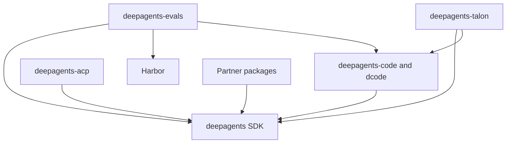

# Deep Agents Repository Quickstart

Start in the package that owns the behavior, not at the repository root. Deep Agents is the opinionated harness layer over LangChain's `create_agent()` and the LangGraph runtime. This page routes work to the appropriate domain page; it intentionally does not repeat their runtime contracts.

## Route the task

| Change | Owner and next wiki page | Focused validation |
| --- | --- | --- |
| SDK graph assembly, middleware, backends, skills, memory, filesystem, or permissions | `libs/deepagents/`; [Architecture overview](./architecture/overview.md) | Run the closest unit test, then `make test TEST_FILE=tests/unit_tests/<file>.py` and `make lint`. |
| dcode runtime assembly, workspace configuration, persistence/resume, offload, sandbox, costs, CLI, or TUI | `libs/code/`; [Run and debug a dcode session](./workflows/run-dcode-session.md), [Testing guide](./testing/testing-guide.md) | Use `make test TEST_FILE=tests/unit_tests/test_<area>.py`; run `make integration_test TEST_FILE=...` only for an integration boundary. |
| ACP editor or stdio behavior | `libs/acp/` and, where dcode is launched, `libs/code/`; [Source map](./architecture/source-map.md) | In `libs/acp`, use `make test TEST_FILE=tests/test_<area>.py`; test dcode ACP mode separately when its launcher changed. |
| Sandbox/provider adapter | Matching `libs/partners/<provider>/`; [Sandbox and partner backends](./integrations/sandbox-partners.md) | Run the adapter's package-local tests and the changed SDK or dcode contract test. |
| Evaluation scenario or Harbor execution | `libs/evals/`; [Testing guide](./testing/testing-guide.md) | Start with the owning unit test; use a real-model evaluation only when the scenario requires it. |
| Talon channels, scheduling, or host behavior | `libs/talon/`; [Architecture overview](./architecture/overview.md) | `make test TEST_FILE=tests/<focused-path>.py`, followed by `make lint`; the test target also runs the WhatsApp bridge Node tests. |
| Package version, dependency, lockfile, or release automation | The changed package, then `libs/`; [Development, CI, and releases](./operations/development.md) | Run package checks and `make -C libs lock-check` when a lockfile is affected. |

## Package map and compatibility

`libs/` is a monorepo of independently versioned packages. Each package owns its `pyproject.toml`, `Makefile`, and README; there is no root `pyproject.toml`. First-party dependencies are editable locally, so make an SDK change in `libs/deepagents` visible to its sibling consumers without a separate publish.

| Package or group | Current baseline | Role | Python requirement |
| --- | ---: | --- | --- |
| `deepagents` | `0.7.17` | SDK: `create_deep_agent`, middleware, and backends | `>=3.11,<4.0` |
| `deepagents-code` | `0.1.73` | Prebuilt terminal coding agent, invoked as `dcode` | `>=3.12,<4.0` |
| `deepagents-acp` | `0.0.12` | Agent Client Protocol editor integration | `>=3.11` |
| `deepagents-evals` | source version `0.0.1` | Evaluation suite and Harbor integration | `>=3.12,<3.14` |
| `deepagents-talon` | `0.0.8` | Experimental local long-running host | `>=3.12` |
| Partners | Daytona `0.0.8`; Modal `0.0.6`; Runloop `0.0.7`; Vercel `0.0.2`; QuickJS `0.3.7` | Provider and sandbox integrations | `>=3.11,<4.0` |

Choose the interpreter from the changed package's `requires-python`; `uv` provisions it, so there is no repository-wide Python version to pin. The partner packages are package-local SDK integration boundaries, not dependencies required for every repository task.


*Published package dependencies flow from consumers and adapters to the SDK, dcode, or Harbor capability they use.*

The manifest relationship is directional: Code pins `deepagents==0.7.17`; ACP depends on `deepagents`; evals depends on Deep Agents, dcode, and Harbor; and Talon depends on Deep Agents and dcode. Treat an SDK version or dependency-bound change as a consumer and release-check change as well.

## Focused edit–test loop

Use `uv` for interpreters, environments, and dependencies, and use each package's `Makefile` as the authority for supported commands.

```bash
cd libs/code
uv sync --all-groups
make test TEST_FILE=tests/unit_tests/test_server_graph.py
make lint
```

Both the SDK and Code `test` targets accept `TEST_FILE`; their standard unit runs disable network sockets except Unix sockets, run in parallel, and report coverage. Code's `make lint` additionally checks its generated command catalog and process-current-working-directory rule. ACP uses `tests/` as its default `TEST_FILE` and applies a 10-second pytest timeout.

For a package-metadata change, update its lockfile deliberately and validate at the appropriate scope:

```bash
cd libs/code
uv lock
make check
make -C ../ lock-check
```

`libs/code`'s `make check` runs lint, import checks, unit tests, extras/version consistency checks, a lockfile check, and an advisory SDK-pin check. On a Code release PR, the SDK-pin workflow warns for a stale SDK pin, while publication enforces that the Code pin is at least the workspace SDK version. Release dependency validation removes editable local sources and resolves changed release manifests against PyPI, so a locally working sibling dependency does not by itself establish a publishable dependency graph. The partner-bounds workflow is advisory: it flags an SDK release that is excluded by a partner's declared `deepagents` upper bound.

## Where to go next

- [Repository architecture overview](./architecture/overview.md) — ownership boundaries and SDK stack.
- [Repository source map](./architecture/source-map.md) — source, entrypoint, and test navigation.
- [Development, CI, and releases](./operations/development.md) — setup, lockfiles, CI, and publishing details.
- [Testing guide](./testing/testing-guide.md) — dcode-focused test selection and test layers.
- [Run and debug a dcode session](./workflows/run-dcode-session.md) — operational dcode lifecycle and recovery.
